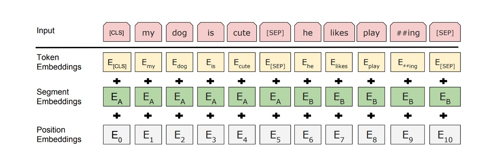
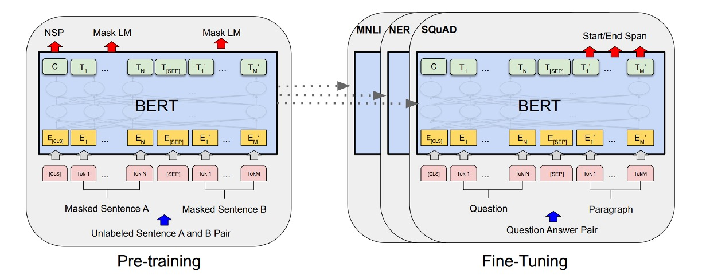
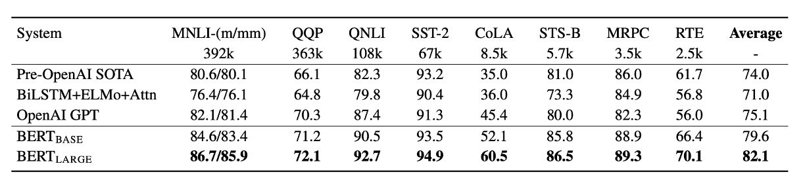
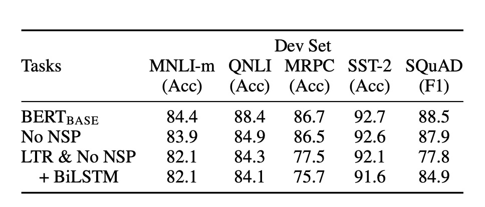

# [18.10] BERT

## Twelve Layers of Encoders

[**BERT: Pre-training of Deep Bidirectional Transformers for Language Understanding**](https://arxiv.org/pdf/1810.04805.pdf)

---

:::info
The following content has been compiled by ChatGPT-4 and manually proofread, edited, and supplemented.
:::

---

After the introduction of the Transformer architecture, many researchers began exploring ways to better utilize it. GPT-1, discussed previously, opted for a decoder-only architecture. In contrast, BERT chose an encoder-only approach.

:::tip
Before BERT, there was a model called ELMo, released half a year earlier. Following the naming of BERT, researchers started a trend of naming models after Sesame Street characters. Initially, researchers seriously used titles to find acronyms, but later, they let their creativity fly, naming models whatever they liked...
:::

## Defining the Problem

There are generally two strategies for applying pre-trained language models to downstream tasks:

1. **Feature-based methods:**

   - Examples like ELMo ([Peters et al., 2018a](https://arxiv.org/abs/1802.05365)) use task-specific architectures that include pre-trained representations as additional features.

2. **Fine-tuning methods:**
   - Examples like OpenAI GPT introduce minimal task-specific parameters and train on the downstream tasks by simply fine-tuning all pre-trained parameters.

---

Both methods share the same objective function during pre-training, using a single language model to learn general language representations. The authors highlight a significant issue with the "unidirectionality" of such models.

### Unidirectionality

In OpenAI GPT, a left-to-right architecture is used, where each token can only attend to previous tokens in the Transformer’s self-attention layers. This limitation is not ideal for sentence-level tasks and can be particularly detrimental when applying fine-tuning methods to token-level tasks, such as question answering, where incorporating context from both directions can significantly enhance performance.

## Solving the Problem

### Model Architecture

The proposed model architecture consists of 12 layers of encoders. The configurations are as follows:

- **BERT-Base:**

  - 12 encoder layers, each following the basic Transformer structure.
  - Each encoder layer has 768 hidden dimensions and 12 attention heads.
  - Total parameter count is 110M.

- **BERT-Large:**
  - 24 encoder layers, each following the basic Transformer structure.
  - Each encoder layer has 1024 hidden dimensions and 16 attention heads.
  - Total parameter count is 340M.

For input data, BERT uses several strategies:

1. **Flexible definition of input sequences:** In BERT, a "sentence" can refer to any range of continuous text, and "sequence" refers to the input token sequence BERT processes, which may include one or two sentences.

2. **WordPiece embeddings:** Using a 30,000-token WordPiece vocabulary ([**Wu et al., 2016**](https://arxiv.org/abs/1609.08144)) to handle unknown or rare words effectively.

3. **Special tokens:**

   - **[CLS] token:** The first token of every sequence, used as the representation for classification tasks.
   - **[SEP] token:** Used to separate pairs of sentences, helping BERT distinguish and process information from different sentences.
   - **[MASK] token:** Used in pre-training to randomly mask some tokens for the model to predict.

4. **Sentence separation features:** Besides the [SEP] token, BERT adds learned parameters to each token to indicate whether it belongs to sentence A or B.

### Pre-training Strategy

As shown in the image above, the left side represents BERT’s pre-training strategy, and the right side represents the fine-tuning strategy. BERT's pre-training strategy is highly influential and has shaped the design of many subsequent models.

- **Masked Language Model (MLM):**

  - BERT uses the masked language model (also known as the cloze task) to train deep bidirectional representations. In this task, a certain percentage of input tokens are randomly masked, and the goal is to predict these masked tokens.
  - **Random masking strategy:** About 15% of WordPiece tokens in each input sequence are randomly selected for masking. In 80% of cases, selected tokens are replaced with the [MASK] token, in 10% of cases with random tokens, and in the remaining 10% of cases, they are kept unchanged.
  - **Predicting masked tokens:** For each masked token, BERT uses the corresponding final hidden vector through an output softmax layer to predict the original token, similar to traditional language models.
  - **Mitigating pre-training and fine-tuning mismatch:** Since [MASK] tokens are used during pre-training but not during fine-tuning, this creates a theoretical mismatch. BERT mitigates this by not always replacing selected tokens with actual [MASK] tokens but instead using a random strategy.

- **Next Sentence Prediction (NSP):**
  - To help the model better understand and capture sentence relationships, BERT introduces the next sentence prediction pre-training task.
  - During pre-training, when selecting sentences A and B to form input pairs, there is a 50% chance that B is the actual next sentence following A (labeled as IsNext), and a 50% chance that B is a random sentence from the corpus (labeled as NotNext). This design helps the model learn to recognize whether two sentences are logically connected or sequentially ordered.

### Fine-tuning Strategy

In the fine-tuning stage, BERT adds an additional classification layer for downstream tasks.

- **Question Answering (SQuAD):**

  - In question answering tasks, BERT processes the question and the paragraph containing the answer as a single sequence, using different embeddings to identify the question and paragraph parts. During fine-tuning, BERT introduces specific start and end vectors to predict the answer's position within the paragraph.

- **Natural Language Inference (NLI):**
  - In NLI tasks, BERT takes two sentences as input and predicts the relationship between them by connecting their representations and passing them through a classification layer.

This fine-tuning method is relatively low-cost and can be completed within hours on a GPU or Cloud TPU, making BERT particularly suitable for quickly deploying and achieving high-performance solutions for various natural language processing tasks.

## Discussion

On the GLUE benchmark tasks, BERT significantly outperformed the OpenAI GPT model, especially on the MNLI task, where BERT-LARGE achieved a score of 80.5, compared to GPT’s 72.8. Studies also showed that BERT-LARGE performed better than BERT-BASE on tasks with smaller datasets, indicating that model size plays a crucial role in improving performance.

Moreover, BERT set new state-of-the-art results on 11 different NLP tasks, demonstrating its versatility and effectiveness across various tasks.

### Ablation Study

The authors conducted a series of ablation studies to explore the impact of different components of BERT on performance.

1. **Without NSP:**

   - A bidirectional model trained with only the Masked LM (MLM) objective and no next sentence prediction (NSP). Results showed that the absence of NSP significantly harmed performance on QNLI, MNLI, and SQuAD 1.1.

2. **LTR & Without NSP:**

   - A model trained with a left-to-right (LTR) language model without MLM or NSP. This model underperformed the MLM model across all tasks, especially on MRPC and SQuAD.
   - On SQuAD, the LTR model’s token prediction performance was significantly worse due to the lack of right-side context support.

3. **Adding BiLSTM:**

   - To improve the LTR system, a randomly initialized BiLSTM was added. While BiLSTM improved SQuAD performance, it was still far from matching the bidirectional model and negatively impacted GLUE tasks.

4. **Comparison with ELMo’s Strategy:**
   - Separate LTR and RTL models were trained and their outputs concatenated, similar to ELMo’s approach. Although this strategy utilized both left and right context, it required double the cost of a single bidirectional model.

## Conclusion

BERT’s prominence comes from its high performance. During that era, achieving such state-of-the-art results across numerous benchmarks was rare, which brought significant attention to BERT. After BERT’s introduction, the academic community shifted away from LSTM, with the focus heavily leaning towards Transformer architectures.

BERT’s success demonstrated the potential of the "pre-training-fine-tuning paradigm" for various natural language understanding tasks, laying the groundwork for even more powerful models in the future.
