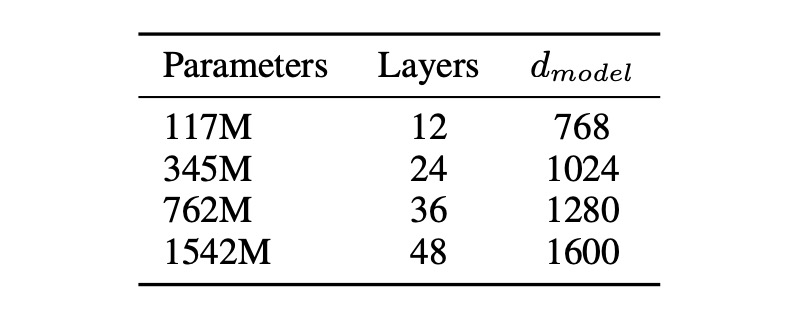
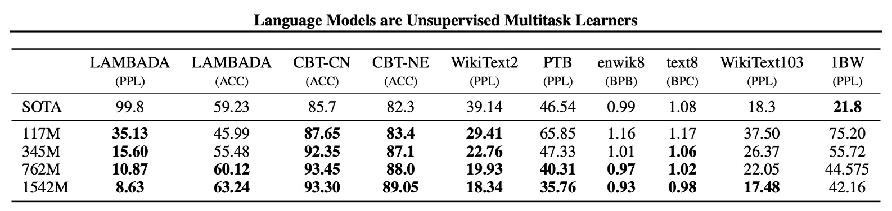

# [19.02] GPT-2

## Forty-Eight Layers of Decoders

[**Language models are unsupervised multitask learners**](https://d4mucfpksywv.cloudfront.net/better-language-models/language_models_are_unsupervised_multitask_learners.pdf)

---

:::info
The following content has been compiled by ChatGPT-4 and manually proofread, edited, and supplemented.
:::

---

The first generation of GPT stacked twelve layers of Transformer decoders. OpenAI felt this wasn't enough, so they stacked forty-eight layers of Transformer decoders, resulting in GPT-2.

## Defining the Problem

The authors believe that existing machine learning systems, despite their excellent performance, are fraught with issues. The paper briefly outlines several areas of concern:

### Fragility

- Machine learning systems exhibit fragility when there are slight changes in data distribution and task specifications.
- These systems lack stability in handling input diversity and variations, leading to unstable behaviors.

### Limitations of Narrow Experts

- Current machine learning systems function more like narrow experts rather than general-purpose systems, limiting their application scope.
- These systems rely on manually building and annotating training datasets for each specific task, a tedious and non-generalizable process.

### Lack of Generalization

- The prevalence of single-task training on single-domain datasets results in systems that lack generalization capabilities.
- To achieve robust systems, training and evaluation need to span a broader range of domains and tasks.

## Solving the Problem

This paper does not propose a new model architecture but extends the existing GPT-1 model.

### Model Design

First, the authors moved LayerNorm to the input of each sub-block, similar to pre-activation residual networks. Additionally, they added an extra layer normalization after the final self-attention block.

A modified initialization method was used, considering the cumulative effect on the residual path as model depth increases. The residual layers' weights were scaled by a factor of 1/√N during initialization, where N is the number of residual layers.

To enhance the model's capabilities, the vocabulary size was expanded to 50,257, the context size increased from 512 to 1024 tokens, and a larger batch size of 512 was used.

:::tip
If you have experience, you will know that a batch size of 512 in this design is quite large.
:::

### Multitask Learning

A general-purpose system should be capable of performing many different tasks. This means modeling P(output|input, task) rather than just modeling the conditional distribution of a single task P(output|input).

Here, the authors propose a method of specifying all inputs and outputs as symbol sequences and training the model using language modeling. For example, a translation training example might be represented as (translate to French, English text, French text), while a reading comprehension training example might be (answer the question, document, question, answer).

In short, different tasks are distinguished using text descriptions.

### Diverse Data

Most prior language model training focused on single text domains, such as news articles, Wikipedia, or book novels. The authors' approach encourages constructing the largest and most diverse dataset possible to cover a broader range of natural language contexts and demonstrations.

For this, the authors chose web scraping, specifically using the Common Crawl dataset. However, they found significant quality issues with Common Crawl.

- **Solution**:

  - **New Web Scraping**: To improve data quality, they scraped all outbound links from the Reddit platform that received at least three upvotes, considering them clean data.
  - **WebText Dataset**: The resulting dataset, WebText, includes a subset of texts from these 45 million links. The initial version of WebText excludes links created after December 2017, and after deduplication and heuristic cleaning, it contains just over 8 million documents, totaling 40 GB of text.
  - **Wikipedia Exclusion**: All Wikipedia documents were removed from WebText to avoid overlap with evaluation tasks, ensuring more accurate analysis.

:::tip
This indicates that pre-2017 data was not influenced by language models, representing genuine human language. Post-2017, it's challenging to discern whether a piece of text was written by a human or a machine.

This poses a significant challenge for future model training, as learning from self-generated data can amplify any errors or biases. Over iterations, these errors accumulate, causing the model's performance to degrade gradually until it eventually collapses.
:::

### Optimized BPE Encoding

The advantage of byte-level BPE lies in its flexibility and generality, as it can decompose any character into a sequence of bytes. However, directly applying BPE to byte sequences can result in suboptimal merges due to BPE's greedy frequency algorithm.

To address this, the authors propose an improved method: preventing merges between different character classes within the byte sequences, except for spaces. This significantly improves compression efficiency while only adding minimal single-character fragments in multiple token representations.

:::tip
This can be likened to piecing together a jigsaw puzzle.

Ordinary BPE is like first assembling commonly occurring puzzle pieces, such as parts of the sky or grass, and then putting these larger assembled pieces together. The benefit is that you can quickly piece together large sections of the sky or grass, making it efficient.

However, if the puzzle's image is highly complex with many different patterns (analogous to Unicode characters), you need to remember all these patterns' combinations. Consequently, your puzzle pieces become numerous, making management cumbersome.

#### Byte-Level BPE

The byte-level BPE approach focuses on each puzzle piece itself, breaking each piece down into smaller units, possibly based on color or shape. This means you only need to remember these basic units rather than the entire pattern's combination, significantly reducing the number of puzzle pieces and simplifying management to just 256 basic units, far fewer than thousands of pattern combinations.

However, this method also has an issue: randomly combining these small units can result in more fragmented pieces. For example, you might mix parts of the sky and grass, making it hard to piece together a complete image.

To solve this, the authors proposed an improved method. They decided to avoid mixing different types of patterns when combining these small units, such as not mixing units of the sky and grass. This ensures that each part of the pattern is easier to piece together. Additionally, they allowed some space between patterns, maintaining each part's integrity.

This way, they could combine the advantages of both methods: efficiently piecing together large patterns while not needing to remember too many pattern combinations. This method made their puzzle-solving more efficient and easier to see the complete picture.
:::

## Discussion

### Model Sizes

The paper proposes four model parameter designs, which were trained and benchmarked.

### Zero-Shot Performance

The authors first evaluated the model's zero-shot performance, i.e., its performance on unseen tasks.

They found that GPT-2 performs well in cross-domain and cross-dataset transferability, improving existing technology levels in 7 out of 8 datasets in zero-shot settings. Significant improvements were seen on small datasets like Penn Treebank and WikiText-2, which contain only 1 to 2 million training tokens.

The dataset for measuring long-term dependencies, such as LAMBADA and the Children's Book Test, also showed substantial progress.

| Metric  | Meaning                                                                             | Interpretation                                                      |
| ------- | ----------------------------------------------------------------------------------- | ------------------------------------------------------------------- |
| **PPL** | **Perplexity**: Measures model sequence prediction performance.                     | Lower score indicates better model prediction accuracy.             |
| **ACC** | **Accuracy**: Measures the proportion of correct predictions.                       | Higher score indicates higher prediction accuracy.                  |
| **BPB** | **Bits Per Byte**: Average bits needed per byte in binary representation.           | Lower score indicates better compression and prediction efficiency. |
| **BPC** | **Bits Per Character**: Average bits needed per character in binary representation. | Lower score indicates better compression and prediction efficiency. |

### Various Experiments

The authors conducted experiments on various tasks, including language modeling, machine translation, question answering, text summarization, and text generation.

Here's a summary table to quickly understand GPT-2's performance on various tasks:

| **Test Name**                    | **Purpose**                                                       | **Test Method**                                                | **Results**                                                                                                                                                                   |
| -------------------------------- | ----------------------------------------------------------------- | -------------------------------------------------------------- | ----------------------------------------------------------------------------------------------------------------------------------------------------------------------------- |
| **Children's Book Test (CBT)**   | Check model performance on different word categories.             | Predict correct options in cloze test.                         | 93.3% accuracy on common nouns, 89.1% accuracy on named entities.                                                                                                             |
| **LAMBADA**                      | Test modeling long-term dependencies.                             | Predict the last word in a sentence.                           | Perplexity reduced from 99.8 to 8.6, accuracy improved from 19% to 52.66%; accuracy with stopword filter improved to 63.24%.                                                  |
| **Winograd Schema Challenge**    | Measure ability to resolve text ambiguity.                        | Solve ambiguity problems.                                      | Performed well on a small dataset of 273 examples.                                                                                                                            |
| **Reading Comprehension (CoQA)** | Test ability to answer questions relying on dialogue history.     | Use conversational question-answering dataset.                 | Achieved 55 F1 score on the development set, approaching or exceeding three-quarters of baseline systems.                                                                     |
| **Summarization**                | Test summarization ability.                                       | Generate summaries via top-k random sampling.                  | Generated summaries similar in quality to human-written ones, though occasionally confusing in details; marginally better than selecting 3 random sentences on ROUGE metrics. |
| **Translation**                  | Test translation ability.                                         | Use English-French sentence translation.                       | Achieved 5 BLEU on English-French test set; 11.5 BLEU on French-English test set, lower than the best unsupervised methods' 33.5 BLEU.                                        |
| **Question Answering**           | Test frequency of producing correct answers to factual questions. | Embed example question-answer pairs, evaluate answer accuracy. | Correctly answered 4.1% of questions, 5.3 times more than baseline; 63.1% accuracy on the top 1% most confident questions.                                                    |

## Conclusion

This study aims to explore the application and potential of unsupervised multitask learning in natural language processing (NLP), particularly utilizing the GPT-2 model's ability to perform various NLP tasks directly without supervised adaptation or modification.

GPT-2 demonstrates that when large language models are trained on sufficiently large and diverse datasets, they can perform well across many domains and datasets, capable of executing numerous tasks without explicit supervision.

These findings offer new perspectives and possibilities for unsupervised learning and model improvement in future NLP tasks.
