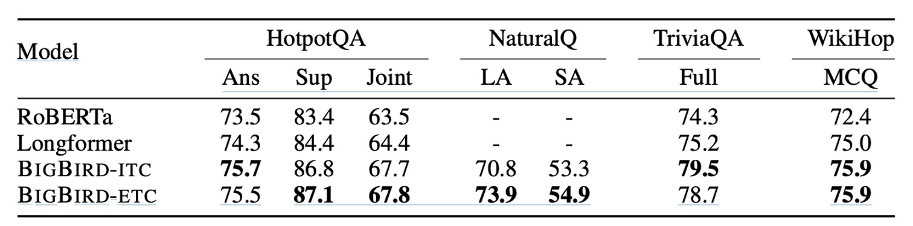

# [20.07] BigBird

## BigBird Attention Mechanism

[**Big Bird: Transformers for Longer Sequences**](https://arxiv.org/abs/2007.14062)

---

:::info
The following content has been compiled by ChatGPT-4, edited, and supplemented with additional information.
:::

---

The computational complexity of the Transformer's self-attention mechanism is $O(n^2)$.

When any algorithm has such a high computational complexity, it indicates significant optimization potential.

Hmm? This introduction again?

## Defining the Problem

Transformer models, such as BERT, have shown outstanding performance in various NLP tasks, primarily due to the parallel computing capability of the self-attention mechanism and modern hardware support. However, the computational and memory requirements brought by this mechanism are quadratic concerning the sequence length, limiting its direct application in tasks requiring longer contexts.

Shortly after the **Longformer** was proposed, the Google Brain team introduced BigBird, a Transformer variant designed specifically to handle long sequences.

- [**Longformer: The Long Attention Mechanism**](../2004-longformer/index.md)

### Lack of Fundamental Theory

In addition, the authors argue that past research has been heuristic without providing theoretical analysis of the self-attention model. They point out that previous studies lack a deep understanding of the key factors and expressive power of self-attention models. Although it has been shown that Transformers possess Turing completeness, it remains unclear whether this capability can be maintained while reducing computational complexity.

Motivated by the above, the authors propose the BigBird model, which achieves excellent performance on long-sequence tasks through a sparse attention mechanism while maintaining theoretical expressive power.

:::tip
Turing completeness refers to a system's capability equivalent to that of a Turing machine, able to simulate any computable task. This means a Turing complete system can execute any algorithm or computer program theoretically with infinite computing potential, given sufficient time and resources.
:::

## Solving the Problem

### Model Architecture

The concept of this paper is quite simple. You can almost understand it by looking at this picture.

In the BigBird architecture, the authors designed three components that ultimately form a sparse structure:

- Diagram (a) is the random attention mechanism that establishes connections between tokens randomly within each layer of the model.
- Diagram (b) is the Sliding Window Attention, where each token only attends to tokens within a fixed range before and after it.
- Diagram (c) is the Global Attention, where specific tokens attend to all other tokens, and other tokens attend to these specific tokens.
- Diagram (d) combines the above three mechanisms to form the BigBird attention mechanism.

### Architecture Design

The authors designed two different methods for selecting global tokens, compared in subsequent experiments:

- **BIGBIRD-ITC (Internal Transformer Construction)**

  - **Global Token Selection**: In this design, certain existing tokens are designated as "global" tokens, meaning they will attend to all other tokens in the sequence.
  - **Matrix Representation**: For the selected global token index set $G$, the corresponding adjacency matrix $A$ is adjusted so that all elements of rows and columns for each global token $i$ in $A$ are set to 1 (i.e., $A(i, :) = 1$ and $A(:, i) = 1$), indicating these tokens can interact with all other tokens in the sequence.

- **BIGBIRD-ETC (Extended Transformer Construction)**

  - **Additional Global Tokens**: Unlike ITC, the ETC design introduces additional global tokens (e.g., CLS tokens) specifically designed to attend to all existing tokens.
  - **Matrix Expansion**: To include these additional global tokens, the original adjacency matrix $A$ is expanded into a new matrix $B$. Specifically, $g$ rows are added to $A$ such that all elements in these $g$ rows of $B$ are set to 1 (i.e., $B(i, :) = 1$), and the corresponding columns for these rows are also set to 1 (i.e., $B(:, i) = 1$), where $i$ is the index of the global tokens. This way, the new global tokens can attend to the entire sequence.

### Proof Beforehand

The following section is the most challenging part of the paper, where the authors prove the theoretical properties of BigBird and explain why the "random attention mechanism" is adopted.

Although we can directly use the conclusions, since we're here, let's take a brief look.

Before proving, the authors describe the theoretical framework of the self-attention mechanism:

1. **Generalized Attention Mechanism**

   - The BigBird model uses a generalized attention mechanism that processes the sequence $X = (x_1, \ldots, x_n)$ within each layer of the Transformer.
   - The attention mechanism is described through a directed graph $D$, where the node set is $[n] = \{1, \ldots, n\}$, and directed edges represent the set of dot products considered.

2. **Attention Output Vector**

   - For each node $i$ in the graph, the generated output vector $\text{ATTND}(X)_i$ is calculated from node $i$ and its outer neighbors $N(i)$.
   - Specifically, $\text{ATTN}_{D}(X)_i = x_i + \sum_{h=1}^H \sigma \left(Q_h(x_i) K_h(X_{N(i)})^T\right) \cdot V_h(X_{N(i)})$.
   - $Q_h, K_h, V_h$ are query, key, and value functions mapping $R^d$ to different spaces.
   - $\sigma$ is a scoring function, such as softmax or hardmax.
   - $H$ is the number of heads.

3. **Fully Connected Graph and Sparsification**:

   - If $D$ is a fully connected directed graph, it reverts to the quadratic attention mechanism described by Vaswani et al.
   - The sparsification of graph $D$ is achieved by selecting a certain number of random edges between nodes, reducing computational complexity.

4. **Sparse Random Graphs**:

   - Random graphs are used to approximate full graphs, with spectral properties similar to full graphs, acting as expanders.
   - The simplest Erdos-Rényi model is used, where each edge is independently chosen with a fixed probability.

5. **Locality and Sliding Window**:

   - In most NLP and computational biology contexts, much of the reference information exhibits locality, extracting information from neighboring tokens.
   - The BigBird model uses a sliding window attention mechanism to address this locality.

6. **Use of Global Tokens**:

   - Global tokens are introduced to simulate cases involving all tokens in the sequence, playing a key role in attention computation, participating in processing the entire sequence.

---

The above section doesn't introduce new concepts but describes how the original attention mechanism is a "special case" of the generalized attention mechanism.

This "special case" is the fully connected directed graph, so adjusting the attention graph to a "tailored" directed graph means stepping into the domain of sparse attention mechanisms.

Additionally, it explains why the random attention mechanism is adopted:

- Because we need to "approximate" a full graph.

Using random graphs to approximate full graphs, which have spectral properties similar to full graphs, acting as expanders. Here, the authors use the simplest Erdos-Rényi model, where each edge is chosen independently with a fixed probability.

:::tip
If you have worked on Graph Convolutional Networks (GCNs) or other graph neural networks, you can compare here. In graph convolution, "nodes" refer to tokens here; "edges" refer to attention connections; "adjacency matrix" refers to the attention graph here.

Why did graph convolution techniques fall out of favor after the attention mechanism was proposed? Because the attention mechanism is a more generalized graph convolution, not only easier to stack deeply but also easier to train.
:::

### Start Proof

The encoder stack of a Transformer is essentially a series of repeated single-layer encoders, each with its own set of parameters.

This structure allows input data to be processed through multiple stages, with each layer further transforming the data based on the previous layer's output.

- **Parameterization**:

  - **H**: The number of attention heads in each encoder layer.
  - **m**: The size of each attention head.
  - **q**: The size of the hidden layer in the output network.

- **Attention Mechanism**:

  - Defined by a directed graph $D$. Unlike traditional attention mechanisms (e.g., Vaswani et al.), this configuration adds a special token at the start of each sequence, denoted as $x_0$. This token can be used for various purposes, such as representing aggregated information of the sequence or handling specific context requirements. The vertex set of graph $D$ includes this special token, i.e., $\{0\} \cup [n] = \{0, 1, 2, \ldots, n\}$.

- **Input and Output Processing**:

  - Despite adding an extra node $x_0$ at the beginning, the Transformer is conceptualized as mapping sequences from $\mathbb{R}^{n \times d}$ to $\mathbb{R}^{n \times d}$.
  - In the final output layer, it is assumed that the extra node and its vector are discarded, ensuring the output dimensions match the input.
  - Position embeddings $E \in \mathbb{R}^{d \times n}$ are appended to the input matrix $X$, enhancing the model's ability to interpret sequence data based on element positions within the sequence.

- **Universal Approximation**:

  - The function class $\text{FCD}$ is defined as the set of continuous functions $f: [0, 1]^{n \times d} \to \mathbb{R}^{n \times d}$, with continuity defined by a specific $p$-norm topology.

  - The distance metric used to measure the quality of function approximation is the $p$-norm distance $d_p(f_1, f_2) = \left(\int \|f_1(X) - f_2(X)\|^p \, dX\right)^{1/p}$.

    :::tip
    Imagine you have a large plane where each point can be described by two numbers, like latitude and longitude on a map.

    In this example, the plane is denoted by $[0, 1]^{n \times d}$, and you can think of it as a large table with many rows and columns, where each cell's number is between 0 and 1.

    The function $f$ is like a special rule that can transform each point (or numbers in each row and column) in this large table into another set of new numbers, i.e., outputting a new table of the same size. This transformation needs to meet certain smoothness and continuity requirements, meaning the output numbers won't change abruptly but will vary coherently and orderly.
    :::

- **Definition: Star Graph Centered at 0 $S$**

  - Here, the star graph $S$ is a specific graph structure where one central node (node 0) is directly connected to all other nodes (nodes 1 to n) in the graph.
  - This structure is crucial as it allows the central node to directly influence all other nodes, which is an important feature used in the subsequent proof.

- **Theorem: Universal Approximation Capacity of Sparse Attention Mechanisms**

  - The theorem states that as long as a graph contains such a star graph $S$, the sparse attention mechanism defined by this graph can be used as a universal approximator.
  - This means that such a Transformer model can approximate any continuous function in the function class $FCD$.

- **Proof Step 1: Approximating $FCD$ with Piecewise Constant Functions**

  First, the function $f$ we need to handle is a continuous function defined on the bounded region [0, 1)$^{n \times d}$. To approximate such a function, we choose to use piecewise constant functions. Specifically, we partition the [0, 1) interval into small grids (with granularity $\delta$), thus turning the entire region into a discrete point set $G_{\delta}$. Within each small grid, we assume the function value is constant. This way, we can approximate the original function $f$ with a new piecewise constant function $\bar{f}$.

- **Proof Step 2: Approximating Piecewise Constant Functions with Modified Transformers**

  This is the most critical step of the proof. Here, we use the self-attention mechanism to produce a context mapping of the input. Each matrix $X$ and its column $x_i$ are mapped into a unique code, which is then used to generate a unique output column. Since we only use a sparse attention mechanism, the challenge lies in ensuring that each query can obtain sufficient information to complete this mapping. The solution is to develop a sparse shift operator that adjusts according to the range of data in the input matrix, ensuring that each column of data forms a complete and unique mapping.

- **Proof Step 3: Approximating Modified Transformers with Original Transformers**

  The final step is to approximate the modified Transformer model with the original Transformer model (using ReLU and softmax functions). This step ensures that these modifications do not deviate from the basic functionality and efficiency of the original model.

### Turing Completeness

In fact, research by Pérez et al. shows that Transformer models based on the complete attention mechanism are Turing complete, meaning they can simulate the computation process of any Turing machine.

However, this result is based on a theoretical assumption that the model can "process data with arbitrary precision."

In practical applications, this assumption often does not hold, as Transformers are finite-state machines and cannot achieve true Turing completeness.

- **Is Sparse Attention Also Sufficient to Simulate Any Turing Machine?**

  The paper mentions that with appropriate adjustments, Transformers using sparse encoders and decoders can also achieve Turing completeness.

  This sparse attention mechanism, in practice, requires each token to interact only with preceding tokens. Unlike BERT's full attention applied at once, it operates token-by-token during the decoding process.

  Moreover, in the method by Pérez et al., each token also serves as a representation of the tape history, with full attention used to move and retrieve the correct symbol on the tape.

  For the implementation of the sparse attention mechanism, besides modifying the addressing scheme pointing to the history, most of the architecture can be directly applied.

  This shows that even under sparse configurations, Transformers have the potential to simulate any computation process, providing a theoretical foundation for understanding and extending Transformer applications in various complex computational tasks.

:::tip
Turing completeness refers to the computational power of a system. If a system can simulate the computation process of any Turing machine, it is considered Turing complete. A Turing machine, proposed by mathematician Alan Turing, is an abstract machine that uses a simple set of rules to read and write symbols on an infinitely long tape. A Turing complete system can achieve any computable function, meaning it can perform any computational task that any other Turing complete system can execute. This is a crucial standard for evaluating the computational capabilities of systems, such as programming languages and processor architectures.
:::

### Limitations of Sparse Attention

This task requires finding, for each given unit vector $u_j$ among $n$ unit vectors $\{u_1, ..., u_n\}$, a corresponding farthest vector $u_j^*$. Here, "farthest" refers to the Euclidean distance in the vector space, often translating to minimizing the inner product.

In a complete attention mechanism, this task is relatively easy to solve because it allows calculating inner products for all vector pairs simultaneously. In other words, the complete self-attention mechanism can evaluate relationships among all vector pairs simultaneously, thus finding the farthest vector for each in $O(1)$ layers.

For sparse attention mechanisms, the situation is quite different. According to the Orthogonal Vector Conjecture (OVC), in sparse attention mechanisms, this problem becomes challenging to solve. The theorem shows that for any sparse attention graph $D$ with $O(n \log^k n)$ edges (denoted as $O\tilde{}$ to hide polylogarithmic factors), solving this seemingly simple farthest vector search problem still requires $\Omega(\tilde{n}^{1-o(1)})$ layers.

This indicates that while sparse attention mechanisms can reduce computational resource consumption, solving certain types of problems may require significantly more layers, potentially becoming a limitation in practical applications.

:::tip
OVC is a widely used hypothesis in fine-grained computational complexity theory, stating that it is impossible to determine whether the minimum inner product of $n$ Boolean vectors is zero in sub-quadratic time.
:::

## Discussion

This section aims to demonstrate the benefits of handling longer input sequences in NLP tasks. We selected three representative tasks for the study: Masked Language Modeling (MLM), Question Answering (QA) with supporting evidence, and long document classification. These tasks aim to explore the potential of learning better contextual representations through longer contiguous sequences.

### QA-dev

- **Datasets**: Including HotpotQA, Natural Questions, TriviaQA, and WikiHop.
- **Metrics**: Using base-sized models, reporting accuracy for WikiHop and F1 scores for HotpotQA, Natural Questions, and TriviaQA.

This comparison includes multiple models, such as RoBERTa, Longformer, BIGBIRD-ITC, and BIGBIRD-ETC. The BIGBIRD-ETC model, with its design of extended global tokens, consistently outperformed all other models.

### QA Test finetune

- **Tasks and Datasets**: Including HotpotQA, Natural Questions, TriviaQA, and WikiHop.
- **Comparison Benchmark**: Comparing the BIGBIRD-ETC model with the top three entries on the leaderboard excluding BIGBIRD.

In this experiment, BIGBIRD-ETC established new SoTA in several datasets, notably in Natural Questions long answer, TriviaQA, and WikiHop tests. Compared to the single-model BIGBIRD, other leading entries are mostly ensemble models, which might explain why BIGBIRD's accuracy in precise answer selection is slightly lower in some cases.

### Long Document Summarization Ability

In this segment, the paper explores experiments using the BIGBIRD model for long document abstractive summarization. The experiments focus on how the model performs significant improvements when dealing with long-range texts requiring deep contextual understanding. The study used three datasets specifically designed for long documents. The experimental results, as shown in the above table, demonstrate that by applying BIGBIRD's sparse encoder and complete decoder to train on these long document datasets, the model effectively enhances the quality and accuracy of the summaries.

This improvement is attributed to the model's ability to handle longer text ranges, thereby better understanding and integrating dispersed key information within the documents.

These observations highlight BIGBIRD's potential and practical benefits in handling highly complex NLP tasks, particularly in applications requiring deep text analysis and comprehension.

:::tip
Pegasus (Pre-training with Extracted Gap-sentences for Abstractive Summarization Sequence-to-sequence models) is a pre-training method specifically designed for text summarization tasks

, developed by Google Research. Pegasus's core innovation lies in its pre-training strategy tailored to the needs of summarization tasks.

Pegasus's pre-training process uses a strategy called "gap sentences prediction" (GSP). In this process, several sentences are randomly selected and "masked" (i.e., removed) from a document, and the model needs to predict these masked sentences. This is slightly different from traditional masked language models (e.g., BERT), which usually randomly mask words or tokens, whereas Pegasus masks entire sentences.
:::

## Conclusion

Compared to past models like Sparse Transformer and Longformer, we believe the main contribution of this paper is providing a detailed mathematical theory proof for sparse attention mechanisms.

Additionally, it points out that if we want to approximate the complete attention mechanism, we need to design the model's attention mechanism using random, sliding window, and partially global methods.

Through in-depth research into the theoretical properties of Transformer models, the authors demonstrate the universal approximation capability of sparse attention mechanisms and prove their superior performance in handling long-sequence tasks.

Regarding the detailed proof methods, the appendix of the paper contains about 20 pages of material, which can be overwhelming. Interested readers are welcome to review the original paper for more information.
