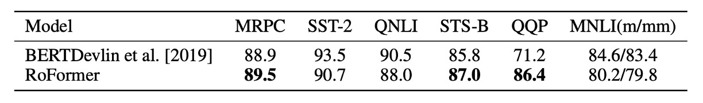

# [21.04] RoFormer

## Rotary Position Embedding

[**RoFormer: Enhanced Transformer with Rotary Position Embedding**](https://arxiv.org/abs/2104.09864)

---

:::info
The following content is compiled by ChatGPT-4 and has been manually edited and supplemented.
:::

---

Compared to the name RoFormer, RoPE (Rotary Position Embedding) is more widely known. RoPE is the core concept of RoFormer, introducing a new method of positional encoding.

## Problem Definition

Unlike RNNs or CNNs, Transformers lack an inductive bias towards position. Thus, we must provide additional positional information so the model can understand the order within a sequence. Typically, positional encoding involves converting positional information into vector form and then "adding" it to the input token embeddings.

### Absolute Position: Sinusoidal

- [**Attention Is All You Need**](https://arxiv.org/abs/1706.03762)

In the first Transformer paper, a sinusoidal function was used:

$$
PE_{(pos, k)} = \begin{cases}
\sin(pos/10000^{2i/d_{\text{model}}}) & \text{if } k = 2i \\
\cos(pos/10000^{2i/d_{\text{model}}}) & \text{if } k = 2i + 1
\end{cases}
$$

This function considers both the sequence length and feature dimensions, providing a fixed positional encoding for each position. Due to its fixed generation pattern, sinusoidal encoding has some extrapolation ability.

:::tip
**What is the significance of the 10000 in the formula?**

The 10000 in the positional encoding formula can be explained as the scale of the encoding. We constrain the scale within a suitable range to effectively capture the relationships between different positions, avoiding adverse effects from excessively high or low frequencies. Changing the 10000 to 100, for example, would increase the frequency of the sine and cosine functions, causing the positional encodings to repeat over shorter distances, potentially impairing the model's ability to sense relationships between distant positions.
:::

### Absolute Position: Learned

- [**BERT: Pre-training of Deep Bidirectional Transformers for Language Understanding**](https://arxiv.org/abs/1810.04805)

In models like BERT and GPT, positional encodings are learned. Assuming a maximum sequence length of $N$ and a model dimension $d_{\text{model}}$, the positional encoding matrix is $N \times d_{\text{model}}$. This design is straightforward and requires no additional thought, but it lacks the ability to generalize to longer sequences and requires retraining if the sequence length changes.

:::tip
Extrapolation might not be a significant drawback of absolute positional encoding. Readers can refer to Su Jianlin's article:

- [**Hierarchical Decomposition Position Encoding, Making BERT Handle Ultra-Long Text**](https://spaces.ac.cn/archives/7947)
  :::

### Relative Position: XL Style

- [**Transformer-XL: Attentive Language Models Beyond a Fixed-Length Context**](https://arxiv.org/abs/1901.02860)

In this paper, the self-attention mechanism's $QK^T$ is expanded:

- $Q_i=(x_i+pos_i)W_Q$
- $K_j=(x_j+pos_j)W_K$
- $Q_iK_j^T=(x_i+pos_i)W_QW_K^T(x_j+pos_j)^T$

This results in:

- $Q_iK_j^T=x_iW_QW_K^Tx_j^T+x_iW_QW_K^Tpos_j^T+pos_iW_QW_K^Tx_j^T+pos_iW_QW_K^Tpos_j^T$

Then, $pos_j$ is replaced with relative positional vector $R_{i-j}$, and $pos_i$ is replaced with learnable vectors $u$ and $v$:

- $Q_iK_j^T=x_iW_QW_K^Tx_j^T+x_iW_QW_K^T{\color{red}{R_{i-j}^T}}+{\color{green}{u}}W_QW_K^Tx_j^T+{\color{green}{v}}W_QW_K^T{\color{red}{R_{i-j}^T}}$

Since $uW_Q$ and $vW_Q$ are learnable parameters, they can be merged into one, resulting in:

- $Q_iK_j^T=x_iW_QW_K^Tx_j^T+x_iW_QW_K^T{\color{red}{R_{i-j}^T}}+{\color{green}{u}}W_K^Tx_j^T+{\color{green}{v}}W_K^T{\color{red}{R_{i-j}^T}}$

Considering the encoding space of ${\color{red}{R_{i-j}^T}}$ differs from the original $pos_j$, $W_K^T$ is replaced with $W_{K, R}^T$:

- $Q_iK_j^T=x_iW_QW_K^Tx_j^T+x_iW_QW_{K, R}^T{\color{red}{R_{i-j}^T}}+{\color{green}{u}}W_K^Tx_j^T+{\color{green}{v}}W_{K, R}^T{\color{red}{R_{i-j}^T}}$

Finally, the paper does not add positional encoding to the V matrix in QKV. Subsequent research also only adds positional encoding to the QK matrix (the attention matrix).

### Relative Position: T5 Style

- [**Exploring the Limits of Transfer Learning with a Unified Text-to-Text Transformer**](https://arxiv.org/abs/1910.10683)

In T5, the authors decoupled content and positional information, placing all position-related information into $\beta_{i,j}$:

- $Q_iK_j^T=x_iW_QW_K^Tx_j^T + \beta_{i,j}$

### More Methods

We are not reviewing all positional encoding methods. For more information, refer to Su Jianlin's article:

- [**Transformer's Positional Encoding That Baffled Researchers**](https://spaces.ac.cn/archives/8130)

## Solution

Previous research shows that absolute and relative positional encodings have their own advantages and disadvantages. This study aims to propose a method that integrates both absolute and relative positional encoding.

### Model Architecture

Language modeling based on Transformers typically uses self-attention mechanisms to utilize the positional information of each token. The authors aim for the dot product to encode positional information only in a relative form:

$$
\langle f_q(x_m, m), f_k(x_n, n) \rangle= g(x_m, x_n, m-n)
$$

The ultimate goal is to find an equivalent encoding mechanism to solve the functions $f_q(x_m, m)$ and $f_k(x_n, n)$ to satisfy the above relation. After a series of derivations (**details in the paper**), the proposed solution is:

- $f_q(x_m, m) = (W_qx_m)e^{im\theta}$
- $f_k(x_n, n) = (W_kx_n)e^{in\theta}$
- $g(x_m, x_n, m - n) = \Re \left[ (W_q x_m)(W_k x_n)^* e^{i(m - n) \theta} \right]$

Here, $\Re$ denotes taking the real part, $*$ denotes the complex conjugate, and $\theta$ is a non-zero constant.

:::info
**Euler's Formula and Rotation**

The core concept of Euler's formula is rotation. For a complex number $z = x + iy$, it can be viewed as a point $(x, y)$ on a plane or a vector $(x, y)$. When we multiply the complex number $z$ by $e^{i\theta}$, it corresponds to rotating the vector $(x, y)$ counterclockwise by an angle $\theta$.

Here's an illustrative example:

- **Initial State**

  ```
      y
      ^
      |
      |   z = x + iy
      |
      +-----------------> x
  ```

- **After Rotation**

  When we multiply the complex number $z$ by $e^{i\theta}$, it corresponds to rotating the vector $(x, y)$ counterclockwise by an angle $\theta$:

  ```
      y
      ^
      |        z' = e^{i\theta}z
      |       /
      |      /
      |     /
      |    /
      |   /  z = x + iy
      |  /
      | /
      |/
      +-----------------> x
  ```

This is because $e^{i\theta}$ can be expanded using Euler's formula:

- $e^{i\theta} = \cos(\theta) + i\sin(\theta)$

This formula represents a unit vector rotating counterclockwise by an angle $\theta$ in the complex plane.

- **Special Case**

  When $\theta = \pi$, we get:

  - $e^{i\pi} = -1$

  This means multiplying the complex number $z$ by $e^{i\pi}$ rotates it by 180 degrees, resulting in a vector in the opposite direction. Thus, we obtain the famous identity:

  - $e^{i\pi} + 1 = 0$

  This identity, known as Euler's identity, is one of the most beautiful formulas in mathematics, elegantly connecting the base of the natural logarithm $e$, the imaginary unit $i$, the circumference ratio $\pi$, 1, and 0.
  :::

:::tip
In the paper, expressions like $in\theta$ appear, where $n\theta$ indicates multiple rotations.

The forms $f_q(x_m, m)$ and $f_k(x_n, n)$ represent two vectors rotating by angles $m\theta$ and $n\theta$ in the complex plane.

Here, $m$ and $n$ are parameters representing different frequency components or spatial positions, capturing the behavior of two vectors at different rotation angles.

$$
g(x_m, x_n, m - n) = \Re \left[ (W_q x_m)(W_k x_n)^* e^{i(m - n)\theta} \right]
$$

Here, $i(m - n)\theta$ indicates the difference in rotation angles between the two.
:::

### Higher-Dimensional Extension


The diagram above illustrates RoPE.

To generalize the results from a 2D space to any $x_i \in R^d$ where $d$ is even, the authors divide the $d$-dimensional space into $d/2$ subspaces, converting $f\{q,k\}$ into:

$$
f\{q,k\}(x_m, m) = R^d_{\Theta,m} W_{\{q,k\}} x_m
$$

where

$$
R^d_\Theta,m =
\begin{pmatrix}
\cos m\theta_1 & -\sin m\theta_1 & 0 & 0 & \cdots & 0 & 0 \\
\sin m\theta_1 & \cos m\theta_1 & 0 & 0 & \cdots & 0 & 0 \\
0 & 0 & \cos m\theta_2 & -\sin m\theta_2 & \cdots & 0 & 0 \\
0 & 0 & \sin m\theta_2 & \cos m\theta_2 & \cdots & 0 & 0 \\
\vdots & \vdots & \vdots & \vdots & \ddots & \vdots & \vdots \\
0 & 0 & 0 & 0 & \cdots & \cos m\theta_{d/2} & -\sin m\theta_{d/2} \\
0 & 0 & 0 & 0 & \cdots & \sin m\theta_{d/2} & \cos m\theta_{d/2}
\end{pmatrix}
$$

is the rotation matrix with predetermined parameters $\Theta = \{\theta_i = 10000^{-2(i-1)/d}, i \in [1, 2, ..., d/2]\}$.

Applying RoPE to the self-attention mechanism's equation, we get:

$$
q^\top_m k_n = (R^d_{\Theta,m} W_q x_m)^\top (R^d_{\Theta,n} W_k x_n) = x^\top W_q R^d_{\Theta,n-m} W_k x_n
$$

where $R^d_{\Theta,n-m} = (R^d_{\Theta,m})^\top R^d_{\Theta,n}$. Note that $R^d_\Theta$ is an orthogonal matrix, ensuring stability in the encoding process.

### Long-Range Decay


The authors follow the original Transformer's design, setting $\theta_i=10000^{-2i/d}$ to provide a long-range decay characteristic, as shown above. This means that as the distance between two positions increases, the dot product of their positional encodings decreases, reflecting the weaker relationships expected between distant positions in a text.

## Discussion

### Comparison with Other Positional Encodings


The above image compares RoPE with other positional encoding methods. On the left, compared with BERT, the model using RoPE shows better performance during training, with a faster decrease in MLM Loss. On the right, adding RoPE to PerFormer shows faster convergence and better performance at the end of training.

### GLUE Benchmark



The authors fine-tuned their model using Hugging Face's Transformers library and experimented on the GLUE dataset. The results indicate that RoFormer generally outperforms BERT on the GLUE dataset, demonstrating the effectiveness of RoPE in natural language processing tasks.

### Limitations

Despite strong theoretical support and encouraging experimental results, the authors acknowledge some limitations:

1. The mathematical representation of relative positional relationships as rotations in 2D subspaces lacks a deep explanation for why this method results in faster convergence than baseline models with other positional encoding strategies.
2. While the model exhibits beneficial long-term decay characteristics similar to existing positional encoding mechanisms and outperforms other models in long text processing, a compelling explanation for this advantage remains elusive.

## Conclusion

This paper might be challenging to read, but the concept of RoPE is fascinating. We highly recommend reading the original paper. Many works (e.g., LLaMA, Mamba) have already adopted RoPE, indicating its promising applications in the field of natural language processing. Subsequent work has explored and improved upon RoPE, and we will discuss these developments as we encounter them.
