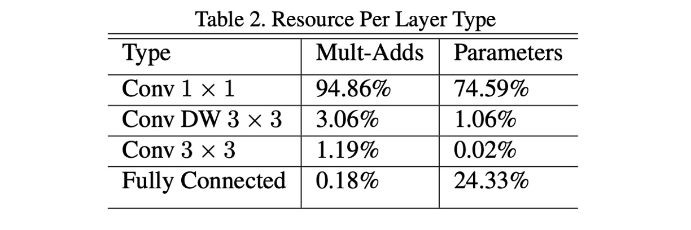
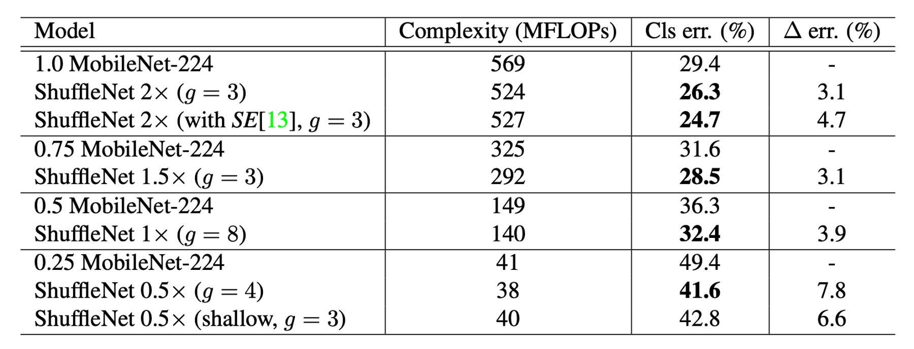

## Channel Shuffling Network

[**ShuffleNet: An Extremely Efficient Convolutional Neural Network for Mobile Devices**](https://arxiv.org/abs/1707.01083)

---

The competition for lightweight networks has just begun.

ShuffleNet joined the fray during this period.

## Defining the Problem

### Computational Load vs. Speed Discrepancy

In this study, the authors aimed to solve the same issue as previous research:

- **How to design an efficient neural network for mobile devices with very limited computational power while maintaining high accuracy?**

Although models like MobileNet and SENet have taken steps toward low computational costs, there is still room for improvement, especially for models with very low computational budgets (e.g., less than 150 MFLOPs).

The authors pointed out that existing efficient models often have a significant gap between the actual inference time on hardware and the expected performance.

### Extensive Use of 1x1 Convolutions



In MobileNet-V1, the authors analyzed the computational load of the entire network architecture, as shown above.

The authors of this paper believe that the extensive use of 1x1 convolutions is the primary source of computational load and that addressing this issue could significantly reduce the computational load.

## Solving the Problem

### Group Convolutions


A major challenge is reducing the computational load of 1x1 convolutions. The authors believe that increasing the number of groups is the solution.

Assume both the input and output channels are 128. Without grouping, the 1x1 convolution needs to compute for each output channel with every input channel, resulting in $128 \times 128 = 16,384$ multiplications. However, if the number of groups is set to 8, each group contains $128 / 8 = 16$ channels. In this case, the convolution computations involve only 16 input channels and 16 output channels within each group, leading to $16 \times 16 = 256$ multiplications per group. Since there are 8 such groups, the total number of multiplications is $256 \times 8 = 2,048$.

Thus, grouped convolutions can reduce the computational load to approximately 12.5% of the original 1x1 convolutions, from 16,384 to 2,048 multiplications.

However, there is no free lunch.

While grouped convolutions can reduce computational load, they also come with a drawback: **they disrupt the relationships between channels**, as shown in diagram (a).

Ultimately, this significantly reduces the overall performance of the network.

### Channel Shuffling

To address the issues brought by grouped convolutions, the authors proposed a new operation: **channel shuffling**, as shown in diagram (b).

The concept is that, since grouping restricts the flow of information between channels, we can introduce an operation within the groups to shuffle the channels of different groups, thus maintaining the inter-channel relationships.

This operation might seem complex at first, but we can implement a shuffling function directly to understand its significance.

```python
import torch

def shuffle_channel(x: torch.Tensor, groups: int) -> torch.Tensor:
    batch_size, num_channels, height, width = x.size()
    channels_per_group = num_channels // groups

    x = x.view(batch_size, groups, channels_per_group, height, width)
    x = x.permute(0, 2, 1, 3, 4).contiguous()
    x = x.view(batch_size, num_channels, height, width)
    return x
```

As the above function demonstrates, channels are first divided into groups, and then their positions are shuffled, achieving the effect of channel shuffling. For example, if the original channels are: AAA, BBB, CCC, after shuffling, they become: ABC, ABC, ABC.

Although it's called shuffling, it is not random but follows a rule to ensure that different groups' channels can communicate information.

### Placement of Shuffling Modules


Finally, the placement of shuffling modules is shown in the diagram above.

The design of the ShuffleNet unit is inspired by the bottleneck unit of residual blocks, particularly utilizing computationally efficient $3 \times 3$ depthwise convolutions to process bottleneck feature maps within its residual path. Based on this, by using grouped pointwise convolutions instead of traditional $1 \times 1$ convolutions and incorporating channel shuffling, the core structure of the ShuffleNet unit is formed (as shown in diagram (b)).

To match the shortcut path and restore the channel dimensions, the second pointwise convolution in the unit is also grouped, but no additional channel shuffling is applied afterward to keep operations simple. In this structure, batch normalization (BN) and non-linear activations are applied similarly to other studies, except that ReLU is not immediately applied after depthwise convolution as usually recommended.

Additionally, when it comes to stride usage, the ShuffleNet unit has made two main adjustments, as shown in diagram (c):

- First, a $3 \times 3$ average pooling operation is introduced in the shortcut path.
- Second, channel concatenation is used instead of element-wise addition, effectively expanding the channel dimension without significantly increasing computational costs.

This design ensures all components in the unit are computed efficiently, especially achieving channel shuffling in the grouped pointwise convolutions.

### Model Architecture


Based on all the above modules, the final ShuffleNet architecture is formed, as shown in the table above. The table on the right shows $g=1$ to $g=8$, where $g$ is the number of groups.

The authors considered that increasing the number of groups reduces the computational load. To maintain a consistent computational load (consistent comparison baseline), they increased the number of channels per layer as they increased the number of groups.

## Discussion

### Effectiveness of Group Convolutions


1. **Impact of Model Size and Number of Groups**:

   The experiments compared ShuffleNet models with different numbers of groups (from 1 to 8) and different network complexities (1x, 0.5x, 0.25x). For the same complexity, grouped convolutions (especially with larger group numbers like g=8) generally improved classification performance. Specifically, for the basic ShuffleNet 1x model, the largest group number improved performance by 1.2%. For the smaller models ShuffleNet 0.5x and 0.25x, performance improvements were 3.5% and 4.4%, respectively.

2. **Performance Saturation and Decline**:

   For some models, like ShuffleNet 0.5x, increasing the group number too much (e.g., g=8) might cause performance to saturate or even decline because the number of input channels for each convolution filter is reduced, potentially harming the representation capacity.

3. **Larger Groups Work Better for Smaller Models**:

   For smaller models like ShuffleNet 0.25x, larger group numbers generally led to better results, indicating that wider feature maps benefit these smaller models more.

### Effectiveness of Channel Shuffling


It is evident that channel shuffling consistently improves classification scores across different settings.

### Comparison with Other Models



ShuffleNet outperforms MobileNet across various complexity levels.

- ShuffleNet 1× achieves a 3.1% higher accuracy than MobileNet, despite its higher computational cost (an additional 500 MFLOPs).
- In smaller networks with about 40 MFLOPs, ShuffleNet outperforms MobileNet by 7.8%.
- ShuffleNet demonstrates higher efficiency compared to other popular network models at equivalent accuracy levels. For instance, compared to AlexNet, ShuffleNet is theoretically 18 times faster.

:::tip
Notably, ShuffleNet 2× with the SE module achieves a top-1 error rate of 24.7%.

Despite the theoretical complexity not increasing much, the authors mentioned that in practice, this configuration of ShuffleNet runs 25% to 40% slower on mobile devices than the original version.
:::

### Real Inference Speed Evaluation


The authors evaluated ShuffleNet's inference speed on ARM mobile devices and compared it with other models.

1. **Groups and Efficiency**: In ShuffleNet models, although larger group numbers (such as g=4 or g=8) generally provide better performance, their efficiency is lower in the current implementation. Experience shows that g=3 offers a suitable balance between accuracy and actual inference time.

2. **Discrepancy between Theoretical and Practical Performance**: There is a significant difference between theoretical acceleration and practical implementation. Theoretical reductions in complexity by four times typically result in about 2.6 times practical acceleration.

3. **Comparison with AlexNet**: Although the theoretical acceleration ratio is 18 times, ShuffleNet 0.5× achieves approximately 13 times practical acceleration at similar classification accuracy levels compared to AlexNet. This demonstrates ShuffleNet's significant speed advantage over traditional models like AlexNet and other older models or acceleration methods.

## Conclusion

Many lightweight models focused on mobile devices often have a significant gap between the actual inference time on hardware and the expected performance.

ShuffleNet effectively reduces the computational load by introducing grouped convolutions and channel shuffling operations while maintaining high accuracy. This approach is valuable for designing efficient neural network models for devices with limited computational power. This design philosophy is worth deep consideration, and perhaps we can also design more efficient neural network models from this perspective.
