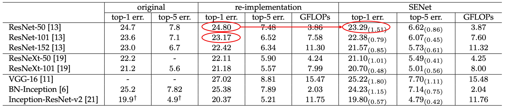

## Squeeze and Excitation Network

[**Squeeze-and-Excitation Networks**](https://arxiv.org/abs/1709.01507)

---

In an era where everyone is striving to top the ImageNet leaderboard, various network architectures emerge endlessly. The SENet architecture was proposed to enhance the global inter-channel relationships within a network, thereby improving its performance.

## Defining the Problem

Past research observations from VGG and ResNet indicate that increasing depth can improve model quality, and residual connections help the network learn better features. Another observation comes from the evolution of grouped convolutions and subsequent Inception series, which enhance network performance through multi-branch designs.

These studies reflect an assumption:

- **The relationships between network channels can be represented as a combination of "local" receptive fields and unknown functions.**

However, the authors believe this assumption is problematic:

- **Why do we only consider local receptive fields and not global ones?**

## Solving the Problem

The authors aim to introduce global information into the network channels without significantly increasing computational load and parameters. Thus, they proposed the Squeeze-and-Excitation (SE) module to introduce global information with minimal additional computational cost.

### Model Architecture


This is another architecture that is easier to understand through code rather than text.

Let's implement it first:

```python
import torch
import torch.nn as nn

class SEBlock(nn.Module):

    def __init__(self, in_channels, reduction_ratio=16):
        super(SEBlock, self).__init__()
        self.squeeze = nn.AdaptiveAvgPool2d(1)
        self.excitation = nn.Sequential(
            nn.Conv2d(in_channels, in_channels // reduction_ratio, kernel_size=1, stride=1, padding=0, bias=False),
            nn.ReLU(),
            nn.Conv2d(in_channels // reduction_ratio, in_channels, kernel_size=1, stride=1, padding=0, bias=False),
            nn.Sigmoid()
        )

    def forward(self, x: torch.Tensor) -> torch.Tensor:
        # x: (B, C, H, W)

        # (B, C, H, W) -> (B, C, 1, 1)
        out = self.squeeze(x)

        # (B, C, 1, 1) -> (B, C//16, 1, 1) -> (B, C, 1, 1)
        out = self.excitation(out)

        # (B, C, H, W) * (B, C, 1, 1) -> (B, C, H, W)
        return x * out
```

Isn't it easier to understand through code?

In SENet, global information is introduced through Global Average Pooling. This involves averaging the feature values of each channel's feature map and passing them through a fully connected layer to obtain the importance weights of each channel.

Although this global information isn't extensive, experiments have shown that this design can enhance network performance.

:::tip
We use 1x1 convolutions to implement fully connected layers, avoiding the need for permuting and reshaping, making things easier.
:::

Now, after looking at the code, let's revisit the diagram provided by the authors:


In SENet, the steps are as follows:

1. **Global Pooling**: Introduce global information.
2. **FC**: Dimension reduction.
3. **ReLU**: Introduce non-linearity.
4. **FC**: Dimension increase.
5. **Sigmoid**: Obtain importance weights for each channel.

The Sigmoid function is used because the authors wanted channels to combine rather than compete. This means considering whether to keep or discard each channel (i.e., the weight) without creating a competitive relationship that would suppress others.

## Discussion

### Image Classification Results



SENet can be inserted into any network without significantly increasing the number of parameters.

For example, comparing ResNet-50 with SE-ResNet-50:

For a 224 × 224 pixel input image, ResNet-50 requires about 3.86 GFLOPs for a single forward pass. Each SE block involves a global average pooling operation during the squeeze phase and two small FC layers during the excitation phase. With a reduction ratio of 16, SE-ResNet-50 requires about 3.87 GFLOPs, only a 0.26% increase compared to the original ResNet-50.

In terms of parameter increase, the addition is about 10%, not shown in the table but mentioned in the paper.

This slight increase in parameters significantly boosts the performance of ResNet-50, nearly matching that of ResNet-101.

:::info
The authors noted that the parameter increase is mainly in the network's final stages. Removing the fully connected layer at the end would reduce the parameter increase to 4%, with only a 0.1% drop in ImageNet top-5 accuracy.
:::

### Results on Lightweight Models


Applying SENet to MobileNet also showed excellent results, reducing the top-1 error rate on ImageNet by 3.1%.

The performance on ShuffleNet was also outstanding, with a top-1 error rate reduction of 1.6%.

:::tip
Almost there to MobileNet-V3. (???)
:::

### Importance of Squeeze


The authors removed the Squeeze part of SENet and found that it still worked! However, the improvement was less impressive. Using Squeeze increased performance by 1.02%, whereas removing it only resulted in a 0.37% improvement.

### Importance of Excitation


The authors studied the activation distribution of different categories (e.g., goldfish, pugs, airplanes, cliffs) at various network levels and concluded the following:

- Early in the network, activations are similar across categories, but deeper layers show more category-specific activations.
- In deeper layers (e.g., SE_4_6 and SE_5_1), specific channels exhibit strong category preferences, indicating SE modules' significant role in these layers for feature discrimination.
- In the SE_5_2 layer, many activation values approach 1, making SE modules act as identity operators without recalibrating features.
- At the network's end, SE modules' importance diminishes. Removing these modules results in marginal performance loss but significantly reduces the parameter count.

These observations highlight the different roles of SE modules at various network levels, crucial for understanding and optimizing feature extraction and processing in deep learning models.

### Other Experimental Results

The authors conducted experiments on different parts of the model and concluded:

1. Sigmoid worked best, followed by Tanh, and ReLU performed the worst.
2. Average Pooling outperformed Max Pooling.
3. A reduction ratio of 16 in the SE module provided the best balance.

For more detailed tables, please refer to the original paper. We believe these experiments are more relevant to engineering practices, so we won't list them all.

## Conclusion

SENet enhances network learning and generalization capabilities by introducing SE blocks.

Its key contribution lies in integrating attention mechanisms into convolutional networks simply, allowing the network to focus more on essential features.

The success of this method demonstrates that enhancing internal feature representation can significantly improve deep learning model performance.

:::tip
Although the Squeeze-and-Excitation module adds relatively low computational costs, subsequent studies found it could occasionally become a performance bottleneck. When deploying to real-time systems or resource-constrained environments, developers should balance performance gains with additional computational overhead.
:::
