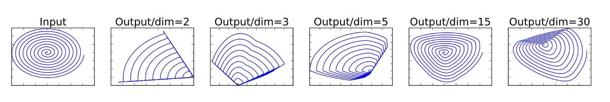
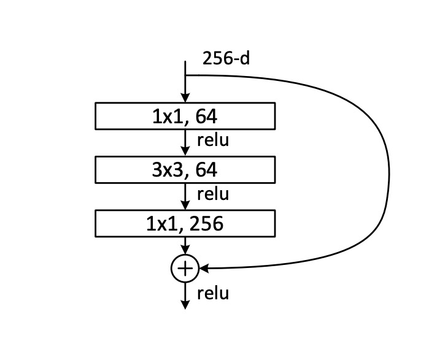
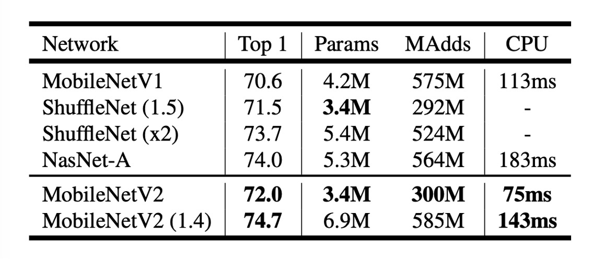

## Refining the Bottleneck

[**MobileNetV2: Inverted Residuals and Linear Bottlenecks**](https://arxiv.org/abs/1801.04381)

---

MobileNet is a lightweight deep learning network designed to achieve efficient image recognition on mobile devices. In the first generation of MobileNet, the authors introduced the concept of depthwise separable convolutions to reduce the number of parameters and computations.

In this paper, the authors continue this approach and attempt to find new methods to improve performance.

:::tip
If you're encountering this paper for the first time, you might be overwhelmed by the multitude of terms. Therefore, we highly recommend looking at the implementation code first.

But since you're already here, let's dive in together.
:::

## Defining the Problem

### Linear Bottleneck

The first issue the authors want to discuss is the linear bottleneck.

Let's say we have a deep convolutional neural network used for image recognition. Each convolutional layer produces a three-dimensional activation tensor (height × width × depth), containing the image's features. For instance, the first layer might recognize edges and color changes, while deeper layers might recognize more complex shapes or object parts.

In each layer of the neural network, the activation tensor can be viewed as existing in a high-dimensional space. The meaningful data structures within this space (referred to in the paper as the "manifold of interest") can theoretically be mapped to a lower-dimensional subspace without losing important information. This is because, while the data in the original space is high-dimensional, it often clusters around certain low-dimensional structures.

:::tip
For example, if we project 128 features into a 2-dimensional space using a transformation matrix, we can retain the transformation information and revert the 2D features back to the 128-dimensional space using an inverse transformation matrix.
:::

To efficiently leverage this property, network design can introduce linear bottleneck layers to reduce the data's dimensionality. This method was successfully applied in MobileNetV1. However, when nonlinear operations such as ReLU (Rectified Linear Unit) are introduced, the situation becomes more complex.

ReLU performs linear thresholding on each element, setting all negative values to zero. This alters the data distribution, creating new geometric structures (e.g., rays and piecewise linear curves).

:::tip
Continuing the example: If we project 128 features into a 2-dimensional space and then apply ReLU, assuming one feature value is negative, it will be set to zero. This will split the point set in the 2D feature space into two parts, making it impossible to completely restore the original 128-dimensional feature space using the inverse transformation matrix.
:::

To avoid this, sufficient dimensions must be provided to retain enough information after nonlinear transformations, as shown below:



In the figure, the leftmost is the input. Depending on the dimension chosen and after ReLU operations, the distribution on the right differs. When insufficient dimensions are chosen, the original distribution is disrupted after ReLU operations, and some information is permanently lost.

### Residual Networks

First, let's look at what a residual network is. Here's an image provided in the ResNet paper:



A typical residual network first undergoes a 1x1 convolution layer for dimensionality reduction, then a 3x3 convolution layer for feature aggregation, and finally another 1x1 convolution layer for dimensionality expansion, followed by adding the original input.

Based on the previously mentioned linear bottleneck concept, the residual module introduces ReLU nonlinear operations during the dimensionality reduction process, resulting in information loss.

What happens when too much information is lost?

The "residual branch" in deep residual networks loses its functionality, becoming purely decorative and wasting computational resources.

## Solving the Problem

To address this issue, the authors modified the original residual module by changing the dimension reduction to dimension expansion and incorporating depthwise separable convolutions.

This new residual module is called the "Inverted Residual with Linear Bottleneck."

### Inverted Residual


The modifications to the entire residual module are shown in the figure above.

1. The original 1x1 convolution layer for dimensionality reduction in ResNet is replaced with a 1x1 convolution layer for dimensionality expansion.
2. The original 3x3 convolution layer is replaced with depthwise separable convolution.
3. All ReLU functions are replaced with ReLU6 functions.

:::tip
We apologize for the rudimentary diagrams. Many diagrams in the paper are not easily comprehensible, so we haven't included them here. If you're interested, you can check the paper.
:::

### Expanded Bottleneck (Appendix A)

The bottleneck transformation involves two core operations: linear transformation and ReLU activation, represented as $ A \text{ReLU}(Bx)$:

1. **Linear Transformation $Bx$:** Here, $x \in \mathbb{R}^n$ represents an n-dimensional vector, which can be a pixel vector in an image or any other data type. $B$ is an $m \times n$ matrix that transforms the original n-dimensional vector $x$ into an m-dimensional space. This step aims to reorganize the input data features in different dimensions, which could involve dimensionality reduction ($m < n$), expansion ($m > n$), or transformation to another space of the same dimension $m = n$.

2. **Nonlinear Activation Function ReLU:** The ReLU function, or Rectified Linear Unit, acts on the result of$Bx$. Mathematically, $\text{ReLU}(z) = \max(0, z)$, where $z$ can be a number or a vector. For vectors, the ReLU function acts independently on each element. This step introduces nonlinearity, enhancing the model's expressiveness, as linear models cannot capture complex data structures and patterns.

3. **Second Layer Linear Transformation $A$:** The result after ReLU activation undergoes another transformation by an $n \times m$ matrix $A$. This step further adjusts the features to suit subsequent neural network layers or final output requirements.

When analyzing the effect of bottleneck transformation, consider the relationship between m (output dimension) and n (input dimension):

- **When $m \leq n$:** Such transformations might lose information while maintaining nonlinearity. If the output dimension is less than or equal to the input dimension, some input information cannot be fully recovered after transformation.
- **When $n < m$:** This transformation can express strong nonlinearity and is largely reversible. With initial random weights, the transformed result has a high probability of restoring the original input.

Finally, the authors note that the bottleneck structure in the expansion layer not only prevents manifold collapse (i.e., information loss) but also helps the network represent more complex functions.

### Model Architecture


Finally, here's the entire model architecture. Compared to MobileNetV1, MobileNetV2 further integrates residual modules.

Let's implement this.

```python
import torch.nn as nn

class InvertedResidual(nn.Module):

    def __init__(self, inp, oup, stride, expand_ratio):
        super(InvertedResidual, self).__init__()
        self.stride = stride
        self.is_shortcut = stride == 1 and inp == oup
        hidden_dim = int(inp * expand_ratio)

        self.conv = nn.Sequential(
            # pw
            nn.Conv2d(inp, hidden_dim, 1, 1, 0, bias=False),
            nn.BatchNorm2d(hidden_dim),
            nn.ReLU6(),
            # dw
            nn.Conv2d(hidden_dim, hidden_dim, 3, stride, 1, groups=hidden_dim, bias=False),
            nn.BatchNorm2d(hidden_dim),
            nn.ReLU6(),
            # pw-linear
            nn.Conv2d(hidden_dim, oup, 1, 1, 0, bias=False),
            nn.BatchNorm2d(oup),
        )

    def forward(self, x):
        if self.is_shortcut:
            return x + self.conv(x)
        else:
            return self.conv(x)
```

With the module done, let's piece together the entire model.

Referencing the configuration from the paper:


Input image size is 224x224, and the number of output classes is 1000...

Well, these parameters are not crucial for implementation.

The paper mentions the need to scale the model, so we need a parameter `width_mult` to scale the model width.

We'll implement the main part of the model, excluding the final output layer.

```python
import torch.nn as nn

class MobileNetV2(nn.Module):

    def __init__(self, width_mult=1.):
        super(MobileNetV2, self).__init__()

        # setting of inverted residual blocks
        self.settings = [
            # t, c, n, s
            [1, 16, 1, 1],
            [6, 24, 2, 2],
            [6, 32, 3, 2],
            [6, 64, 4, 2],
            [6, 96, 3, 1],
            [6, 160, 3, 2],
            [6, 320, 1, 1],
        ]

        # building first layer
        input_channel = int(32 * width_mult)
        self.first_layer = nn.Sequential(
            nn.Conv2d(3, input_channel, 3, 2, 1, bias=False),
            nn.BatchNorm2d(input_channel),
            nn.ReLU6()
        )

        # building inverted residual blocks
        layers = []
        for t, c, n, s in self.settings:
            output_channel = int(c * width_mult)
            for i in range(n):
                layers.append(
                    InvertedResidual(
                        input_channel,
                        output_channel,
                        stride=s if i == 0 else 1,
                        expand_ratio=t
                    )
                )
                input_channel = output_channel
        self.layers = nn.Sequential(*layers)

        # building last several layers
        last_channel = int(1280 * width_mult) if width_mult > 1.0 else 1280
        self.last_layer = nn.Sequential(
            nn.Conv2d(input_channel, last_channel, 1, 1, 0, bias=False),
            nn.BatchNorm2d(last_channel),
            nn.ReLU6()
        )

    def forward(self, x):
        x = self.first_layer(x)
        x = self.layers(x)
        x = self.last_layer(x)
        return x
```

:::tip
**Why set the bias of nn.Conv2d to False?**

Because the bias term is already included in Batch Normalization, so there's no need to add it again in Conv2d.
:::

## Discussion

### Image Classification Performance



As seen in the table above, MobileNetV2 outperforms MobileNetV1 on ImageNet.

With nearly half the computational cost, MobileNetV2's accuracy is about 1.4% higher than MobileNetV1, with inference speed increased by about 30%.

- At the 300M computational level, it surpasses ShuffleNet, which was released a few months prior.
- At the 600M computational level, it outperforms NASNet, with approximately 20% faster CPU runtime.

## Conclusion

In this study, the authors demonstrate how MobileNetV2 effectively addresses the demands for high performance and low power consumption on mobile devices.

The use of linear bottleneck layers and inverted residual modules allows the model to efficiently manage information flow while maintaining its lightweight nature, reducing information loss during transmission.

This design not only enhances the model's representation capability but also improves performance on mobile devices.

Future work will continue to explore the potential of this architecture, seeking to further enhance performance and generalization while maintaining model efficiency.
