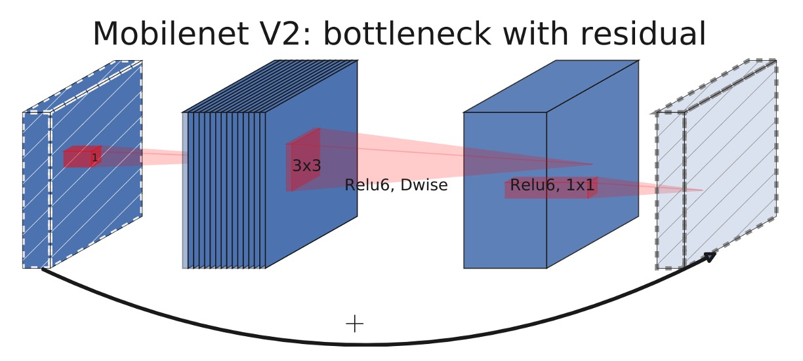
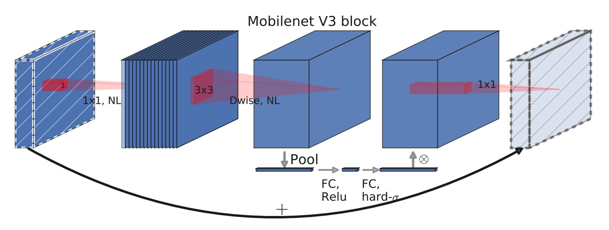
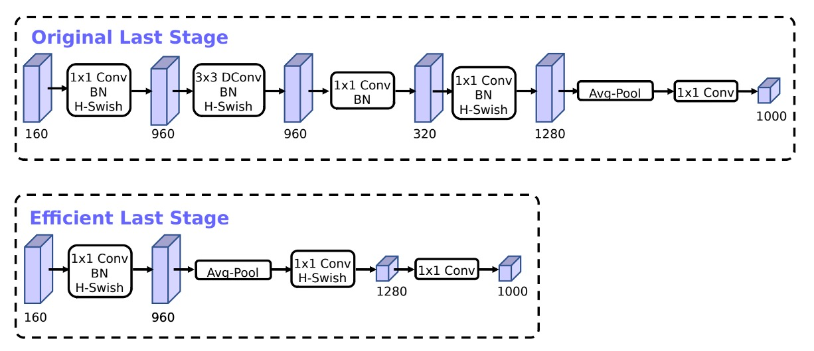
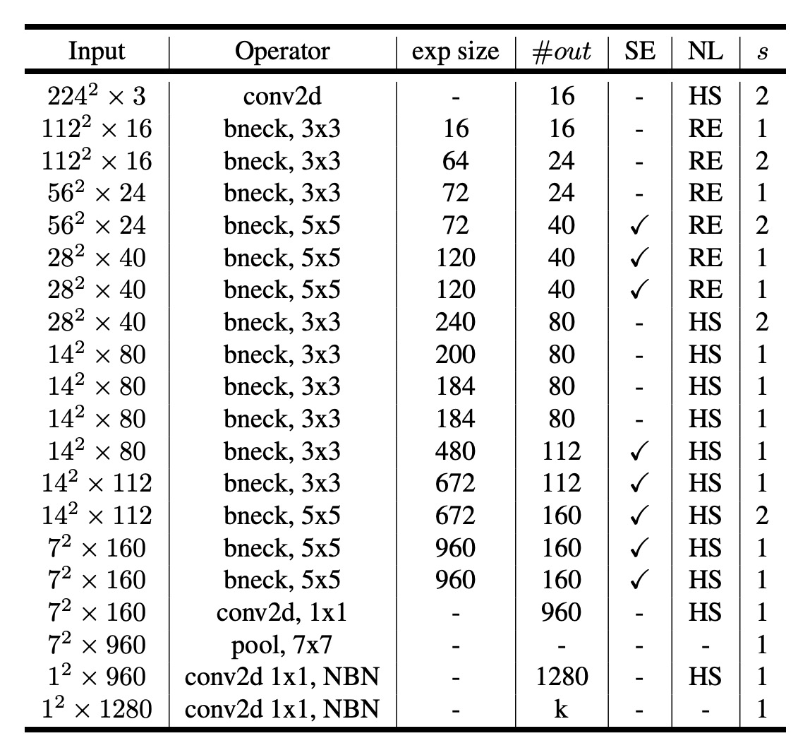
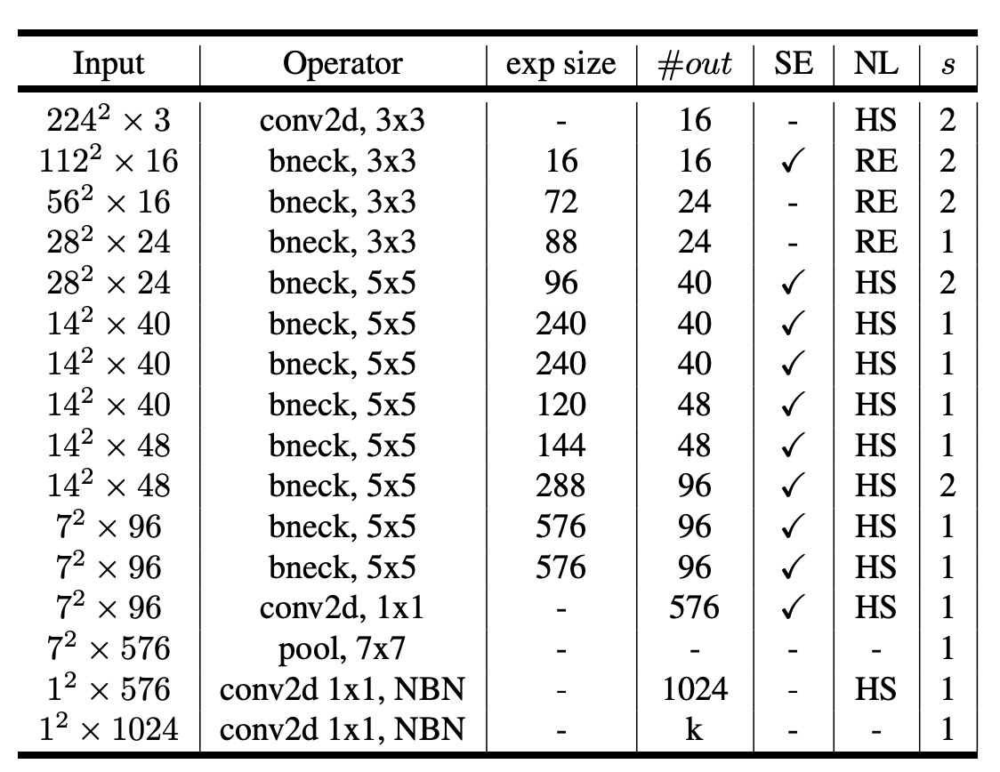

# [19.05] MobileNet-V3

## Custom Architecture Search

[**Searching for MobileNetV3**](https://arxiv.org/abs/1905.02244)

---

A while ago, it seemed like SENet was on the verge of introducing MobileNet-V3!

Unfortunately, it was only briefly mentioned towards the end of the paper.

- [**SENet-Lightweight Model Performance Showcase**](../1709-senet/index.md#results-on-lightweight-models)

The Google team was clearly eager to further develop MobileNet, and so began their exploration into MobileNet-V3.

## Defining the Problem

There wasn't really a problem to solve.

The authors simply wanted to find a better MobileNet.

They explored two directions:

1. **Using Neural Architecture Search (NAS)**: To automatically find the best network structure.
2. **Using the NetAdapt Algorithm**: To optimize the architecture specifically for mobile CPUs.

## Solving the Problem

### MobileNet-V2 Module

### MobileNet-V3 Module

Can you spot the difference between the two architectures?

The change lies in the expansion layer, which now includes the `Squeeze-and-Excitation` (SE) module.

About a year earlier, the `MnasNet` paper had already introduced the `Squeeze-and-Excitation` module based on `MobileNet-V2`.

- [**\[18.07\] MnasNet: Platform-Aware Neural Architecture Search for Mobile**](https://arxiv.org/abs/1807.11626)

In `MobileNet-V3`, this module was further improved by replacing the "slow" `Sigmoid` function with the `Hard-Sigmoid` function.

:::tip
Many believe that the `Squeeze-and-Excitation` module was introduced by `MobileNet-V3`, but that's not true!
:::

### Neural Architecture Search

With the new module ready, the next question was: how to stack them?

This part continued the work of `MnasNet`, using an RNN-based controller to search for the network architecture.

Then, the NetAdapt algorithm and other optimizations were applied to the network architecture.

- [**\[18.04\] Netadapt: Platform-aware neural network adaptation for mobile applications**](https://arxiv.org/abs/1804.03230)

  

:::tip
This part is not the main focus of this paper; we just need to know it's used to adjust the network architecture.
:::

### Network Tail Modifications

Based on the inverted bottleneck structure of MobileNetV2, the model uses a 1x1 convolution as the last layer to expand to a higher-dimensional feature space. This is shown as the 1280-dimensional part in the `Original Last Stage`.

To have rich predictive features, this layer is essential but comes at the cost of extra latency.

To reduce latency while preserving features, the authors moved this layer after the global average pooling, as shown in the `Efficient Last Stage`.

Originally calculated at a 7x7 resolution, the adjustment allows calculation at a 1x1 resolution, saving a significant amount of computational resources.

### Reducing Initial Filters

The authors observed that in MobileNetV2, the initial 32 filters were often "mirrored," meaning half of them were redundant.

Therefore, the authors reduced the initial filters from 32 to 16 and added the `hard-swish` activation function to maintain performance.

### Non-Linear Activation Functions

The authors extensively used the `hard-swish` and `hard-sigmoid` activation functions in the paper.

Here's a quick overview of these activation functions:

1. **ReLU (Rectified Linear Unit)**

   - **Definition**: $ f(x) = \max(0, x) $
   - **Features**: Outputs $ x $ when $ x $ is positive, and 0 when $ x $ is negative.
   - **Use**: Widely used in deep learning models due to its simplicity and non-saturating nature.

2. **Swish**

   - **Definition**: $ f(x) = x \cdot \sigma(x) $, where $ \sigma(x) $ is the Sigmoid function $ \sigma(x) = \frac{1}{1 + e^{-x}} $.
   - **Features**: Combines linear and non-linear characteristics.
   - **Use**: Shows better performance in some deep learning tasks compared to ReLU and other activation functions.

3. **Hard-Swish**

   - **Definition**: $ f(x) = x \cdot \text{relu6}(x+3)/6 $, where $\text{relu6}(x) = \min(\max(0,x), 6)$.
   - **Features**: A simplified version of Swish, faster to compute with lower computational cost.
   - **Use**: Suitable for applications requiring efficient computation, such as mobile devices or edge devices.

4. **Sigmoid**

   - **Definition**: $ f(x) = \frac{1}{1 + e^{-x}} $
   - **Features**: Outputs range between 0 and 1, often used to compress outputs into a limited range.
   - **Use**: Commonly used for the final output layer in binary classification problems due to its probabilistic interpretation.

5. **Hard-Sigmoid**

   - **Definition**: $ f(x) = \max(0, \min(1, \frac{x+1}{2})) $
   - **Features**: A simplified version of Sigmoid, faster to compute, suitable for high-efficiency requirements.
   - **Use**: Used in models requiring efficient computation, similar to Sigmoid but more efficient.

### Network Architecture (Large)

After planning the above, a new MobileNet-V3 model was obtained through neural architecture search.

The table is similar to `MobileNet-V2`, with the new parts being:

- **SE**: Indicates the use of the `Squeeze-and-Excitation` module.
- **NL**: Indicates the use of a non-linear activation function.
- **HS**: Indicates the use of the `hard-swish` activation function.
- **RE**: Indicates the use of the `ReLU` activation function.
- **NBM**: Indicates the absence of `Batch Normalization`.

### Network Architecture (Small)

For smaller models, the authors also showcased the search results.

## Discussion

### ImageNet Experiment Results

The above figure shows that MobileNetV3 outperforms the current state-of-the-art models such as MnasNet, ProxylessNas, and MobileNetV2.

### Mobile Device Evaluation

The authors reported floating-point performance on different Pixel phones.

In the table, P-1 stands for Pixel 1, P-2 for Pixel 2, and P-3 for Pixel 3. The unit is inference speed in milliseconds, based on single-core performance.

### Optimization Record

The figure shows the authors' optimization record in this paper.

Starting from MnasNet, gradually adding `SE` and `h-swish`, and finally using `Netadapt` for network architecture search, leading to the final result.

## Conclusion

The mobile device market is vast, and computational power is limited, necessitating more "customized" models.

This paper demonstrates how network architecture search and the NetAdapt algorithm achieved better performance on Pixel phones.

In the future, this approach might extend to unified architectures on various phones like Pixel, Apple, Samsung, etc.

This is good news for both mobile users and model developers.
