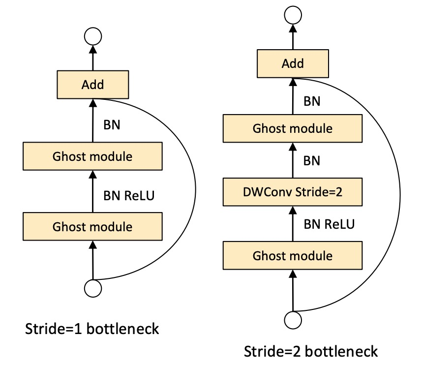
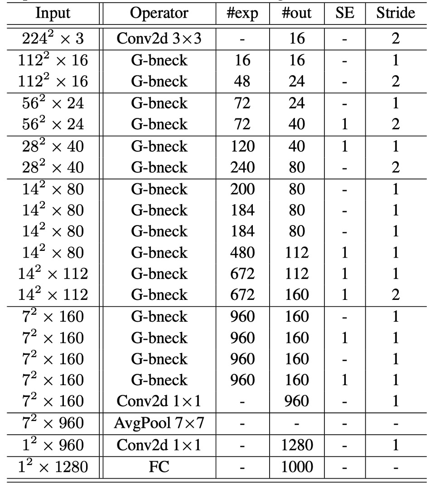

## Ghost in Feature Maps

[**GhostNet: More Features from Cheap Operations**](https://arxiv.org/abs/1911.11907)

---

After the introduction of MobileNet, many researchers continued to work on improving the performance of lightweight networks.

This paper specifically addresses the problem of "feature map redundancy."

## Defining the Problem

Feature maps in convolutional networks typically contain a lot of redundant information, which consumes computational resources and adversely affects the network's performance.

The image above is a simple example showing that some areas of the feature map are repetitive, which might not significantly contribute to the network's performance.

## Solving the Problem

Generally, there are two common approaches: model compression and making the model more compact.

### Model Architecture

In GhostNet, the authors proposed a new model architecture, as shown above.

Unlike typical convolutional networks, the GhostNet module operates in two steps:

1. First, a convolution operation is used to compress the input feature map, obtaining a "base feature map" A.
2. Then, linear operations are applied to each channel of the base feature map A to generate "ghost feature maps" B.

Finally, the base feature map A and the ghost feature maps B are concatenated to obtain the final feature map.

These linear operations are much simpler than convolution operations, significantly reducing the computational load of GhostNet.

:::tip
The "Cheap" linear operation of each channel mentioned in the paper is actually grouped convolution. This method can reduce the amount of calculation and improve efficiency.
:::

### Module Configuration

- **Ghost Bottlenecks**

  Leveraging the advantages of the ghost module, the authors introduced ghost bottlenecks (G-bnecks) designed specifically for small CNNs. This design is similar to the basic residual blocks in ResNet, combining multiple convolution layers and shortcuts.

  The ghost bottleneck primarily consists of two stacked ghost modules. The first ghost module acts as an expansion layer, increasing the number of channels, with the expansion ratio defined as the ratio of the output channels to the input channels. The second ghost module reduces the number of channels to match the shortcut path and connects the input and output of these two ghost modules through a shortcut.

  Batch normalization (BN) and ReLU non-linearity are applied to each layer. Additionally, following MobileNetV2's suggestion, ReLU is not used after the second ghost module.

- **GhostNet**

  Based on ghost bottlenecks, the authors proposed GhostNet.

  This architecture generally follows the design of MobileNetV3, replacing its bottleneck blocks with ghost bottlenecks. GhostNet mainly consists of a series of ghost bottlenecks, starting with a standard convolution layer with 16 filters, followed by a series of ghost bottlenecks with gradually increasing channels. These ghost bottlenecks are divided into different stages based on the size of the input feature maps.

  Except for the last bottleneck of each stage, which has a stride of 2, all other bottlenecks have a stride of 1. Finally, the feature map is converted to a 1280-dimensional feature vector for final classification through global average pooling and a convolution layer.

  In some ghost bottlenecks, the residual layer also applies squeeze-and-excitation (SE) modules. Compared to MobileNetV3, GhostNet does not use hard activation functions (hard-swish) due to their higher latency.

- **Width Multiplier**:

  Although the basic architecture of GhostNet already provides low latency and high accuracy, in some cases, smaller, faster models or higher accuracy for specific tasks may be required.

  To meet different needs, the number of channels in each layer can be multiplied by a factor $\alpha$, known as the width multiplier. This uniformly changes the width of the entire network, controlling the model size and computational cost by approximately $\alpha$ squared.

  Generally, smaller $\alpha$ leads to lower latency and performance, while larger $\alpha$ improves performance. This design flexibility allows GhostNet to adapt to different application scenarios and requirements.

The final model configuration is shown in the table below:

## Discussion

### Performance on ImageNet

To verify the superiority of the proposed GhostNet, the authors conducted experiments on the ImageNet image classification task.

Following the training settings used in past literature, with an initial learning rate of 0.4 when the batch size is 1024 and trained on 8 GPUs. All results are reported using the top-1 accuracy on the ImageNet validation set with single-crop evaluation. For GhostNet, the kernel size in the primary convolution is set to k = 1, and parameters s = 2 and d = 3 are used in all ghost modules, which is a simple setup.

The authors selected several modern small network architectures as competitors, including the MobileNet series, ShuffleNet series, ProxylessNAS, FBNet, and MnasNet, with results summarized in the table above.

These models are divided into three computational complexity levels, typically suitable for mobile applications, i.e., around 50, 150, and 200-300 MFLOPs. From the results, it is evident that larger FLOPs generally lead to higher accuracy among these small networks, demonstrating their effectiveness. GhostNet consistently outperforms other competitors at various levels of computational complexity because GhostNet is more efficient in utilizing computational resources to generate feature maps.

### Actual Inference Speed

Since the proposed GhostNet is designed for mobile applications, the authors further measured the actual inference speed of GhostNet on an ARM-based mobile phone using TFLite tools. In single-thread mode with a batch size of 1, they used common settings from the literature.

From the results below, it can be seen that GhostNet achieves approximately 0.5% higher top-1 accuracy than MobileNetV3 at the same latency, and GhostNet requires less runtime to achieve similar performance. For instance, GhostNet has only 40ms latency at 75.0% accuracy, whereas MobileNetV3 requires about 45ms to process an image at a similar accuracy level.

:::tip
In the paper, the test inference speed is based on ARM architecture mobile phones and tested with TF-Lite. In fact, the author did not mention which mobile phone to use. Based on our own experience, the same configuration and model will perform differently on different brands of mobile phones.

Therefore, we recommend that readers conduct their own experiments when using GhostNet to ensure that its inference speed meets their needs.
:::

## Conclusion

To reduce the computational cost of current deep neural networks, this paper proposes a novel ghost module for building efficient neural network architectures. This method is a plug-and-play module that can convert the original model into a compact model while maintaining comparable performance.

In the process of developing neural networks, the GhostNet architecture can be a viable option, especially in resource-constrained scenarios, potentially offering more possibilities.
