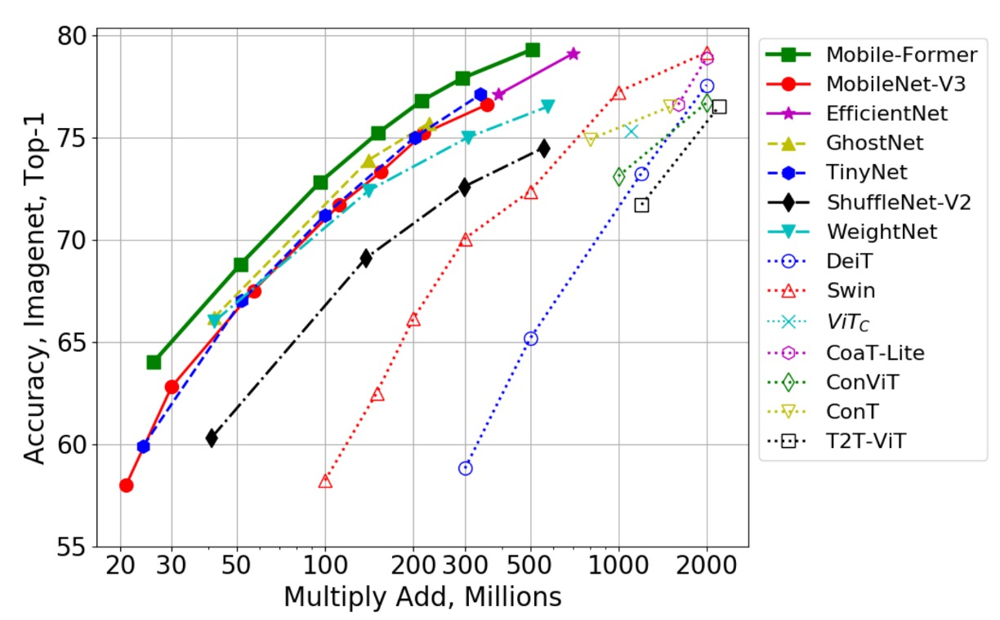
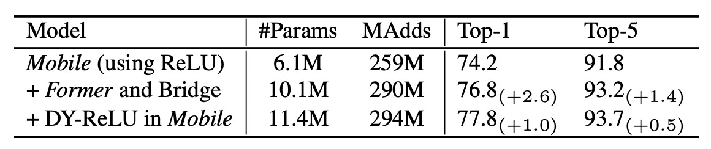
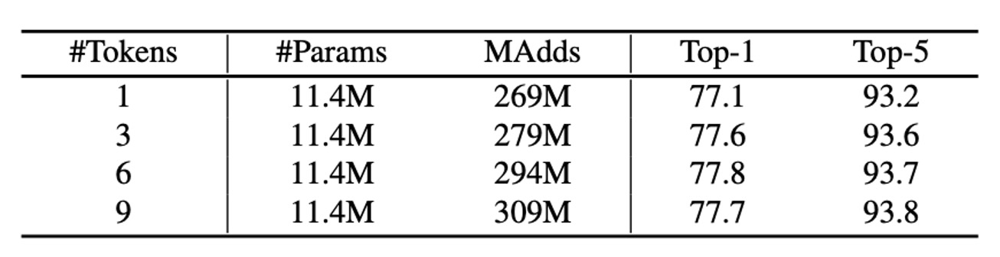

# [21.08] Mobile-Former

## Bidirectional Bridge

[**Mobile-Former: Bridging MobileNet and Transformer**](https://arxiv.org/pdf/2108.05895)

---

Researchers have been exploring various methods to make ViT (Vision Transformer) more efficient on mobile devices.

## Problem Definition

While it's possible to run ViT on mobile devices, it's slow and doesn't fully benefit from hardware acceleration.

The authors of this paper propose a solution:

- **Why not integrate "a bit of" Transformer architecture into MobileNet?**

## Solution

### Model Architecture

The authors introduce a bidirectional bridge architecture that connects MobileNet and Transformer in a parallel manner.

Here’s how it works, step by step:

1. **Blue Block**: The input image passes through MobileNet’s feature extraction layer, resulting in a feature map.
2. **Yellow Block**: Simultaneously, the input image is processed by the Transformer block, using cross-attention mechanisms for feature extraction.
   - The authors predefine a set of learnable tokens (up to 6), which serve as queries while the feature map acts as key-value pairs.
3. **Green Block**: After cross-attention, self-attention is computed.
4. **Red Block**: The output from the first step undergoes cross-attention with the output from the third step.
5. Finally, the output from the fourth step is fed into the next MobileNet block, while the third step’s output is input into the next Transformer block.

In each attention mechanism, the authors simplify the calculations by omitting some linear projections, thus reducing parameters and computational load. For example, instead of converting $x$ into $W_q x$, $W_k x$, and $W_v x$, the authors opt to use $x$ directly for calculations.

Other design optimizations include using a factor of 2 instead of 4 in the Feed-Forward Network (FFN), modifying the input of Dynamic ReLU to be the output of the green block, and using Post-LN normalization.

:::tip
It’s important to note that the green block's output not only goes to the red block but also feeds back into the blue block as input for Dynamic ReLU.

This design choice warrants discussion, as it could be a significant factor in the model’s performance speed.
:::

### Architecture Parameters

The table below shows how the authors replace each block in the original MobileNet-V3 architecture with a Mobile-Former block.

## Discussion

### Performance on ImageNet

The authors conducted image classification experiments on the ImageNet dataset, which includes 1,281,167 training images and 50,000 validation images across 1,000 classes.

The training settings used a 224×224 image resolution. All models were trained from scratch with the AdamW optimizer for 450 epochs, using cosine learning rate decay. The batch size was 1024, and data augmentation techniques included Mixup, AutoAugment, and Random Erasing. Different combinations of initial learning rate, weight decay, and dropout were applied depending on the model complexity.

The table above compares Mobile-Former to classic efficient CNNs like MobileNetV3, EfficientNet, ShuffleNetV2, and WeightNet across seven groups, ranging from 26M to 508M FLOPs.

In most cases, Mobile-Former outperforms these efficient CNNs at lower computational costs (FLOPs). Only in the ~150M FLOP range does Mobile-Former have slightly higher FLOPs than ShuffleNet/WeightNet, but with significantly higher Top-1 accuracy (75.2% vs. 69.1%/72.4%).

---

The authors also compared Mobile-Former with other vision transformer models, including DeiT, T2T-ViT, PVT, ConViT, CoaT, ViTC, and Swin.

All variants used 224×224 image resolution without teacher network distillation. Mobile-Former achieves higher accuracy with only 30% of the computational cost of other transformer variants. This efficiency is due to Mobile-Former's use of fewer tokens for global interaction modeling and the effective use of MobileNet for local feature extraction.

Notably, Mobile-Former (trained for 450 epochs without distillation) even outperforms LeViT (trained for 1000 epochs with distillation) in terms of accuracy (77.9% vs. 76.6%) while having fewer FLOPs (294M vs. 305M).

---

The figure above further compares Mobile-Former with more CNN models (like GhostNet) and vision transformer variants (like Swin and DeiT).

Swin and DeiT’s FLOPs range from 100M to 2G, achieved by carefully scaling the network width and height. Mobile-Former consistently outperforms these CNNs and ViT variants, showcasing the advantage of the parallel design that combines MobileNet with Transformer. While vision transformers generally struggle in the low-FLOP range compared to efficient CNNs, this study demonstrates that with proper architectural design, transformers can also excel in low-FLOP scenarios.

### Ablation Studies

Which parts of Mobile-Former contribute most to its performance?

The authors conducted ablation studies to examine the impact of different components of Mobile-Former on its performance.

The table above shows that adding the Former and bridge (Mobile→Former and Mobile←Former) to MobileNet only increases computational cost by 12% but improves Top-1 accuracy by 2.6% compared to using MobileNet alone.

Additionally, using Dynamic ReLU in the Mobile submodule further boosts Top-1 accuracy by 1.0%. The parameters in Dynamic ReLU are generated by the first global token, confirming the effectiveness of Mobile-Former’s parallel design.

---

The table above presents ImageNet classification results using different numbers of global tokens in the Former. These tokens have a dimension of 192.

Interestingly, even with just one global token, the model performs well (77.1% Top-1 accuracy). Increasing to 3 and 6 tokens improves accuracy by 0.5% and 0.7%, respectively. Beyond 6 tokens, the gains plateau. The compactness of these global tokens is a key factor in Mobile-Former’s efficiency.

## Conclusion

Mobile-Former achieves an efficient vision model by combining MobileNet and Transformer in a parallel design.

However, the authors note that while Mobile-Former is faster than MobileNetV3 for large image processing, it slows down with smaller images, especially on mobile devices. This aspect could be a valuable area for future research.

:::tip
The MobileNet-V3 data referenced in this paper is somewhat outdated and hasn’t been optimized with modern training techniques. For more up-to-date information, readers can refer to the MobileNet-V4 paper.

- [**[24.04] MobileNet-V4: Five Years of Evolution**](../2404-mobilenet-v4/index.md)

Mobile-Former might perform differently on this new foundation.
:::
