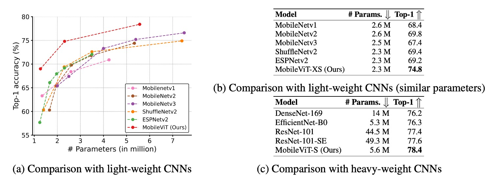

## Changing the Design of Convolution Kernels

[**MobileViT: Light-weight, General-purpose, and Mobile-friendly Vision Transformer**](https://arxiv.org/abs/2110.02178)

---

Shortly after Microsoft introduced **Mobile-Former**, Apple presented its own solution to improve vision transformers for mobile devices: **MobileViT**.

## Problem Definition

The primary issue remains the poor performance of ViT (Vision Transformer) models on mobile devices. Unlike the parallel connection bridge architecture of Mobile-Former, MobileViT increases the receptive field of convolution kernels by replacing the core matrix multiplication in convolution with self-attention. This aims to enhance the overall model performance on mobile devices.

To better understand how MobileViT works, let’s first review the convolution process.

## Solution

### Convolution Review

To speed up convolution operations, the process can be broken down into "unfold" and "fold" operations, which transform convolution into a matrix multiplication problem. This method is more efficient under certain conditions.

- **1. Unfold Operation**

  The unfold operation, also called "im2col," reshapes the input tensor (e.g., an image) into a form suitable for matrix multiplication.

  For example, consider a $3 \times 3$ input matrix $X$:

  $$
  X = \left[\begin{matrix}
  1 & 2 & 3 \\
  4 & 5 & 6 \\
  7 & 8 & 9
  \end{matrix}\right]
  $$

  Suppose we have a $2 \times 2$ convolution kernel $K$:

  $$
  K = \left[\begin{matrix}
  1 & 0 \\
  0 & -1
  \end{matrix}\right]
  $$

  Normally, the kernel slides across the input matrix to compute convolution values. However, with unfold, we transform this process into matrix multiplication. Using a $2 \times 2$ sliding window, we extract four $2 \times 2$ patches from $X$:

  $$
  \left[\begin{matrix}
  1 & 2 \\
  4 & 5
  \end{matrix}\right],
   \left[\begin{matrix}
  2 & 3 \\
  5 & 6
  \end{matrix}\right],
  \left[\begin{matrix}
  4 & 5 \\
  7 & 8
  \end{matrix}\right],
  \left[\begin{matrix}
  5 & 6 \\
  8 & 9
  \end{matrix}\right]
  $$

  We then flatten these patches into row vectors, forming a matrix:

  $$
  X_{\text{unfold}} = \left[\begin{matrix}
  1 & 2 & 4 & 5 \\
  2 & 3 & 5 & 6 \\
  4 & 5 & 7 & 8 \\
  5 & 6 & 8 & 9
  \end{matrix}\right]
  $$

- **2. Matrix Multiplication**

  Next, we multiply the unfolded input matrix $X_{\text{unfold}}$ by the flattened convolution kernel $K$:

  $$
  K_{\text{flat}} = \left[\begin{matrix} 1 & 0 & 0 & -1 \end{matrix}\right]
  $$

  The result of multiplying $X_{\text{unfold}}$ by $K_{\text{flat}}^T$ is:

  $$
  Y_{\text{flat}} = \left[\begin{matrix}
  1 \cdot 1 + 2 \cdot 0 + 4 \cdot 0 + 5 \cdot (-1) \\
  2 \cdot 1 + 3 \cdot 0 + 5 \cdot 0 + 6 \cdot (-1) \\
  4 \cdot 1 + 5 \cdot 0 + 7 \cdot 0 + 8 \cdot (-1) \\
  5 \cdot 1 + 6 \cdot 0 + 8 \cdot 0 + 9 \cdot (-1)
  \end{matrix}\right]
  =
  \left[\begin{matrix}
  -4 \\
  -4 \\
  -4 \\
  -4
  \end{matrix}\right]
  $$

- **3. Fold Operation**

  Finally, the fold operation reconstructs the output back into its original shape, turning the resulting vector into a $2 \times 2$ output matrix:

  $$
  Y = \left[\begin{matrix}
  -4 & -4 \\
  -4 & -4
  \end{matrix}\right]
  $$

Using **unfold** and **fold**, convolution can be turned into a matrix multiplication problem, often yielding more efficient computation.

### MobileViT Architecture

Now, we can examine the architecture of MobileViT. After unfolding the convolution, instead of using matrix multiplication with the convolution kernel, MobileViT replaces it with a self-attention mechanism. Traditional convolution involves only local information interaction, but self-attention enables every position to see information from all other positions, thus allowing global interaction.

Since self-attention is more computationally expensive, it is applied selectively. The authors chose specific layers to apply this substitution, as shown below:

In the last three stages of the convolutional network, the convolution kernels are replaced with self-attention. This reduces the number of parameters and improves the model's efficiency.

### Experimental Setup

The authors trained MobileViT on the ImageNet-1k dataset, which includes 1.28 million training images and 50,000 validation images. Training was conducted using PyTorch on eight NVIDIA GPUs for 300 epochs. They used the AdamW optimizer and cross-entropy loss with a label smoothing factor of 0.1. The effective batch size was 1,024 images, with a learning rate that gradually increased from 0.0002 to 0.002 over the first 3,000 iterations, then decayed back down following a cosine schedule. L2 weight decay was set at 0.01.

A multi-scale sampler was employed during training, boosting accuracy by around 0.5%. However, this technique is more of a training trick than a core contribution of the paper.

## Discussion

### Performance on ImageNet

- **MobileViT Outperforms Lightweight CNNs**:

  - Across different model sizes, MobileViT consistently outperformed lightweight CNN models such as MobileNetv1, MobileNetv2, ShuffleNetv2, ESPNetv2, and MobileNetv3.
  - For example, with around 2.5 million parameters, MobileViT achieved:
    - 5% better accuracy than MobileNetv2,
    - 5.4% better than ShuffleNetv2,
    - 7.4% better than MobileNetv3.

- **MobileViT Outperforms Heavier CNNs**:

  - MobileViT also surpassed heavyweight CNNs like ResNet, DenseNet, ResNet-SE, and EfficientNet.
  - For instance, it achieved 2.1% higher accuracy than EfficientNet with a similar number of parameters.

---

In the image above, `advance` (red) indicates models trained with advanced augmentation techniques like Mixup, CutMix, and RandAugment, while `basic` (green) represents models trained with basic augmentation.

- **Comparison with ViT Variants**:

  - MobileViT was compared against various ViT variants trained from scratch, including DeIT, T2T, PVT, CAIT, DeepViT, CeiT, CrossViT, LocalViT, PiT, ConViT, ViL, BotNet, and Mobile-Former.
  - Unlike many of these models that rely on advanced augmentations, MobileViT used only basic augmentations and achieved better performance with fewer parameters.
    - For example, MobileViT is 2.5 times smaller than DeIT and 2.6% more accurate.

MobileViT demonstrates CNN-like benefits, making it easy to optimize and robust for new tasks and datasets.

:::tip
The MobileNet series data referenced in this paper are somewhat outdated. The latest advancements can be found in the MobileNet-V4 paper.

- [**[24.04] MobileNet-V4: A Legacy After Five Years**](../2404-mobilenet-v4/index.md)
  :::

## Conclusion

While MobileViT outperforms many lightweight and heavyweight CNN models on ImageNet-1k, its inference speed on mobile devices remains a challenge.

The authors point out that transformer-based models lag behind CNNs by nearly an order of magnitude in terms of inference speed on mobile devices. This disparity arises primarily due to two reasons:

1. Transformers benefit from dedicated CUDA kernels for scalability and efficiency on GPUs.
2. CNNs are optimized at the hardware level, including fusions with operations like batch normalization, which improve latency and memory access.

Thus, significant challenges remain in making ViT models viable for mobile inference. Future hardware and software optimizations will be crucial in addressing these issues.
