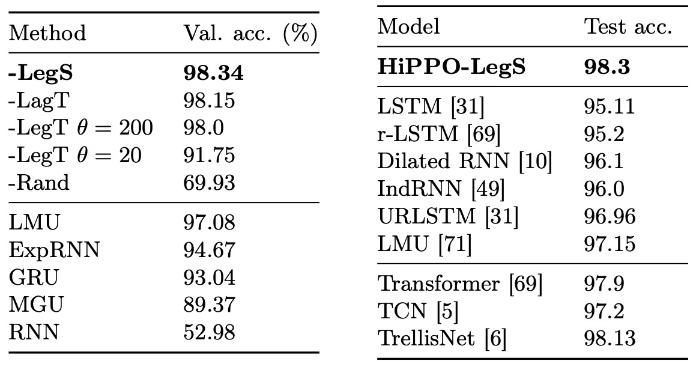
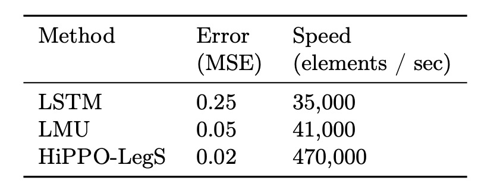

## Hippo's Memory

[**HiPPO: Recurrent Memory with Optimal Polynomial Projections**](https://arxiv.org/abs/2008.07669)

---

We have already read **S4** to better understand the research context, so let's revisit this paper.

I have to say that the author's papers are very mathematical, and you need to muster some courage before opening them.

:::tip
If you want to know more about S4, you can refer to another article of ours:

- [**[21.11] S4: The Prelude of Mamba**](../2111-s4/index.md)
  :::

## Problem Definition

Most people are familiar with the issue of vanishing and exploding gradients in RNNs.

Although this is a characteristic inherent in the architecture, there are always some ways to mitigate it, such as adding gates like LSTM or GRU, or using special bases like Fourier Recurrent Unit or Legendre Memory Unit (LMU).

However, this only treats the symptoms, not the root cause! Covering up the problem does not make it go away.

The authors do not agree with these approaches. They believe these methods share some common problems:

1. **There is no unified theoretical framework to explain the memory mechanism.**
2. **They often require prior knowledge about the input sequence's length or time scale.**

Can we find a method that does not require prior knowledge of the time scale, has a theoretical foundation, and can address the long-term dependency issue?

## Problem Solution

First, let’s reconsider the scenario of an RNN.

### Compressed Representation of Sequences

Given an input function $f(t)$ that changes over time, at each time $t \geq 0$, we want to make decisions, predictions, or representations based on all past information (i.e., the entire sequence or signal segment from the start time 0 to time $t$, $f(x)$, $x \le t$).

However, directly storing the entire history $f_{\le t} := \{ f(x) \mid x \le t \}$ is impractical, because as time progresses, the amount of data increases indefinitely, making storage computationally difficult.

Therefore, we need a "compressed representation with bounded dimensions"!

That is, we hope to use a finite number of parameters (values) at each moment to approximate the entire historical information.

Next, we must choose a function subspace $G$ with bounded dimensions in which to find the best approximation.

The authors choose a natural and commonly used option: **polynomial spaces**.

Suppose we take $G$ as the space spanned by polynomials:

$$
G = \{ \text{polynomials } p(x) : \deg(p) < N \}.
$$

In this subspace, we can write the approximate function $g$ as

$$
g(t) = \sum_{n=0}^{N-1} x_n p_n(t),
$$

where $p_n(t)$ is a set of basis polynomials (e.g., $p_n(t)=t^n$ or more appropriately, an orthogonal polynomial system), and $x_n$ are the coefficients we need to maintain and update. Since $N$ is fixed, we only need to store $N$ coefficients $x_n$ to represent a compressed approximation of the past history.

:::tip
**Why choose polynomials?**

Because polynomials are very versatile bases:

1. Mathematically, polynomial density guarantees arbitrary approximation of many functions (as $N \to \infty$).
2. Orthogonal polynomials have many good properties, allowing closed-form solutions for calculating optimal approximation coefficients.
3. Other bases, like Fourier series, can be considered a special case of polynomials under appropriate transformations.

Good stuff, why not use it?
:::

:::tip
**Let's consider another example of temperature monitoring:**

Suppose $f(t)$ is the temperature recorded by a sensor at time $t$, and we want to predict future trends using the historical temperature data at any time $t$. Storing all past temperatures would require infinite memory; instead, we can use polynomial approximation to represent the overall trend of temperature changes over time. For example, if $N=3$, we might use

$$
g(t) = x_0 + x_1 t + x_2 t^2
$$

to represent the recent temperature change characteristics. As time progresses, we update $x_0, x_1, x_2$ in real-time, maintaining a "compressed description" of the temperature history.

See, you can already sense what the HiPPO framework is trying to achieve, right?
:::

### The Advantages and Disadvantages of Approximation

This brings up the next core question:

- **What method should we use to define "approximation" and quantify the "quality of the approximation"?**

The quality of the approximation, or "the quality of the approximation," can be measured by the "concept of distance."

Generally, we know that there is a length on the number line, a distance in the plane, and also a distance in higher-dimensional spaces. The function space (where each function is treated as a point) can also define a "distance," but the way to define this distance requires the use of integrals.

The author's idea here is:

> **If two functions are very close in value at every time point, we say they are "close in distance"; on the other hand, if they are inconsistent in many places, they are "far apart".**

Mathematically, we define the distance between functions by introducing a "measure" $\mu$ and a corresponding "weighted inner product":

1. **Measure $\mu$**

   Here, we can think of the measure as a kind of "weighting system" used to indicate which time points on the time axis are more important.

   If we care more about the most recent data, we assign a larger weight to the "latest time intervals" and a smaller weight to the more distant past time points. Or, we could treat all time points equally.

2. **Weighted Inner Product $\langle f,g \rangle_\mu$**

   We define the "inner product" between two functions $f$ and $g$ as follows:

   $$
   \langle f,g \rangle_\mu = \int_0^\infty f(x)g(x) \, d\mu(x).
   $$

   Intuitively, if $f$ and $g$ have similar values most of the time and are positive, the integral will be large, indicating that their inner product is large; if they often have opposite signs or are far apart, the integral will be small or close to zero, indicating a small inner product.

Similar to the length of a vector in two-dimensional space, which is $\sqrt{x^2 + y^2}$, in function space, we use the inner product to define the "length" or "norm" of a function:

$$
\| f \|_{L^2(\mu)} = \sqrt{\langle f,f \rangle_\mu} = \sqrt{\int_0^\infty f(x)^2 \, d\mu(x)}.
$$

If the value of function $f$ is large, the norm will be large; if $f$ is close to 0, the norm will be small.

Finally, we try to approximate a simpler function $g$ to approach $f_{\le t}$ (representing the historical data from 0 to $t$), and then, within this metric structure, we can calculate the difference between the two:

$$
\| f_{\le t} - g \|_{L^2(\mu)} = \sqrt{\int_0^\infty [f(x) - g(x)]^2 \, d\mu(x)}.
$$

This integral essentially squares the difference $(f(x) - g(x))$ over the entire time interval from 0 to infinity, applies the weighting, and integrates it. The **$(f(x) - g(x))^2$** measures:

1. If it is small for most of the time points, the integral result will be small, indicating that $f$ and $g$ are very close.
2. If it is large for many time points, the integral result will be large, indicating that $f$ and $g$ differ greatly.

## HiPPO Framework

By this point, we have defined the "memory" problem as an "online function approximation problem," where, at any given time $t$, we approximate the accumulated history $f_{\le t}$ of the input function over the interval $[0,t]$ using an $N$-dimensional subspace (usually spanned by polynomials).

To achieve this goal, the next task is to solve the following problem:

> **As new data $f(t)$ keeps arriving, how do we update the approximation coefficients online, so that the polynomial stays close to $f_{\le t}$?**

### Orthogonal Polynomials and Coefficient Projection

1. **Choosing an appropriate basis $\{g_n\}_{n<N}$:**

   To ensure good mathematical properties for the approximation, we choose the orthogonal polynomials corresponding to the measure $\mu^{(t)}$ as the basis for the subspace $G$. The key advantage of this basis is that, due to orthogonality, the "optimal approximation coefficients" have a closed-form solution, and the subsequent updates have a more concise representation.

2. **Solving for the "best approximation projection":**

   If $g(t) \in G$ is the best polynomial approximation to $f_{\le t}$, then $g(t)$ can be written as:

   $$
   g(t, x) = \sum_{n=0}^{N-1} c_n(t) g_n(x)
   $$

   where $c_n(t)$ is the best approximation coefficient at time $t$. By definition, $c_n(t)$ can be obtained through the inner product:

   $$
   c_n(t) = \langle f_{\le t}, g_n \rangle_{\mu(t)}.
   $$

   Due to orthogonality, obtaining $c_n(t)$ becomes a straightforward and feasible task.

### Transforming into a Differential Equation

The key problem now is:

> **How do we update $c(t) = [c_0(t), c_1(t), \dots, c_{N-1}(t)]^\top$ as time $t$ progresses?**

Since $f_{\le t}$ and the measure $\mu^{(t)}$ change over time, we consider taking the derivative of $c_n(t)$ with respect to $t$.

After detailed mathematical derivation, we find:

:::tip
The author provides the full derivation in the appendix of the paper, and we apologize for skipping this part here.
:::

$$
\frac{d}{dt} c(t) = A(t) c(t) + B(t) f(t),
$$

where $A(t)$ is an $N \times N$ matrix, and $B(t)$ is an $N \times 1$ vector, both determined by the measure and the properties of the orthogonal polynomials.

This means that the "evolution of the best approximation coefficients over time" can be described by an ordinary differential equation (ODE).

Theoretically, by solving this ODE, we can update $c(t)$ online.

However, in practice, we cannot solve the ODE exactly in continuous time, but we can discretize it (using methods like Euler's method or other numerical techniques) to convert it into a linear recurrence form.

Thus, each time a new $f(t)$ value arrives, we can update

$$
c_{t} = A c_{t-1} + B f(t),
$$

and similar to an RNN, each step requires only $O(N^2)$ time (or less with specific structures) for the update.

### HiPPO Abstraction

In the previous sections, we have defined the "memory representation" problem as a "function approximation problem":

- At any given time $t$, we wish to represent the entire historical signal $f_{\le t}$ in a finite-dimensional way, ensuring that this approximation is optimal under a selected metric.

The author introduces several key operators here:

1. **Projection Operator $proj_t$:**

   - **Input:** The historical function segment $f_{\le t}$, which is the portion of the function $f$ over the time interval $[0, t]$.
   - **Output:** A polynomial $g^{(t)} \in G$, where $G$ is an $N$-dimensional polynomial subspace.

   This $g^{(t)}$ is the polynomial that best approximates $f_{\le t}$ under the $L^2(\mu^{(t)})$ metric.

   In simple terms, $proj_t(f)$ finds the "best polynomial approximation" to represent $f$ over the interval $[0, t]$.

2. **Coefficient Extraction Operator $coef_t$:**

   - **Input:** A polynomial $g^{(t)}$.
   - **Output:** A vector $c(t) \in \mathbb{R}^N$, which is the coefficient vector of the polynomial in terms of an orthogonal polynomial basis.

   Since $g^{(t)}$ is an element in an $N$-dimensional subspace, we can uniquely express $g^{(t)}$ as

   $$
   g^{(t)}(x) = \sum_{n=0}^{N-1} c_n(t) \, g_n(x),
   $$

   where the $g_n(x)$ are the orthogonal basis functions (determined by the measure $\mu^{(t)}$).

By combining these two operators, we have $hippo = coef_t \circ proj_t$, which maps the original function $f(t)$ directly to its best polynomial approximation coefficient vector $c(t)$:

$$
(hippo(f))(t) = coef_t(proj_t(f)).
$$

Thus, we only need to maintain $c(t) \in \mathbb{R}^N$ to dynamically update and obtain a bounded-dimensional representation of historical memory.

While the definition is simple, directly computing $proj_t(f)$ is not easy.

The author derives the update rule for $c(t)$ from theory, which can be described by an ODE:

$$
\frac{d}{dt} c(t) = A(t)c(t) + B(t)f(t),
$$

where $A(t)$ and $B(t)$ are matrices and vectors determined by the measure $\mu^{(t)}$ and the choice of the basis.

:::tip
**Why is this important?**

Through this ODE, we do not need to repeatedly solve a complex projection problem at every time step. Instead, we can simply integrate (or discretize) over time to keep $c(t)$ as the best approximation coefficient vector for the current history.

Furthermore, when we discretize this ODE, we obtain a linear recurrence relation:

$$
c_{k+1} = A' c_k + B' f_k,
$$

where $A'$ and $B'$ are the discretized versions of $A(t)$ and $B(t)$.

With this discrete recurrence, we can efficiently update the memory representation online:

- Every time a new input value $f_k$ arrives, we just compute $c_{k+1}$ based on the previous $c_k$.

This approach makes the seemingly complex optimal projection problem practical.
:::

Finally, the author includes a cute hippopotamus and a chart to illustrate the process:

<figure style={{"width": "90%"}}>

</figure>

The process of simplifying the approximate function is broken down into four steps:

1. **Arbitrary Function $f$**: The upper left shows a function curve $f(t)$, defined for $t \geq 0$. This represents the time-varying signal input.
2. **For each time $t$, compute the best projection $g^{(t)}$**:

   The second box in the diagram shows that at any time $t$, we want to find a polynomial $g^{(t)}$ to approximate $f_{\le t}$.

   In the diagram, $g^{(t)}$ is drawn as a function curve approximating $f(t)$, but only considering the current time range $[0, t]$, and determining the best approximation according to the inner product space defined by the selected measure $\mu^{(t)}$.

3. **Coefficient Representation and Dynamics (ODE)**:

   The third box shows that $g^{(t)}$ is written as a linear combination of orthogonal polynomial bases, yielding the coefficient vector $c(t)$.

   At this point, the author's theoretical result shows that $c(t)$ will follow a set of linear differential equations (ODE):

   $$
   \frac{d}{dt}c(t) = A(t)c(t) + B(t)f(t).
   $$

   This simplifies the problem into a computable dynamic system.

   We no longer need to repeatedly minimize an error function, but instead update $c(t)$ over time.

4. **Discretization and Online Update**:

   Finally, since the actual data is a discrete sequence (e.g., $f_0, f_1, \dots$), we discretize the ODE, leading to the state shown in the far-right diagram:

   $$
   c_{k+1} = A' c_k + B' f_k.
   $$

   This is a simple recurrence relation, similar to a special "RNN-like" structure. Given the previous time step's state $c_k$ and the current input $f_k$, we can update the state $c_{k+1}$.

### HiPPO Application Examples

:::tip
We’ve made it this far, but we’re only halfway through. Hang in there a bit longer!
:::

To help us better understand how HiPPO can be applied in practice, the author provides two common "memory types" as examples: **Sliding Window (LegT) Measure** and **Exponential Decay (LagT) Measure**.

- **1. Sliding Window (LegT) Measure**

  The sliding window is an intuitive memory mechanism, commonly used in scenarios such as monitoring real-time video streams in a control room.

  We are generally only concerned with events that occurred in the last few seconds, and older frames are no longer important. Therefore, we set a "window length" $\theta$, storing only the most recent $\theta$ seconds of video and constantly discarding older fragments. This is like sliding a fixed-length window along the timeline, only looking at the "latest" history inside this window.

  Mathematically, this idea of "uniform weighting over the interval [ $t-\theta, t$ ]" can be expressed using a measure:

  $$
  \mu^{(t)}(x) = \frac{1}{\theta} I_{[t-\theta,\, t]}(x),
  $$

  where $I_{[t-\theta, t]}$ is the indicator function, indicating that only time points within the interval $[t-\theta, t]$ are considered.

  In this measure, the HiPPO projection problem can be transformed into a set of linear time-invariant ODEs:

  $$
  \frac{d}{dt} c(t) = -A c(t) + B f(t),
  $$

  where $A$ and $B$ have a clear closed-form solution. This update rule is the one used by the **Legendre Memory Unit (LMU)**.

  LMU was originally constructed intuitively, and now HiPPO tells us that LMU is a special case of the sliding window memory mechanism and provides a rigorous mathematical interpretation of its principles.

- **2. Exponential Decay (LagT) Measure**

  Another common scenario is when we want to consider the infinite past history, but the more distant information becomes less important.

  Mathematically, this can be modeled by applying exponential decay to the weights of the history:

  $$
  \mu^{(t)}(x) = e^{-(t-x)} I_{(-\infty,t]}(x),
  $$

  which gives the most weight to recent time points, and gradually less weight to older ones, but never completely disappearing.

  Similarly, using HiPPO, we can derive the corresponding ODE and linear recurrence update rules for this measure:

  $$
  A_{nk} =
  \begin{cases}
  1 & \text{if } n \geq k \\
  0 & \text{if } n < k
  \end{cases}, \quad B_n = 1.
  $$

  This set of formulas describes a "long-term memory" that "gradually fades," which is very useful for many practical applications, such as finance, signal filtering, and weighted averaging.

---

The author uses these two examples to demonstrate the versatility of the HiPPO framework. By simply changing the measure, we can generate different memory update rules with varying characteristics.

Sliding windows and exponential decay are just two typical examples of measures. Through the same derivation process, we can generate corresponding formulas for other special measures (such as Fourier or Chebyshev) or specific task requirements.

### HiPPO Discretization

In the original definition, HiPPO starts with continuous time and describes the evolution of the memory state $c(t)$ over time through a set of ODEs. However, in practice, we often deal with discrete sequential data, such as daily stock prices, temperature readings every second, or image signals at each time step.

Therefore, we need to discretize the continuous-time ODE, which means dividing time into small steps $\Delta t$ and converting the continuous evolution equation into a discrete update formula, making it applicable to real sequential data.

In continuous time, we have

$$
\frac{d}{dt} c(t) = u(t, c(t), f(t)),
$$

where $f(t)$ is the input function, $c(t)$ is the state vector, and $u$ describes how the state is updated.

By dividing time into small steps $\Delta t$, at each time point $t = k \Delta t$ (where $k$ is an integer), we update the state.

The basic Forward Euler discretization is:

$$
c(t+\Delta t) = c(t) + \Delta t \cdot u(t, c(t), f(t)).
$$

If we have a sequence of inputs $(f_0, f_1, f_2, \dots)$, we can assume that $f_k = f(k \cdot \Delta t)$, and then use the above formula to update $c_k = c(k \cdot \Delta t)$ step by step.

With this discretization step, we can compute it in a "single loop" on a computer:

- Starting from the initial state $c_0$,
- Each time a new data point $f_k$ arrives, we update $c_{k+1} = c_k + \Delta t \cdot u(k\Delta t, c_k, f_k)$.

This results in a discrete-time recurrence relation, eliminating the need to deal with continuous differential equations.

If our data is not at equal time intervals (for example, if some time points are missing or the measurement times are irregular), we can also use the actual "time gap" between timestamps as an adaptive $\Delta t$, allowing HiPPO to naturally handle cases with uneven step sizes. We simply use the time difference between two consecutive available data points as $\Delta t$.

### HiPPO Low-Degree Projection

The core idea of HiPPO is to approximate historical memory using high-degree polynomials, where $N$ represents the degree of the polynomial. The higher the value of $N$, the theoretically better it can approximate more complex historical patterns.

But what happens if we take $N=1$, meaning we only use a first-degree polynomial for approximation?

Taking HiPPO-LagT (the exponential decay example) as an example, when $N=1$, the corresponding ODE becomes very simple, with $A=B=1$, and upon discretization, we get:

$$
c_{k+1} = (1-\Delta t)c_k + \Delta t f_k.
$$

This formula can be interpreted as:

- $(1-\Delta t)$ acts as the "proportion of old memory retained."
- $\Delta t$ is the "proportion of new information injected."

By adjusting $\Delta t$ appropriately or treating it as a data-driven numerical value, we find that:

- **Hey! This update rule is exactly the familiar Gated RNN!**

So, based on HiPPO theory, we can view Gated RNN as a special case within the HiPPO framework, where we choose the lowest-degree polynomial projection.

It turns out that Gated RNNs can also be derived from the "function approximation" perspective, rather than being solely an empirically designed architecture.

### Timescale Robustness of HiPPO

In the previous sections, we learned that HiPPO determines the characteristics of the memory mechanism by selecting an appropriate measure. The measures we explored earlier, such as Sliding Window (LegT) or Exponential Decay (LagT), rely on certain hyperparameters to represent time range or time intervals (for example, the window size $\theta$ in LegT or $\Delta t$ in LagT when discretized).

However, in practice, we often cannot determine the optimal timescale in advance, and fixed timescales may not be applicable when the data distribution changes over time.

To address this issue, the author introduces a new measure in this section:

- **Scaled Legendre (LegS)**

This measure aims to establish a memory mechanism that is robust to timescales, without requiring specific time hyperparameters.

### Definition of the LegS Measure

$$
\mu^{(t)}(x) = \frac{1}{t} I_{[0,t]}(x).
$$

This measure assigns uniform weights to the entire historical interval $[0,t]$, unlike the sliding window, which only focuses on the recent $\theta$-length time interval, or exponential decay, which heavily weights the recent history and exponentially reduces the weight of distant history.

LegS essentially dynamically expands the "window" over time, always including all history from $0$ to $t$.

Based on the author's proofs, HiPPO-LegS has dynamic equations for both continuous and discrete time:

- **Continuous-time differential equation:**

  $$
  \frac{d}{dt} c(t) = -\frac{1}{t} A c(t) + \frac{1}{t} B f(t).
  $$

- **Discrete-time recurrence relation:**

  $$
  c_{k+1} = \left(1 - \frac{A}{k}\right) c_k + \frac{1}{k} B f_k.
  $$

Here, $A \in \mathbb{R}^{N \times N}$ and $B \in \mathbb{R}^{N \times 1}$, with specific structures for $A$ and $B$ as follows:

$$
A_{nk} =
\begin{cases}
\frac{\sqrt{2n+1}}{\sqrt{2k+1}} & \text{if } n > k \\[6pt]
n + 1 & \text{if } n = k \\[6pt]
0 & \text{if } n < k
\end{cases},
\quad
B_n = \sqrt{2n+1}.
$$

These formulas provide a memory update rule that does not require timescale hyperparameters.

:::tip
To put it simply, the definition of $(A, B)$ describes the "rule matrix" (A) and the "input vector" (B) used in HiPPO-LegS to update the memory representation. They determine how the coefficients of the polynomial basis ($c_n(t)$) at each time step change based on the current state and the new input $f(t)$.

The definition of $A_{nk}$ is divided into three cases:

1. **$n = k$ (Diagonal elements):**

   $$
   A_{nn} = n + 1.
   $$

   On the diagonal, each element $A_{nn}$ is $n+1$. Intuitively, this means that each "coefficient of degree $n$" affects its own update with a linear proportion ($n+1$). The higher the degree $n$, the stronger the scaling of the higher-degree polynomial coefficients during the update.

2. **$n > k$ (Below the diagonal):**

   $$
   A_{nk} = \frac{\sqrt{2n+1}}{\sqrt{2k+1}}.
   $$

   When $n$ is greater than $k$, it means this is an element below the diagonal of the matrix. These elements indicate that higher-degree coefficients (row index $n$) are influenced by lower-degree coefficients (column index $k$), with the degree of influence determined by a ratio involving $\sqrt{2n+1}$ and $\sqrt{2k+1}$. Intuitively, higher-degree polynomial coefficients will "reference" lower-degree coefficients' information, with a weight ratio that changes with degree.

3. **$n < k$ (Above the diagonal):**

   $$
   A_{nk} = 0.
   $$

   All elements above the diagonal are 0. This means that matrix $A$ is a lower triangular matrix, and higher-degree polynomials are not directly influenced by higher-degree coefficients. The information flow is directed downward (from lower degrees to higher degrees), not the other way around.

This structure ensures that during polynomial approximation, each coefficient update refers sequentially to the information of lower-degree coefficients, and the influence between degrees is orderly and controllable.

---

Additionally, the structure of the $B$ vector is:

$$
B_n = \sqrt{2n+1}.
$$

$B_n$ controls the influence of input $f(t)$ on the $n$-th degree polynomial coefficient.

- As $n$ increases, $\sqrt{2n+1}$ also increases, meaning higher-degree coefficients theoretically respond more strongly to the input $f(t)$.
- Intuitively, higher-degree polynomials have more flexibility to adjust to complex shapes, so assigning them relatively larger weights allows them to provide greater flexibility when approximating the function.
  :::

### Theoretical Properties and Advantages

The **LegS (Scaled Legendre)** measure proposed by HiPPO exhibits several advantages.

Its key feature is assigning uniform weights to the entire historical interval $[0, t]$, which leads to "timescale robustness," "computational efficiency," "stable gradient flow," and "controlled approximation error."

- **Timescale Robustness**

  Since LegS does not rely on fixed time window sizes or step-size parameters, it naturally adapts to time stretching or compression. The author provides the following mathematical expression:

  > For any $\alpha > 0$, define $h(t) = f(\alpha t)$, then
  >
  > $$
  > hippo(h)(t) = hippo(f)(\alpha t).
  > $$

  In other words, for any time scaling function $\gamma: t \mapsto \alpha t$, we have:

  $$
  hippo(f \circ \gamma) = hippo(f) \circ \gamma.
  $$

  This means that when we compress or stretch the time axis of the input function, the corresponding approximation coefficients of HiPPO-LegS will also adjust by the same proportion, without needing to reset any hyperparameters.

  In contrast, other measures (such as LegT or LagT) require additional window lengths $\theta$ or step sizes $\Delta t$ as hyperparameters, which are easily affected by changes in timescale and must be carefully adjusted in practice.

- **Computational Efficiency**

  After discretizing the continuous ODE, we face the issue of performing matrix-vector multiplications at each time step. Typically, this requires $O(N^2)$ computations.

  However, for LegS, through a specific generalized bilinear transformation discretization method, each update step can be computed in $O(N)$ time:

  > For the HiPPO-LegS discrete recurrence update
  >
  > $$
  > c_{k+1} = \left(1 - \frac{A}{k}\right)c_k + \frac{1}{k} B f_k,
  > $$
  >
  > under appropriate discretization conditions, each calculation can be completed in $O(N)$ time.

  Due to the special structure of the $A$ matrix, we can perform fast calculations regardless of how $\Delta t$ is chosen. When calculating over long sequences, HiPPO-LegS is approximately 10 times faster than traditional RNNs.

- **Gradient Flow**

  RNNs often suffer from the "vanishing gradient" problem, which makes it difficult to capture long-term dependencies. For LegS, the author provides an analysis of the gradient flow, showing that it avoids exponential gradient decay:

  > For any $t_0 < t_1$,
  >
  > $$
  > \left\|\frac{\partial c(t_1)}{\partial f(t_0)}\right\| = \Theta\left(\frac{1}{t_1}\right).
  > $$

  Although the gradient decreases as $t_1$ increases, it only decays as $1/t_1$, which is far less severe than exponential decay. This means LegS can more stably retain the influence of early information over long sequences.

- **Approximation Error Bounds**

  Finally, the author discusses the theoretical accuracy of LegS in function approximation.

  If $f$ is L-Lipschitz, then

  $$
  \|f_{\le t} - g^{(t)}\| = O\left(\frac{tL}{\sqrt{N}}\right),
  $$

  and if $f$ has $k$-th bounded derivatives, then

  $$
  \|f_{\le t} - g^{(t)}\| = O\left(\frac{t^k}{N^{k-\frac{1}{2}}}\right).
  $$

  These results indicate that as the polynomial degree $N$ increases, the approximation error stabilizes and decreases. The smoother the input function, the more significant the improvement in approximation accuracy.

## Discussion

In the experiments, the author used different HiPPO methods, including the previously introduced LegT, LagT, and LegS.

- **LegT**: Requires a hyperparameter $\theta$ to represent the sliding window length.

  If the timescale of the data is known and set to an ideal value, LegT performs well. However, if $\theta$ is not suitable (too large or too small), performance will significantly degrade.

- **LagT**: Requires setting a step size hyperparameter $\Delta t$, and its performance also depends on this choice.

- **LegS**: Does not require such time-scale parameters and is theoretically more robust to different timescales.

In addition, the author designed a control group **Rand**, where random $A$ and $B$ matrices (properly normalized) are used in the update rule. By comparing Rand with other rigorously derived HiPPO dynamics, the importance of "specific dynamic design" is confirmed, as opposed to the effect of purely random matrices.

The HiPPO methods were also combined with MGU (Minimal Gated Unit, a simplified GRU) as the basic architecture. Additionally, various RNN variants designed for long-term dependencies, such as LSTM, GRU, expRNN, and LMU, were also compared.

All methods in the experiments were set with the same hidden layer units, ensuring the models had similar scale and parameter counts.

### Long-Term Memory Benchmark Task

<figure style={{"width": "70%"}}>

</figure>

The pMNIST task involves shuffling the pixel order of MNIST handwritten digits and then inputting the model pixel by pixel. Since the spatial adjacency of pixels is shuffled, the model must use long-term memory to retain and integrate information from the entire image for classification, making this task a true test of long-term dependency capability.

The table above shows the accuracy of various HiPPO implementations and baseline models.

- HiPPO-LegS achieved the best performance among all models, outperforming other HiPPO versions and baseline models.
- LegT performed well when the window length $\theta$ was set to the ideal value but suffered a significant performance drop when $\theta$ was set incorrectly.
- LagT also performed well with an appropriate $\Delta t$.

LMU had been the state-of-the-art (SOTA) for this task in RNN-based models, but LegS surpassed LMU and other sequence models, achieving a test accuracy of 98.3% on pMNIST, setting the "strict sequence model" true SOTA.

:::tip
"Strict sequence" means that when processing a long sequence of data, the model must read the input values step by step, without peeking ahead at future information in the current step. In other words, when time step $t$ is processing input $f_t$, the model can only use historical information $f_1, f_2, \dots, f_{t-1}$, and cannot "peek" at future time steps (such as $f_{t+1}, f_{t+2}, \dots$). RNNs, LSTMs, and GRUs naturally process sequences step by step, adhering to the "strict sequence" principle.

In contrast, models like Transformers use attention mechanisms to "see" all elements of the sequence simultaneously (or at least a large context), without needing to process each step based solely on past information. They can access global information from the entire sequence, making them less constrained by sequential order, which is akin to "cheating" in a way: they can refer to future steps or process all elements in parallel during training.
:::

### Timescale Robustness

Sequence models generally benefit from appropriate timescale priors, but these priors are often presented as additional hyperparameters and are not automatic solutions. For example:

- In LSTM, the "forget bias" parameter requires adjustment to handle long-term dependency issues.
- HiPPO-LagT and HiPPO-LegT require choosing an appropriate step size $\Delta t$ or window length $\theta$ during discretization.

In the previous section, ablation experiments were conducted, showing that if a sliding window mechanism like LegT does not have the correct $\theta$, its performance drastically drops.

In the paper, the author used the **Character Trajectories** dataset as an experimental target.

- [**[18.11] The UEA Multivariate Time Series Classification Archive**](https://arxiv.org/abs/1811.00075)

The task of this dataset is to classify characters drawn by handwriting strokes (coordinates collected at a fixed sampling rate). To simulate "timescale shifts," the author considered two standard time series generation processes:

1. **Sampling Rate Change**:
   The training model's sampling rate is different from the testing sampling rate, resulting in different timescales between training and testing. Since the sequence length can vary, the model cannot directly infer the change in sampling rate from the sequence length.

2. **Irregular Sampling or Missing Data**:
   In this case, the time stamps of the sequence are not at fixed intervals. A simple transformation is performed: the time stamps in the testing phase are scaled. If the model can naturally handle multiple timescales, it will automatically adapt to the time expansion or compression of the test data.

---

HiPPO treats input data as continuous functions and interacts with discrete inputs via discretization. Since updates are based solely on the given discretization step size, HiPPO easily handles missing data or irregular sampling. Combined with LegS's timescale invariance, the author expects HiPPO-LegS to adapt automatically under these settings.

In this experiment, the author compared HiPPO-LegS with other models designed for irregular sampling and missing data, including:

- **GRU-D**: Models the time intervals between observations using a decay mechanism.
- **Neural ODE Models**: Use ODEs to simulate state evolution between observation points, naturally handling irregular sampling.

The results are shown in the table below:

<figure style={{"width": "90%"}}>

</figure>

The results show that, without distribution shifts, all models achieved classification accuracy over 95%. However, when the testing timescale differed from the training timescale, all methods except HiPPO-LegS experienced severe performance drops.

In contrast, HiPPO-LegS was almost unaffected by distribution shifts, maintaining stable and high-quality predictions even under unseen timescale conditions, demonstrating its natural adaptability to timescale changes.

### Scalability Verification

<figure style={{"width": "90%"}}>

</figure>

The typical sequence lengths that LSTMs can handle are between 100 and 1000. When the sequence length exceeds this range, LSTMs suffer from memory decay and cannot maintain long-term dependencies.

To verify HiPPO-LegS's performance with extremely long sequences, the author designed a challenging experiment: function approximation on a white noise sequence of length $10^6$.

The results show that both LMU and HiPPO-LegS accurately reconstructed the input function, even with sequence lengths in the millions.

Visualizing the results:

<figure style={{"width": "90%"}}>

</figure>

In addition to its theoretical $O(N)$ computational complexity, practical implementations confirm that HiPPO-LegS is highly efficient.

The author implemented a fast-update version in C++ with PyTorch bindings. The measured results show that HiPPO-LegS can process up to 470,000 time steps per second on a single-core CPU, which is about 10 times faster than LSTM and LMU.

## Conclusion

The HiPPO framework treats memory representation as an ongoing optimal function approximation problem over time, and by introducing a measure of time variation, it unifies and explains existing memory mechanisms.

HiPPO-LegS, as an instance of the HiPPO framework, not only theorizes towards "timescale robustness," but also practically demonstrates its effectiveness in handling long-term dependency problems with sequences up to millions of time steps and with high computational efficiency.

:::tip
We’ve finally covered the full paper!

HiPPO has also been applied to the S4 framework, leading to the development of the Mamba model. This shows the tremendous power of this theoretical framework in real-world applications.

Finally, we highly recommend readers to read the original paper to gain a deeper understanding of HiPPO's potential.
:::
