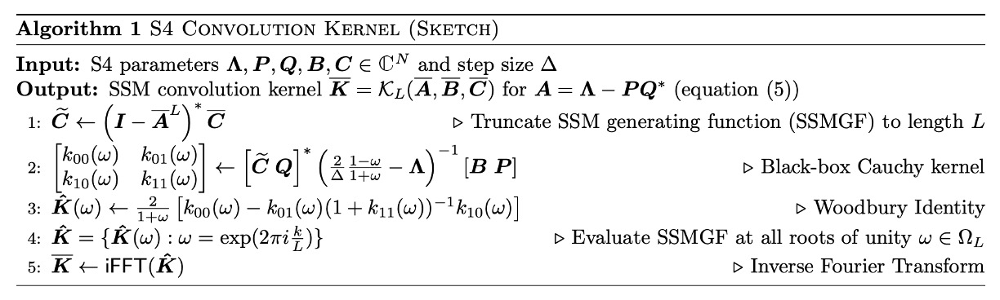
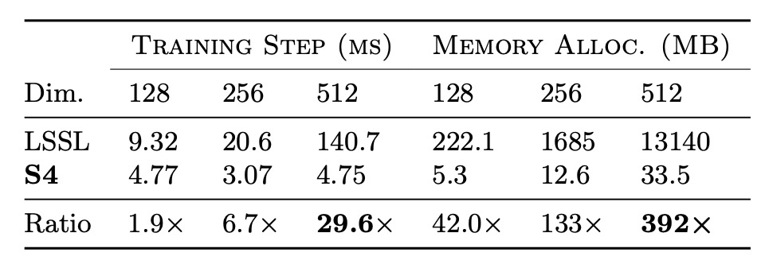
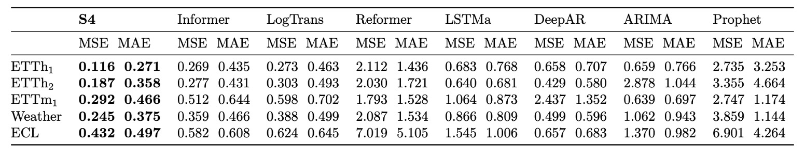
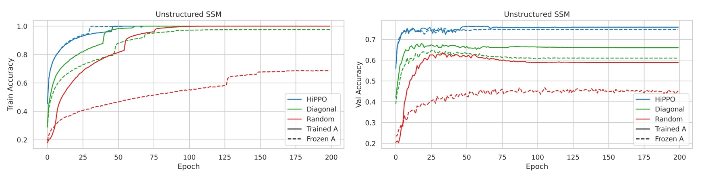

## The Prelude of Mamba

[**Efficiently Modeling Long Sequences with Structured State Spaces**](https://arxiv.org/abs/2111.00396)

---

We wanted to dive into Mamba, but we discovered there were quite a few prerequisites to tackle first—some foundational knowledge needed to be addressed.

So, we’re starting with S4.

This paper primarily aims to improve upon existing issues with State Space Models (SSMs).

Since it involves SSMs, it means we need to backtrack and delve into the relevant concepts of SSMs first.

:::tip
Why does reading a paper feel like solving a puzzle?
:::

## State Space Models

:::info
The authors are well aware that readers might not be familiar with SSMs, so they included some background knowledge in the paper. Let’s take a look together.
:::

State Space Models (SSMs) are mathematical tools used to describe the behavior of dynamic systems. They are widely applied in control engineering, signal processing, economics, and, more recently, deep learning.

The core idea of SSMs is to describe the dynamic behavior of systems through internal "states." It maps external input signals to the system's internal states, which then generate output signals. This framework captures the temporal evolution of systems, making it particularly suitable for handling time-series data and dynamic processes.

SSMs describe system behavior using two core equations:

1. **State Equation**: Describes how the system's state evolves over time.

   $$
   \dot{x}(t) = A x(t) + B u(t)
   $$

   - **State Transition Matrix $A$**: Determines the intrinsic dynamics of the system, such as natural decay or oscillation.
   - **Input Matrix $B$**: Defines how inputs affect the system's state.

2. **Output Equation**: Describes how to obtain outputs from the states.

   $$
   y(t) = C x(t) + D u(t)
   $$

   - **Output Matrix $C$**: Specifies which states influence the output.
   - **Direct Transmission Matrix $D$**: Represents the direct impact of inputs on outputs (if any).

Thus, given an initial state $x(0)$ and an input $u(t)$, one can solve for $x(t)$ and $y(t)$, describing how the system evolves over time.

:::tip
At this point, it feels quite similar to RNNs—they both handle time-series data and involve hidden states.
:::

### HiPPO Theory

In prior studies, basic State Space Models (SSMs) struggled in practical applications because the solutions to first-order linear ordinary differential equations exhibit exponential behavior. This leads to gradients vanishing or exploding exponentially with sequence length, thereby hindering the model's learning capability. As a result, SSMs have difficulty handling tasks that involve long-term memory.

:::tip
In other words, the problem of gradient vanishing or exploding.
:::

To address this issue, the Linear State Space Layer (LSSL) model introduced the **HiPPO Theory** (High-order Polynomial Projection Operators), which focuses on a mathematical framework for continuous-time memory.

HiPPO introduces a class of specialized matrices $A \in \mathbb{R}^{N \times N}$. When these matrices are applied to the state transition equation in SSMs, they enable the state $x(t)$ to efficiently retain information about the input history $u(t)$.

The mathematical definition of the HiPPO matrix is as follows:

$$
A_{nk} =
\begin{cases}
-\sqrt{\frac{2n+1}{2k+1}} & \text{if } n > k \\
-(n+1) & \text{if } n = k \\
0 & \text{if } n < k
\end{cases}
$$

- **$n > k$**: Defines the interaction between different orders.
- **$n = k$**: Represents reflexivity (self-interaction).
- **$n < k$**: Indicates no influence between states.

This matrix structure captures the temporal importance of input history and dynamically adjusts the memory's priority. For example, in the Sequential MNIST task, replacing the default model with one using HiPPO improved accuracy from **60% to 98%**, demonstrating that HiPPO effectively addresses long-term dependency problems and enhances SSM performance for sequence data.

:::tip
**Intuitive Understanding of HiPPO**

The HiPPO matrix can be seen as a method of compressing historical signals into a fixed dimension while continuously updating this compressed information at each time step. For example:

- Higher-order signals receive more attention (e.g., recent inputs are more important than older ones).
- Lower-order signals are gradually attenuated but still retain meaningful memory, achieving an effective representation of history.

**How is it different from RNNs? It sounds like RNN hidden layers.**

HiPPO matrices are based on a "continuous-time mathematical framework" to compress and update historical input signals. They emphasize dynamic projection of inputs and structured multi-order memory, leveraging orthogonal bases to effectively represent past signals. RNN hidden states, on the other hand, rely on "discrete nonlinear update rules," typically carried out by neural networks with activation functions (e.g., $\text{tanh}$ or $\text{ReLU}$) to update the hidden states and encode current inputs via nonlinear transformations.

HiPPO matrices **naturally** support "long-term memory," particularly through orthogonal polynomials and specially designed matrices that preserve historical information. Conversely, RNN hidden states heavily depend on gradient flow, making them susceptible to gradient vanishing or exploding, which limits their ability to handle long-term dependencies.

LSTM and GRU were designed to address this problem by incorporating gating mechanisms to retain long-term memory. However, they still rely on manually crafted nonlinear update rules, which are less efficient than the mathematically structured approach of HiPPO.
:::

### Discretization

When handling discrete input sequences $(u_0, u_1, \dots)$, SSMs need to discretize the continuous-time equations because inputs $u_k$ are typically discrete samples derived from a continuous signal $u(t)$:

$$
u_k = u(k\Delta),
$$

where $\Delta$ represents the time step. This indicates that the $k$-th sample corresponds to the value of the continuous signal at time $k\Delta$.

To achieve this transformation, the **bilinear method** is commonly used, which converts the continuous-time state matrix $A$ into its discrete counterpart $\bar{A}$.

The state space model in its discrete form is represented as:

$$
\begin{aligned}
x_k &= \bar{A} x_{k-1} + \bar{B} u_k, \\
y_k &= \bar{C} x_k,
\end{aligned}
$$

where:

$$
\begin{aligned}
\bar{A} &= \left( I - \frac{\Delta}{2} A \right)^{-1} \left( I + \frac{\Delta}{2} A \right), \\
\bar{B} &= \left( I - \frac{\Delta}{2} A \right)^{-1} \Delta B, \\
\bar{C} &= C.
\end{aligned}
$$

- **$\bar{A}$**: The discrete state matrix, describing the evolution of the hidden state.
- **$\bar{B}$**: The discrete input matrix, describing how the input influences the state.
- **$\bar{C}$**: The output matrix, identical to the continuous case.

The discretized equations transform the continuous-time representation into a sequence-to-sequence mapping, where the hidden state at each time step $x_k$ is linked to the previous state $x_{k-1}$, resembling the structure of Recurrent Neural Networks (RNNs).

In this formulation, $x_k \in \mathbb{R}^N$ can be seen as the hidden state of an RNN, and $\bar{A}$ functions as the weight matrix for the recurrent layer.

:::tip
**What do these formulas represent?**

These formulas aim to convert a continuous-time system into its discrete-time equivalent, where the components represent:

- **$A$**: Describes the internal dynamics of the system, akin to the "natural evolution rules" or "intrinsic characteristics" of the system. For instance, it defines how the system evolves in the absence of external influences.
- **$B$**: Describes how external inputs affect the system state, acting as the "channel" or "method" through which the system receives external information.
- **$C$**: Translates the internal state of the system into observable outputs, like a "display" showing the system's results.
- **$\Delta$**: The time interval, indicating how often the system is observed or updated (e.g., once per second).
- **$I$**: The identity matrix, which leaves matrices unchanged and simplifies mathematical operations.

By breaking down the formulas:

- **$\bar{A}$**

  $$
  \bar{A} = \left( I - \frac{\Delta}{2} A \right)^{-1} \left( I + \frac{\Delta}{2} A \right)
  $$

  This formula converts the continuous-time state dynamics $A$ into its discrete-time version $\bar{A}$. Intuitively:

  - **$\left( I + \frac{\Delta}{2} A \right)$**: Makes a small forward prediction of how the system changes based on the current state.
  - **$\left( I - \frac{\Delta}{2} A \right)^{-1}$**: Corrects the forward prediction to ensure more accurate results.

  Together, $\bar{A}$ indicates how the system transitions from one time step to the next in discrete time.

- **$\bar{B}$**

  $$
  \bar{B} = \left( I - \frac{\Delta}{2} A \right)^{-1} \Delta B
  $$

  This formula converts the input matrix $B$ into its discrete-time version $\bar{B}$, describing how inputs influence the system state at each time step.

  - $\Delta B$: Represents the direct impact of inputs over the time interval $\Delta$.
  - $\left( I - \frac{\Delta}{2} A \right)^{-1}$: Adjusts this impact by considering the system's inherent dynamics, ensuring a more accurate representation of input effects in discrete time.

- **$\bar{C} = C$**

  The output matrix $C$ remains unchanged because the system's output measurement method does not require adjustment during discretization.

---

So, let's make a practical analogy to better understand these concepts.

Imagine you’re driving, and the car’s state (e.g., speed and position) evolves over time.

The continuous-time equations $A, B, C$ describe how the car’s dynamics change at every moment, but we can only observe and control the car at discrete intervals $\Delta$ (e.g., every second).

1. **$\bar{A}$**: Describes how the car’s inherent dynamics (e.g., inertia and natural deceleration) evolve the state from one time step to the next.
2. **$\bar{B}$**: Describes how the driver’s actions (e.g., pressing the accelerator or brake, as inputs) influence the car’s state at each time step.
3. **$\bar{C}$**: Describes the outputs we observe (e.g., speed or position via a speedometer or odometer), which remain unchanged in the discretized model.

:::

### Convolutional Representation

While the recursive formula above captures sequence relationships, its sequential nature makes it challenging to train efficiently on modern hardware like GPUs, as each step depends on the previous step's computation.

To overcome this, we transform the recursive formula into a convolutional form. Assuming the initial state $x_{-1} = 0$, the recursive formula unfolds as follows:

$$
\begin{aligned}
x_0 &= \bar{B} u_0, \\
x_1 &= \bar{A} \bar{B} u_0 + \bar{B} u_1, \\
x_2 &= \bar{A}^2 \bar{B} u_0 + \bar{A} \bar{B} u_1 + \bar{B} u_2, \\
&\dots
\end{aligned}
$$

The output $y_k$ is given by:

$$
y_k = \bar{C} x_k,
$$

which expands to:

$$
y_k = \bar{C} \bar{A}^k \bar{B} u_0 + \bar{C} \bar{A}^{k-1} \bar{B} u_1 + \cdots + \bar{C} \bar{B} u_k
$$

Upon expanding, we observe that this can be expressed in convolutional form:

$$
y = K * u,
$$

where:

$$
K = (\bar{C} \bar{B}, \bar{C} \bar{A} \bar{B}, \dots, \bar{C} \bar{A}^{L-1} \bar{B})
$$

Here, $K$ represents the convolution kernel, which describes how the system's output is generated from the input as it propagates through the state matrices.

## Defining the Problem

:::tip
We can finally return to the main focus of the paper—what a journey!
:::

The authors clearly state at the outset that the core goal of this paper is to address the efficiency bottlenecks in sequence models when handling **Long-Range Dependencies (LRDs)**. Specifically, the focus is on the computational and memory challenges faced by existing models when processing long sequences.

Currently, most sequence models can effectively handle sequences of "a few thousand time steps." However, real-world time-series data often requires reasoning over **tens of thousands of time steps**. For example, in the Path-X task, the sequence length is 16,384. Existing models perform poorly in such long-range scenarios (as measured by LRA benchmarks), often reaching performance levels equivalent to random guessing.

Although traditional models—such as CTMs, RNNs, CNNs, and Transformers—have introduced specialized variants to tackle LRD, such as orthogonal RNNs, dilated convolutions, and efficient Transformers, these approaches still struggle on challenging benchmarks like LRA and raw audio classification.

Beyond the mainstream techniques, **State Space Models (SSMs)** have theoretical potential but have long been difficult to apply to deep learning due to several limitations:

- **Deep SSMs**: While theoretically capable of handling LRDs, their practical performance in real-world tasks has been limited.
- **Linear State Space Layers (LSSLs)**: Although LSSLs can unify the strengths of CTMs, RNNs, and CNNs and demonstrate potential for addressing LRDs, they suffer from excessive computational and memory demands. Additionally, their practical application has been hindered by numerical instability, especially due to the high non-normality of the matrix $A$, which makes traditional algorithms difficult to apply stably.

To address these challenges, the authors propose a **Structured State Space Model (S4)**.

The goal of S4 is to significantly reduce computational complexity and memory requirements by re-parameterizing the state matrix $A$ and leveraging frequency-domain computations via generating functions, while maintaining numerical stability.

## Solving the Problem

In discrete-time state space models (SSMs), direct computations involve repeated multiplications of the matrix $A$, which constitutes the primary computational bottleneck:

- **Time Complexity**: For a sequence of length $L$, computing the formula requires $O(N^2L)$ operations.
- **Space Complexity**: Storing the hidden states requires $O(NL)$ space.

To address this, the authors diagonalize $A$ into a more structured form to simplify the computations.

:::tip
**Diagonalization** is a mathematical operation that transforms a matrix into a simpler form.

The goal is to express a matrix $A$ as:

$$
A = V \Lambda V^{-1},
$$

where:

- **$\Lambda$** is a diagonal matrix with non-zero elements only on the diagonal, while other elements are zero.
- **$V$** is a matrix composed of the eigenvectors of $A$.
- **$V^{-1}$** is the inverse of $V$.

Diagonalization makes operations like matrix multiplication or exponentiation much more efficient. For example, consider computing a high power $A^{10}$:

- **Direct computation**: Requires 9 matrix multiplications.
- **With diagonalization**:
  $$
  A^{10} = (V \Lambda V^{-1})^{10} = V \Lambda^{10} V^{-1}.
  $$
  - Since $\Lambda$ is a diagonal matrix, computing $\Lambda^{10}$ involves raising each diagonal element to the 10th power, which is computationally cheap.
  - Only two additional matrix multiplications (with $V$ and $V^{-1}$) are required.

This drastically reduces the cost of high-order matrix computations, particularly for large matrices or frequent operations, making diagonalization a critical tool for numerical optimization.
:::

Given the state space model $(A, B, C)$, conjugation transforms it into $(V^{-1}AV, V^{-1}B, CV)$.

Through conjugation, the authors diagonalize $A$, simplifying matrix computations. This allows the computation of the matrix $K$ in the formula to be represented as a Vandermonde matrix, reducing the computational cost to $O((N + L) \log^2(N + L))$.

However, for HiPPO matrices, direct diagonalization leads to numerical instability because the elements of the diagonalizing matrix $V$ grow exponentially large. This makes direct numerical computations infeasible.

### S4 Parameterization

The term **Normal Plus Low-Rank (NPLR)** refers to a matrix decomposition combining a **normal matrix** with a **low-rank matrix**.

In the previous discussion, the authors concluded that only well-conditioned matrices $V$ should be used for conjugation. Ideally, matrix $A$ would be diagonalizable by a unitary matrix (a matrix with a condition number of 1).

According to the spectral theorem in linear algebra, matrices satisfying this condition are **normal matrices**, which fulfill $AA^* = A^*A$. However, this class of matrices is limited, and notably, HiPPO matrices do not belong to this category.

Although HiPPO matrices are not normal, they can be decomposed into the sum of a **normal matrix** and a **low-rank matrix**. However, directly leveraging this decomposition is computationally inefficient because exponentiating such a decomposition remains slow and hard to optimize.

To overcome these challenges, the authors introduced three key techniques:

- **Technique 1: Spectral Computation via Generating Functions**

  Instead of directly computing $K$, they calculate its truncated generating function:

  $$
  \sum_{j=0}^{L-1} K_j \zeta^j
  $$

  at the roots of unity $\zeta$. The convolution kernel $K$ is then recovered using **Inverse Fast Fourier Transform (IFFT)**.

- **Technique 2: Matrix Resolvent and Woodbury Identity**

  The generating function involves matrix inversion rather than exponentiation. The authors apply the **Woodbury identity** to express $(A + P Q^*)^{-1}$ in terms of $A^{-1}$, reducing the computation to the diagonal case efficiently:

  $$
  (A + P Q^*)^{-1} = A^{-1} - A^{-1}P (I + Q^*A^{-1}P)^{-1} Q^*A^{-1}.
  $$

- **Technique 3: Equivalence to Cauchy Kernel Computation**

  For diagonal matrices, the computation reduces to calculating the **Cauchy kernel**:

  $$
  \frac{1}{\omega_j - \zeta_k},
  $$

  a well-studied problem in numerical analysis with fast, stable algorithms that operate in near-linear time. These algorithms are detailed in works such as:

  - [**Transformations of Matrix Structures Work Again**](https://arxiv.org/abs/1303.0353)
  - [**Fast Approximate Computations with Cauchy Matrices and Polynomials**](https://arxiv.org/abs/1506.02285)

These techniques are broadly applicable to matrices that can be decomposed into the **Normal Plus Low-Rank (NPLR)** form.

- **Theorem 1: NPLR Representation of HiPPO Matrices**

  The authors formally state the first theorem of the paper:

  **All HiPPO matrices** (e.g., HiPPO-LegS, LegT, LagT) can be represented in the NPLR form:

  $$
  A = V \Lambda V^* - P Q^\top = V (\Lambda - (V^*P) (V^*Q)^*) V^*,
  $$

  where:

  - $V \in \mathbb{C}^{N \times N}$ is a unitary matrix,
  - $\Lambda$ is a diagonal matrix,
  - $P, Q \in \mathbb{R}^{N \times r}$ represent the low-rank decomposition.

  This representation demonstrates that HiPPO matrices are well-structured and amenable to efficient computation using the NPLR framework.

### S4 Complexity

NPLR matrices can be transformed into a diagonal plus low-rank matrix form (DPLR), but it is important to note that their elements extend from $\mathbb{R}$ to $\mathbb{C}$.

When matrix $A$ is expressed in the DPLR form, S4 achieves optimal or near-optimal computational efficiency for both recurrence and convolution operations.

- **Theorem and Efficiency of S4 Recurrence**

  - **Theorem 2: Computational Efficiency of S4 Recurrence**

    It is proven that for any given step size $\Delta$, each step of the recurrence formula (3) can be computed in $O(N)$ operations, where $N$ is the size of the state dimension.

- **Theorem and Efficiency of S4 Convolution**

  - **Theorem 3: Computational Efficiency of S4 Convolution Filter**

    It is proven that for any given step size $\Delta$, the computation of the SSM convolution filter $K$ can be reduced to 4 Cauchy matrix multiplications, requiring only $\tilde{O}(N + L)$ operations and $O(N + L)$ space.

:::tip
The detailed proofs can be found in the paper. The content is extensive, so we encourage readers to refer to the original text.
:::

Theorem 3 represents the core technical contribution of this research, and its algorithm embodies the design motivation behind the NPLR S4 parameterization. The complete algorithm is outlined as follows:

<figure style={{"width": "80%"}}>

</figure>

S4 achieves linear complexity $O(N)$ for recurrence operations and $\tilde{O}(N + L)$ for convolution operations, combining efficiency and stability to establish a solid theoretical and practical foundation for SSM computation.

### Architecture Details

At initialization, the matrix $A$ in the state space model (SSM) of an S4 layer is set to the HiPPO matrix. According to **Theorem 1**, this SSM is unitarily equivalent to $(\Lambda - P Q^*, B, C)$. These parameters form the $5N$ trainable parameters of the S4 layer.

The deep SSM consists of $H$ independent copies of the SSM, each sharing the same parameters but mixing features through position-wise linear layers. This design enables the S4 layer to handle multi-dimensional features while performing independent state transitions at each position. Through multiple layers, the S4 layer forms a deep nonlinear network.

The overall architecture outputs sequences in a shape consistent with other sequence models like Transformers, RNNs, and CNNs: $(\text{batch size}, \text{sequence length}, \text{hidden dimension})$.

Compared to other models, S4 shares similarities with convolutional neural networks (CNNs). While the S4 core module is a linear transformation, the overall deep SSM becomes nonlinear through the nonlinear transformations across layers. Additionally, the broadcasting of features across $H$ dimensions in the S4 layer resembles **depthwise-separable convolutions**, but S4’s convolution kernels are global.

The following table compares the computational complexities of the S4 layer and other sequence models:

<figure style={{"width": "80%"}}>

</figure>

## Discussion

### Efficiency Benchmarks

<figure style={{"width": "60%"}}>

</figure>

To evaluate the training speed and resource efficiency of S4, the authors conducted efficiency benchmarks, starting with a comparison against LSSL.

The results, as shown in the table above, confirm that S4 is orders of magnitude more efficient in terms of speed and memory usage compared to LSSL for practical layer sizes.

Next, the authors compared S4 with efficient Transformer variants such as Linear Transformer and Performer. The results are shown in the table below. In parameter-matched settings, S4's speed and memory usage are competitive with the best Transformer variants.

<figure style={{"width": "60%"}}>

</figure>

### Stability Benchmarks

<figure style={{"width": "80%"}}>

</figure>

The authors further investigated S4's stability in long-range reasoning by comparing its performance with other models on challenging tasks such as LRA and raw speech classification.

On LRA benchmarks, S4 significantly outperforms all baseline models, achieving an average performance of 80.48%, while all baseline models score below 60% on average. S4 successfully completed the Path-X task, demonstrating its capability to handle long-range dependencies.

On the SC10 dataset, S4 achieved a classification accuracy of 98.3%, surpassing all baseline models. This validates that a powerful LRD model can extract more information directly from raw data, outperforming handcrafted preprocessing methods.

### Visualization

<figure style={{"width": "85%"}}>

</figure>

The authors conducted a visualization analysis of S4's learned representations to further understand its performance.

The figure above shows the performance of a trained S4 model on the LRA Path-X task. The SSM convolution kernel$K \in \mathbb{R}^{16384}$ is reshaped into a$128 \times 128$ image for visualization.

The left image depicts an example from the Path-X task, where the model is required to determine whether two markers are connected by a path.

- **Top (First Layer Convolution Kernels)**: These kernels are from the first layer of the S4 model. They display learned local contextual features, focusing on patterns in a small number of rows while ignoring most of the global information.

- **Bottom (Last Layer Convolution Kernels)**: These kernels are from the last layer of the S4 model. They show global structured features that span the entire context (16384 pixels), learning global information and capturing patterns at various spatial frequencies.

The results demonstrate that S4's convolution kernels effectively capture the 2D structural characteristics of sequence data, showcasing a deep understanding of long-range dependencies.

### A General Model?

The authors conducted a series of experiments to explore whether S4 can function as a general sequence model.

---

**Image Generation: CIFAR Density Estimation**

<figure style={{"width": "70%"}}>

</figure>

CIFAR density estimation is a popular benchmark for autoregressive image modeling. The images are flattened into a sequence of 3072 RGB subpixels, which are predicted one by one.

The results show that despite lacking a 2D structural bias, S4 is competitive with models specifically designed for this task.

---

**Text Generation: WikiText-103**

<figure style={{"width": "70%"}}>

</figure>

WikiText-103 is a classic benchmark for language modeling, requiring the model to predict tokens in a sequence based on contextual order.

The results demonstrate that S4, by replacing the self-attention layers in a Transformer, significantly narrows the performance gap with Transformers (just 0.8 ppl difference). Additionally, S4 sets a new state of the art (SOTA) for attention-free models, outperforming other models by over 2 ppl.

---

**Time-Series Forecasting: Weather Data**

S4 was applied to time-series forecasting tasks and compared with Informer, a model specifically designed for such problems.

The results indicate that S4 outperforms baselines in 40/50 settings across 5 forecasting tasks. Notably, in long-sequence forecasting, such as predicting 30 days of weather data, S4 reduces the mean squared error by 37%.

---

Through these diverse experiments, S4 demonstrates its potential as a general sequence model, effectively addressing LRD problems and excelling across various domains and tasks. Its efficient generation capability, flexibility in adapting to different resolutions, and strong performance under weak structural biases position it as a significant candidate for sequence modeling research.

### Importance of HiPPO

One of the key design aspects of S4 is using the HiPPO matrix to initialize the SSM.

The authors conducted ablation studies to evaluate the importance of various components and addressed the following questions:

1. How important is HiPPO initialization?
2. Is training the SSM on top of HiPPO necessary?
3. Are the benefits of S4 derived solely from the NPLR parameterization, independent of HiPPO?

All experiments were conducted on the Sequential CIFAR-10 task, which was chosen for its generalizability to other settings. Models were constrained to at most 100K trainable parameters, used a simple stepwise learning rate scheduler, and did not apply regularization.

---

#### **Experiment 1: Unconstrained SSM Initialization**

- **Comparison of Initialization Methods**
  - **Random Gaussian Initialization**: Initializes matrix$A$ with a random Gaussian distribution.
  - **HiPPO Initialization**: Initializes$A$ using the HiPPO matrix.
  - **Random Diagonal Matrix**: Sets$A$ as a random diagonal matrix without applying S4's NPLR parameterization.
  - Both freezing and training$A$ were tested for the above initialization methods.

The results show that training the SSM improves performance across all initialization methods, with the largest gains observed for randomly initialized models.

There were significant differences in validation performance among initialization methods. While all models achieved perfect training accuracy, validation accuracy varied by more than **15%**, with HiPPO initialization yielding the best generalization.

---

#### **Experiment 2: Combining NPLR Parameterization with HiPPO**

<figure style={{"width": "80%"}}>

</figure>

This experiment tested whether HiPPO initialization is the primary driver of S4's success or if the benefits are derived solely from the NPLR parameterization.

The results, shown above, indicate that using NPLR parameterization alone without HiPPO leads to poor performance, further validating the importance of HiPPO initialization.

---

#### **Experiment 3: Regularization and Full S4 Performance**

<figure style={{"width": "80%"}}>

</figure>

This experiment added lightweight regularization (Dropout = 0.1) to the main ablation studies, comparing the performance of S4 with HiPPO initialization to other initialization methods.

The results show that even with Dropout, HiPPO initialization retains a clear advantage. The full S4 method (HiPPO + NPLR) achieves **84.27% test accuracy** with only 100K trainable parameters.

## Conclusion

In this paper, the authors introduced the "S4" sequence model, which leverages innovative parameterization of State Space Models (SSMs) by integrating continuous-time, recurrent, and convolutional perspectives. This approach provides an effective and principled solution to the Long-Range Dependency (LRD) problem.

Across a series of benchmarks, S4 demonstrated outstanding performance across various data modalities and model capabilities, showcasing its potential as a general solution for sequence modeling. It holds significant application value and research implications.

:::tip
This paper is quite challenging for us, and we still cannot fully understand it after reading it.

For the specific implementation and technical details of S4, we need further research and practice in the future.
:::
