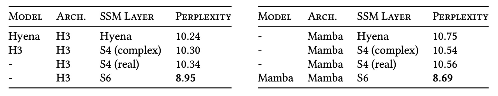

## Who is the Successor

[**Mamba: Linear-Time Sequence Modeling with Selective State Spaces**](https://arxiv.org/abs/2312.00752)

---

To read this paper, we put in quite a bit of effort.

First, we had to review the author's past works:

- [**[20.08] HiPPO: Hippo's Memory**](../2008-hippo/index.md)
- [**[21.11] S4: The Prelude of Mamba**](../2111-s4/index.md)

Next, we had to understand the main comparison target of this paper, which is the advantages and disadvantages of the Transformer.

At this point, we assume you’ve already read the previous papers and possess sufficient background knowledge.

Now, let’s dive into this paper.

## Defining the Problem

Do you remember what S4 did?

S4 continues the previous research on SSMs, significantly reducing computational complexity and memory requirements through reparameterization of the state matrix $A$ and frequency-domain generating function calculations, while maintaining numerical stability.

However, S4 is still a linear time-invariant system (LTI), meaning the model dynamics remain unchanged throughout the sequence (the same set of parameters $A, B, C$ are used at all time steps).

For example, consider the following Copying problem: the input is a sequence, and the output requires copying a "part of the information" from that sequence:


In the left diagram, if there is a fixed time gap between the input and output, this problem is very simple for an LTI model, because it only needs to learn a fixed shift or convolution kernel.

But in the right diagram, when there are random time intervals between the input and output and the model needs to be "content-aware," the model must distinguish which tokens need to be copied and which are irrelevant or noisy. At this point, the model needs to have "selective" capabilities.

This ability is very common in LLMs, because the Transformer architecture uses a self-attention mechanism to determine the output based on contextual content. However, LTI models lack the ability to "dynamically change parameters," making it difficult to handle such problems.

Therefore, the authors believe that a way must be found to make several key parameters of the SSM (such as $\Delta$, $B$, $C$) "input-dependent," meaning these parameters will change over time steps rather than remaining fixed.

## Solving the Problem

### Selective Mechanism


First, let's see how the author improved the core algorithm of the SSM to enable the model with "selectivity."

Start with **Algorithm 1 (S4)**:

```txt
Algorithm 1 SSM (S4)
Input: x : (B, L, D)
Output: y : (B, L, D)
    1: A : (D, N) ← Parameter       ⊲ Represents structured N×N matrix
    2: B : (D, N) ← Parameter
    3: C : (D, N) ← Parameter
    4: Δ : (D) ← τΔ(Parameter)
    5: A, B : (D, N) ← discretize(Δ, A, B)
    6: y ← SSM(A, B, C) (x)         ⊲ Time-invariant: recurrence or convolution
    7: return y
```

- **(Step 1–3) Parameter Initialization**

  The model has three core parameters: $A, B, C$.

  $A$ can be viewed as a structured $N \times N$ matrix, but in practice, it is often diagonalized or uses other special structures to save on parameters, stored in the shape of $(D, N)$.

- **(Step 4) Setting $\Delta$**

  $\Delta$ is a vector of size $(D)$, which, after being processed by a monotonic function such as $\tau_\Delta$ (e.g., $\mathrm{softplus}$), is used for discretization transformation.

- **(Step 5) Discretization**

  The function `discretize(Δ, A, B)` discretizes the continuous system parameters $A$ and $B$ through exponential matrix operations and other discretization steps based on $\Delta$, resulting in $\bar{A}, \bar{B}$ in discrete time.

  Since both $\Delta$ and $A, B$ are time-invariant, the discretized $\bar{A}, \bar{B}$ remain fixed.

- **(Step 6) SSM Computation**

  Since (A, B, C) do not change across sequence positions, the computation can use a **fixed convolution** (global convolution) or **linear recurrence**:

  - Using convolution, the entire sequence can be processed at once in parallel, making training highly efficient.
  - For autoregressive inference, it can switch back to recursive mode to process step-by-step.

From the above, we can see that S4 retains the "linear time-invariant (LTI)" property, allowing most SSMs to be accelerated using convolution kernels, avoiding explicit expansion of the entire hidden state tensor, thus achieving high efficiency in practice.

---

Now, let's look at **Algorithm 2 (S6)**.

Here, the concept of "selectivity" is introduced, allowing $B, C, \Delta$ to change according to the input $x$. As a result, global convolutions or fixed recursions can no longer be applied, and the model must use a "scan" method for updates.

```txt
Algorithm 2 SSM + Selection (S6)
Input: x : (B, L, D)
Output: y : (B, L, D)
    1: A : (D, N) ← Parameter         ⊲ Represents structured N×N matrix
    2: B : (B, L, N) ← sB(x)
    3: C : (B, L, N) ← sC(x)
    4: Δ : (B, L, D) ← τΔ(Parameter + sΔ(x))
    5: A, B : (B, L, D, N) ← discretize(Δ, A, B)
    6: y ← SSM(A, B, C) (x)           ⊲ Time-varying: recurrence (scan) only
    7: return y
```

- **(Step 1) Structure of $A$**

  Like S4, a structured $N \times N$ matrix is still needed for $A$, but the other parts ($B, C, \Delta$) will change over time steps or sequence positions.

- **(Step 2–3) Input-dependent $B, C$**

  Here, $B$ and $C$ are no longer fixed $(D, N)$ shapes but correspond to $(B, L, N)$, meaning that for each batch and each sequence position, there is a different set of parameter values.

  - These values are dynamically generated by functions $s_B(x)$ and $s_C(x)$ based on the input features, usually implemented as small linear projections or MLPs.

- **(Step 4) Input-dependent $\Delta$**

  Similarly, $\Delta$ is extended to the shape $(B, L, D)$, first adding internal parameters (Parameter), then calculated through $s_\Delta(x)$, followed by $\tau_\Delta$ (e.g., softplus), yielding the final learnable "time-varying step size."

- **(Step 5) Discretization**

  Since each time step of $\Delta$ is different, during discretization, $\bar{A}_{t}, \bar{B}_{t}$ must be computed separately for each position.

  At this point, $\bar{A}, \bar{B}$ will have the shape $(B, L, D, N)$.

- **(Step 6) Recursive Scan**

  Because the parameters are "time-varying," a fixed convolution kernel can no longer be used for the entire sequence. Instead, the state must be updated step-by-step or in parallel using a "scan" approach.

### S6 Architecture

In deep learning, common efficient fundamental operations include **convolution** and **attention**. These operations leverage mature implementation libraries and parallelization strategies on GPUs to fully harness hardware computational potential.

Now, the author aims to replace the attention mechanism with **selective SSM**, but this clearly cannot benefit from hardware acceleration because SSM is neither a convolution nor an attention mechanism; it is a "recursive" model.

Therefore, to generalize SSM, a hardware-oriented algorithm must be developed to ensure that SSM performs well on GPUs.

To achieve this goal, the author proposes the **selective scan** hardware-oriented algorithm. The core idea is to cleverly expand only the necessary intermediate states in the GPU memory hierarchy and use parallel scan and recomputation techniques to reduce the read/write operations on High Bandwidth Memory (HBM).

:::tip
**Selective Scan Structured State Space Sequence Modeling, hence called S6.**
:::

:::info
Before we proceed, let’s understand what GPU SRAM and HBM are:

1. **SRAM (Static Random Access Memory)**

   SRAM is extremely fast memory used for the GPU's internal cache (such as L1 and L2 Cache). It has low data access latency, making it ideal for small data blocks that are frequently accessed. The limitation of SRAM is its small capacity, which makes it unsuitable for handling large datasets.

2. **HBM (High Bandwidth Memory)**

   HBM is external memory designed for high-performance computing with extremely high data transfer bandwidth. It is commonly used in applications requiring large data processing, such as deep learning, scientific simulations, and image processing.

SRAM is the "cache" of the GPU, accelerating frequent operations on small data blocks, while HBM serves as the "warehouse," handling data transfer and storage requirements. Therefore, to speed up computations, we should minimize read/write operations on HBM and prioritize using SRAM for calculations.
:::

With an understanding of the GPU architecture, let’s look at the overall architecture diagram:


In the diagram, the author provides an example of a 5-channel SSM model, where each channel has a 4-dimensional hidden state. If we were to expand it directly, the model’s state space would be $(D \times N)$, multiplied by batch size $B$ and sequence length $L$, which would become massive. Therefore, during the intermediate state exchange step, the selective scan algorithm is used, expanding only when necessary.

As shown in the diagram, the parameters ($\Delta, A, B, C$) are first loaded from HBM to faster SRAM. Then, **discretization** and **recursive updates (scan)** are performed in SRAM.

Finally, the result $(B, L, D)$ is written back to HBM. The computation kernels, which were originally separate, are merged into one or a few kernels to reduce repeated read/write operations on HBM.

During backpropagation, the model will need to access intermediate states from the forward pass. However, storing each time step would consume a lot of GPU RAM. The author’s solution is "not to store"!

When backward pass occurs, the original input and parameters are reloaded from HBM, and the forward computation is recomputed to obtain the intermediate states. This **recomputation** technique increases computational overhead but drastically reduces memory requirements, leading to greater overall efficiency.

Thus, selective SSM retains input-dependence flexibility while utilizing GPU hardware features for higher throughput and lower resource usage, making recursive models more feasible for large-scale applications.

:::tip
This concept is somewhat similar to FlashAttention, which avoids excessive intermediate result access in attention mechanisms by using recomputation to save memory.
:::

### Mamba Architecture

<div align="center">
<figure style={{"width": "90%"}}>

</figure>
</div>

The traditional H3 architecture is a common variant of SSM, where each block contains an interleaved stack of parts resembling "linear attention" along with an MLP (multi-layer perceptron). Here, the authors choose to combine these two components into a single unit, then repeat it multiple times within the network to achieve a more streamlined and scalable design (similar to the simplification of attention in GAU).

In implementation, the authors introduce a controllable expansion factor $E$ to the model's dimension $D$, making the primary parameters of each block focus on linear projections (projected onto input and output, tripling the number of parameters), while the actual SSM (including $\Delta$, $B$, $C$, and $A$) occupies a small proportion.

In experiments, the authors fix $E = 2$ and use two layers of such blocks, making the overall parameter count comparable to the scale of a traditional Transformer with "multi-head attention (MHA) + MLP" hybrid (about $12D^2$).

Additionally, to make the "Gated MLP" closer to the popular SwiGLU variant, the authors use SiLU (Swish) as the activation function. Inspired by RetNet (which places normalization layers in similar positions), they also introduce an optional layer normalization (LayerNorm), ultimately forming the complete "Mamba" architecture.

### Revisiting the Selective Mechanism

At the end of the methodology, the authors discuss the role and impact of the "selective mechanism" in SSM:

1. **Interpretation of the "Selective" Parameters**

   - **Significance of $\Delta$**: $\Delta$ can be viewed as an extended RNN gate: when $\Delta$ is large, the model "resets the state and focuses on the current input"; when $\Delta$ is small, it "ignores the current input and retains the old state." From the perspective of continuous time systems, "$\Delta \to \infty$" corresponds to the system spending more time processing the current input, while "$\Delta \to 0$" almost skips that time step.

   - **Relationship between $A$ and $\Delta$**: Although $A$ can be set to "change with input," the authors note that the main selectivity is still driven by $\Delta$, since $A$ is influenced by $\Delta$ during discretization ($\bar{A} = \exp(\Delta A)$). As long as $\Delta$ can selectively increase or decrease, it significantly impacts the dynamics of the entire model.

   - **Meaning of $B$ and $C$**: As mentioned earlier, the key to the selective mechanism is the ability to filter out irrelevant information. $B$ governs "how the input is written to the hidden state," and $C$ controls "how the hidden state is mapped to the output." By making $B$ and $C$ input-dependent, the model can more finely decide whether $x_t$ should enter the model.

2. **Generality of the Selective Mechanism**

   The "selective mechanism" can be applied in many contexts, including traditional RNNs or CNNs. It can be applied to different parameters (such as $A$ in Algorithm 2) and even implemented through various input transformation functions $s(x)$. This suggests that the "selective mechanism" is not limited to a specific model but is a broad concept in the entire sequence modeling domain.

3. **Connection to RNN Gating Mechanisms**

   The authors emphasize that common RNN gating mechanisms (such as the input gate and forget gate in LSTM, and update gate in GRU) can be considered specific instances of a "selective mechanism."

   :::tip
   We discussed this in the S4 paper earlier.
   :::

4. **Three Key Effects of the Selective Mechanism**

   The authors summarize the impact of the "selective mechanism" into three important "forces":

   - **(a) Variable Spacing**: By dynamically filtering or ignoring certain inputs, the model can skip over irrelevant "padding" or "noise" sections, allowing the temporal sequence to not necessarily follow an evenly spaced record. For example, in human language, filler words like "um" or "ah" can be ignored, allowing the model to focus more on the truly important words.

   - **(b) Filtering Context**: Many sequence models experience a performance decline when dealing with long contexts because they struggle to ignore irrelevant historical information. Models with a selective mechanism can discard or reset useless information at any point, allowing performance to ideally improve as the context grows longer.

   - **(c) Boundary Resetting**: In real-world tasks, multiple independent sequences may be concatenated for processing. Without a selective mechanism, these sequences might "mix" their contexts. With a selective mechanism, the model can reset its state at the boundaries (e.g., $\Delta_t \to \infty$ or $g_t \to 1$), preventing interference between consecutive sequences.

### Training Methods and Protocols

The authors use the **Pile dataset** for pretraining, which is a large corpus commonly used for language models, and they employ a training recipe similar to that of GPT-3 (e.g., using corresponding depths and widths).

:::tip
For detailed training hyperparameters and settings, refer to Appendix E.2 of the paper.
:::

- **Model Comparison**

  1. **Transformer (GPT3 Architecture)**: This is the traditional, standard Transformer-based GPT3-style language model with multi-head attention.

  2. **Transformer++**: The authors specifically mention this as "the most powerful Transformer recipe known to date," combining best practices from models like PaLM and LLaMa, including:

     - Rotary embedding
     - SwiGLU MLP
     - RMSNorm (replacing LayerNorm)
     - No linear bias
     - Higher learning rates

  3. **Other Subquadratic Architectures**: Several recently proposed models that aim to reduce the computational cost or offer more scalability than attention, such as RWKV and RetNet, are also included in the comparison.

- **Experimental Methods and Results**

  - **Chinchilla Protocol**: The authors follow the "Chinchilla" evaluation method, testing models with parameter sizes ranging from ≈125M to ≈1.3B. This method typically balances "model size" with "training tokens" to observe the optimal result under "equivalent expenditure."

    :::tip
    If you're unfamiliar with Chinchilla, you can refer to the article we previously read:

    - [**[22.03] Chinchilla: Chinchilla's Gaze**](../../transformers/2203-chinchilla/index.md)
      :::

## Discussion

### Scaling Laws


According to experimental results, the chart above shows that as the sequence length increases, **Mamba** catches up with Transformer++ using enhanced recipes in terms of perplexity.

The authors particularly highlight that Mamba is the first "linear-time" architecture to rival the strongest existing Transformers without using attention. While RWKV and RetNet are also "subquadratic" architectures, their performance on long sequences is less stable compared to Mamba. Mamba’s advantage is particularly evident for long sequences (e.g., 8k tokens).

### Comparison with Other Language Models

<div align="center">
<figure style={{"width": "90%"}}>

</figure>
</div>

The authors selected multiple well-known zero-shot downstream tasks, including knowledge reasoning, commonsense question answering, and cloze tests, for comparison with models like Pythia and RWKV.

:::tip

- **Pythia**: A popular open-source model, which uses the same tokenizer and dataset (Pile) as Mamba and was also trained on 300B tokens.
- **RWKV**: A type of RNN-based language model, conceptually similar to an SSM, but with a context length set to 1024.
  :::

Experimental results show that **Mamba** outperforms competitors of the same parameter size on almost all benchmarks. Moreover, Mamba's performance can "match" or "surpass" models with double its parameter size, indicating that this architecture may have better "parameter efficiency" under equivalent training conditions.

Overall, **Mamba** not only has the potential to match enhanced Transformer models in pretraining perplexity and scaling laws but also outperforms open-source models of the same size on several zero-shot tasks, demonstrating its strong competitiveness in language modeling.

### Inference Efficiency Comparison


The authors also provide a detailed performance comparison of **Mamba**'s inference throughput and memory usage, particularly in relation to **scan operations**.

As shown in the chart, compared to FlashAttention-2, **SSM scans are faster** when the sequence length exceeds 2K. With the standard scan implementation in PyTorch, it achieves a **20–40x speedup**.

:::tip
This is thanks to the hardware-oriented optimizations proposed by the authors, such as kernel fusion, parallel scans, and recomputation.
:::

In the inference phase, **Mamba** eliminates the need for attention key-value (KV) caches, allowing for larger batch sizes and significantly increasing throughput.

For example, a 6.9B parameter Mamba model surpasses a 1.3B Transformer in inference throughput despite being "5 times smaller" in size. When compared with Transformers of the same size, Mamba can typically be **4–5 times faster** during inference.

### Ablation Study - Selective Mechanism



The authors compare different structures and their internal SSM implementations: if using the previously non-selective (LTI) SSM, which is equivalent to a global convolution, it can achieve similar results whether complex or real numbers are used. This shows that for language models, "replacing complex numbers with real numbers doesn't significantly sacrifice performance but can improve hardware efficiency."

However, when the LTI SSM is replaced with a selective SSM (S6), performance improves significantly. The authors further note that with selective SSM, the performance of Mamba and H3 architectures is very similar.

### Ablation Study - Key Parameters

<div align="center">
<figure style={{"width": "80%"}}>

</figure>
</div>

Next, the authors compare the "selectivity" setting of different parameters (Δ, B, C). The results show that the most critical parameter is Δ, which directly corresponds to RNN gating: when Δ becomes input-dependent, the model can more selectively ignore irrelevant information in long or noisy sequences, leading to the greatest benefit.

### Ablation Study - Other Settings

The authors also explore different initializations for the SSM (especially real or complex numbers) and point out that in language model environments, real-valued diagonal initializations are generally more ideal than complex-valued ones. Even random initializations yield good results, indicating that the model is not heavily reliant on special complex initializations for stability or better convergence.

Finally, the authors emphasize that as the hidden state dimension $N$ increases, the perplexity of the selective SSM improves by about 1.0, with only about 1% more additional parameters, validating the earlier core argument:

> With the right selective mechanism and hardware-oriented algorithm, it is possible to increase the state dimension while maintaining performance and efficiency, giving the model greater modeling power without imposing significant computational or memory burdens.

## Conclusion

In this paper, the authors completely discard the attention mechanism and propose a solution using a "selective mechanism + state-space model": Mamba.

Experimental results show that Mamba can rival or even surpass today's powerful Transformer models across various types of data (from speech to genomics to language text) while offering better inference speed and memory efficiency.

The authors hope that Mamba will become the backbone of general sequence models and play an even larger role in ultra-long-sequence tasks such as genomics, audio, and vision in the future.

:::tip
All previous Transformer-based attempts can be revisited within the Mamba framework, marking the beginning of a new era of papers!
:::
