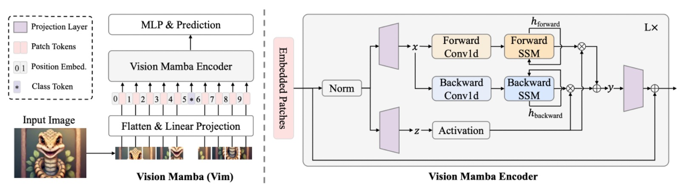
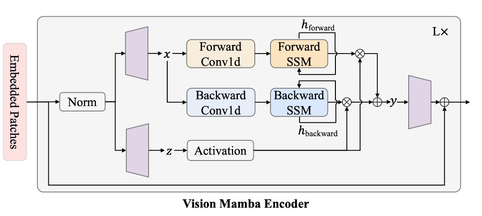
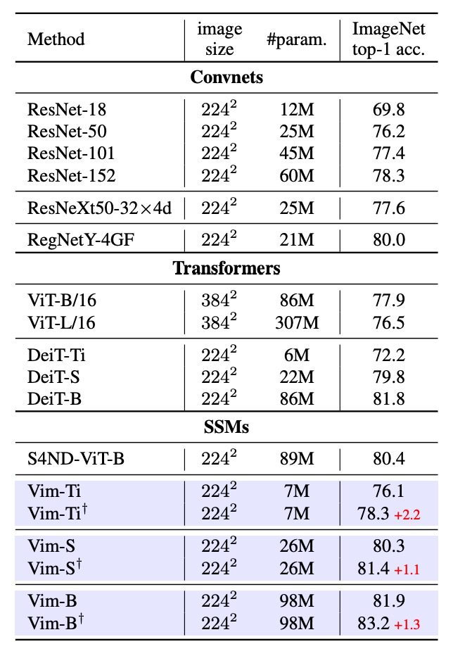
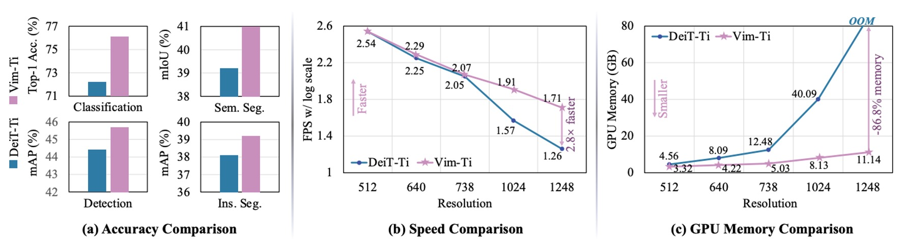
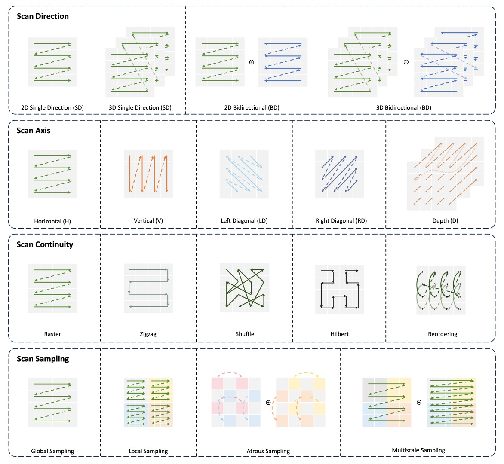

## The Mamba's Eye

[**Vision Mamba: Efficient Visual Representation Learning with Bidirectional State Space Model**](https://arxiv.org/abs/2401.09417)

---

Remember when Transformer first appeared in the NLP field, and it took the CV field three years to produce ViT?

Now, Mamba has appeared in the NLP field, and with the prior experience, the CV field only took a month to develop Vim.

One can only say that the researchers in this field are truly hardworking and diligent.

## Defining the Problem

Mamba excels in long-sequence NLP tasks, with much lower resource consumption compared to Transformer.

For a moment, it seems like all researchers' attention is on Mamba, and everyone is wondering whether Mamba has the potential to become the foundation for the next-generation LLM, replacing Transformer at the top of the field.

Whether Mamba is the successor to Transformer may be debated in academia for a few more years, but the CV field isn't going to wait that long. The authors of this paper directly swapped the Transformer architecture inside ViT for Mamba to see what effect it would have.

:::tip
This requires quite a bit of background knowledge. You need to understand the basic concepts of Transformer, ViT, and the Mamba architecture. If you haven’t read the related papers, you can check out a few of our previous articles:

- [**[17.06] Transformer: The Beginning of a New World**](../../transformers/1706-transformer/index.md)
- [**[20.10] ViT: The Pioneer of a New World**](../../vision-transformers/2010-vit/index.md)
- [**[23.12] Mamba: Who is the Heir?**](../2312-mamba/index.md)

If you're too lazy to read, at the very least... you should understand what Mamba is, or you won't be able to follow this paper.
:::

## Solving the Problem

### Model Architecture

<figure style={{"width": "90%"}}>

</figure>

We believe you already possess the necessary knowledge from previous research, so let’s directly look at the architecture of Vim.

The model architecture shown in the image follows the design style of ViT. Since Mamba is also a sequence model, the image input is first converted into sequence data. The method of flattening the image into sequences here, like ViT, involves dividing the image into patches of size $P \times P$, and then unfolding them into vectors.

If the entire image is divided into $J$ patches, the result is:

$$
x_p \in \mathbb{R}^{J \times (P^2 \cdot C)}.
$$

Then, using a linear projection matrix $W \in \mathbb{R}^{(P^2\cdot C) \times D}$, each patch is projected to a dimension $D$. Continuing the approach from ViT, a **CLS token** is added at the beginning of the sequence to aggregate the information of the entire sequence for image classification.

Additionally, a learnable positional encoding $E_{\text{pos}} \in \mathbb{R}^{(J+1) \times D}$ is added to the sequence $\{\,t_{\text{cls}},\; x_1 W,\; x_2 W, \dots\}$:

$$
T_0 = [\,t_{\text{cls}};\;t_{1}^{p}W;\; \dots;\; t_{J}^{p}W\,] \;+\; E_{\text{pos}}.
$$

Finally, $L$ Vim blocks are stacked, each block mapping the output token sequence $T^{l-1}$ of the previous layer into $T^l$, and the **class token** from the $L$-th layer output is taken for the final classification:

$$
T^l = \mathrm{Vim}(T^{l-1}) + T^{l-1},
\quad
\hat{p} = \mathrm{MLP}(\mathrm{Norm}(T_L^0)).
$$

At this point, it is essentially the same as ViT, with the main difference being in the design of the Vim block. Let's continue to explore further.

### Vision Mamba Block

<figure style={{"width": "90%"}}>

</figure>

Mamba is a strict sequential model, unlike Transformers which can see all the data at once. The Mamba architecture must process the input sequence one by one. This concept is similar to earlier LSTM models and is a key feature of Mamba.

However, for images that "require spatial awareness," processing the sequence from start to finish is clearly not the best approach. Image sequences not only need "left-to-right" information, but also often require "right-to-left" or broader contextual understanding. Therefore, the authors introduce the concept of bidirectional sequence modeling.

After inputting the image sequence, the model must simultaneously perform "forward" and "backward" SSM operations, then merge them at the output, conceptually similar to "bidirectional RNN" in natural language processing.

Following the architecture diagram above, let's briefly describe the computation process:

- **Normalization**: The input $T^{l-1}$ is normalized, and the output is denoted as $\widetilde{T}$.
- **Linear Projection**: $\widetilde{T}$ is projected into $x, z$, with dimensionality $E$.
- **1-D Convolution**: A "forward" and "backward" 1-D convolution is applied to $x$ to obtain $x'_o$.
- **Parameterizing through SSM**: $x'_o$ is mapped to $(A_o, B_o, C_o, \Delta_o)$, and discretized to obtain corresponding $A, B$.
- **Forward/Backward SSM**: Each direction gives $y_{\text{forward}}, y_{\text{backward}}$.
- **Gated Integration**: Using $z$ to weight $y_{\text{forward}}$ and $y_{\text{backward}}$, the final output is $T^l$.

In mathematical form, assume the sequence length in the forward direction is $M$, then for $t=1,2,\dots,M$:

$$
h_{t+1} = A_t \, h_t + B_t \, x'_t,
\quad
y_t = C_t \, h_t,
$$

The backward direction recursively processes from $t=M$ to $t=1$.

Finally, $z$ is used for element-wise addition or gating combination, such as:

$$
T^l = z \odot (y_{\text{forward}} + y_{\text{backward}}).
$$

:::tip
This is similar to the $Q, K, V$ in attention mechanisms. In the above mathematical expression, the branch of $x$ takes on the roles of $Q$ and $K$, using SSM to replace the attention map computation, while $z$ plays the role of $V$, weighting $y_{\text{forward}}$ and $y_{\text{backward}}$ to obtain the final output.

Compared to Transformer’s self-attention, the SSM in Vim grows linearly with sequence length, whereas self-attention grows quadratically.

The author provides a theoretical complexity comparison:

$$
\Omega(\text{self-attention}) = 4MD^2 + 2M^2D
$$

$$
\Omega(\text{SSM}) = 3M(2D)N + M(2D)N
$$

As seen, self-attention exhibits quadratic growth with respect to $M$, while SSM grows linearly with $M$ (with $N=16$ as a small constant). Therefore, when $M$ becomes large (i.e., the number of patches in high-resolution images), Vim's advantages are clear, making it much easier to scale to ultra-high-resolution image applications.

Basically, you can see how Mamba solves the computational efficiency problem, and Vim just follows the same approach!
:::

### Parameter Settings

The hyperparameter design of the Vim architecture is as follows:

- **$L$**: The number of stacked Vim blocks.
- **$D$**: The hidden dimension of the input tokens.
- **$E$**: The expansion dimension, typically set to 2 or 4 times $D$.
- **$N$**: The state dimension of the SSM, default set to 16.

When compared with architectures like DeiT-Tiny, DeiT-Small, the corresponding hyperparameter settings are:

- Tiny-size: $D=192, E=384, N=16, L=24$.
- Small-size: $D=384, E=768, N=16, L=24$.
- Patch projection size is 16×16, non-overlapping, directly flattened and input to Vim blocks.

The overall architecture does not require additional convolution branches or attention mechanisms to "purely" model images as sequences.

## Discussion

### Performance in Image Classification

<figure style={{"width": "70%"}}>

</figure>

First, Vim was tested on ImageNet-1K for classification, using the same training configuration as ViT, with the AdamW optimizer and a cosine schedule learning rate strategy, executed on 8 A800 GPUs. To fully leverage Vim's advantage with long sequences, the authors performed an additional 30 epochs of fine-tuning after pretraining to extract more detailed visual features.

The experimental results, shown in the table above, compare Vim with ConvNet methods like ResNet50, ViT, and Transformer. Vim achieved better Top-1 accuracy with the same number of parameters, indicating that Vim's strength in sequence modeling leads to better classification performance.

Next, comparing with ViT, Vim achieved higher accuracy with the same dimensions and fewer parameters. This demonstrates the efficiency and performance advantage brought by the SSM-based construction. When compared with DeiT, Vim outperformed or matched DeiT in accuracy across different scales (Tiny, Small, Base) with similar parameter counts:

- Vim-Tiny is 3.9 percentage points higher than DeiT-Tiny.
- Vim-Small is 0.5 percentage points higher than DeiT-Small.
- Vim-Base is 0.1 percentage points higher than DeiT-Base.

This shows that even with the highly optimized DeiT in the Transformer domain, Vim performs slightly better in terms of accuracy.

Finally, after long-sequence fine-tuning (denoted by `†`), the accuracy of Vim-Tiny, Vim-Small, and Vim-Base was further improved, demonstrating that fine-tuning with long sequences can yield better performance while maintaining smaller parameter counts.

### Performance Comparison at High Resolution

<figure style={{"width": "90%"}}>

</figure>

The authors compared the FPS (inference speed) and GPU memory usage of Vim-Tiny and DeiT at different image resolutions. The results are shown in the figure above:

- At 512×512 resolution: Vim and DeiT perform similarly in terms of FPS and memory usage.
- At 1248×1248 resolution:
  - Vim's inference speed is 2.8 times faster than DeiT.
  - GPU memory usage is only 13.2% of DeiT's (saving 86.8%).

The main reason for this is that self-attention mechanisms grow quadratically with sequence length $M$, whereas Vim's SSM module grows linearly. When $M$ is large, the speed and memory advantages of Vim become more pronounced.

### Performance in Image Segmentation

<figure style={{"width": "70%"}}>

</figure>

After testing image classification, the authors evaluated the performance of Vim in image segmentation. They conducted experiments on the ADE20K dataset, using UperNet as the base segmentation framework, showing Vim's superiority over self-attention-based backbone networks.

The experimental results, shown in the table above, demonstrate that Vim outperforms DeiT in mIoU at different scales. For example, Vim-Tiny is 1.8 mIoU higher than DeiT-Tiny, and Vim-Small is 0.9 mIoU higher than DeiT-Small. This indicates that Vim has stronger representational power for semantic understanding of the entire image.

When compared with ResNet-101, Vim-Small achieved mIoU results comparable to ResNet-101 but with approximately half the number of parameters. This shows that pure sequence modeling (SSM-based) can also deliver efficient and precise results in semantic segmentation.

### Performance in Object Detection

<figure style={{"width": "70%"}}>

</figure>

The authors conducted object detection experiments on the COCO 2017 dataset, using ViTDet as the base framework.

The experimental results, shown in the table above, reveal that Vim-Tiny outperforms DeiT-Tiny by 1.3 percentage points in both box AP and mask AP. This indicates that Vim has stronger capability in capturing long-range/broad contextual information.

When further divided into different object scales, Vim's box AP and mask AP for medium-size objects are 1.6 and 1.3 higher, respectively, while for large-size objects, Vim outperforms by 1.4 and 1.8. These scores demonstrate Vim's strength in capturing long-range context.

Through object detection and instance segmentation experiments on COCO, the authors confirmed that the Vim architecture is highly scalable for high-resolution inputs, achieving excellent results without relying on spatial priors like 2D windows, validating Vim's representational power and computational efficiency with high-resolution images.

### Ablation Experiment - Bidirectional Design

The authors tested 5 "bidirectional" strategies to understand their impact on ImageNet classification and ADE20K segmentation. For segmentation, **Segmenter** head was used with only two layers to test the transferability of backbone outputs.

1. **None**: Directly using the original Mamba's unidirectional block, only performing forward direction. For image sequences, this approach may perform well for classification, but it likely sacrifices the capture of "spatial positioning" or "contextual information," affecting downstream segmentation.
2. **Bidirectional Sequence**: During training, the visible sequence is randomly flipped in direction. This essentially acts as data augmentation, not providing bidirectional processing in the model structure.
3. **Bidirectional Block**: Every two blocks are paired: the first block handles forward, and the second handles backward. In other words, in the model stack, odd layers are forward, even layers are backward, but there is no simultaneous forward and backward processing within the same layer.
4. **Bidirectional SSM**: In each block, besides the original forward SSM, an additional backward SSM is added, allowing each block to compute the sequence in both directions simultaneously.
5. **Bidirectional SSM + Conv1d**: Building on the Bidirectional SSM, an additional **backward Conv1d** module is added, applying a 1D convolution before the backward SSM.

The experimental results are shown in the table below:

<figure style={{"width": "70%"}}>

</figure>

- **None (Unidirectional Mamba)**

  - **Classification**: Good Top-1 accuracy performance.
  - **Semantic Segmentation**: Due to the lack of bidirectional spatial information, segmentation performance is relatively poor.

- **Bidirectional Block**

  - **Classification**: Top-1 accuracy decreased by 7 percentage points, indicating that stacking forward/backward in separate blocks does not work well for classification learning.
  - **Semantic Segmentation**: mIoU increased by 1.3 compared to Unidirectional, showing that even this "segmented" bidirectional strategy helps augment global context information.

- **Bidirectional SSM + Conv1d (Full Bidirectional Strategy)**

  - This configuration achieved the best balance for both **ImageNet** classification and **ADE20K** segmentation tasks:
    - Classification: 73.9 Top-1 accuracy (compared to 73.2 for Bidirectional SSM).
    - Segmentation: 35.9 mIoU (compared to 32.3 mIoU).
  - It can be seen that integrating forward/backward in the same layer while adding a 1D convolution before the backward SSM helps maintain classification ability while significantly improving dense predictions.
  - This configuration ultimately became the design approach for the **Vim block**.

### Ablation Experiment - Classification Strategies

The authors wanted to test whether using different "classification strategies" under the **SSM-based** backbone would affect the final ImageNet results. They proposed 5 strategies for comparison:

1. **Mean pool**: Perform average pooling on all the last-layer outputs (tokens) before classification. No class token is used.
2. **Max pool**: Perform max pooling on all sequence tokens. Similarly, no class token is used, and each token has a "local" classification head, with max pooling deciding the final prediction.
3. **Head class token**: Mimic DeiT by adding a class token at the beginning of the sequence, using this token for final classification.
4. **Double class token**: Place a class token at both the "start" and "end" of the sequence and combine them for classification, intending to capture both "beginning" and "ending" information.
5. **Middle class token**: Insert a class token in the "middle" of the sequence, using this token for final classification. The authors believe this design takes full advantage of the recursive nature of SSM and the prior knowledge that the main object is typically centered in ImageNet images.

The experimental results are shown in the table below:

<figure style={{"width": "70%"}}>

</figure>

The results show that the **Middle class token** provides the best Top-1 accuracy, achieving **76.1**.

This indicates that in SSM-based models, placing the class token in the middle of the sequence better utilizes the model's forward and backward information flow, and it aligns with the common object distribution in ImageNet images.

:::tip
In most cases, the main object is located in the center of the image.
:::

## Conclusion

In this study, the authors introduced Vision Mamba (Vim), aiming to extend the latest and most efficient Mamba into a general-purpose vision backbone network.

Vim does not rely on self-attention and achieves sufficient global context through bidirectional SSM. It maintains reasonable computational and memory consumption even when dealing with longer sequences or higher-resolution images, and performs excellently on multiple standard vision tasks.

The most impressive concept from this paper is undoubtedly the "bidirectional sequence modeling."

Consider this: since images are a 2-D data structure, how can we only look at them "left to right" or "right to left"? Can we look directly? Can we look diagonally?

We can explore various ways to "look":

<figure style={{"width": "90%"}}>

</figure>

Additionally, concepts like MAE and CLIP could be applied here. MAE uses "masked image modeling," and CLIP-style multimodal pretraining might further enhance Vim's performance.

It seems there's a ton of papers waiting for us to read next!
