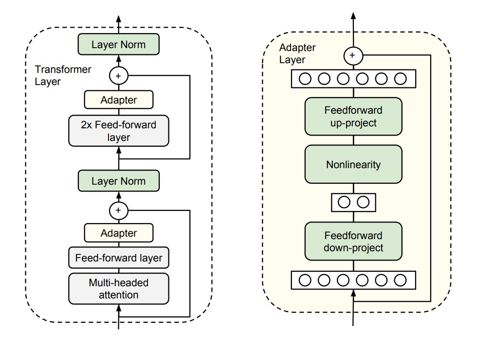
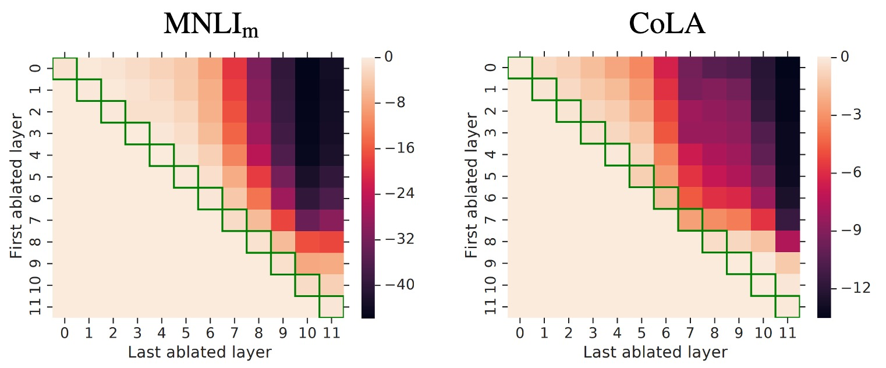

## Saving 96% of Parameters

[**Parameter-Efficient Transfer Learning for NLP**](https://arxiv.org/abs/1902.00751)

---

After BERT was introduced, it set the standard for the learning paradigm in NLP:

- **We must first train a "large" model with "massive" data, and then fine-tune it.**

By following this paradigm, you can achieve the best performance on various NLP tasks.

## Defining the Problem

The authors of this paper identify an obvious issue with this approach:

### Wastefulness

Recall that for target tasks, we need to fine-tune the entire pretrained model, even if only a small part of it needs adjustment.

- So, if we want to solve ten different tasks, we must train ten different models?
- Even if these tasks share many commonalities.

With so many shared aspects, why do we waste so many resources?

## Solving the Problem

Here, we don't need much—just a small "Adapter" for each task.

The authors introduce small yet efficient Adapter modules into the existing Transformer architecture. These Adapters aim to enhance the model's performance without adding too many additional parameters.

Refer to the image above. Specifically, the authors add two Adapter modules to each layer of the Transformer:

- **The first is added after the Self-Attention mechanism and before LayerNorm.**
- **The second is added after the Feed-Forward layer and before LayerNorm.**

Each Adapter module functions like a small neural network. It first compresses the original high-dimensional features into lower dimensions, applies a non-linear transformation, and then projects them back to the original high dimensions.

This design, similar to the "bottleneck" architecture seen in lightweight models like MobileNet or SqueezeNet, has two main benefits:

- **Parameter Efficiency:** This design only requires about 0.5% to 8% of the parameters of the original model.
- **Feature Compression:** By compressing features, it enhances the representational power of the features.

Additionally, to ensure each Adapter module operates smoothly, the authors introduce a "skip connection" within each Adapter. This way, if the Adapter module's parameters are initialized close to zero, they act like identity functions and do not affect the original output, ensuring stability.

During model training, we only need to update the parameters of the "Adapter modules," freezing all other parameters.

## Discussion

### GLUE Evaluation

The authors conducted experiments on the GLUE validation set.

The results show that this Adapter module design can improve model performance without significantly increasing parameters.

The table above shows two types of experimental designs:

- **First Set of Experiments (8-256):** This design uses different Adapter modules for different tasks, with the feature dimensions (number of units in the bottleneck) being one of "8, 64, 256."
- **Second Set of Experiments (64):** This design uses the same Adapter module for all tasks, with the feature dimension set to 64.

Due to training instability, the authors re-ran each setting 5 times with different random seeds and selected the best model on the validation set.

From the table, the average GLUE score for the Adapter setup is 80.0, while "full fine-tuning" averages 80.4. Although the Adapter's performance is slightly inferior to "full fine-tuning," the Adapter only uses 3.6% of the parameters, which is an impressive efficiency gain.

:::tip
From now on, we can fine-tune large models with small GPUs! Great!
:::

### Ablation Study

To test the effectiveness of the Adapter modules, the authors conducted a series of ablation experiments.

This heatmap shows the performance change when removing Adapters from consecutive layers.

:::tip
The heatmap may seem complex at first glance, but let's walk through it:

- **Look at Row 0**:
  - Here, the "First ablated layer" is 0, meaning the Adapter is removed from the 0th layer.
- **Next, look at Row 0 and Column 0**:
  - The "Last ablated layer" is also 0, meaning only the 0th layer Adapter is removed.
- **Next, look at Row 0 and Column 1**:
  - The "Last ablated layer" is 1, meaning Adapters from layers 0 to 1 are removed.
- **Next, look at Row 0 and Column 11**:
  - The "Last ablated layer" is 11, meaning Adapters from layers 0 to 11 are removed.
- **Next, look at Row 5 and Column 8**:
  - The "First ablated layer" is 5, and the "Last ablated layer" is 8, meaning Adapters from layers 5 to 8 are removed.

Now you should understand: this heatmap shows the performance impact of removing Adapters from different layers. Each cell's color represents the performance change, with darker colors indicating worse performance.

Focus on the upper triangle of the heatmap; the lower triangle is irrelevant.
:::

The experimental results reveal several findings:

1. **Impact of Removing Layers**:

   - Removing a single Adapter layer has little impact on overall performance, with a maximum drop of only 2%.
   - However, removing all Adapters drastically reduces performance, dropping to 37% on MNLI and 69% on CoLA.

2. **Impact of High and Low Layers**:

   - Removing lower layer Adapters (e.g., layers 0-4) has minimal impact on performance.
   - Higher layer Adapters significantly impact performance, aligning with the intuition that higher layers construct task-specific features.

3. **Initialization Scale**:

   - Adapter performance remains robust with initialization standard deviations below 0.01.
   - Performance degrades with higher standard deviations, especially on the CoLA dataset.

4. **Bottleneck Feature Size**: Performance remains stable across feature sizes of 8, 64, and 256.

5. **Architecture Variations**: Adding BatchNorm or LayerNorm, increasing Adapter layers, changing activation functions (e.g., tanh), or inserting Adapters only in the attention layer did not significantly improve performance.

Therefore, the authors recommend the original Adapter design for its simplicity and effectiveness.

## Conclusion

The Adapter module design functions like small yet efficient plugins within the model, requiring only a fraction of the parameters—about 0.5% to 8%—to adapt the model to target tasks. For instance, a 30B parameter model would need only 0.15 to 2.4B parameters to achieve the same performance.

This development allows individuals without substantial computing resources to fine-tune large Transformer models easily, which is excellent news from every perspective!
