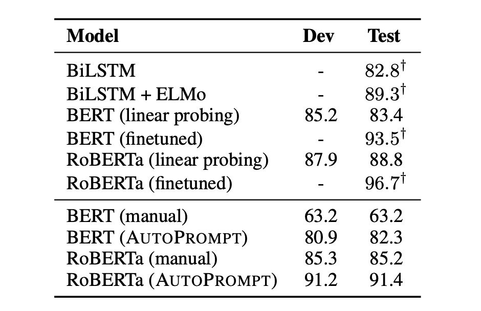

## Model Language

[**AutoPrompt: Eliciting Knowledge from Language Models with Automatically Generated Prompts**](https://arxiv.org/abs/2010.15980)

---

As language models grow larger and more complex, training or fine-tuning them becomes beyond the reach of most people. Consequently, prompt engineering, a new research direction, has emerged: how to design effective prompts that enable large language models to answer specific questions.

But writing prompts is a hassle!

## Problem Definition

### Manually Crafting Prompts is Time-Consuming and Tedious

Every time you create a prompt for a new task, it's like playing a puzzle game that requires repeated trial and error, consuming a lot of time.

Crafting these prompts is not straightforward; you need to deeply understand the model and the task to write effective prompts, which isn't intuitive for most people.

### The Model is Highly Sensitive to Inputs

Models have stringent requirements for prompts; even slight changes can significantly degrade their performance.

A small mistake while writing a prompt can lead to disastrous results.

### Lack of Expertise

Manually writing prompts is not only tiring but also requires specialized knowledge. Without expertise, you might not ask the core questions, and the model can only respond with superficial answers.

### New Model, New Prompts

After facing the previous challenges, you spend months perfecting prompts that fully leverage the model's potential.

But then the model gets upgraded!

And you have to start all over again.

## Solution

### Model Architecture Design

To address these issues, the paper proposes a new method: AutoPrompt.

The concept is very simple: since I don't know what kind of prompts are effective for the model, let the model generate the prompts itself.

The entire architecture is clearly illustrated in the figure above:

1. **Original Input**: This is the original input $X$.
2. **\[MASK\]**: This is the original output $Y$.

In this case, the task is sentiment analysis, so $Y$ is a sentiment label, either positive or negative.

The part in the middle, \[T\], is the focus of AutoPrompt: the range for automatically generating prompts.

This means that the model receives the original input and output, and it must find the prompts itself to improve performance.

### Gradient-Based Prompt Search

The authors designed different prompt generation strategies for different tasks to improve the model's performance.

In this part, AutoPrompt uses a gradient-based search strategy to automatically generate prompts.

The aforementioned automatic prompts part is initialized with \[MASK\] and iteratively updated to find the top-k token candidates.

Therefore, this method doesn't alter the target language model; it uses feedback from the language model to find the optimal prompt words through gradient updates.

## Discussion

### Sentiment Analysis Experiment

Research results show:

1. Prompts generated by AutoPrompt demonstrate that BERT and RoBERTa have a deep understanding of sentiment analysis.
2. Without any fine-tuning, BERT's performance is comparable to a supervised BiLSTM.
3. RoBERTa's accuracy is on par with fine-tuned BERT and ELMo models.

Additionally, the authors observed that automatically constructed prompts are more effective than manually created ones, and these prompts are challenging to construct using human intuition:

- Automatic prompts can improve accuracy by 20% compared to manual prompts.
- For RoBERTa, the best template is **“\{sentence\} atmosphere alot dialogue Clone totally \[P\]。”**.

### Fact Retrieval

The authors also conducted experiments on the fact retrieval task. This study used the LAMA and LPAQA datasets to explore whether pretrained MLMs (such as BERT and RoBERTa) can accurately recognize and understand real-world facts. In this task, the authors used the template "\{sub\}\[T\]...\[T\]\[P\]" to map triples, where trigger tokens are specific tokens related to relationships, and the correct object serves as the label token.

- **Data Collection and Processing**

  - Collected up to 1,000 facts from the T-REx dataset and Wikidata to train AutoPrompt.
  - Ensured no overlap between training and testing data, and split the data 80-20 for training and development sets.

- **Performance Evaluation**

  - Used standard ranking metrics such as Mean Reciprocal Rank (MRR), Precision at 1 (P@1), and Precision at 10 (P@10) to evaluate the model.
  - AutoPrompt showed more effective performance in fact retrieval compared to previous methods, especially with the use of 7 trigger tokens.

- **Comparison of BERT and RoBERTa**:

  - Directly compared the performance of BERT and RoBERTa under the same test conditions. Found that BERT slightly outperformed in some cases, especially in prompt generation, where RoBERTa generated more irrelevant words.

This study demonstrates that the AutoPrompt method can more effectively extract factual knowledge from MLMs.

Surprisingly, RoBERTa's performance was not better than BERT's, warranting further investigation in future work.

:::tip
When evaluating language models using prompt methods, a model's relatively low performance does not necessarily indicate a lower understanding of the relevant knowledge. The model's performance should be understood in the broader context of evaluation and not solely based on single test results.

Prompt methods measure how language models handle specific fact retrieval tasks. However, this approach may not fully capture all model capabilities. For instance, if the prompts are suboptimal or do not match the data distribution used during model training, it may lead to poor performance. Moreover, some models may excel in certain types of questions but perform averagely in others, which does not imply the model lacks the relevant knowledge or abilities.

Language models are typically trained on large datasets covering a wide range of language structures and information. Thus, a model might have acquired significant implicit knowledge that is not immediately apparent. When evaluation tasks do not adequately correspond to the model's training experience, evaluation methods or specific test designs may fail to trigger or display these implicit knowledge capabilities.
:::

## Conclusion

As mentioned by the authors:

- For RoBERTa, the best template is **“\{sentence\} atmosphere alot dialogue Clone totally \[P\]。”**.

While language models are trained using human linguistic knowledge, they might have derived more "model-specific" language from the training data, which only the models can understand.

This "model language" arises because deep neural networks can abstract complex language features from data, encompassing deep semantic and contextual patterns of language.

Therefore, when the model uses seemingly unordered phrases to express its internal state, it is actually processing and encoding information in its unique way.

This phenomenon is quite interesting and opens up numerous lines of thought:

1. Is human language too inefficient?
2. Should the differences between model language and human language be eliminated? Is it even possible?
3. We often criticize models for their lack of transparency, but does the existence of "model language" make them even harder to interpret?
4. Do different models have similarities in their "model languages"? After all, they are all learned from human language?

Let's continue to explore subsequent research to see if there are more answers to these questions.
