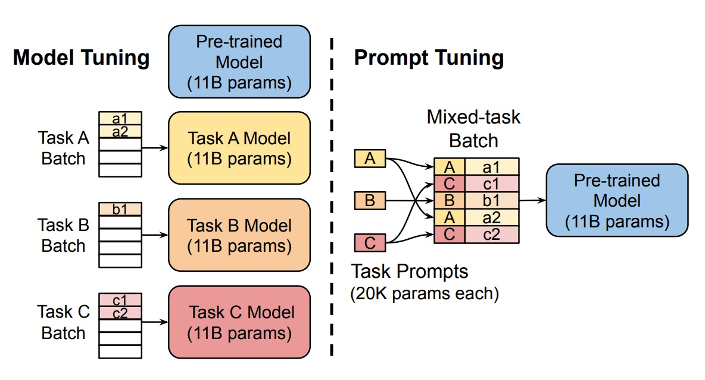

## A soft reminder

[**The Power of Scale for Parameter-Efficient Prompt Tuning**](https://arxiv.org/abs/2104.08691)

---

We just finished reviewing **Prefix-Tuning** not long ago, and now let's take a look at another new method: **Prompt Tuning**.

:::tip
If you haven't read about Prefix-Tuning yet, consider checking out the paper we reviewed earlier:

- [**[21.01] Prefix-Tuning: Is it the Same or Different?**](../2101-prefix-tuning/index.md)
  :::

## Problem Definition

The authors begin the paper by revisiting the framework of T5 to help readers understand the challenges currently faced in fine-tuning models.

:::tip
If you're unfamiliar with T5, you can refer to the following paper:

- [**[19.10] Exploring the Limits of Transfer Learning with a Unified Text-to-Text Transformer**](https://arxiv.org/abs/1910.10683)
  :::

T5 treats all tasks as text generation problems. Whether it is translation, summarization, or classification, tasks can be represented as generating output text from input text.

Traditional classification models use the probability $\text{Pr}(y|X)$ to map an input $X$ to an output class $y$. However, in the T5 framework, the focus is on a **conditional generation** problem, where the objective is to compute:

$$
\text{Pr}_\theta(Y | X)
$$

where:

- $Y$ is **text** representing a class, such as "positive" or "negative," rather than categorical labels like 0, 1, or 2.
- $\theta$ are the parameters of the Transformer model.

This approach enables the model to generate richer textual outputs rather than just a single class label.

**Prompting** involves adding a piece of text before the input $X$ to guide the model in generating the correct output $Y$. Prompts provide the model with task context or instructions, helping it understand how to handle the input.

For example, in a sentiment analysis task, a prompt might look like this:

```
"Please determine the sentiment of the following sentence:"
```

The user’s input sentence is appended to the prompt, forming the final input for the model:

```
"Please determine the sentiment of the following sentence: I love this movie!"
```

However, this traditional prompting approach comes with several challenges: it requires high manual effort, is unstable in performance, and is non-differentiable. The non-differentiability issue means that the prompt's parameters cannot be updated using backpropagation, preventing the model from automatically learning the optimal prompts.

---

To address this issue, previous research—**Prefix-Tuning**—proposed adding a special sequence of tokens called a **Prefix** to the model's input. This prefix influences the model at every layer, ensuring it is guided throughout the entire generation process.

But can we simplify this further? What if we only guide the model at the input layer?

Enter the paper: **Prompt Tuning**.

:::tip
The "guidance" discussed here differs from what we often hear as "Prompt Engineering." Prompt Engineering involves using natural language prompts to guide the model without modifying its input features, parameters, or architecture.

In contrast, **Prompt Tuning** involves adding a trainable token at the model's input layer. This token can be updated during training, allowing the model to learn the most effective guiding strategy on its own.
:::

## Solving the Problem

### Prompt Tuning

<div align="center">
<figure style={{"width": "80%"}}>

</figure>
</div>

The authors proposed the **Prompt Tuning** method, introducing trainable prompt embedding parameters $\theta_P$. These parameters are no longer constrained by the model's word embedding table and can be automatically learned from the training data.

The new conditional generation formula becomes:

$$
\text{Pr}_{\theta; \theta_P}(Y | [P; X])
$$

where:

- $[P; X]$ represents the concatenation of the prompt $P$ and the input $X$.
- $\theta$ are the frozen model parameters.
- $\theta_P$ are the trainable prompt parameters.

During training, only the prompt parameters $\theta_P$ are updated using the backpropagation algorithm, while the main model parameters $\theta$ remain unchanged.

The implementation can generally be divided into the following steps:

1. **Input Embedding**: Embed the $n$ input tokens into a matrix $X_e \in \mathbb{R}^{n \times e}$, where $e$ is the embedding dimension.
2. **Prompt Embedding**: Embed the prompt tokens into a matrix $P_e \in \mathbb{R}^{p \times e}$, where $p$ is the length of the prompt.
3. **Concatenation**: Concatenate the prompt embeddings and input embeddings into:
   $$
   [P_e; X_e] \in \mathbb{R}^{(p + n) \times e}
   $$
4. **Model Processing**: Input the concatenated embeddings into the encoder-decoder architecture for computation.

For example, suppose we want the model to determine the sentiment of the sentence "I love this movie!" In traditional methods, the model input would look like this:

```
"Please determine the sentiment of the following sentence: I love this movie!"
```

In contrast, using the Prompt Tuning method, the model input becomes:

```
[Token1] [Token2] [Token3] [Token4] [Token5] I love this movie!
```

Here, each of the tokens (`[Token1]`, `[Token2]`, etc.) is trainable, and the model must learn how to best use these prompts.

:::tip
**Isn't this AutoPrompt?**

If you're familiar with AutoPrompt, you might be asking this question. If not, you can refer to our previous article:

- [**[20.10] AutoPrompt: Model Language**](../2010-autoprompt/index.md)

---

The key difference lies in how prompts are generated:
In **AutoPrompt**, the model selects the most suitable prompts from an existing vocabulary, and the results remain within the vocabulary. In **Prompt Tuning**, the prompt input directly operates in the feature space, without being restricted to the vocabulary.

As a result, with Prompt Tuning, you can only infer which words the prompt resembles by calculating cosine similarity, rather than directly observing the prompt content.
:::

## Discussion


The authors conducted a series of ablation studies to explore key questions surrounding **Prompt Tuning**:

### How long should the prompt be?

As shown in Figure (a), the authors experimented with different prompt lengths (\{1, 5, 20, 100, 150\}) across various model scales (Small, Base, Large, XL, XXL).

The results indicate:

- For most models, increasing the prompt length beyond a single token leads to significant performance improvements.
- For the **T5-XXL model**, even a single-token prompt achieves reasonable performance, suggesting that larger models are less reliant on extensive prompt signals.
- Beyond 20 tokens, performance gains taper off, providing only marginal improvements.

### What is the impact of prompt initialization strategies?

In Figure (b), the authors compared three initialization strategies:

1. **Random Initialization**: Prompt embeddings are initialized with values uniformly sampled from $[-0.5, 0.5]$.
2. **Vocabulary Embedding Initialization**: Embeddings are initialized using T5's **5,000 most frequent vocabulary words**.
3. **Class Label Initialization**: Downstream task labels are converted into embeddings. If a label consists of multiple tokens, the embeddings are averaged. For prompts longer than the number of classes, remaining tokens are filled with vocabulary embeddings.

The findings show:

- **Class Label Initialization** consistently performs the best across all model scales, with particularly pronounced differences for smaller models.
- For the **T5-XXL model**, performance is relatively insensitive to the initialization strategy, with stable results regardless of the method used.

### How does the pretraining objective affect Prompt Tuning?

In Figure (c), the authors examined the impact of different pretraining objectives on Prompt Tuning:

1. **Span Corruption**: T5's default span corruption objective during pretraining.
2. **Span Corruption + Sentinel**: Adds sentinel tokens in the target output of downstream tasks to mimic the format used in pretraining.
3. **LM Adaptation**: Continues T5 pretraining with an additional **language modeling (LM) objective** for 100,000 steps.

The results show:

- Models pretrained with **Span Corruption** are poorly suited for frozen-model Prompt Tuning because they expect input and output texts to include sentinel tokens. Even simulating the pretraining format with **Span Corruption + Sentinel** provides limited benefits.
- **LM Adaptation** significantly improves performance across all model scales, highlighting its effectiveness in aligning the model's pretraining objective with downstream Prompt Tuning tasks.

### The Impact of LM Adaptation Duration

As shown in Figure (d), the authors investigated the effect of LM adaptation duration on Prompt Tuning.

The results indicate that extending the number of LM adaptation steps provides additional gains, peaking at around 100,000 steps. Converting Span Corruption pretraining to an LM objective is not a straightforward process and requires significant training resources (approximately 10% of the original T5 pretraining steps).

T5-XXL performs well under various suboptimal configurations, demonstrating its robustness. However, under Span Corruption pretraining, performance is unstable, with smaller models sometimes outperforming Base, Large, and XL models. These issues are not caused by random noise, as consistent low variance was observed across three repeated experiments.

Compared to models trained with Span Corruption, LM-adapted models exhibit stable performance across all scales, significantly reducing the risk of performance instability.

---

### Comparison with Other Methods

<div align="center">
<figure style={{"width": "80%"}}>

</figure>
</div>

The figure compares Prompt Tuning with several related methods. Below are brief descriptions of each method and their corresponding references:

---

- **Prefix Tuning**:

  - [**[21.01] Prefix-Tuning: Optimizing Continuous Prompts for Generation**](https://arxiv.org/abs/2101.00190)

    Prefix Tuning prepends learnable prefixes to every layer of the Transformer, effectively providing fixed activations for each layer. It is designed for GPT-2 and BART, while Prompt Tuning focuses on T5. For BART, Prefix Tuning requires prefixes for both the encoder and decoder, whereas Prompt Tuning only modifies the encoder.

    Prompt Tuning simplifies the process by adding a single prompt token at the input layer, reducing parameter requirements. Additionally, Prompt Tuning allows the Transformer to update intermediate task representations based on input examples, unlike Prefix Tuning, which relies on reparameterization for training stability.

---

- **WARP**:

  - [**[21.01] WARP: Word-level Adversarial ReProgramming**](https://arxiv.org/abs/2101.00121)

    WARP introduces prompt parameters at the input layer, utilizing [MASK] tokens and a learnable output layer to map masked portions to class predictions. However, this method only supports single-output tasks, limiting it to classification problems.

    Prompt Tuning does not require specialized input design or task-specific output layers, making it applicable to a broader range of tasks with performance closer to full model fine-tuning.

---

- **P-tuning**:

  - [**[21.03] GPT Understands, Too**](https://arxiv.org/abs/2103.10385)

    P-tuning embeds learnable continuous prompts within the input and arranges them based on human-designed patterns. To achieve strong SuperGLUE performance, P-tuning must combine prompt and model fine-tuning, requiring updates to both the prompt and main model parameters.

    Prompt Tuning updates only the prompt parameters, keeping the main language model frozen and avoiding the cost of full model fine-tuning.

---

- **Soft Words**:

  - [**[21.04] Learning How to Ask: Querying LMs with Mixtures of Soft Prompts**](https://arxiv.org/abs/2104.06599)

    Soft Words learns prompts based on handcrafted templates and introduces trainable $\Delta_i$ parameters for each layer, increasing parameter requirements with model depth.

    Prompt Tuning does not require additional parameters per layer, making it more parameter-efficient.

---

- **Adapters**:

  - [**[19.02] Parameter-Efficient Transfer Learning for NLP**](https://arxiv.org/abs/1902.00751)

    Adapters insert small bottleneck layers between frozen model layers to reduce task-specific parameters. For BERT-Large, tuning adapter layers adds only 2–4% more parameters while achieving performance close to full model fine-tuning.

    While Adapters modify model behavior by rewriting intermediate activations, Prompt Tuning adjusts input representations, leaving internal computations unchanged.

### What Exactly Do Prompts Capture?

As previously discussed, since Prompt Tuning operates in continuous space rather than a discrete vocabulary space, it is difficult to directly understand how prompts influence model behavior.

The authors addressed this by calculating the **cosine similarity** between each prompt token and the tokens in the model's vocabulary, identifying the most similar words. This reveals the "nearest-neighbor words" for each prompt token, shedding light on the semantic meanings captured by the prompts.

The experimental results showed that the top five nearest-neighbor words for each prompt token often form "semantically cohesive groups." In contrast, when random vectors are used instead of trained prompt tokens, no such semantic grouping is observed.

This indicates that Prompt Tuning is not random but effectively captures the semantic structures inherent in the language model. Additionally, in long prompt sequences, the authors observed that multiple prompt tokens might share the same nearest-neighbor words.

However, this raises two potential issues:

1. **Redundant Capacity**: There may be overlapping or redundant information in the prompts, offering no further performance gains.
2. **Lack of Sequential Structure**: The prompt tokens’ representations fail to precisely reflect positional information within the sequence, making it harder for the model to locate and interpret key information.

Another important observation is that the nearest-neighbor words of prompt tokens frequently include the **class labels** of the downstream task. This suggests that Prompt Tuning can store expected output categories within the model as reference points for generating outputs.

## Conclusion

Prompt Tuning demonstrates performance comparable to traditional model fine-tuning across various experiments, and this performance gap diminishes as model scale increases. In zero-shot transfer tasks, Prompt Tuning shows better generalization capabilities, indicating that freezing the language model’s general understanding parameters while restricting learning to lightweight prompt vectors effectively mitigates overfitting to specific domains.

The authors suggest that future research could focus on separating "task-specific parameters" from "general language modeling parameters." This would better control model behavior and enhance interpretability.

:::tip
Several subsequent studies have continued to explore directions related to Prompt Tuning. We can review some of these papers in the future.
:::
