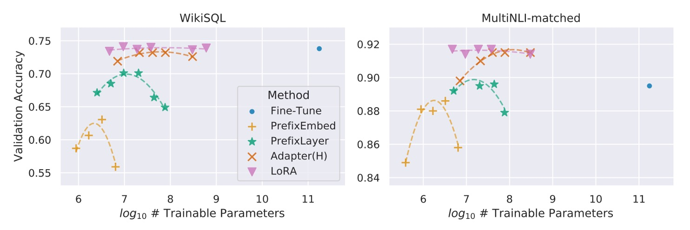
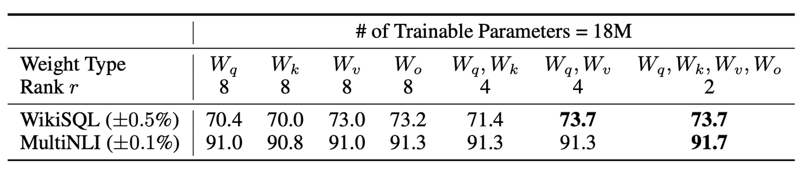
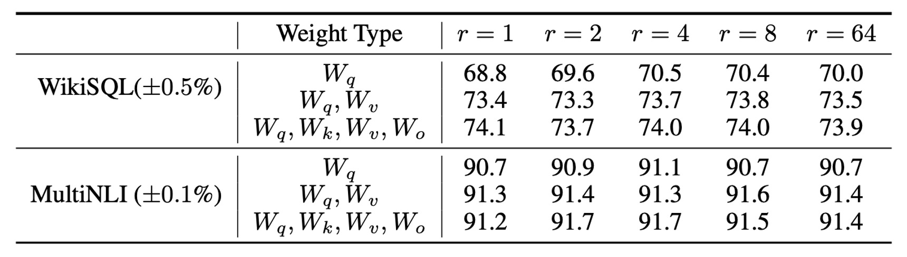

# [21.06] LoRA

## One in Ten Thousand LLM

[**LoRA: Low-Rank Adaptation of Large Language Models**](https://arxiv.org/abs/2106.09685)

---

We must admit that most people cannot afford to train large language models (LLMs).

The world is vast, yet only a handful of companies are capable of iterating on LLMs. Researchers are eager to leverage these massive models to solve a variety of problems, making it crucial to find efficient ways to fine-tune them.

## Defining the Problem

If you aim to fine-tune an entire model, the process would typically involve the following steps:

1. **Initialize the model** with pretrained weights $\Phi_0$.
2. **Update the model** through gradient optimization to $\Phi_0 + \Delta \Phi$, maximizing the conditional language model objective:

   $$
   \max_\Phi \sum_{(x,y) \in Z} \sum_{t=1}^{|y|} \log P_\Phi(y_t | x, y_{<t})
   $$

Each downstream task requires learning a different set of parameters $\Delta \Phi$, with the size of $|\Delta \Phi|$ equal to that of the original model $|\Phi_0|$. For large models like GPT-3, which contains **175 billion parameters**, storing and deploying multiple fine-tuned versions becomes a daunting task.

In previous research, the mainstream approach to address this issue was **Adapters**, which we have previously discussed:

- [**[19.02] Adapter: Reducing Parameters by 96%**](../1902-adapter/index.md)

However, the exploration does not stop there. Here are a few additional studies that are worth a look:

- [**[20.04] Exploring Versatile Generative Language Models with Parameter-Efficient Transfer Learning**](https://arxiv.org/abs/2004.03829)
- [**[20.05] AdapterFusion: Non-Destructive Task Composition for Transfer Learning**](https://arxiv.org/abs/2005.00247)
- [**[21.04] The Power of Scale for Parameter-Efficient Prompt Tuning**](https://arxiv.org/abs/2104.08691)

However, these methods still face certain limitations, particularly in large-scale, latency-sensitive production environments. They increase the parameter count and may interfere with parallel computation during model deployment. For example, adding an Adapter to GPT-2 results in a noticeable increase in latency, as shown in the following table:

<figure style={{"width": "80%"}}>

</figure>

While techniques like layer pruning or multi-task learning can reduce latency, they cannot fully eliminate the computational overhead introduced by Adapters. The design of Adapters inherently introduces bottlenecks, keeping the parameter count below 1% of the original model’s size.

In theory, this should not significantly increase the computational load (measured in FLOPs), right?

Unfortunately, it still does.

This is because large neural networks rely heavily on **parallel hardware** to maintain low latency. However, Adapters require sequential processing, which can lead to significant delays during **online inference**, where batch sizes are typically set to 1.

What About Prefix-Tuning?

Another potential solution is **Prefix-Tuning**:

- [**[21.01] Prefix-Tuning: Optimizing Continuous Prompts for Generation**](https://arxiv.org/abs/2101.00190)

Prefix-Tuning represents a different strategy for adaptation. However, it has some issues: parameter performance tends to fluctuate non-monotonically during optimization, making the process challenging. Additionally, Prefix-Tuning reserves part of the input sequence length for the prefix, which reduces the available length for downstream tasks.

This makes things even worse.

To address these challenges, the authors propose **low-rank decomposition of parameters**. Task-specific parameter updates $\Delta \Phi$ are encoded as a much smaller parameter set $\Theta$, such that:

$$
|\Theta| \ll |\Phi_0|
$$

The optimization objective is redefined to focus on this smaller set $\Theta$:

$$
\max_\Theta \sum_{(x,y) \in Z} \sum_{t=1}^{|y|} \log P_{\Phi_0 + \Delta \Phi(\Theta)}(y_t | x, y_{<t})
$$

:::tip
The mathematical description from the original paper suggests the goal is to find a parameter set that is approximately **one ten-thousandth the size** of the original model's parameters. This smaller set will represent the model's parameters, and fine-tuning will be performed on this set.

However, finding such a parameter set is not straightforward, and this paper outlines the approach to do so effectively.
:::

## Solving the Problem

Before diving into the methodology, let’s first review some high-school math concepts.

### Rank, Full Rank, and Low Rank

In mathematics, a **matrix** is a table of numbers arranged in rows and columns. For example:

$$
\mathbf{A} = \begin{bmatrix}
1 & 2 & 3 \\
4 & 5 & 6 \\
7 & 8 & 9
\end{bmatrix}
$$

Matrices play a crucial role in data processing and computation, and one of the key concepts associated with matrices is **rank**.

---

1. **What is Rank?**

   Rank refers to the number of **independent rows or columns** in a matrix.

   Independence means that a row (or column) cannot be represented as a linear combination of other rows (or columns). If some rows or columns can be expressed as combinations of others, they are not independent. In other words, the rank of a matrix tells us how much **useful, independent information** it contains.

   For a matrix $A$ of size $m \times n$ (with $m$ rows and $n$ columns), its rank is the largest number of independent rows or columns. The rank cannot exceed the smaller dimension of the matrix:

   $$
   \text{rank}(A) \leq \min(m, n)
   $$

---

2. **Full-Rank Matrices**

   A matrix is called **full-rank** when its rank equals the smaller of the number of rows or columns:

   $$
   \text{rank}(A) = \min(m, n)
   $$

   This means that all the rows or columns are independent, with **no redundant information**. For example:

   $$
   \mathbf{I} = \begin{bmatrix}
   1 & 0 \\
   0 & 1
   \end{bmatrix}
   $$

   This is a $2 \times 2$ identity matrix, where both rows are independent. The rank of this matrix is 2 (equal to $\min(2, 2)$), making it a **full-rank matrix**. Each row or column provides new information that cannot be expressed using other rows or columns.

---

3. **Low-Rank Matrices**

   A **low-rank matrix** has a rank smaller than its number of rows or columns, meaning that some rows or columns can be expressed as linear combinations of others. While such matrices might be large in size, the amount of **useful information** they contain is relatively small.

   For example:

   $$
   \mathbf{B} = \begin{bmatrix}
   1 & 2 \\
   2 & 4
   \end{bmatrix}
   $$

   Here, the second row is simply the first row multiplied by 2. Therefore, the matrix’s rank is 1 (only one independent row), not 2. This is a **low-rank matrix**. Since the rank is low, we can use a smaller matrix to approximate or describe it.

### Why Are Low-Rank Matrices Useful?

In many applications, we encounter large matrices that contain redundant information. In such cases, we can use **low-rank matrices** to approximate the original matrix and achieve several benefits:

1. **Reduced Computational Cost**: Low-rank matrices require fewer operations, speeding up algorithms.
2. **Lower Storage Requirements**: Less memory is needed, which is ideal for large datasets.
3. **Dimensionality Reduction**: High-dimensional data can be projected onto a lower-dimensional space while retaining essential information (e.g., PCA).
4. **Improved Model Performance**: Low-rank matrices help prevent overfitting, improving model generalization.

A well-known example is **Singular Value Decomposition (SVD)**, which breaks a matrix into smaller components, retaining only the most important information. SVD is widely used in areas like image compression and recommendation systems.

### Low-Rank Decomposition: LoRA

<figure style={{"width": "60%"}}>

</figure>

In neural networks, **dense layers** rely on matrix multiplication, where the weight matrices are typically full-rank. Previous research has shown that pretrained language models exhibit **low intrinsic dimensionality**—they can still maintain good performance even when projected into a smaller subspace.

- [**[20.12] Intrinsic Dimensionality Explains the Effectiveness of Language Model Fine-Tuning**](https://arxiv.org/abs/2012.13255)

Based on this, the authors hypothesize that weight updates during fine-tuning also exhibit **low intrinsic rank**. In other words, for a pretrained weight matrix $W_0 \in \mathbb{R}^{d \times k}$, the update can be expressed as a **low-rank decomposition**:

$$
W_0 + \Delta W = W_0 + BA
$$

where $B \in \mathbb{R}^{d \times r}$ and $A \in \mathbb{R}^{r \times k}$, with $r \ll \min(d, k)$.

During training, the **pretrained weight matrix $W_0$** remains frozen, meaning its gradients are not updated. Only $A$ and $B$ are **trainable parameters**. These matrices are multiplied by the input vector $x$, and the results are summed element-wise:

$$
h = W_0 x + \Delta W x = W_0 x + BA x
$$

Matrix $A$ is initialized with values from a **Gaussian distribution**, while $B$ is initialized with zeros. Thus, at the start of training, $\Delta W = BA$ is zero.

For stability, the update $\Delta W x$ is scaled by:

$$
\frac{\alpha}{r} \cdot \Delta W x
$$

where $\alpha$ is a constant related to $r$. When using the **Adam optimizer**, adjusting $\alpha$ works similarly to tuning the learning rate, simplifying hyperparameter tuning by setting $\alpha = r$.

If the rank $r$ of LoRA matches the rank of the original weight matrix, its performance can be as good as **full-model fine-tuning**. As the number of trainable parameters increases, LoRA's performance gradually approaches that of the original model.

### LoRA on Transformer Models

LoRA can be applied to any neural network weight matrix. In **Transformer architectures**, it primarily targets the **self-attention module** matrices:

- Four key matrices: $W_q$, $W_k$, $W_v$, and $W_o$.
- Each matrix has dimensions $d_{\text{model}} \times d_{\text{model}}$, even though their outputs are often split across multiple attention heads.

In the paper, the authors only fine-tune the **attention weights**, while freezing the **MLP modules** to reduce the parameter count.

This approach provides several benefits:

- **Reduced Memory and Storage Requirements**:

  - For large Transformer models (e.g., GPT-3 with 175B parameters), **VRAM usage** decreases from **1.2TB** to **350GB** (if $r \ll d_{\text{model}}$).
  - If $r = 4$ and only the query and value projection matrices are fine-tuned, the checkpoint size shrinks from 350GB to **35MB** (a **10,000x reduction**).

- **Lower GPU Utilization and Avoiding I/O Bottlenecks**: With smaller storage needs, fewer GPUs are required for training.

- **Faster Task Switching**: Tasks can be switched simply by swapping LoRA weights without reloading the entire model.

- **Faster Training**: LoRA speeds up training on GPT-3 175B by about **25%** since most parameters are not updated.

However, there are some drawbacks. If the matrices $A$ and $B$ are merged back into the original weight matrix $W$ to eliminate inference delays, handling **batch inputs across different tasks** becomes challenging. In latency-insensitive scenarios, one can avoid merging the weights and dynamically select the appropriate LoRA module for each task.

:::tip
This concept is known as **reparameterization**. Essentially, a set of parameters is attached externally to the original model, which can be merged back when needed, though this may introduce some trade-offs.

In cases where inference speed is not critical, it’s better not to merge the weights, allowing the dynamic selection of LoRA modules to handle different batch inputs efficiently.
:::

## Discussion

### Experimental Baselines

The authors conducted experiments on **RoBERTa**, **DeBERTa**, **GPT-2**, and **GPT-3**, using the following baselines:

1. **Fine-Tuning (FT)**

   - **Full-Model Fine-Tuning**: All parameters, initialized from the pretrained weights and biases, are updated during training.
   - **Partial-Layer Fine-Tuning (FTTop2)**: Only the last two layers of GPT-2 are updated (Li & Liang, 2021).
   - **Bias Fine-Tuning (BitFit)**: Only bias vectors are trainable, while all other parameters remain frozen (Zaken et al., 2021).

---

2. **Prefix-Embedding Tuning (PreEmbed)**

   Special tokens are inserted between input tokens, and their embeddings are trainable.

   - **Strategies**:
     - **Prefix**: Special tokens are added before the prompt.
     - **Infix**: Special tokens are added after the prompt.
   - **Parameter Count**:
     $$
     |\Theta| = d_{\text{model}} \times (l_p + l_i)
     $$
     where $l_p$ and $l_i$ are the numbers of prefix and infix tokens, respectively.

---

3. **Prefix-Layer Tuning (PreLayer)**

   Instead of tuning embeddings, the activation values for each Transformer layer are learned.

   - **Parameter Count**:
     $$
     |\Theta| = L \times d_{\text{model}} \times (l_p + l_i)
     $$
     where $L$ is the number of Transformer layers.

---

4. **Adapter Tuning**

   - **AdapterH**: Introduced by Houlsby et al. (2019), Adapters are inserted between the self-attention module and the residual connection.
   - **AdapterL**: Applied only after the MLP module and LayerNorm (Lin et al., 2020).
   - **AdapterP**: Similar to AdapterL (Pfeiffer et al., 2021).
   - **AdapterD**: Some Adapters are removed for efficiency (Rücklé et al., 2020).
   - **Parameter Count**:
     $$
     |\Theta| = \hat{L}_{\text{Adpt}} \times (2 \times d_{\text{model}} \times r + r + d_{\text{model}}) + 2 \times \hat{L}_{\text{LN}} \times d_{\text{model}}
     $$
     where $\hat{L}_{\text{Adpt}}$ is the number of Adapter layers and $\hat{L}_{\text{LN}}$ is the number of trainable LayerNorms.

---

5. **LoRA Tuning**

   LoRA introduces **low-rank matrices** alongside the original weight matrices, which are updated in parallel. In most experiments, LoRA is applied only to the **query matrix $W_q$** and **value matrix $W_v$**.

   - **Parameter Count**:
     $$
     |\Theta| = 2 \times \hat{L}_{\text{LoRA}} \times d_{\text{model}} \times r
     $$
     where $\hat{L}\_{\text{LoRA}}$ is the number of matrices with LoRA applied, and $r$ is the rank.

---

### Comparison with Other Fine-Tuning Methods

The authors evaluated **RoBERTa Base (125M)** and **RoBERTa Large (355M)** models from HuggingFace for their experiments.

:::tip
**What is RoBERTa?**

RoBERTa is an optimized version of BERT, with improved training procedures to enhance performance. We’ve previously covered RoBERTa in:

- [**[19.07] RoBERTa: A Guide to Training BERT**](../../transformers/1907-roberta/index.md)
  :::

To ensure a fair comparison with the Adapter baseline, the following adjustments were made:

1. **Same Batch Size and Sequence Length**: All tasks used the same batch size, with the sequence length set to 128 to match the Adapter baseline.
2. **Model Initialization**: For MRPC, RTE, and STS-B tasks, the models were initialized from pretrained weights, not from MNLI-adapted models (as in other fine-tuning baselines).

The results show that **LoRA** performs similarly to full-model fine-tuning on both **RoBERTa Base** and **RoBERTa Large**. In most cases, LoRA outperforms both **Adapters** and other parameter-efficient tuning methods.

**DeBERTa** is a more advanced variant of BERT with larger training scales and competitive performance on benchmarks like **GLUE** and **SuperGLUE**. The authors also tested LoRA on DeBERTa, with the results (shown in the table above) indicating that LoRA often outperforms **full-model fine-tuning**.

### Fine-Tuning GPT-3

<figure style={{"width": "80%"}}>

</figure>

Finally, the authors applied LoRA to **GPT-3**. As shown in the table, LoRA consistently outperforms **Adapters** and other efficient tuning methods.

However, increasing the number of trainable parameters does not always lead to improved performance, as seen in the following chart:

With **prefix-embedding tuning**, performance drops when using more than **256 special tokens**. Similarly, **prefix-layer tuning** shows degraded performance beyond **32 special tokens**. This decline could be due to the input distribution diverging from the pretrained data distribution when too many special tokens are used.

### Which Weight Matrices Should LoRA Target in Transformers?

Given a limited parameter budget, which weight matrices should be adapted to achieve optimal performance in downstream tasks?

The authors conducted experiments on **GPT-3 (175B)**, setting the number of trainable parameters to **18 million** (approximately **35MB** with FP16 precision). Across all **96 layers**, if LoRA is applied to one type of attention weight, the rank is set to $r = 8$. If two types are adapted, the rank is reduced to $r = 4$.

The results in the table suggest:

- **Adapting only $\Delta W_q$ or $\Delta W_k$** leads to a significant drop in performance.
- **Adapting both $W_q$ and $W_v$** yields the best results.

Even with a small rank $r = 4$, $\Delta W$ can capture sufficient information. This suggests that adapting **more types of weight matrices with a smaller rank** is more effective than adapting only one type with a higher rank.

### What is the Optimal Rank $r$ for LoRA?

LoRA achieves excellent performance even with **very small ranks**, especially when applied to $\{W_q, W_v\}$.

Increasing the rank beyond a certain point does not yield meaningful improvements, indicating that **low-rank adaptation matrices are sufficient** to capture the necessary information.

### Subspace Similarity Analysis

The authors also explored the similarity between subspaces for different values of $r$ and across different random seeds. They performed Singular Value Decomposition (SVD) on these matrices to obtain the right singular matrices:

$$
U_{A_{r=8}} \quad \text{and} \quad U_{A_{r=64}}
$$

Their goal was to determine how much of the subspace formed by the top $i$ singular vectors of $U_{A_{r=8}}$ overlaps with the subspace formed by the top $j$ singular vectors of $U_{A_{r=64}}$.

They measured the similarity using normalized subspace similarity based on Grassmann distance:

$$
\phi(A_{r=8}, A_{r=64}, i, j) = \frac{\left\| U_{A_{r=8}}^{i^\top} U_{A_{r=64}}^{j} \right\|_F^2}{\min(i, j)} \in [0, 1]
$$

Here, $U_{A_{r=8}}^{i}$ represents the first $i$ columns of the singular matrix $U_{A_{r=8}}$.

figure show as below:

The directions of the top singular vectors overlap significantly between $A_{r=8}$ and $A_{r=64}$, while the overlap is smaller for other directions. Overall, the subspaces of $A_{r=8}$ and $A_{r=64}$ for $\Delta W_v$ (or $\Delta W_q$) share a dimension with similarity $\phi > 0.5$.

This explains why even with rank $r = 1$, LoRA performs well in downstream tasks—most of the useful information is concentrated in the top singular vectors.

---

Let’s summarize the key takeaways from the paper:

1. **Low-Rank Adaptation Matrices Are Sufficient**: Even with very small ranks, LoRA achieves performance comparable to full-model fine-tuning in downstream tasks.
2. **Adapting More Types of Weight Matrices is More Effective than Increasing Rank**: Given a limited parameter budget, it is better to **adapt more types of weight matrices** (e.g., both $W_q$ and $W_v$) with a smaller rank than to focus on one matrix type with a higher rank.

## Conclusion

Compared to other fine-tuning methods, **LoRA offers remarkable advantages**!

It achieves a **10,000x reduction** in trainable parameters while maintaining the full performance of the original model.

- **Now, we can all fine-tune LLMs!**

In 2021, fine-tuning LLMs has moved from being a dream to a practical reality. This opens the door to bringing large model performance into more applications and unlocking their potential across diverse scenarios.

The next decade promises to be exciting, with many fascinating research advancements to look forward to!
