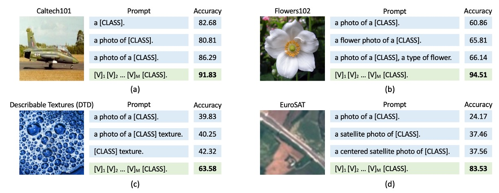
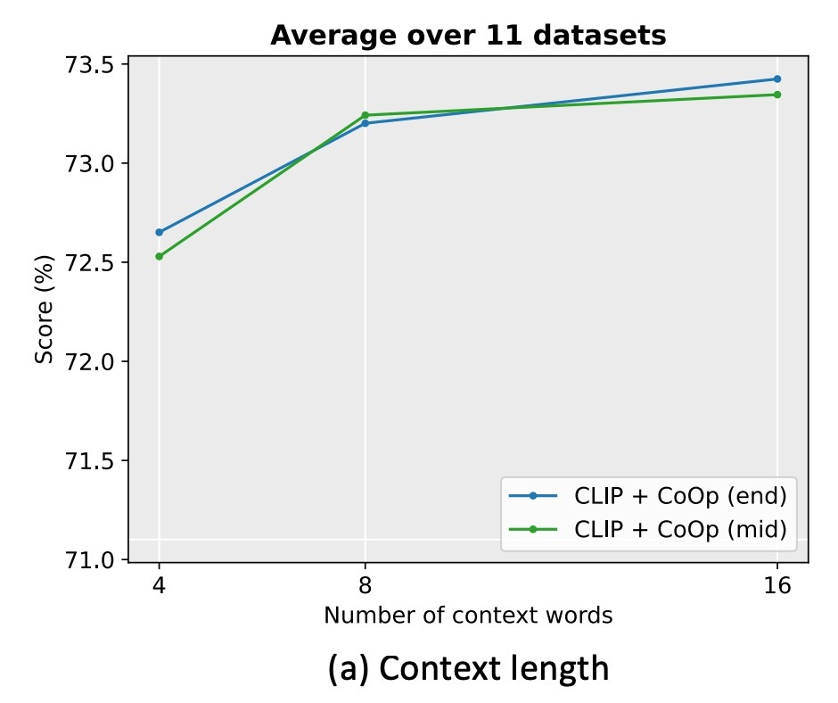

# [21.09] CoOp

## Whispering in the Wind

[**Learning to Prompt for Vision-Language Models**](https://arxiv.org/abs/2109.01134)

---

Earlier, we discussed the **Soft Prompts** paper. Now, let’s take a look at its subsequent applications.

:::tip
If you haven’t read it yet, you can refer to our previous article:

- [**[21.04] Soft Prompts: Whispering Secrets Like Tiny Strings**](../2104-soft-prompts/index.md)
  :::

This plugin-based method for model tuning is primarily aimed at LLMs or VLMs.

In this paper, the authors target VLMs, specifically focusing on the well-known **CLIP**.

:::tip
Haven’t heard of CLIP? Check out this article first:

- [**[21.03] CLIP: Breaking Dimensional Barriers**](../../multimodality/2103-clip/index.md)
  :::

CLIP was introduced in March 2021. Just a month later, the concept of Soft Prompts emerged.

The authors decided to apply the idea of Soft Prompts to CLIP, resulting in this paper.

## Problem Definition

<figure style={{"width": "90%"}}>

</figure>

The problem defined here is similar to that of **Soft Prompts**: manually crafted prompts have many limitations. They can produce drastically different results depending on the model and task.

As shown above, take CLIP as an example. If we use the prompt `a photo of [CLASS]`, the accuracy is around 80%. But by adding just one extra word, changing it to `a photo of a [CLASS]`, the accuracy surprisingly increases to 86%!

This isn’t an isolated case; the four different images in the figure above show the same pattern.

What’s going on here? How can just a few seemingly insignificant words lead to such dramatic differences?

:::tip
Just when you’ve finally grasped the characteristics of one model, a new one enters the market, forcing you to start all over again.
:::

## Reviewing CLIP

We’re guessing you don’t want to read the CLIP paper, so here’s a quick review of its architecture.

<figure style={{"width": "70%"}}>

</figure>

CLIP consists of two encoders:

- **Image Encoder**: Embeds high-dimensional image data into a low-dimensional feature space. The architecture can use either CNNs or ViTs.
- **Text Encoder**: Based on a Transformer architecture, it converts natural language into textual representations.

Text inputs are processed using **Byte Pair Encoding (BPE)**, transforming them into 512-dimensional word embedding vectors. The vocabulary size is 49,152. During training, sentences are padded with special tokens `[SOS]` and `[EOS]` and capped at a maximum length of 77. Finally, features at the `[EOS]` position undergo **LayerNorm**, followed by a linear projection layer.

The goal of CLIP is to align image and text embeddings. Specifically, given a batch of image-text pairs, the model maximizes the cosine similarity for matched pairs while minimizing it for unmatched pairs.

CLIP is trained on an enormous dataset. To help the model learn diverse visual concepts, the CLIP team collected a massive training dataset comprising **400 million image-text pairs**.

Review complete—congratulations, you’re now a CLIP expert!

## Problem Solving

### Model Architecture

<figure style={{"width": "90%"}}>

</figure>

The figure above illustrates the architecture of **Context Optimization (CoOp)**, which models contextual words as learnable continuous vectors, avoiding the need for manual prompt engineering.

The authors propose two different training methods:

- **Unified Context (UC)**

  In the design of unified context prompts, all categories share the same contextual word vectors. The prompt structure is as follows:

  $$
  t = [V]_1 [V]_2 \dots [V]_M  \text{[CLASS]},
  $$

  where $[V]_m$ ($m \in \{1, \dots, M\}$) is a vector with the same dimensionality as the word embeddings (e.g., 512 for CLIP), and $M$ is a hyperparameter specifying the number of contextual tokens.

  The inference process is as follows:

  - The prompt $t$ is passed to the text encoder $g(\cdot)$, producing the corresponding classification weight vector (taken from the [EOS] token position).
  - The prediction probability is calculated as:

  $$
  p(y = i|x) = \frac{\exp(\cos(g(t_i), f)/\tau)}{\sum_{j=1}^K \exp(\cos(g(t_j), f)/\tau)},
  $$

  where $t_i$ represents the prompt for the $i$-th category, including the word embedding vector for that category name.

  :::tip
  In addition to placing the class token `[CLASS]` at the end of the prompt, it can also be placed in the middle, such as:

  $$
  t = [V]_1 \dots [V]_{\frac{M}{2}} \text{[CLASS]} [V]_{\frac{M}{2}+1} \dots [V]_M.
  $$

  :::

- **Class-Specific Context (CSC)**

  For class-specific context, each category has its own independent contextual word vectors. The prompt structure is as follows:

  $$
  t_i = [V]_i^1 [V]_i^2 \dots [V]_i^M \text{[CLASS]},
  $$

  where $[V]_i^m$ ($m \in \{1, \dots, M\}$) is a vector with the same dimensionality as the word embeddings, and $M$ is a hyperparameter specifying the number of contextual tokens.

  The inference process is as follows:

  - The prompt $t_i$ is passed to the text encoder $g(\cdot)$, producing the corresponding classification weight vector (taken from the [EOS] token position).
  - The prediction probability is calculated as:

  $$
  p(y = i|x) = \frac{\exp(\cos(g(t_i), f)/\tau)}{\sum_{j=1}^K \exp(\cos(g(t_j), f)/\tau)},
  $$

  where $t_i$ represents the prompt for the $i$-th category, including the word embedding vector for that category name.

:::tip
In simpler terms, either all categories share a single set of learnable contextual word vectors, or each category has its own set.

Intuitively, having a dedicated set of contextual word vectors for each category should yield better results.

But is this really the case? Let’s take a look at the experimental results.
:::

## Discussion

### Performance Across Multiple Datasets

<figure style={{"width": "90%"}}>

<figurecaption>
Solid lines represent the improvements of CoOp over CLIP, stars denote zero-shot CLIP. 
Dashed lines indicate the linear probe alternative. 
$M$ denotes context length. 
“end” or “mid” refers to placing the class token at the end or middle of the context. 
CSC indicates class-specific context.
</figurecaption>
</figure>

---

From the figure above, **CLIP+CoOp** achieves significant improvements over zero-shot CLIP with just two samples (2-shot). When the number of samples increases to 16-shot, the average performance gain is approximately **15%**.

- For specialized tasks such as **EuroSAT** and **DTD**, performance improvements exceed **45%** and **20%**, respectively.
- On fine-grained datasets (e.g., **Flowers102**, **StanfordCars**, **FGVCAircraft**) and scene/action recognition datasets (e.g., **SUN397**, **UCF101**), performance gains generally surpass **10%**.
- Even for the challenging **ImageNet** dataset (with 1,000 categories), a **4.77%** improvement is observed.

### Comparison Between UC and CSC

Earlier, we introduced **Unified Context (UC)** and **Class-Specific Context (CSC)**. Which one performs better?

Referring back to the figure, let’s compare the performance with and without CSC.

- On average, **UC** performs better in most scenarios.
- However, for fine-grained datasets (**StanfordCars**, **Flowers102**, **FGVCAircraft**) and specialized tasks (**DTD**, **EuroSAT**), **CSC** demonstrates superior performance, especially at **16-shot**.

There isn’t a universally better method; rather, the choice between UC and CSC depends on the task requirements. Selecting the appropriate version based on the dataset can further enhance performance.

### Generalization and Transferability

<figure style={{"width": "80%"}}>

</figure>

Since CLIP already has strong zero-shot capabilities, the authors were concerned whether CoOp, fine-tuned on a specific dataset, might affect CLIP's generalization ability.

In the table, `source` refers to using `ImageNet` for fine-tuning, and `target` refers to datasets used to test generalization capability.

Experimental results show that CoOp enhances CLIP's robustness to distribution shifts, indicating that the design and learning of prompts have cross-domain adaptability.

### How Long Should the Prompt Be?

<figure style={{"width": "60%"}}>

</figure>

The authors conducted experiments on 11 datasets, setting the context length to 4, 8, and 16.

The experiments revealed that increasing the number of context tokens generally improves performance, especially when the context length is longer (e.g., 16), and placing the class token in the middle (mid) has a more noticeable effect. However, there is no fixed optimal context length, as a balance must be struck between performance and robustness to distribution shifts.

### Initialization Method

<figure style={{"width": "40%"}}>

</figure>

The authors compared the effects of random initialization and manual initialization. The manual initialization used the embedding vector of "a photo of a."

The results show that good initialization has little impact on performance. While further tuning of the initialization tokens might help, random initialization is sufficiently efficient in practice.

### Interpretability of Prompts

<figure style={{"width": "90%"}}>

</figure>

Since the context vectors are optimized in a continuous space, they are difficult to interpret directly.

The authors adopted an indirect approach by searching for the nearest words in the vocabulary based on Euclidean distance to the learned vectors.

Below are the search results for some datasets:

- **Food101**: "enjoyed" is somewhat relevant to the task.
- **OxfordPets**: "fluffy" and "paw" have some degree of relevance.
- **DTD**: "pretty" reflects material descriptions.

The experimental results suggest that interpreting learned prompts based on nearest words has limited accuracy, as the semantics of the vectors may not fully align with their nearest words. The learned vectors might go beyond the semantic space of existing vocabulary, possibly representing higher-dimensional semantic information.

### Conclusion

The experimental results of this study demonstrate that **CoOp** performs remarkably well across multiple datasets, particularly excelling in domain generalization, significantly outperforming manually designed prompts. This highlights its potential and advantages in data-efficient learning.

As the first comprehensive study on adapting large-scale vision models through prompt learning, this work has significant pioneering value. It not only provides empirical support for prompt learning but also lays a solid foundation for future research.

:::tip
It is worth noting that subsequent research has revealed that CoOp is sensitive to noisy labels in certain scenarios, and the learned contexts are challenging to generalize to unseen categories within the same dataset. This indicates that CoOp may overfit the limiting features of base classes during training.

We’ll revisit in the future to explore how subsequent research addresses these existing challenges.
:::
