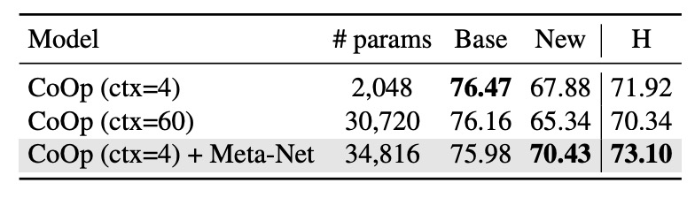

# [22.03] CoCoOp

## Look at the image first

[**Conditional Prompt Learning for Vision-Language Models**](https://arxiv.org/abs/2203.05557)

---

After the authors released CoOp, they found a problem.

The tokens used to guide VLM are independent of the input image, meaning that once these tokens are trained, they no longer consider information from the image.

:::tip
If you haven’t read CoOp yet, you can refer to our previous article:

- [**[21.09] CoOp: Swaying Whispers**](../2109-coop/index.md)
  :::

## Defining the Problem

Since vision-language models usually contain hundreds of millions to billions of parameters, full-model fine-tuning is impractical in terms of resource requirements and may disrupt the model's pre-trained representation space. Therefore, before this, the authors proposed CoOp, which uses prompt learning to guide the model's generalization to new tasks.

However, CoOp overfits to specific training categories when learning context, causing a significant drop in accuracy on unseen categories. This static design lacks generalization ability and struggles to handle a broader range of scenarios.

An intuitive idea is: we can allow the model to adjust the content of the tokens based on the input image's information during prediction.

## Solving the Problem

This paper's framework is almost the same as the previous CoOp, so we'll focus on some important parts.

### Model Architecture

<figure style={{"width": "80%"}}>

</figure>

The difference between CoCoOp and CoOp is the addition of a branch that guides image features into the token generation process.

Previously, the image and text branches operated independently, but this framework allows the image information to influence the generation of text.

:::tip
The architecture of the first-generation CoOp looks like this:

<figure style={{"width": "80%"}}>

</figure>

:::

CoCoOp introduces a lightweight neural network (Meta-Net) to combine learnable context vectors to generate input conditional context. Meta-Net is a two-layer bottleneck structure (Linear-ReLU-Linear), where the hidden layer compresses the input dimension by 16 times, with the input being the output features of the image encoder.

The conditional context vector formula is as follows:

$$
v_m(x) = v_m + \pi, \quad \pi = h_\theta(x)
$$

The prompt format is updated to $t_i(x) = \{v_1(x), v_2(x), ..., v_M(x), c_i\}$, and the prediction probability formula is updated to:

$$
p(y|x) = \frac{\exp(\text{sim}(x, g(t_y(x)))/\tau)}{\sum_{i=1}^{K} \exp(\text{sim}(x, g(t_i(x)))/\tau)}
$$

During training, the context vector $\{v_m\}_{m=1}^M$ and Meta-Net parameters $\theta$ are optimized simultaneously, while the base model (CLIP) remains frozen.

:::tip
We just breezed through another paper!
:::

## Discussion

Here, we mainly look at the differences between CoCoOp and CoOp.

### Generalization Ability on Unseen Categories

The authors conducted experiments on 11 different datasets. In the table, `Base` represents the base category, and `New` represents unseen categories. `CoOp` is the first-generation model, and `CoCoOp` is the model from this paper.

From the table, we can observe that although CoOp performs better than CLIP on base categories, its accuracy drops significantly on new categories. The average accuracy drops from 82.69% on base categories to 63.22% on new categories, a nearly 20% difference. This may be because CoOp over-optimized base categories, leading to poor performance on new categories, highlighting the need to improve the generalization ability of learned prompts.

CoCoOp’s accuracy on new categories increases to 71.69%, significantly narrowing the gap with manual prompts. On 5 of the 11 datasets, the accuracy improved by more than 10%. For example, the accuracy on ImageNet increased from 67.88% to 70.43%, even surpassing CLIP's 68.14%.

Compared to CoOp, CoCoOp’s base category accuracy slightly decreased on some datasets, but in 9 cases of decline, 6 datasets saw a decrease of less than 3%, and the significant improvement in new categories more than compensated for the loss in base categories. For example, in the case of StanfordCars, where the base category accuracy dropped by 7.63%, the accuracy on new categories increased by 13.19%, leading to an overall average increase of 5.56%.

### Who Can’t Increase Parameters?

<figure style={{"width": "70%"}}>

</figure>

CoCoOp introduces Meta-Net, increasing the number of parameters. As an expert, you might immediately ask:

- **Is this improvement only due to the increased number of parameters?**

To answer this, the authors designed an experiment where they removed Meta-Net from CoCoOp and increased the context number of CoOp to the maximum value with a similar number of parameters to CoCoOp.

From the results above, comparing `CoOp (ctx=60)` and `CoOp (ctx=4) + Meta-Net` with similar parameter counts, `CoOp (ctx=60)` did not improve the generalization ability for new categories. In fact, it even decreased by 2.54%, which further proves the authors' point that CoOp overfits base categories.

Therefore, the improvement in CoCoOp comes from the design of conditional context, not just the increase in parameters.

## Conclusion

CoCoOp, based on the design of conditional prompts, solves the generalization problem of static prompts and performs excellently in various scenarios, such as cross-dataset prompt transfer and domain generalization.

The authors mention at the end that CoCoOp’s training efficiency is significantly lower than that of CoOp, and in 7 of the 11 datasets, the performance on unseen categories is still lower than CLIP, indicating that the performance gap between learned and manual prompts has not been fully bridged, and the problem is far from over.

:::tip
One of the popular research directions in recent years is adding more fancy Prompt learning engineering between the image and text branches of CLIP. We’ll compile more on this when we have time.
:::
