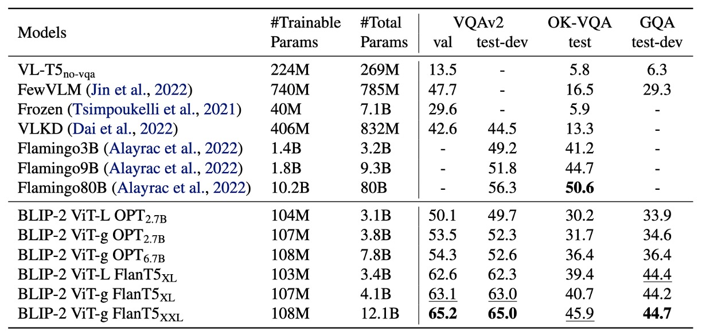
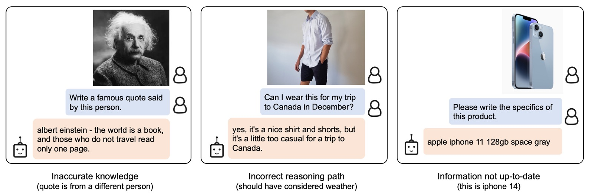

# [23.01] BLIP-2

## Q-Former debuts

[**BLIP-2: Bootstrapping Language-Image Pre-training with Frozen Image Encoders and Large Language Models**](https://arxiv.org/abs/2301.12597)

---

This is the second-generation architecture named BLIP.

Unlike the first-generation BLIP, which was a multimodal project, the second-generation BLIP focuses on using a small number of parameters to guide large pre-trained models toward desired directions.

:::tip
For readers unfamiliar with BLIP, you can refer to our previous article:

- [**[22.01] BLIP: Synthetic Text Technology**](../../multimodality/2201-blip/index.md)
  :::

## Defining the Problem

We continue to focus on the field of Vision-Language Models (VLM).

Current pre-training architectures often rely on large-scale training, which not only requires significant resources but also does not transfer well to every downstream task due to their diverse nature.

If we could directly leverage pre-trained unimodal LLMs and align multimodal features under frozen parameters, wouldn’t it save us the effort of retraining a multimodal model?

With this idea in mind, the authors designed a lightweight query transformer, called Q-Former, as a bridge to extract key features from image encoders and convert them into outputs that the language model can understand.

Is this really possible? Let’s dive in and learn!

## Solving the Problem

### Model Architecture

<figure style={{"width": "90%"}}>

</figure>

This architecture diagram might look a bit complex, so let’s break it down step by step:

Starting from the far left, an image is input and processed by a pre-trained image encoder. The parameters of this encoder are frozen, meaning it only extracts features without participating in training.

Next, on the right, the entire block consists of the "Q-Former" module, which is a dual-structured design. This architecture takes two inputs:

1. **Learned Query Embeddings**: These parameters are randomly initialized, with a length set to 32 tokens as described in the paper.
2. **Text Input Describing the Image**: This is similar to common language model inputs, consisting of natural language descriptions.

In the diagram, the orange portion, which represents **Self-Attention**, directly uses pre-trained language model weights as initialization parameters. After undergoing the Self-Attention computation, the Q-Former queries the features output by the image encoder. Essentially, the "Learned Query" here is primarily responsible for aligning image features with textual descriptions.

:::tip
In other words, we randomly generate a set of tokens, query them against text features first, and then query them against image features. This produces a "hybrid" feature.

Finally, we align this "hybrid" feature with the textual features, and the process is complete for this round.
:::

### Phase 1 Pre-Training

<figure style={{"width": "80%"}}>

</figure>

In the diagram above, **Q** represents the Query token, and **T** represents the Text token. Masked sections are indicated with darker shading.

During Phase 1, Q-Former is combined with a frozen image encoder for image-text pair pre-training, optimizing the following three objective functions:

1. **Image-Text Matching (ITM)**

   This objective function is used to train the **Learned Query**, represented by the **Q** portion in the diagram.

   The attention mask design, as shown above, allows queries and text tokens to interact. A linear classifier performs binary classification, and the matching score is calculated as the average classification result across all query embeddings. A **hard negative mining strategy** is applied during training to generate more challenging negative samples.

2. **Image-Grounded Text Generation (ITG)**

   This objective function trains the **Text tokens**, represented by the **T** portion in the diagram.

   A multimodal causal self-attention mask is used here. Query tokens (**Q**) can interact with each other, while text tokens (**T**) can only attend to the query tokens and the preceding text tokens in the sequence.

   :::tip
   Instead of using a `[CLS]` token, a `[DEC]` token is introduced as the start token for the decoding task.
   :::

3. **Image-Text Contrastive Learning (ITC)**

   The two objectives above train the **Q** and **T** parts separately. However, since both describe the same instance, it is necessary to align these two features, which is the purpose of this objective function.

   This objective aligns the similarity between positive image-text pairs and distinguishes them from negative pairs by adjusting the alignment between the query output $Z$ and the textual feature $t$. Here, $t$ represents the output embedding of the `[CLS]` token.

   To prevent information leakage, a unimodal self-attention mask is used, ensuring that queries and text tokens cannot directly observe each other.

### Phase 2 Pre-Training

<figure style={{"width": "90%"}}>

</figure>

:::tip
The first phase focuses on aligning image features with textual descriptions, while the second phase involves pre-training for **text generation**.
:::

As shown in the diagram, Q-Former is connected to a frozen large language model (LLM) to leverage its language generation capabilities. During this stage, the following two architectures can be employed for generation:

- **Decoder-Only Architecture**: Pre-trained with a language modeling loss, requiring the LLM to generate text conditioned on visual features.
- **Encoder-Decoder Architecture**: Pre-trained with a prefix language modeling loss. The input text is split into a prefix and a suffix. The prefix text, along with visual features, is sent to the LLM encoder, while the suffix text serves as the generation target for the LLM decoder.

:::tip
It is important to note that the **Image Encoder** and **LLM** are frozen in this phase. The goal is to use the visual cues extracted by Q-Former to guide the LLM in generating text.
:::

In this design, the query embeddings $Z$ output by Q-Former are linearly projected to the same dimension as the LLM’s text embeddings. These projected query embeddings are prepended to the input text embeddings, serving as **soft visual prompts**.

Since Q-Former has been pre-trained to extract visual features relevant to language, it acts as an information bottleneck, effectively filtering out irrelevant visual details and reducing the burden on the LLM for vision-language alignment.

:::tip
For readers interested in the concept of "Soft Prompts," you can refer to our earlier article:

- [**[21.04] Soft Prompts: Subtle Whispers of Guidance**](../2104-soft-prompts/index.md)
  :::

### Pre-Training Setup

- **Pre-Training Steps**:

  - **Feature Learning Stage**: 250,000 steps.
  - **Generative Learning Stage**: 80,000 steps.

- **Batch Sizes**:

  - **Feature Learning**: 2320 (ViT-L) or 1680 (ViT-g).
  - **Generative Learning**: 1920 (OPT) or 1520 (FlanT5).

- **Compute Efficiency**:

  - Training on a single 16 × A100 (40G) machine:
    - **Feature Learning Stage (Largest Model)**: Less than 6 days.
    - **Generative Learning Stage (Largest Model)**: Less than 3 days.

- **Optimizer and Learning Rate**:

  - **Optimizer**: AdamW ($\beta_1 = 0.9$, $\beta_2 = 0.98$, weight decay $0.05$).
  - **Learning Rate Schedule**: Cosine decay with a peak learning rate of $1 \times 10^{-4}$ and linear warmup for 2000 steps; the minimum learning rate in the second stage is $5 \times 10^{-5}$.

- **Image Processing**:
  - **Image Size**: $224 \times 224$.
  - **Augmentation**: Random cropping and horizontal flipping.

## Discussion

<figure style={{"width": "90%"}}>

</figure>

Without saying much, let’s first look at the results.

Compared to previous state-of-the-art models, BLIP-2 achieves higher performance while significantly reducing the number of trainable parameters required during VLM pre-training.

### Zero-shot VQA

<figure style={{"width": "90%"}}>

</figure>

The authors first tested BLIP-2’s zero-shot capability. The table above shows BLIP-2’s performance on various VQA tasks, including **VQAv2**, **GQA**, and **OK-VQA**.

**Evaluation Setup**:

- The prompt for the OPT model was "`Question: {}` Answer:".
- The prompt for the FlanT5 model was "`Question: {}` Short answer:".
- Beam search was used to generate answers, with a beam width of 5, and a length penalty of $-1$ to encourage concise answers.

On **VQAv2** and **GQA**, BLIP-2 outperformed Flamingo80B, especially on **VQAv2**, where it achieved an **8.7% improvement**, despite having only **1/54** the number of trainable parameters compared to Flamingo80B.

On **OK-VQA**, BLIP-2 performed slightly worse than Flamingo80B, likely because OK-VQA emphasizes open-world knowledge. Flamingo80B leverages the Chinchilla language model (70B), which has more extensive knowledge than BLIP-2’s FlanT5XXL (11B).

**Zero-shot Capability Observations**:

The first phase of multimodal pre-training is crucial for the model’s zero-shot capability.

Q-Former learns text-related visual features during this phase, reducing the burden on the LLM for vision-language alignment.

Without this phase, the model suffers from catastrophic forgetting, with performance significantly declining as training progresses. (This was observed as a **15% performance drop** in the OPT model.)

### Finetuned VQA

<figure style={{"width": "80%"}}>

</figure>

The authors fine-tuned BLIP-2 on annotated VQA data, freezing the LLM’s parameters and fine-tuning only the Q-Former and image encoder.

In this task, BLIP-2 reached state-of-the-art performance among open-ended generation models for the visual question answering task, demonstrating its ability to focus on extracting visual features relevant to the question.

### Image Captioning

<figure style={{"width": "90%"}}>

</figure>

The authors evaluated BLIP-2's performance on the image captioning task and compared it with other methods.

For the image captioning task, the initial prompt was "`a photo of`," and the model was trained using language modeling loss. During fine-tuning, the LLM's parameters were frozen, and only the Q-Former and image encoder parameters were updated.

On the COCO dataset, BLIP-2 achieved state-of-the-art performance and demonstrated strong generalization ability for zero-shot transfer on the NoCaps validation set.

### Image-Text Retrieval

<figure style={{"width": "90%"}}>

</figure>

The authors evaluated BLIP-2 on the image-text retrieval task using the COCO and Flickr30K datasets and analyzed the impact of different loss functions on performance.

BLIP-2 achieved state-of-the-art performance in zero-shot image-text retrieval, significantly outperforming existing methods.

The authors examined the contribution of each loss function to the results, as shown in the table below:

- **ITC (Image-Text Contrastive) Loss** and **ITM (Image-Text Matching) Loss**: Directly learn the similarity between images and text.
- **ITG (Image-Grounded Text Generation) Loss**: Enhances the query’s ability to extract visual features relevant to the text, further improving vision-language alignment.

<figure style={{"width": "80%"}}>

</figure>

### Text-to-Image Generation Showcase

<figure style={{"width": "90%"}}>

</figure>

The authors showcased examples of various zero-shot image-to-text capabilities, including visual knowledge reasoning, visual commonsense reasoning, visual conversation, and personalized image-to-text generation.

:::tip
The images in the paper are quite large. For space considerations, we have not included the entire image here. Interested readers can refer to the original paper.
:::

### Failure Cases

<figure style={{"width": "90%"}}>

</figure>

Similar to previous LLMs, the model may produce unusual results for unseen objects or concepts. Additionally, it is prone to associating incorrect entities or concepts, highlighting areas for improvement in the future.

## Conclusion

The concept of Q-Former demonstrates that with a minimal number of parameters and just a few tokens, large language models can be guided to perform multimodal tasks effectively.

If we want to address problems in specific domains, this approach allows us to transfer the capabilities of large pre-trained models toward our desired objectives.

:::tip
In recent years, Q-Former has become a common sight in the field of Face Anti-Spoofing (FAS) research!
:::
