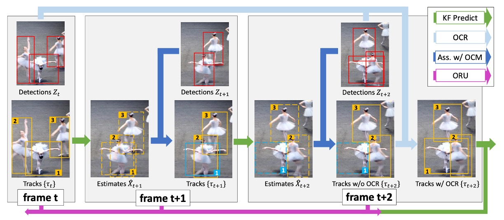
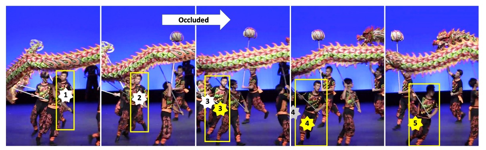
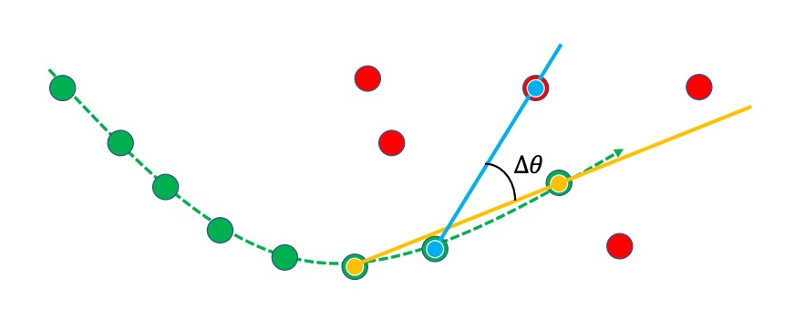
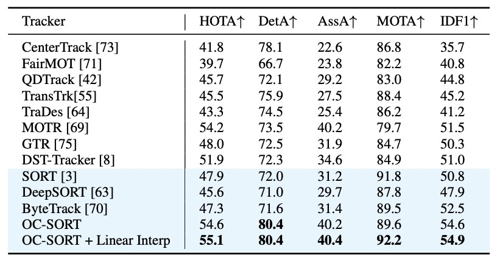
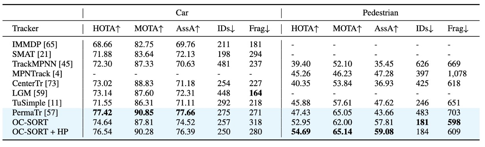
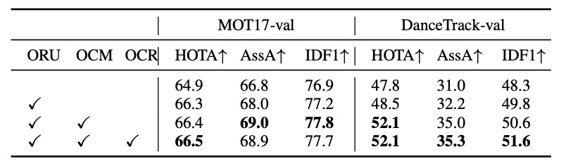
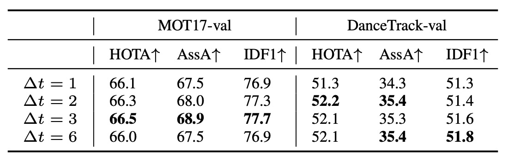

## Breaking Free from the Cage of Kalman

[**Observation-Centric SORT: Rethinking SORT for Robust Multi-Object Tracking**](https://arxiv.org/abs/2203.14360)

---

We’ve previously covered little about object tracking, so this time we’ll approach the field through a CVPR paper.
This note will be written in more detail—we’ll start by filling in some of the unfamiliar metrics and methods.

## Problem Definition

In the field of Multi-Object Tracking (MOT), the task seems simple:

- **Find all objects in each frame, and maintain consistent IDs for them across time.**

However, this “keeping it the same” problem is often more difficult than simply “finding it.”

---

Modern MOT systems are almost all built on the **Tracking-by-Detection** framework:
Detect first, then track.

Typically, we start with a **detection model**, followed by a **tracking model** that links detection results into continuous **trajectories**.

The most representative of these systems is **SORT (Simple Online and Real-time Tracking)**.
Built upon the **Kalman Filter**, SORT assumes that an object’s velocity remains approximately constant over short periods, using a linear motion model to predict future positions.

This assumption makes SORT both simple and efficient—an emblem of _real-time tracking_.
It performs predictions within milliseconds while maintaining stable results.
Yet, the elegance of this assumption rests on a fragile premise:

> **Object motion must be linear.**

Anyone who has used SORT knows how unrealistic this is.
Detected people stop walking, cars turn corners, cameras shake, and occlusions are everywhere.
When an object is hidden and reappears, the Kalman Filter’s prediction has already drifted far from the true trajectory.

Prediction errors accumulate over time, eventually leading to “broken tracks” and “ID resets.”
Once trajectories lose continuity, the MOT task effectively fails.

You might think a higher **frame rate** could mitigate this issue—
but paradoxically, **higher frame rates often make it worse**.

In theory, higher frame rates make the linear assumption more reasonable.
But in practice, the displacement between frames becomes so small that it approaches the noise level.
As a result, the Kalman-estimated velocities fluctuate violently, amplifying and accumulating noise over time until the trajectory drifts far from reality.

At the same time, a deeper contradiction emerges:

> **Modern detectors are often more accurate than the tracker’s estimation model.**

In SORT’s framework, observations are merely auxiliary information to update estimates—
the real trajectory extension comes from the model’s prediction.
In other words, even when the detector confidently tells you _“the object is here,”_
the tracker insists on extending its trajectory somewhere else based on its own estimation.

That’s completely backward.

Thus, the authors of this paper start from this contradiction and rethink the relationship between “observation” and “estimation,”
attempting to restore observation as the true foundation of trajectory extension.

Would that be a good idea?

## Re-examining the Limitations of SORT

Before discussing OC-SORT, we must return to its origin: the **Kalman Filter**.
This classic algorithm is the core of all linear tracking models—and SORT is built upon it.

The Kalman Filter (KF) is a **linear state estimator**.
It assumes that the target follows a discrete-time linear dynamic system,
alternating between two steps: **prediction** and **update**.
It predicts the next state (prior) and then corrects it using new observations (posterior).
Even without observations, it can continue predicting the future—
a property that makes it so popular for tracking problems.

SORT applies the Kalman Filter to visual tracking.
It defines the state vector as:

$$
\mathbf{x} = [u, v, s, r, \dot{u}, \dot{v}, \dot{s}]^\top
$$

where:

- $(u, v)$: object center coordinates in the image
- $s$: bounding box area
- $r$: bounding box aspect ratio (assumed constant)
- $(\dot{u}, \dot{v}, \dot{s})$: corresponding velocity terms

The detector provides the observation vector:

$$
\mathbf{z} = [u, v, w, h, c]^\top
$$

including center, width, height, and confidence.

SORT assumes that an object follows a linear motion model:

$$
u_{t+1} = u_t + \dot{u}_t \Delta t, \quad
v_{t+1} = v_t + \dot{v}_t \Delta t
$$

With a fixed frame rate ($\Delta t = 1$), the displacement between frames can be treated as approximately linear.
At high frame rates, this assumption usually holds—objects move only slightly between frames,
so even dancers spinning or boxers punching can be locally approximated as linear motion.

However, when **occlusion** occurs and no observation is available, the Kalman Filter performs a “virtual update”:

$$
\hat{\mathbf{x}}_{t|t} = \hat{\mathbf{x}}_{t|t-1}, \quad
\mathbf{P}_{t|t} = \mathbf{P}_{t|t-1}
$$

This means the system **blindly trusts its own prediction**,
even without any new observational evidence.

This reliance on estimation rather than observation is SORT’s fundamental limitation.

But that’s not all. SORT has three major problems:

---

1. **Excessive Sensitivity to State Noise**

   Suppose the object’s center position follows a Gaussian distribution:

   $$
   u \sim \mathcal{N}(\mu_u, \sigma_u^2), \quad v \sim \mathcal{N}(\mu_v, \sigma_v^2)
   $$

   Based on the linear motion model:

   $$
   \dot{u} = \frac{u_{t+\Delta t} - u_t}{\Delta t}, \quad
   \dot{v} = \frac{v_{t+\Delta t} - v_t}{\Delta t}
   $$

   The resulting velocity noise distribution is:

   $$
   \delta \dot{u} \sim \mathcal{N}\left(0, \frac{2\sigma_u^2}{(\Delta t)^2}\right), \quad
   \delta \dot{v} \sim \mathcal{N}\left(0, \frac{2\sigma_v^2}{(\Delta t)^2}\right)
   $$

   Thus, **the higher the frame rate (smaller $\Delta t$), the greater the velocity noise.**

   In the MOT17 dataset, the average displacement per frame is only about 1–2 pixels,
   meaning even a 1-pixel location error can completely distort the velocity estimate.
   Though the per-frame deviation seems small, it is repeatedly amplified and accumulated over time.

---

2. **Temporal Amplification of Error**

   When occlusion occurs, the Kalman Filter cannot receive new observations.
   It can only continue extrapolating based on past estimates.

   Assuming $T$ frames pass without observation:

   $$
   u_{t+T} = u_t + T \dot{u}_t, \quad v_{t+T} = v_t + T \dot{v}_t
   $$

   Then the position error grows quadratically:

   $$
   \delta u_{t+T} \sim \mathcal{N}(0, 2T^2\sigma_u^2), \quad
   \delta v_{t+T} \sim \mathcal{N}(0, 2T^2\sigma_v^2)
   $$

   Even with a 1-pixel variance, 10 consecutive frames of occlusion can shift the trajectory by hundreds of pixels—enough to misplace an entire person in the frame.
   In crowded scenes, such drift is essentially tracking failure.

---

3. **Estimation-Centric Design Flaw**

   The two issues above stem from SORT’s philosophy: it is an **estimation-centered algorithm**.
   It keeps updating without observations, trusts its own predictions over detections,
   and assumes past estimation errors won’t catastrophically accumulate.
   In modern settings, these assumptions no longer hold.

   Today’s detectors have much lower observation noise than the Kalman Filter’s prediction noise.
   In other words, **observations are more reliable than estimates.**

   When SORT faces nonlinear motion and occlusion, its estimations become the primary source of error.

## Solving the Problem

<figure style={{ "width": "90%"}}>

</figure>

The core idea proposed by the authors is simple:

> Since **observations are more reliable than estimations**, tracking should be built **around observations** rather than estimations. Hence, the method is named **OC-SORT (Observation-Centric SORT)**.

There are two key components in this design:

1. **Observation-Centric Re-Update (ORU):** Corrects accumulated errors during occlusion using observations.
2. **Observation-Centric Momentum (OCM):** Enforces directional consistency during association, relying on real observations rather than estimations.

The overall workflow is illustrated in the figure above:

- Red boxes represent detections (observations).
- Orange boxes represent active trajectories.
- Blue boxes represent lost tracks.
- Dashed boxes represent Kalman Filter predictions.

When target #1 disappears at frame $t+1$ due to occlusion, SORT lets it drift away.
But when it reappears at frame $t+2$, OC-SORT triggers **ORU**, retrospectively recalculating the trajectory during the occluded period to prevent accumulated error.

---

### Observation-Centric Re-Update (ORU)

In traditional SORT, even if a target is rediscovered at frame $t+2$, its Kalman Filter parameters have already drifted significantly—
meaning it will likely be lost again soon.

**ORU** addresses this by, upon reactivation, _not_ directly resuming from the drifted state.
Instead, it generates a **virtual trajectory** to retroactively correct the motion between the last and new observations.

Formally, suppose the last visible observation is $z_{t_1}$, and the object is detected again at $t_2$ with $z_{t_2}$.
For the occluded interval $t_1 < t < t_2$, a virtual interpolated trajectory is generated as:

$$
{\mathbf{z}}_t = Traj_{\text{virtual}}(\mathbf{z}_{t_1}, \mathbf{z}_{t_2}, t), \quad t_1 < t < t_2
$$

The Kalman Filter then re-runs its prediction–update loop using these virtual observations:

$$
\begin{cases}
\mathbf{K}_t = \mathbf{P}_{t|t-1}\mathbf{H}_t^\top(\mathbf{H}_t\mathbf{P}_{t|t-1}\mathbf{H}_t^\top + \mathbf{R}_t)^{-1} \\
\hat{\mathbf{x}}_{t|t} = \hat{\mathbf{x}}_{t|t-1} + \mathbf{K}_t (\mathbf{z}_t - \mathbf{H}_t \hat{\mathbf{x}}_{t|t-1}) \\
\mathbf{P}_{t|t} = (\mathbf{I} - \mathbf{K}_t \mathbf{H}_t) \mathbf{P}_{t|t-1}
\end{cases}
$$

The effect is shown below:

<figure style={{ "width": "90%"}}>

</figure>

When the dragon dance performer is occluded in the second frame and reappears in the third,
without ORU, the Kalman Filter’s estimated center (white star) drifts severely, leading to failed association.
With ORU, the virtual observations allow re-alignment, producing a new estimation center (yellow star) that matches the detection box—allowing tracking to continue smoothly.

---

### Observation-Centric Momentum (OCM)

Beyond correcting accumulated errors, the authors also aim for more stable data association.

Ideally, an object’s motion direction should remain consistent—
a person running left shouldn’t suddenly be matched with a detection moving right.

However, if direction is estimated from the Kalman Filter’s predictions, it becomes highly sensitive to noise.
Thus, **OCM** introduces an observation-based approach:
it computes motion direction from _real detection points_ and incorporates directional consistency into the association cost matrix.

Formally, the association cost is defined as:

$$
C(\hat{\mathbf{X}}, \mathbf{Z}) = C_{\text{IoU}}(\hat{\mathbf{X}}, \mathbf{Z}) + \lambda C_v(\mathcal{Z}, \mathbf{Z})
$$

where:

- $C_{\text{IoU}}$: IoU-based cost.
- $C_v$: direction-consistency cost.
- $\lambda$: weighting hyperparameter.

The direction-consistency cost $C_v$ measures the difference between two angles:

1. $\theta_{\text{track}}$: direction formed by two consecutive observation points in the existing track.
2. $\theta_{\text{intention}}$: direction from the last observation to the new detection.

The angular difference is:

$$
\Delta \theta = |\theta_{\text{track}} - \theta_{\text{intention}}|
$$

Each angle $\theta$ is computed as:

$$
\theta = \arctan \frac{v_1 - v_2}{u_1 - u_2}
$$

A conceptual diagram is shown below:

<figure style={{ "width": "60%"}}>

</figure>

The green line represents the existing trajectory, the red dot is the new detection,
the blue line indicates $\theta_{\text{track}}$, and the yellow line indicates $\theta_{\text{intention}}$.

If the two directions are consistent (small $\Delta\theta$),
the association cost is lower, increasing the chance of a correct match.

---

### Observation-Centric Recovery (OCR)

In addition to ORU and OCM, the authors also propose a practical heuristic: **OCR**.

When a track fails to find a match during normal association,
OCR performs a _second association attempt_ using its last valid observation.

This is particularly effective for **short occlusions** or **stationary objects**.

## Discussion

To comprehensively validate the robustness of **OC-SORT**, the authors evaluated it across multiple multi-object tracking (MOT) datasets:

- **MOT17**

  - **Task:** Pedestrian tracking in urban environments.
  - **Dataset characteristics:**

    - Comprises **7 video sequences**, each annotated using different detectors (DPM, Faster R-CNN, SDP), making it ideal for comparing tracker performance under varying detection inputs.
    - Frame rate: around **30 FPS**, meaning motion between frames is nearly linear.
    - Scenes contain occlusions but of moderate complexity.

  - **Challenges:**

    - Pedestrians frequently approach or cross paths, but the **linear motion assumption** of the Kalman Filter generally holds.
    - Suitable for testing the performance of “basic MOT systems.”

  ***

  :::info
  Reference: [**Mot16: A benchmark for multi-object tracking**](https://arxiv.org/abs/1603.00831)
  :::

  ***

- **MOT20**

  - **Task:** Also pedestrian tracking, but in **much more extreme scenarios**.
  - **Dataset characteristics:**

    - Released in **2020**, designed specifically for **high-density crowd tracking**.
    - Each image may contain over **100 annotated pedestrians**.
    - Severe **occlusion** and **overlap** among subjects.

  - **Challenges:**

    - Despite the high frame rate, the frequent occlusions break the assumptions of **simple linear motion models**.
    - Trackers like **SORT** and **DeepSORT**, based on Kalman Filters, often suffer large numbers of **ID switches**.
    - Functions as a **stress test under heavy occlusion**.

  ***

  :::info
  Reference: [**Mot20: A benchmark for multi object tracking in crowded scenes**](https://arxiv.org/abs/2003.09003)
  :::

  ***

- **KITTI**

  - **Task:** Tracking of pedestrians and vehicles.
  - **Dataset characteristics:**

    - Vehicle-mounted camera perspective, featuring street and traffic environments.
    - Frame rate: **10 FPS**, meaning longer time gaps between frames → linear assumption often breaks down.
    - Exhibits **nonlinear motion**, e.g., pedestrians crossing abruptly, vehicles turning or accelerating.

  - **Challenges:**

    - Predictions must span longer time intervals.
    - Traditional Kalman Filters accumulate more error in low frame rate settings.

  ***

  :::info
  Reference: [**Vision meets robotics: The kitti dataset**](https://www.cvlibs.net/publications/Geiger2013IJRR.pdf)
  :::

  ***

- **DanceTrack**

  - **Task:** Human tracking in dance scenes.
  - **Dataset characteristics:**

    - Detections are easy and bounding boxes are accurate.
    - **Highly nonlinear motion:** frequent rotation, crossing, and position swapping.
    - **Uniform appearance:** dancers wear similar outfits, making appearance-based association unreliable.
    - Severe occlusion and frequent ID mixing.

  - **Challenges:**

    - Focuses on **association correctness** rather than detection accuracy.
    - Tests whether the tracker can maintain ID stability under **nonlinear motion and frequent occlusion**.

  ***

  :::info
  Reference: [**DanceTrack: Multi-Object Tracking in Uniform Appearance and Diverse Motion**](https://arxiv.org/abs/2111.14690)
  :::

  :::tip
  This paper places special emphasis on this dataset, as it perfectly fits the challenging scenario of "nonlinear motion + occlusion."
  :::

  ***

- **CroHD**

  - **Task:** Head tracking in dense crowds.
  - **Dataset characteristics:**

    - Extremely crowded environments.
    - Annotations focus on **heads**, not full bodies—emphasizing resolution and precision in dense scenes.

  - **Challenges:**

    - Very high levels of occlusion and overlap.
    - Serves as a test for trackers in **ultra-dense crowd scenarios**.

  - **Usage in the paper:** Only included in the appendix as supplementary validation.

  ***

  :::info
  Reference: [**Tracking Pedestrian Heads in Dense Crowd**](https://arxiv.org/abs/2103.13516)
  :::

  ***

From these datasets, we can see that the authors deliberately selected scenes spanning a wide spectrum:
MOT and KITTI represent **quasi-linear motion**, while **DanceTrack** is an extreme case of **nonlinear movement**.

To ensure fairness, **OC-SORT does not retrain any detectors**; instead, it directly uses the publicly available detection results from the same baselines:

- **MOT17 / MOT20 / DanceTrack →** YOLOX detections from **ByteTrack**
- **KITTI →** Detection results from **PermaTrack**

This ensures that differences arise purely from the tracking algorithm—not from detection quality.

In the details of ORU and OCM, the authors made clear settings:

- **ORU: Virtual Trajectory Generation**

  During occlusion, OC-SORT assumes **constant velocity** and linearly interpolates missing observations:

  $$
  z_t = z_{t_1} + \frac{t - t_1}{t_2 - t_1}(z_{t_2} - z_{t_1}), \quad t_1 < t < t_2
  $$

  This effectively performs **linear interpolation** between two valid observations.

- **OCM: Motion Direction Estimation**

  - Direction is computed using observations spaced **three frames apart ($\Delta t = 3$)**.
  - The measure is the **absolute angular difference** (in radians) between two motion directions.
  - The weighting hyperparameter $\lambda$ is set to **0.2**.

- **Other Settings**

  - Detection confidence threshold:

    - MOT20 → **0.4**
    - Other datasets → **0.6**

  - Association IoU threshold → **0.3**

---

Beyond traditional **MOTA**, the paper emphasizes metrics that reflect **association quality**, including:

- **HOTA**

  - The main metric, balancing detection accuracy and association consistency.

- **AssA**

  - Evaluates **association performance** — whether the tracker consistently follows the same target.

- **IDF1**

  - Measures **ID consistency**, another association-oriented metric.

While MOTA is still reported, the authors note that:

> Since MOTA heavily depends on detection accuracy, it is only fair when all methods use identical detection inputs.

Therefore, the paper distinguishes such experiments as **public tracking**,
with detailed results provided in **Appendix C**.

### MOT17 Results

<figure style={{ "width": "90%"}}>

</figure>

On **MOT17**, OC-SORT performs on par with existing state-of-the-art methods.

Since MOT17 mostly features **linear or near-linear pedestrian motion**, the original SORT design is already quite stable in this setting. Therefore, the advantage of OC-SORT is not particularly pronounced. Nevertheless, OC-SORT still shows consistent improvement in **association accuracy (AssA, IDF1)**.

It’s worth noting that, for fair comparison, the authors directly used ByteTrack’s YOLOX detection results. OC-SORT does **not** adopt ByteTrack’s dynamic detection thresholding, nor does it include low-confidence detections to boost MOTA. Even so, OC-SORT maintains an advantage in metrics that reflect **association correctness** such as HOTA and IDF1.

This demonstrates that even in “linear motion + mild occlusion” scenarios, an observation-centric design still provides more stable trajectory continuity.

### MOT20 Results

<figure style={{ "width": "90%"}}>

</figure>

Compared with MOT17, **MOT20 is far more crowded and occlusion is frequent**—exactly where SORT tends to fail.

In this challenging scenario, OC-SORT shows clear superiority:

- Achieves **HOTA = 62.1**, setting a new state-of-the-art at the time.
- When pedestrians heavily overlap, traditional SORT suffers from severe ID switches due to accumulated errors, whereas OC-SORT’s **ORU mechanism** effectively “repairs errors during occlusion,” maintaining ID continuity.

Even though OC-SORT remains a simple design (without ByteTrack’s adaptive thresholding or multi-detection fusion), it still consistently outperforms other methods under extreme crowd conditions—demonstrating that the **observation-centric** approach is especially effective in high-occlusion environments.

### DanceTrack Results

<figure style={{ "width": "80%"}}>

</figure>

**DanceTrack serves as the core validation dataset for OC-SORT.**

In this dataset:

- Detection is easy, but motion is **highly nonlinear** (frequent rotation, crossing, and repositioning).
- Participants look very similar, making appearance-based association unreliable.
- Occlusion and ID swapping occur almost constantly.

Results show that OC-SORT **significantly surpasses all baselines**, achieving new highs in both HOTA and IDF1.
When dancers cross paths, traditional SORT often breaks or resets IDs, while OC-SORT maintains smooth trajectories through the combined effects of **ORU** and **OCM**.

This confirms that **in scenarios of nonlinear motion and frequent occlusion, the observation-centric design of OC-SORT is highly effective.**

### KITTI Results

<figure style={{ "width": "90%"}}>

</figure>

The **KITTI** challenge lies in its low frame rate (10 FPS):

For **pedestrian tracking**, OC-SORT reaches a new SOTA, clearly surpassing PermaTrack while being nearly **10× faster**.
This shows that in “low frame rate + pedestrian motion” environments, **ORU** effectively compensates for errors accumulated during occlusion, maintaining trajectory continuity.

However, for **vehicle tracking**, OC-SORT reveals one limitation:

- Because vehicles move much faster, the bounding box IoU between consecutive frames is almost zero at such low frame rates.

Since the default OC-SORT still relies on IoU-based association, vehicle tracking performance degrades.
This is not an inherent flaw of OC-SORT itself but rather a general limitation of **IoU-based association under fast motion**.

A possible remedy would be to integrate additional cues such as **appearance similarity** (e.g., ReID features used in DeepSORT) or motion prediction fusion.

### Module Contribution Analysis

The authors conducted ablation studies on the **MOT17** and **DanceTrack** validation sets by toggling each module on/off. The results are summarized below:

<figure style={{ "width": "70%"}}>

</figure>

The trends are clear:

- **ORU contributes the most.**
  It provides a significant boost in both HOTA and IDF1 across datasets, proving that correcting accumulated errors using virtual observations after reappearance greatly enhances stability.

- **OCM’s impact is scene-dependent.**

  - On **DanceTrack** (nonlinear motion + frequent occlusion), OCM significantly improves association performance.
  - On **MOT17**, the effect is limited, as pedestrian motion is largely linear and directional consistency is not a major concern.

Overall, **ORU** offers “occlusion-period recovery,” while **OCM** enhances “stable association under nonlinear motion.”
Together, they enable OC-SORT to remain robust across diverse dynamic scenarios.

### Virtual Trajectory Generation in ORU

<figure style={{ "width": "70%"}}>

</figure>

In ORU, OC-SORT must generate **virtual observations** for the occluded duration.

The authors tested several trajectory-generation assumptions, including:

- **Constant Speed** — _(used in the final paper)_
- Constant Acceleration
- Linear Regression
- Gaussian Process Regression (GPR, with RBF kernel)
- Near Constant Acceleration Model (NCAM)

As shown in the table above, **local hypotheses** significantly outperform **global regression** approaches.

This is because ORU operates **online**, and during occlusion only a few historical points are available (sometimes just a few frames).
Thus, global fitting methods like Linear Regression or GPR are prone to **overfitting** and **instability**.

Ultimately, the **Constant Speed model**, despite its simplicity, achieved the best balance of **stability and real-time performance**.

### Δt Selection for OCM

<figure style={{ "width": "70%"}}>

</figure>

OCM relies on computing motion direction (momentum consistency), which requires observations at two distinct time points.

But how large should the time gap Δt be?

- If **Δt is too small**, noise dominates (velocity estimates become highly unstable).
- If **Δt is too large**, the **linear assumption breaks down** (the object may have changed direction).

To find a balance, the authors compared results across different Δt values.

Results:

- Increasing Δt from 1 → 3 leads to clear performance gains.
- Beyond Δt = 3 (e.g., Δt = 5), performance starts to decline.

This confirms the theoretical insight:
**Using a limited time interval for observation suppresses noise while preserving local linearity.**

In final experiments, the authors fixed **Δt = 3** as the default value for OCM.

## Conclusion

OC-SORT revisits the core assumptions of SORT, identifying that the traditional Kalman Filter accumulates errors during occlusion and nonlinear motion due to lack of observations.
To address this, it redesigns the tracking process around **observation-centric principles**:
**ORU** corrects drift during occlusion, and **OCM** enforces directional consistency during association.
This allows OC-SORT to remain simple and real-time while achieving remarkable robustness under heavy occlusion and complex motion.

In practical terms, the key insight is:

> **When the detector is already reliable, the core of tracking lies not in a more complex prediction model, but in better leveraging observations.**

Finally, although OC-SORT excels across multiple datasets, it remains limited by IoU-based association instability in **low frame rate or high-speed motion** scenarios.
Nevertheless, as a modular, real-time, and robust baseline, **OC-SORT redefines the boundary of what a “lightweight tracker” can achieve.**
