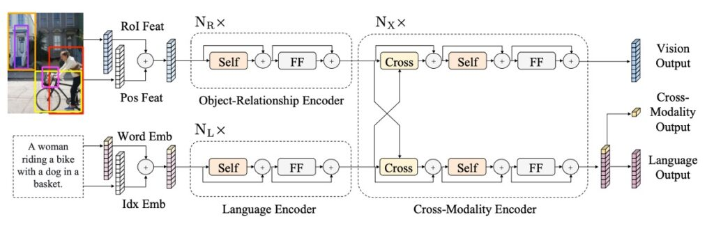

# [19.08] LXMERT

## Pre-training Matters

[**LXMERT: Learning Cross-Modality Encoder Representations from Transformers**](https://arxiv.org/abs/1908.07490)

---

During this period, researchers have increasingly focused on multimodal studies.

Many models, such as ViLBERT, VL-BERT, and VisualBERT, were all published around the same time.

LXMERT incorporates more attention mechanisms and a comprehensive pre-training strategy to provide a relatively complete vision-and-language solution for its time.

## Defining the Problem

The major challenge these models aim to address is similar:

- **How can we design and train a model that effectively understands and represents both visual and language information while performing well across various cross-modal tasks?**

While ViLBERT and VisualBERT attempted this, the authors felt these models didn’t generalize well enough.

## Approach

### Model Architecture

The LXMERT model architecture is inspired by the Transformer structure. It integrates self-attention and cross-attention layers, enabling it to process both image and corresponding sentence inputs simultaneously. This design not only allows the model to encode visual and language information independently but also facilitates interactions between the two, creating a unified cross-modal representation.

In the language component, sentences are tokenized using a WordPiece tokenizer, with each word and its position within the sentence represented as a vector.

For the visual component, the model takes features from Faster R-CNN outputs, encoding each object with both regional features and spatial information, enhancing the model's spatial awareness.

As illustrated, LXMERT provides three types of outputs: language, vision, and cross-modal. Language and vision outputs derive directly from feature sequences in the cross-modal encoder, while the cross-modal output leverages a special `[CLS]` token, representing the combined information from both modalities and suited for a range of downstream tasks.

### Pre-training Strategy

To help the model develop a deeper understanding of vision-language connections, LXMERT is pre-trained on a large, aggregated dataset.

The pre-training tasks include:

- **Language Task – Masked Cross-Modal Language Model**

  This task encourages the model to understand and generate missing words in sentences, using visual cues to predict masked words, similar to BERT but with multimodal inputs.

  For example, if the word “apple” is masked in the sentence and the image displays an apple, LXMERT can use the visual hint to fill in the word.

- **Visual Task – Masked Object Prediction**

  This task reinforces the model’s understanding of objects in images. Randomly selected objects are masked, and the model predicts their attributes or identities, using context from both the image and related text.

- **Cross-Modal Tasks**

  - **Cross-Modal Matching**

    This task strengthens the model’s ability to associate an image and sentence correctly. The model must determine if a sentence accurately describes an image, similar to BERT’s “Next Sentence Prediction” but focused on image-language alignment.

  - **Image Question Answering (QA)**

    Here, the model is tasked with answering questions about the content of an image, requiring strong cross-modal understanding. It receives an image and a related question and must generate or select the correct answer.

Pre-training data is sourced from five major vision-language datasets, using images primarily from MS COCO and Visual Genome. Altogether, the data comprises 180,000 images with 9.18 million associated image-sentence pairs.

The model parameters are initialized from scratch, without pre-trained BERT weights. Multiple pre-training tasks are used simultaneously, combining their losses in the training process. The full pre-training took ten days on four Titan Xp GPUs.

## Discussion

### Comparison with Other Models

:::tip
A quick note: in the paper, the authors use “State-of-the-Art” to refer to some of their comparison models without specifying them precisely, which led me to dig around to confirm the exact SOTA references...
Alright, let’s move on.
:::

Based on the data in the table, LXMERT demonstrates impressive performance across various tests.

1. **VQA (Visual Question Answering)**

   The previous SOTA result was presented by Kim et al. in 2018 with [**BAN+Counter**](https://arxiv.org/abs/1805.07932), which outperformed other recent methods such as MFH, Pythia, DFAF, and Cycle-Consistency on VQA.

   However, LXMERT improves overall accuracy by 2.1%, with a 2.4% improvement in the “Binary” and “Other” question categories. Even without explicitly using a counting module like BAN+Counter, LXMERT achieves comparable or better results on number-related questions (e.g., “Number”).

2. **GQA**

   The previous SOTA result on GQA was also based on BAN and published by Kim et al. in 2018.

   LXMERT improves accuracy on GQA by 3.2% compared to previous SOTA methods. This improvement surpasses its VQA performance gain, likely because GQA relies more on visual reasoning. In fact, LXMERT’s new encoder and cross-modal pre-training lead to a 4.6% improvement on open-domain questions.

3. **NLVR2**

   Thanks to LXMERT’s novel pre-training strategy, it achieves a 22% improvement in accuracy on the unreleased NLVR2 test set, reaching 76.2%. Moreover, LXMERT significantly improves on the consistency evaluation metric, achieving 42.1%, which is 3.5 times higher than previous models.

### Importance of Pre-training

1. **Comparison between BERT and LXMERT**

   BERT performs poorly on vision-language tasks. For instance, applying BERT alone to NLVR2 results in a 22% performance drop, as NLVR2 requires complex image comprehension and alignment with natural language descriptions.

   LXMERT offers a specialized pre-training strategy that accounts for both language and vision, capturing complex relationships across modalities more effectively.

2. **Importance of Visual QA Pre-training**

   With visual QA pre-training, the model learns not only language structure but also how to interpret and respond to questions based on image content, improving performance on tasks like NLVR2.

   Experiments showed that models using QA pre-training strategies saw a 2.1% improvement on NLVR2.

3. **Pre-training and Data Augmentation**

   Data augmentation is widely used in vision-language tasks to expand training data, enhancing model generalization to real-world scenarios. Rather than simply increasing data volume, LXMERT’s pre-training on multiple QA datasets proves more effective than augmenting a single dataset.

## Conclusion

Through the integration of this pre-training strategy and various pre-training tasks, LXMERT achieves impressive results across a range of vision-language tasks.

Not only does it set new benchmarks on the major visual QA datasets, VQA and GQA, but it also demonstrates remarkable versatility on NLVR2.
