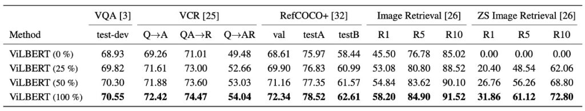

## Interwoven Layers in the Beginning

[**ViLBERT: Pretraining Task-Agnostic Visiolinguistic Representations for Vision-and-Language Tasks**](https://arxiv.org/abs/1908.02265)

---

Each year in academia brings numerous developments, and 2019 was especially eventful, with the wave of advancements still unfolding.

## Defining the Problem

Current methods primarily train visual and language models separately before attempting to combine them.

This approach often leads to suboptimal results, as models struggle to generalize well when visual and language data are limited or biased. While models may be capable of recognizing objects in images or understanding language independently, creating meaningful connections between these two modalities remains a significant challenge.

The authors aim to depart from traditional learning approaches, designing a method to help the model simultaneously learn from both images and text, thus fostering a closer association between them.

## Approach

### Model Architecture

<figure style={{"width": "85%"}}>

</figure>

Inspired by BERT, the authors sought to develop a similar model that could learn joint representations of language and visual content from paired data.

In BERT’s original architecture, only language data is processed. The authors wondered if some of these inputs could be replaced with image data, enabling the model to simultaneously learn connections between images and text.

As shown above, the authors propose a dual-stream architecture: one stream is dedicated to visual processing, and the other to language. These streams interact through cross-attention mechanisms, allowing variable network depth for each modality and enabling cross-modal connections at different layers.

The image input is derived from bounding boxes and visual features extracted by a pre-trained object detector, which are then combined with visual position encodings.

### Pre-training Tasks

<figure style={{"width": "70%"}}>

</figure>

As illustrated above, the authors propose two main pre-training tasks: Masked Language Modeling (MLM) for multimodal learning and multimodal alignment prediction.

- **Multimodal MLM**: This task aims to enable the model to reconstruct masked inputs.
- **Multimodal Alignment Prediction**: This task requires the model to determine whether the image and text are aligned—whether the text accurately describes the image.

The model is trained on the Conceptual Captions dataset, which consists of 3.3 million image-caption pairs automatically extracted from web images. Despite some noise and incomplete captions, this dataset provides a rich variety of visual content.

The experimental setup includes:

- Language model initialization using BERT-BASE, which was pre-trained on BookCorpus and English Wikipedia.
- Visual features derived from a pre-trained Faster R-CNN.
- Transformer and co-attentional Transformer blocks in the visual stream with 1024 neurons and 8 attention heads.
- Training on 8 TitanX GPUs for 10 epochs.

## Discussion

### How Effective is ViLBERT?

As shown above, the ViLBERT model achieves impressive performance across various vision-language tasks.

It performs well not only in pre-trained settings (compared to single-stream and ViLBERT models) but also in non-pre-trained settings (compared to single-stream† and ViLBERT† variants). In particular, ViLBERT demonstrates significant benefits in tasks such as VQA and RefCOCO+.

Using ViLBERT in pre-training tasks leads to improvements of 2% to 13% across various tasks (comparing ViLBERT and ViLBERT†), indicating that both ViLBERT and single-stream models benefit from pre-training.

ViLBERT’s fine-tuning strategy surpasses state-of-the-art task-specific models across four established tasks. Notably, it sets a new benchmark in VCR, RefCOCO+, and image retrieval, with improvements of 7-10 percentage points. Moreover, expanding the model to these tasks is relatively straightforward, requiring only an additional classifier per task.

### Impact of Model Depth on Performance

As shown above, the authors examine how model depth affects ViLBERT’s performance.

- **VQA and Image Retrieval**: Both tasks benefit from deeper ViLBERT models, with performance increasing monotonically with depth, peaking at a depth of 6 layers.
- **Zero-Shot Image Retrieval**: Performance also improves significantly with model depth, suggesting that deeper models may be more suitable for this task.
- **VCR and RefCOCO+**: These tasks, in contrast, seem to perform better with shallower models, indicating that different tasks may require different model depths for optimal performance.

:::tip
In today’s era of extremely deep models—GPT-3 with its 96 layers, we’re looking at you!—even 2 or 8 layers would still be considered relatively small-scale architectures.
:::

### Effect of Pre-training Data

When pre-trained on random subsets of 25% and 50% of the Conceptual Captions dataset, the model’s accuracy increases as the amount of data increases.

This finding supports a common belief in deep learning: more training data typically enhances model performance, as it allows the model more opportunities to learn and extract useful features and patterns.

Additionally, this suggests that ViLBERT could potentially benefit from even larger datasets during pre-training, making it a promising direction for future research and applications to further optimize model performance.

## Conclusion

In the early days of multimodal research, the development of dual-stream architecture marked a major breakthrough, offering a more nuanced perspective on understanding and capturing relationships between images and text.

The introduction of ViLBERT represents a milestone in this field, as it attempts to deeply integrate visual content with language, establishing close connections between the two and achieving outstanding performance on various vision-language tasks.
