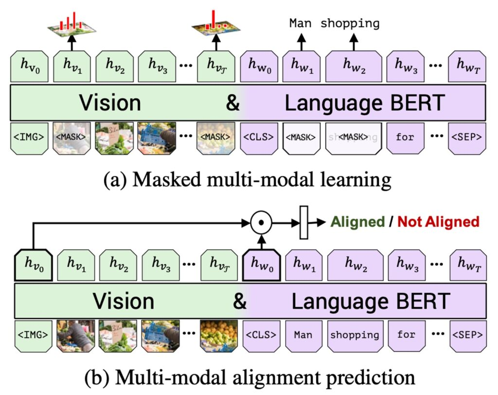
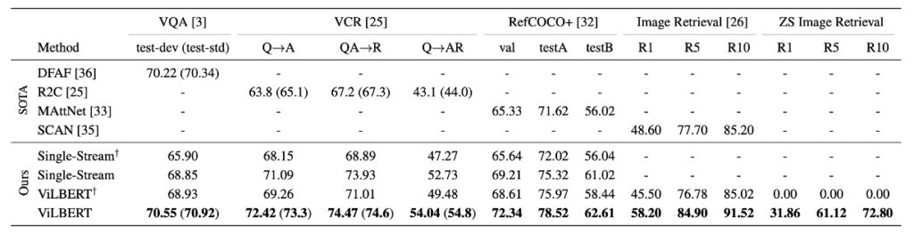

# [19.08] ViLBERT

## Interweaving in the Prologue

[**ViLBERT: Pretraining Task-Agnostic Visiolinguistic Representations for Vision-and-Language Tasks**](https://arxiv.org/abs/1908.02265)

---

This article introduces ViLBERT, which emerged around the same time as VisualBERT. 2019 was a particularly eventful year in the academic world, and we are far from the end of this journey.

We all know that it is no easy task to make machines truly "understand" an image and describe it in words. In the past, most research methods separated image understanding from language processing. However, when attempting to combine these two domains, the results often fell short. It's like a machine can recognize that an image shows a Shiba Inu but struggles to identify the breed when asked, "What breed of dog is this?"

This paper proposes a new approach: ViLBERT. Unlike traditional methods, ViLBERT aims to simultaneously teach machines about images and language from the start. For example, when given a photo of a red apple along with the text "This is a red apple," ViLBERT tries to help the machine understand the connection between the word "red" and the apple's color.

Preliminary research shows that ViLBERT performs exceptionally well in various tests, significantly outperforming other methods. Specifically, in question-answering tasks, ViLBERT not only "sees" the images but also provides more accurate answers.

Let's explore how the authors define the problem and the solutions they propose in this paper.

## Defining the Problem

### Integrating Vision and Language

Although both fields have made significant progress individually, combining them remains challenging. Most current methods train vision and language models separately and then attempt to merge them. This approach often yields suboptimal results, especially when visual and language data are limited or biased, leading to poor generalization.

### Effective Visual Grounding

Even if computers can recognize objects in images or understand language, linking the two remains a significant challenge. For instance, a computer might recognize a dog in an image but fail to associate it with the concept of a "Shiba Inu" or "Shepherd Dog."

## Solving the Problem

### ViLBERT Model Design

When designing the ViLBERT model, the primary goal was to merge vision and language to create a model that can learn from paired image and text data. Inspired by BERT's success in language modeling, the authors aimed to develop a similar model that can learn joint representations of language and vision from paired data.

1. **Basic Concept**

   - The authors mention an intuitive design approach: treating visual input as "tokens" similar to text input. However, this method has limitations as it may lose visual details and overlook the need for different processing levels for the two modalities.

2. **Dual-Stream Architecture**

   - The authors proposed a dual-stream architecture with one stream dedicated to vision and the other to language.
   - These two streams interact through co-attention Transformer layers, allowing variable network depth in each modality and enabling cross-modal connections at different depths.

3. **Co-Attention Transformer Layer**

   - This is the core mechanism introduced by the authors, allowing the model to exchange information between keys and values in each modality.
   - This design enables features in one modality to be integrated into the representations of the other modality.

4. **Image Representation**

   - The authors chose to extract bounding boxes and corresponding visual features from a pre-trained object detection network.
   - Since image regions do not have a fixed sequence, the authors encoded spatial positions based on region locations and combined them with visual features.

5. **Training Tasks and Objectives**

   - The authors proposed two primary pre-training tasks: MLM (Masked Language Modeling) and multimodal alignment prediction.
   - The MLM task aims to enable the model to reconstruct masked input.
   - Multimodal alignment prediction requires the model to determine whether the image and text are aligned, i.e., if the text describes the image.

### Pre-Training Mechanism

1. **Training ViLBERT**

   - **Dataset**

     - The authors used the Conceptual Captions dataset for training, consisting of 3.3 million image-caption pairs automatically harvested from web images.
     - Although this dataset contains some noise and incomplete captions, it provides a highly diverse set of visual content.

   - **Implementation Details**
     - The language stream was initialized using the BERT-BASE model, pre-trained on BookCorpus and English Wikipedia.
     - Visual features were extracted using Faster R-CNN, pre-trained on the Visual Genome dataset.
     - Both the Transformer and co-attention Transformer blocks in the visual stream had 1024 neurons and 8 attention heads.
     - The entire model was trained for 10 epochs on 8 TitanX GPUs.

2. **Fine-Tuning on Vision and Language Tasks**

   The authors applied the pre-trained ViLBERT model to a set of vision and language tasks and fine-tuned it. Below is a detailed overview of each task:

   - **Visual Question Answering (VQA)**

     - **Dataset**: Trained and evaluated on the VQA 2.0 dataset, which contains 1.1 million questions related to COCO images.
     - **Fine-Tuning Method**: Fine-tuned using two layers of MLP on top of the element-wise product of image and text elements, mapping the representation to 3,129 possible answers. Multilabel classification was performed using binary cross-entropy loss.

   - **Visual Commonsense Reasoning (VCR)**

     - **Dataset**: VCR dataset, sourced from 110,000 multiple-choice QA questions from movie scenes.
     - **Fine-Tuning Method**: Fine-tuned with each possible answer and question combination as four separate text inputs, then fine-tuned each text input with the image. Finally, predicted scores for each pair were calculated.

   - **Grounding Referring Expressions**

     - **Dataset**: RefCOCO+ dataset.
     - **Fine-Tuning Method**: Used proposed bounding boxes generated by Mask R-CNN, re-ranked each set of image region proposals, and trained using binary cross-entropy loss.

   - **Caption-Based Image Retrieval**

     - **Dataset**: Contains 31,000 images from Flickr, each with five unique captions.
     - **Fine-Tuning Method**: Trained in a multiple-choice setting, randomly selecting three distractors by replacing a random caption, a random image, or a hard negative from the target image's 100 nearest neighbors. Calculated similarity scores for each pair using alignment prediction and applied the softmax function to determine the most likely match.

   - **Zero-shot Caption-Based Image Retrieval**

     - **Dataset**: Used the Flickr30k dataset for zero-shot image retrieval.
     - **Method**: Aimed to demonstrate ViLBERT's ability to localize based on text from pre-training on the Conceptual Captions dataset, generalizing to unseen visual and language variations without task-specific fine-tuning. The authors directly used the pre-trained ViLBERT model, leveraging the alignment prediction objective as a scoring function to evaluate image-caption alignment.

## Discussion

### How Well Does ViLBERT Perform?

Referring to Table 1, the ViLBERT model demonstrated excellent performance across various vision-language tasks:

- **Comparison with Baselines**

  ViLBERT outperformed both single-stream models and ViLBERT in both pre-training and non-pre-training scenarios. Particularly in VQA and RefCOCO+, ViLBERT achieved the most significant gains.

- **Benefits of Pre-Training Tasks**

  By using ViLBERT in pre-training tasks, performance improved by 2% to 13% across different tasks (comparing ViLBERT with ViLBERT†). This indicates that both ViLBERT and single-stream models can benefit from these pre-training tasks.

- **Comparison with Task-Specific Benchmarks**

  Fine-tuning ViLBERT surpassed state-of-the-art task-specific models in all four established tasks. Notably, in VCR, RefCOCO+, and image retrieval, ViLBERT set new technical standards with a 7-10 percentage point increase. Additionally, extending these tasks was relatively straightforward, requiring only the addition of a classifier for each task.

### How Does the Depth of ViLBERT's Visual Stream Affect Performance?

From Table 2, it's evident that the depth of ViLBERT's visual stream impacts its performance across various tasks:

- **VQA and Image Retrieval**

  Both tasks benefited from deeper ViLBERT models, with performance monotonically increasing as layer depth increased. Performance peaked at a depth of 6 layers.

- **Zero-shot Image Retrieval**

  For this task, deeper models showed significant gains, indicating that deeper models might be more suitable for this task.

- **VCR and RefCOCO+**

  Contrary to the above tasks, these tasks seemed to favor shallower models, suggesting that different tasks might require different model depths for optimal performance.

:::tip
From the perspective of modern models with up to 100 layers (yes, GPT-4, we're talking about you!), whether it’s 2 or 8 layers, it's still within the scale of small models.
:::

### Impact of Pre-Training Dataset Size

The experiments show that the size of the pre-training dataset significantly impacts ViLBERT's performance.

When randomly sampling 25% and 50% subsets of the Conceptual Captions dataset for pre-training, performance increased monotonically with more data used.

This finding confirms the common notion in deep learning that more training data provides better performance, as the model has more opportunities to learn and extract features and patterns from numerous samples.

Moreover, it suggests that ViLBERT has the potential to benefit from even larger datasets during pre-training, which could be a direction for future research and applications to further optimize and enhance model performance.

### What Did ViLBERT Learn?

During pre-training, ViLBERT learned semantically meaningful alignments between visual and language elements from the Conceptual Captions dataset. This is evident from its performance in zero-shot caption-based image retrieval: although zero-shot performance is noticeably lower than the fine-tuned models, it performs reasonably well on the Flickr30k images and captions without any exposure to them. This demonstrates that ViLBERT successfully learned and mastered alignment techniques during pre-training.

Additionally, by inputting images and generating conditional text descriptions (essentially image captions), we can further understand what ViLBERT learned during pre-training. While the generated descriptions are unlikely to be high quality without fine-tuning on clean, human-annotated captions, they still provide insight into the pre-trained model's learning outcomes.

However, it's important to note that generating text from BERT-style models remains a challenge. In ViLBERT's case, the generated "captions" often describe the primary content of the image but may sometimes include edited or non-visual concepts from Conceptual Captions, leading to discrepancies between descriptions and actual image content.

## Conclusion

In this article, the researchers delve into the application of self-supervised learning in the vision and language domain. ViLBERT represents a milestone in this field, attempting to deeply integrate image content with text, tightly combining the two. It can be seen as a computer simultaneously reading images and text, trying to understand their relationship.

Compared to the earlier VisualBERT, ViLBERT's dual-stream architecture stands out, providing a more detailed perspective to observe and learn the nuanced connections between images and text. For example, when describing a cooking process, ViLBERT can more accurately align textual descriptions with visual content, rather than simply identifying key objects or actions.

While ViLBERT has already surpassed some previous techniques in certain applications, further validation and optimization are needed in more scenarios and tasks. Compared to earlier VisualBERT, ViLBERT shows more potential and depth, but each method has its unique aspects worth further research and comparison.
