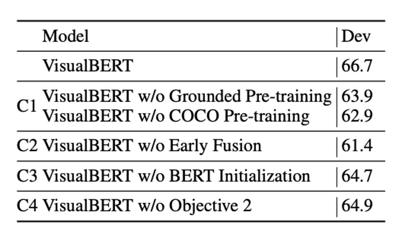

## Gaze at the Prelude

[**VisualBERT: A Simple and Performant Baseline for Vision and Language**](https://arxiv.org/abs/1908.03557)

---

Around 2015, numerous cross-modal models were proposed, most of which were based on LSTM architectures.

Fast forward to 2017, when the Transformer made a major impact in NLP, and soon after, the attention mechanism began to shine in multimodal fields. The integration of language and vision once again became a hot research focus.

How could we miss out on something this exciting?

Inspired by these developments, the authors aimed to capture implicit relationships within images through the attention mechanism and believed that pre-training could effectively facilitate the learning of such relationships.

## Defining the Problem

Based on previous research, the authors identified a few current challenges:

- **Unified Vision-Language Model Architecture**: Many existing models are designed for specific vision-language tasks, lacking a general-purpose model that can handle a variety of tasks.
- **The Importance of Pre-training**: While BERT has demonstrated the significance of pre-training, the role of pre-training in the multimodal domain has yet to be fully explored.
- **Challenges in Understanding Image Semantics**: The association between images and text remains difficult to achieve effectively.

## Solving the Problem

### Model Architecture

<figure style={{"width": "80%"}}>

</figure>

The core idea of VisualBERT is to leverage the self-attention mechanism within the Transformer to automatically align elements of input text with regions within an image.

VisualBERT builds upon the BERT model and adds a set of visual embeddings, denoted as $F$, to represent the image. Each $f \in F$ corresponds to a bounding region in the image, derived from an object detector.

Each visual embedding $f$ is composed of three summed embeddings:

1. **Regional Feature Embedding** ($f_o$): Represents the visual feature of the bounding region, computed by a convolutional neural network.
2. **Segment Embedding** ($f_s$): Marks the embedding as an image embedding (in contrast to a text embedding).
3. **Position Embedding** ($f_p$): When alignment information between text and bounding regions is provided in the input, this embedding represents the aligned position, set as the sum of the position embeddings corresponding to the aligned words.

The visual embeddings are passed through multiple layers of the Transformer along with the original text embeddings, enabling the model to automatically discover useful alignments between the two input sets and build a new joint representation.

:::tip
This is an early paper, so cross-modal processing might seem somewhat rudimentary, but it still serves as a great starting point.
:::

### Pre-training Mechanism

VisualBERT is designed to handle both language and visual inputs, using the COCO dataset for training. The COCO dataset provides multiple paired annotations, with each image associated with five independent captions.

The training is divided into three main phases:

1. **Task-Agnostic Pre-Training**: The model is first pre-trained on COCO with two visually grounded language modeling objectives:

   - **Masked Language Modeling**: Randomly masks some words in the text input, requiring the model to predict the masked words while leaving the vectors corresponding to image regions unmasked.
   - **Sentence-Image Prediction**: Since each image in the COCO dataset is associated with multiple captions, the model receives a text segment consisting of two captions. One caption describes the image, while the other has a 50% chance of being another related caption and a 50% chance of being a randomly selected caption. The model is trained to distinguish between these two scenarios.

2. **Task-Specific Pre-Training**: Before fine-tuning VisualBERT for specific downstream tasks, the model undergoes additional pre-training on the task-specific dataset, with the objective of masked language modeling combined with image features. This phase helps the model adapt better to the target domain.

3. **Fine-Tuning**: In the final step, the model is fine-tuned with task-specific inputs, outputs, and objectives, with training focused on maximizing performance on the target task.

## Discussion

### Performance on VQA

<figure style={{"width": "85%"}}>

</figure>

The task in Visual Question Answering (VQA) is to answer a question correctly based on a given image. Here, the VQA 2.0 dataset is used, which includes over one million questions about images from COCO.

The model is trained to predict the 3,129 most frequent answers. Image features are derived from a ResNeXt-based Faster R-CNN, pre-trained on Visual Genome.

The results, shown in the table above, include three categories of methods:

1. Baseline methods using the same visual features and number of bounding region proposals.
2. The model presented in this study.
3. Non-comparable methods, including those using additional question-answer pairs from Visual Genome, multiple detectors, and model ensembles.

VisualBERT outperforms existing methods in comparable settings.

:::tip
There are also numerous other datasets and tasks, such as VCR and $\text{NLVR}^2$, which we won’t delve into here.
:::

### Ablation Study

<figure style={{"width": "60%"}}>

</figure>

The authors conducted an ablation study on the NLVR2 dataset, testing two ablation models and four additional variants of VisualBERT. To simplify computation, all models, including the full model, used only 36 features per image.

The study analyzed the contributions of the following four key components in VisualBERT:

1. **C1: Task-Agnostic Pre-training**:

   - To examine the impact of task-agnostic pre-training, two variants were created:
     - A model without any pre-training (VisualBERT w/o COCO Pre-training).
     - A model pre-trained with only text from COCO (without images) (VisualBERT w/o Grounded Pre-training).
   - Both variants performed worse, indicating that pre-training on paired vision-language data is crucial.

2. **C2: Early Fusion**:

   - This variant, VisualBERT w/o Early Fusion, excludes early fusion to test the importance of early interactions between image and text features. The results confirmed that multi-layered vision-language interactions significantly enhance performance.

3. **C3: BERT Initialization**:

   - All models were initialized with pre-trained BERT parameters. To assess the contribution of BERT initialization, a variant with randomly initialized parameters was trained in the same way as the full model. Results showed that while BERT weights from language-only pre-training are beneficial, the performance drop was less than expected. This suggests that the model learned many valuable grounded language aspects during COCO pre-training.

4. **C4: Sentence-Image Prediction Objective**:
   - A variant excluding the sentence-image prediction objective (VisualBERT w/o Objective 2) was introduced to investigate the effect of this objective in task-agnostic pre-training. The results indicated that this objective has a positive, though relatively minor, impact compared to other components.

The findings confirm that the most critical design choices are **task-agnostic pre-training (C1)** and **early fusion of vision and language (C2)**. In the pre-training phase, including COCO data and using both images and captions are essential.

## Conclusion

VisualBERT not only demonstrates robust performance but also offers an interpretable and intuitive means of understanding information through its built-in attention mechanism.

However, one challenge remains unavoidable:

- When models incorporate object detection, the architecture becomes overly complex and challenging to use.
- Overly intricate designs limit the model's potential for practical application and complicate deployment.

Therefore, optimizing and simplifying this architecture should be considered a key direction for future research.
