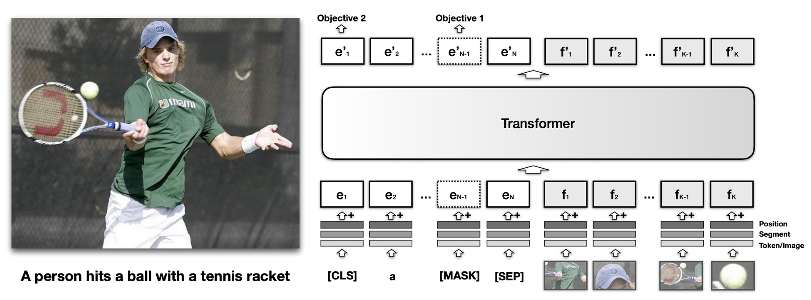

# [19.08] VisualBERT

## Gaze at the Prelude

[**VisualBERT: A Simple and Performant Baseline for Vision and Language**](https://arxiv.org/abs/1908.03557)

---

:::info
The following content has been compiled by ChatGPT-4 and manually proofread, edited, and supplemented.
:::

---

Around 2015, many multimodal models based on LSTM architecture were being explored, as mentioned by the authors: "Multimodal model research is nothing new!" With the advent of the Transformer architecture and its attention mechanism in 2017, significant advancements were made in natural language processing. Notably, BERT successfully pre-trained a general language encoder capable of predicting masked words in a text.

By 2019, the application of attention mechanisms in the multimodal domain had also advanced significantly, refocusing research on combining language and vision to extract deeper semantic details from images, including objects, attributes, parts, spatial relationships, actions, and intentions.

Inspired by this, the authors sought to capture implicit relationships in images using attention mechanisms and believed that pre-training could effectively learn these relationships. Based on previous research, they identified several current issues:

## Problem Definition

- **Complex Interaction Between Vision and Language:**

  - Current vision-language tasks (e.g., object recognition, visual captioning, visual question answering, and visual reasoning) require systems to understand detailed image semantics, including objects, attributes, parts, spatial relationships, actions, and intentions, and how these concepts are referenced and established in language.

- **Unified Model Architecture for Vision and Language:**

  - Many existing models are designed for specific vision-language tasks and lack a universal model that can be applied across various tasks.

- **Importance of Pre-Training:**

  - How to effectively pre-train models on vision and language data to enhance their performance in downstream tasks.

- **Challenges in Understanding Image Semantics:**

  - Capturing and understanding the detailed semantics described in images and associating them with textual descriptions.

## Solution

### VisualBERT Model Design

1. **Attention Mechanism:**

   - The core idea of VisualBERT is to use the attention mechanism in Transformers to implicitly align elements of the input text with regions in the input image.

2. **Visual Features:**

   - In addition to all components of BERT, VisualBERT introduces a set of visual features called F to model images.
   - Each feature in F corresponds to an object region in the image, derived from an object detector (possibly Faster RCNN or others).
   - Each feature f in F is calculated as the sum of the following three features:
     - (f_o): The visual feature representation of the object region f, computed by a convolutional neural network.
     - (f_s): Segment feature indicating it is an image feature as opposed to a textual feature.
     - (f_p): Positional feature, used when alignment between words and object regions is provided as part of the input and set to the sum of the positional features corresponding to the aligned words.

3. **Combining Visual and Text Features:**

   - The visual features F are passed along with the original text feature set E through multiple layers of Transformers. This design allows the model to implicitly discover useful alignments between the two sets of inputs (text and image) and build new joint representations.

This architecture enables VisualBERT to capture rich semantic relationships between images and corresponding texts when handling multimodal tasks, leveraging the powerful capabilities of Transformers for deep representation learning.

### Pre-Training Mechanism

The pre-training process of VisualBERT can be divided into three main stages:

1. Task-Agnostic Pre-Training:

   - **Data Source:**

     - Assume a photo in the COCO dataset shows a little boy playing with his dog in a park. Five possible captions for this photo might be:
       - A little boy playing in the park.
       - A dog chasing a ball on the grass.
       - A child and his pet enjoying time outdoors.
       - A boy and a dog having fun in the sun.
       - A kid and a dog interacting in the park.

   - **Masked Language Modeling:**

     - Using the first caption "A little boy playing in the park" as an example, randomly mask the word "playing," resulting in "A little boy in the park [MASK]." VisualBERT's task is to predict the masked word "playing" based on the context and the corresponding image (a boy and a dog in the park).

   - **Sentence-Image Prediction:**
     - Given the same photo, provide the model with two captions:
       - (a) A little boy playing in the park (describes the image)
       - (b) An old lady shopping at the market (a random unrelated caption)
     - VisualBERT receives these two captions and the photo as input and must determine which caption matches the image. The correct answer is caption (a).

2. Task-Specific Pre-Training:

   - Before fine-tuning VisualBERT for specific downstream tasks, this pre-training stage helps the model adapt better to the target domain. This stage primarily involves masked language modeling with image targets, training on specific task data to accustom the model to the new target domain.

3. Fine-Tuning:
   - This step is similar to BERT's fine-tuning strategy. First, introduce the corresponding input, output layers, and objectives for the specific task. Then train the Transformer to maximize performance on the task.

By combining these three stages of pre-training, the authors aim to make the model more generalized and adaptable to various vision-language tasks.

## Discussion

In this study, the authors observed that VisualBERT not only performed well across various tasks but also provided unique insights into training strategies and architectural design. Specifically, how to integrate image and text information and establish deep semantic connections between the two.

Next, let's explore the core advantages of VisualBERT, the chosen pre-training strategies, and how it effectively captures the detailed relationships between images and language.

### How Well Does the Model Perform?

- **VQA**

  - **Task Description:**

    - Goal: Provide correct answers to given images and questions.
    - Dataset: VQA 2.0, proposed by Goyal et al. in 2017.
    - Dataset Characteristics: Contains over 1 million questions related to COCO images.

  - **Model Training:**

    - Answer Selection: Train the model to predict 3,129 most common answers.
    - Image Feature Source: Based on ResNeXt Faster RCNN, pre-trained on Visual Genome.

  - **Part One:**

    - Baseline models using the same visual features (in terms of feature dimensions) and object region proposals (in terms of the number of selected regions) as in the study.

  - **Part Two:**

    - Model results of VisualBERT.

  - **Part Three:**

    - Results of other non-comparable methods, including those using external QA pairs, multiple detectors, and model ensembles.

  - **Summary:**

    - Performs well against comparable baselines.
    - For non-comparable methods, the proposed method is simple and outperforms existing methods in efficiency and performance.

- **VCR**

  - **Task Description:**

    - VCR includes 290,000 questions from 110,000 movie scenes.
    - These questions focus mainly on visual commonsense.

  - **Subtasks:**

    - VCR is divided into two multiple-choice subtasks.
    - These are Question Answering (Q → A) and Answer Justification (QA → R).
    - Separate models are trained for both subtasks.

  - **Image Features:**

    - ResNet50 (proposed by He et al. in 2016) extracts image features.
    - Use "gold" object bounding boxes and segmentation provided in the dataset.

  - **Text-Image Alignment:**

    - VCR provides alignment between words referenced in the text and object regions.
    - Using corresponding positional features to match words and regions, the model utilizes this alignment.

  - **Comparison Baseline:**

    - Compared with the dataset's baseline model based on BERT (R2C).
    - Also compared with the top single model on the leaderboard (B2T2).

  - **Summary:**

    - A trimmed-down version of VisualBERT without COCO pre-training performs significantly better than R2C with the same resource allocation.
    - The full version of VisualBERT further improves performance.

  Although there is a significant domain difference between VCR (mainly covering movie scenes) and COCO, pre-training on COCO is still very beneficial for VCR.

- **NLVR2**

  - **Task Description:**

    - NLVR2 focuses on joint reasoning between natural language and images.
    - Major challenges include semantic diversity, compositionality, and visual reasoning.
    - The task is to determine whether a given natural language description accurately describes a pair of images.
    - Contains over 100,000 English sentence examples paired with web images.

  - **Segment Feature Adjustment:**

    - The segment feature mechanism in VisualBERT is adjusted.
    - Used to assign features from different images using different segment features.

  - **Image Features:**

    - Utilizes Detectron's pre-trained detector to obtain image features.
    - Each image uses 144 proposals to provide features.

  - **Summary:**
    - VisualBERT shows superior performance.
    - PhBERT without early fusion and VisualBERT without COCO pre-training significantly outperform the previous leading model MaxEnt.
    - The full version of VisualBERT further extends its performance gap with other models.

- **FLICKR30K**

  - **Task Description:**

    - The main goal of the Flickr30K dataset is to test a system's ability to locate specific object regions in an image based on phrases in captions. - Given part or a segment of a sentence, the system needs to select the corresponding image object region. - The dataset contains 30k images and nearly 250k annotations.

- **Model Configuration:**

  - Based on the BAN setup (proposed by Kim et al. in 2018).
  - Image features are obtained using Faster R-CNN pre-trained on Visual Genome.
  - During fine-tuning, additional attention blocks are added, and the average weight of the attention heads is used to predict alignment between object boxes and phrases.
  - During system prediction, the box most attended to in the last sub-word of the phrase is selected as the result.

- **Summary:**
  - VisualBERT outperforms the current leading model BAN on this task.
  - Interestingly, models without early fusion do not show significant performance differences from the full version of VisualBERT, suggesting that simpler or shallower model structures may suffice for this task.

### What Is Most Important in This Model Design?

The authors explore which components or design choices in the VisualBERT model contribute most to its performance.

They selected the following four core components/strategies for ablation studies:

1. Task-agnostic pre-training (C1).
2. Early fusion, i.e., early interaction between image and text features (C2).
3. Initialization strategy of BERT (C3).
4. Sentence-image prediction objective (C4).

Experimental results show:

1. Task-agnostic pre-training (C1) is crucial. Pre-training on paired visual and language data significantly improves model performance.
2. Early fusion (C2) is also important. Allowing early interaction between image and text features enhances mutual influence between visual and language components across multiple interaction layers.
3. The initialization strategy of BERT (C3) has some importance. Although performance declines without BERT pre-trained weights, the decline is not as severe as expected, suggesting that the model also learns substantial language grounding knowledge during COCO pre-training.
4. The sentence-image prediction objective (C4) has a certain impact but is less significant than other components.

### Does the Model Really Focus on the Right Areas?

The authors investigate whether the attention heads in VisualBERT can correctly map entities in sentences to corresponding object regions in images. Additionally, they examine whether the attention heads can identify syntactic relationships in sentences, especially when these syntactic relationships have clear correspondences with image regions.

1. Entity Recognition:

   - Many attention heads in VisualBERT exhibit high accuracy without direct supervision for entity recognition.
   - The accuracy appears to improve in higher layers of the model, suggesting that early layers may be less certain about entity recognition, while later layers become increasingly confident.

2. Syntactic Basis:

   - Many attention heads in VisualBERT seem to capture syntactic relationships, especially the associations between verbs and their corresponding arguments.
   - For various syntactic dependency relationships, at least one attention head in VisualBERT performs significantly better than a baseline based on guessing.
   - This indicates that VisualBERT can implicitly identify and map syntactic structures without explicit syntactic supervision.

### How Does Attention Distribution Evolve?

The authors explore how VisualBERT progressively changes its attention distribution across multiple Transformer layers to more accurately align entities or concepts in text with corresponding regions in images.

- Attention Refinement: VisualBERT incrementally refines the alignment between text and images across its successive Transformer layers. For example, as illustrated in the bottom left of the image, initially, both "husband" and "woman" might strongly focus on the "woman" region in the image, but this alignment becomes more precise and correct in later layers of the model.
- Syntactic Alignment: VisualBERT can align entities not only based on semantics but also based on syntax. For example, in the image, the word "teasing" focuses on both the man and woman, while the word "by" focuses only on the man.
- Coreference Resolution: VisualBERT seems capable of resolving coreference in language, correctly aligning the word "her" to the "woman" in the image.

## Conclusion

VisualBERT demonstrates outstanding performance across various vision-language tasks. These results not only validate the model's effectiveness but, more importantly, through its built-in attention mechanism, VisualBERT provides an interpretable and intuitive way to capture and understand information.

However, one thing remains unavoidable:

- When combining object detection models, the model architecture becomes highly complex and challenging to use.
- This excessive complexity may inhibit the model's potential in practical applications, increasing the difficulty of deployment and adjustment.

Therefore, optimizing and simplifying this architecture should be considered a crucial direction for future research.

Of course, many issues still require further exploration and clarification. For instance, can VisualBERT perform equally well on purely visual tasks, such as scene graph parsing and contextual recognition? Additionally, can its capabilities be further expanded through pre-training on larger caption datasets, such as Visual Genome and Conceptual Captions?

At this stage, despite many questions that warrant further investigation, this research provides clear directions for future researchers.
