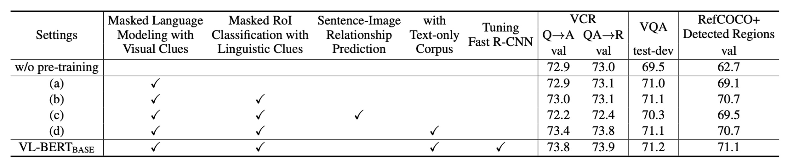

# [19.08] VL-BERT

## Watching from the Sidelines

[**VL-BERT: Pre-training of Generic Visual-Linguistic Representations**](https://arxiv.org/abs/1908.08530)

---

Previously, we discussed VisualBERT, a One-Tower Encoder structure, which primarily supervises the text portion without direct visual supervision. We also covered ViLBERT, a Two-Tower Encoder where visual and text encoders interact through cross-attention, though this adds complexity.

- **Wait, what are One-Tower and Two-Tower architectures?**

We haven’t emphasized these terms earlier, as they might seem confusing without further context. But with the emergence of diverse model architectures, it’s a good time to introduce them.

In vision-and-language learning, One-Tower and Two-Tower are two main architectures describing how multimodal information is integrated and exchanged.

1. **Single-Tower Architecture (One-Tower)**

   In this architecture, a single Transformer encoder operates on concatenated visual and language inputs. This approach enables unconstrained and direct interaction between visual and text tokens and generally requires fewer parameters than Two-Tower models.

   Examples include ViLT, VL-BERT, UNITER, and OSCAR. Many models like VisualBERT and VL-BERT adapt BERT for this purpose.

2. **Two-Tower Architecture (Dual-Tower)**

   Here, visual and text inputs are processed separately in distinct Transformer stacks. Cross-modal interactions are introduced through cross-attention layers.

   This architecture allows more explicit and structured interactions, with a separate encoder for each modality, as seen in ViLBERT, LXMERT, and BridgeTower.

## Defining the Problem

When choosing between these architectures, there are trade-offs to consider.

On one hand, One-Tower Encoder provides a straightforward training approach but may not capture deep associations between images and text. On the other, Two-Tower Encoder captures richer connections but adds complexity and demands more computational resources.

This paper’s authors aim to integrate the strengths of both architectures, creating a truly versatile visual-linguistic representation that performs well across multiple vision-language tasks.

## Approach

### Model Architecture

<figure style={{"width": "80%"}}>

</figure>

Inspired by BERT, the VL-BERT model builds on the original BERT framework, a multi-layer bidirectional Transformer encoder designed to capture dependencies between input elements.

To accommodate both visual and language inputs, the model input sequence begins with a special `[CLS]` token, followed by language elements, visual elements, and ends with an `[END]` token. A `[SEP]` token is inserted between language and visual elements to differentiate them clearly.

Each input element in VL-BERT is represented by four encoding types: token encoding, visual feature encoding, segment encoding, and sequence position encoding. Visual feature encoding is especially important for capturing visual clues, while the other encodings derive from the original BERT design.

The visual feature encoding includes appearance features extracted by Faster R-CNN from RoIs (regions of interest) and geometric features describing each element's position within the image.

### Pre-training Mechanism

<figure style={{"width": "80%"}}>

</figure>

The authors design specific pre-training tasks to help VL-BERT capture relationships between visual and language elements.

- **Task #1: Masked Language Modeling (MLM) with Visual Clues**

  This task adapts BERT’s MLM task to use visual information. For example, given the sentence “The puppy is playing in the [MASK],” and an image showing a puppy playing in a pool, the model predicts that the masked word is “pool” using unmasked portions and visual clues.

- **Task #2: Masked RoI Classification with Language Clues**

  Here, a part of an image (e.g., a bird) is masked. Given a description like “The bird is flying in the clear [MASK],” the model must predict that the masked RoI corresponds to “sky” using other image parts and contextual cues from the text.

## Discussion

### Comparison with Other Models

The dataset used is VQA v2.0, based on COCO images, with training, validation, and test splits comprising 83k, 41k, and 81k images, respectively, and 444k, 214k, and 448k questions.

The pre-trained VL-BERT shows a 1.6% improvement on the VQA task. Compared to BUTD, a popular model tailored for this task, VL-BERT achieves over 5% higher accuracy. Among contemporary models, VL-BERT performs well, ranking just behind LXMERT, which was pre-trained on a larger dataset.

This experiment highlights the importance of pre-training, especially for tasks like visual question answering. Despite training on a smaller dataset than LXMERT, VL-BERT achieves comparable performance to state-of-the-art models.

### Can the Model Understand Natural Language?

To investigate this, the authors use the RefCOCO+ dataset.

RefCOCO+ is a referential object retrieval dataset focusing on visual grounding tasks where a system receives an image and a natural language description and must locate or identify the specific object mentioned in the description.

Results show that pre-trained VL-BERT significantly improves reference understanding performance, confirming the effectiveness of its pre-training strategy.

When compared with other models like MAttNet, VL-BERT demonstrates strong and efficient performance. Although VL-BERT has a simpler architecture without task-specific modules, it performs comparably to advanced models like ViLBERT.

### Ablation Study

The authors conducted extensive experiments to assess the impact of different design choices on model performance.

1. **Importance of Pre-training**

   Comparing “no pre-training” with the VL-BERT-BASE setting, pre-training shows clear improvements across all three downstream tasks, underscoring its central role in the model’s design.

2. **Task-Specific Benefits**

   Different pre-training tasks benefit different downstream tasks. For example, the Masked RoI Classification task with language cues particularly benefits RefCOCO+ but may not be optimal for other tasks.

3. **Sentence-Image Relation Prediction**

   Although sentence-image relation prediction was considered beneficial, it negatively affected performance across all three downstream tasks, highlighting the need to carefully choose pre-training tasks.

4. **Addition of Pure Text Corpus**

   Adding a pure text corpus enhances performance across all downstream tasks, particularly in the VCR task, which involves complex sentences. This underscores the importance of language information for vision-language models.

5. **End-to-End Training**

   Fine-tuning the entire network, including the Fast R-CNN portion generating visual features, further improves performance across all downstream tasks. This emphasizes the importance of integrating and aligning the visual and language components.

The results confirm that VL-BERT’s pre-training strategy is crucial, not only enhancing task-specific performance but also improving its generalization across multiple downstream tasks. The model design also considers how different pre-training tasks affect downstream performance, optimizing results through end-to-end training.

## Conclusion

VL-BERT’s major strength is its Transformer-based architecture, which avoids task-specific modules, achieving simplicity and efficiency. Pre-training on both the Conceptual Captions dataset and pure text corpus reinforces its ability to align visual and language cues effectively.

The authors’ exploration of additional pre-training tasks offers valuable insights for future researchers and suggests directions for further optimization.
