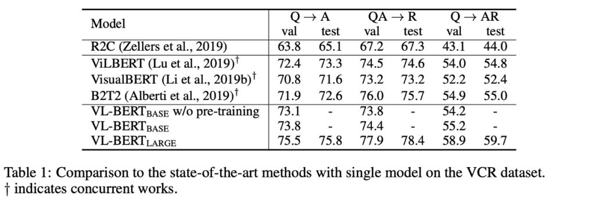
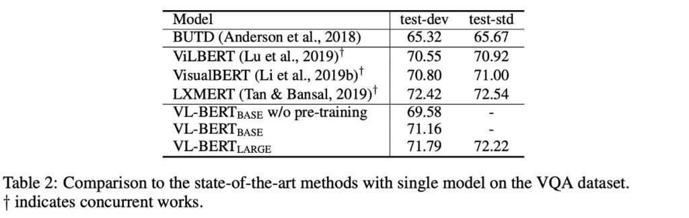

# [19.08] VL-BERT

## Watching from the Prelude

[**VL-BERT: Pre-training of Generic Visual-Linguistic Representations**](https://arxiv.org/abs/1908.08530)

---

Previously, we discussed VisualBERT, which follows a One-Tower Encoder architecture but only supervises the text part during training, leaving the image part unsupervised. We also mentioned ViLBERT, a Two-Tower Encoder architecture, where text and images each have their own encoder and exchange information via a cross-attention mechanism, though it is quite complex.

- **Wait, what's One-Tower, Two-Tower?**

These terms weren't mentioned before because they weren't particularly helpful, but now, with different architectures to compare, it's worth defining them. When discussing vision and language multimodal learning models, we often encounter One-Tower and Two-Tower architectures (there are others, which we'll discuss later).

These two architectures mainly describe how different modalities are integrated and interact.

1. **Single-Tower Architecture (One-Tower)**

   - Concept: In this architecture, a single Transformer encoder operates on the concatenation of visual and textual input representations.
   - Advantages: Since visual and text tokens are embedded into a single input, interactions between modalities are unconstrained and free-flowing. Additionally, it requires fewer parameters than Two-Tower architectures.
   - Common Models: This includes ViLT, VL-BERT, UNITER, OSCAR, etc. Many models like VisualBERT and VL-BERT are variations based on the BERT model.
   - Characteristics: Many of these models leverage BERT's pre-trained weights, though some, like ViLT, use ViT's pre-trained weights.

2. **Two-Tower Architecture (Dual-Tower)**

   - Concept: This architecture does not directly concatenate visual and textual inputs but encodes each modality in separate Transformer stacks. The interactions between modalities are then realized through a cross-attention mechanism.
   - Advantages: It allows for more explicit and structured interactions between modalities. This structure is usually easier to understand as each modality has its own encoder.
   - Common Models: ViLBERT, LXMERT, and BridgeTower are representatives of this type.
   - Characteristics: There may be slight differences among these models. For example, ViLBERT's language module uses BERT-base weights, while LXMERT's parameters are trained from scratch.

Given these different architectures, one might feel confused. On the one hand, One-Tower Encoder architectures offer a more intuitive training method but may not fully explore the relationship between images and text. On the other hand, Two-Tower Encoders, while capable of deeply exploring the relationships between the two, are more complex and require more computational resources.

In this paper, the authors of VL-BERT attempt to combine the advantages of VisualBERT and ViLBERT. They aim to create a truly generic visual-linguistic representation capable of performing well across various vision-language tasks. This is achieved through a pre-training strategy that not only enhances performance on vision-language tasks but also improves generalization to long and complex sentences through pre-training on pure text corpora.

## Problem Definition

In the realm of vision-language tasks, existing research has yet to fully exploit and utilize the combined capabilities of visual and linguistic information:

### Limitations of Pre-Training

Previous works, such as VideoBERT, have initiated pre-training for vision-language tasks, but their clustering methods led to significant loss of visual content and hindered the update of visual network parameters.

### Diversity of Network Architectures

Different studies have opted for various network architectures. For instance, ViLBERT and LXMERT adopted a dual-modality approach, processing visual and linguistic information separately before combining them, while others like VL-BERT chose a unified architecture, allowing early and free interaction between the two types of information.

### Constraints of Attention Patterns

Some methods, like the cross-modal Transformer in ViLBERT, impose restrictions on attention patterns, potentially limiting the model's capabilities.

### Differences in Pre-Training

While multiple works have attempted to derive pre-trained generic representations for vision-language tasks, there are notable differences in their pre-training strategies. For instance, VL-BERT differs from other contemporaneous works in three significant ways: it does not use sentence-image relationship prediction tasks, performs joint pre-training on vision-language and pure text datasets, and updates Fast R-CNN parameters during pre-training.

The authors of this paper aim to address these issues, seeking a more effective way to combine and align visual and linguistic information, and strive for better results in pre-training strategies.

## Solution

### VL-BERT Model Design

In designing the VL-BERT model, the authors drew inspiration from the original BERT model and made specific modifications to handle both visual and linguistic information simultaneously.

Here are the main design steps and strategies:

1. **Architectural Foundation:**

   - The foundation of the VL-BERT model is the original BERT architecture, which is based on a multi-layer bidirectional Transformer encoder.
   - This design allows the model to capture dependencies among all input elements.

2. **Multimodal Input:**

   - Unlike the original BERT model, which only processes text, VL-BERT is designed to accept both visual and linguistic inputs.
   - Visual inputs are obtained from Regions of Interest (RoIs) in images, which may be bounding boxes extracted by an object detector or annotations obtained from specific tasks.

3. **Input Formatting:**

   - Although different vision-language tasks may have different input formats, the unordered nature of the Transformer allows VL-BERT to provide a unified representation for each input element.
   - The model's input starts with a special [CLS] token, followed by linguistic elements, then visual elements, and ends with an [END] token.
   - To clearly distinguish between linguistic and visual information, a special [SEP] token is inserted between linguistic and visual elements.

4. **Feature Encoding Strategy:**

   - Each input element's encoded feature in VL-BERT is composed of four encoding types: token encoding, visual feature encoding, segment encoding, and sequence position encoding.
   - Visual feature encoding is specifically introduced to capture visual cues, while the other three encoding modes are based on the original BERT design.
   - Visual feature encoding includes visual appearance features extracted by Faster R-CNN from RoIs and visual geometry features describing the element's position in the image.

5. **Other Encoding Strategies:**
   - Token Embedding: Uses WordPiece encoding, with a special [IMG] token to indicate visual elements, distinguishing them from linguistic elements.
   - Segment Embedding: Used to distinguish input elements from different sources, such as sentences and images.
   - Positional Embedding: Represents each input element's position in the overall input sequence. Notably, visual elements do not have a fixed, natural order, so their position encodings are the same.

### Pre-Training Mechanism

In this paper, the authors effectively pre-trained VL-BERT by designing specific pre-training tasks to capture relationships between visual and linguistic information.

1. **Data Sources**

   The model was pre-trained using large-scale datasets, with the primary data source being the Conceptual Captions dataset, containing about 3.3 million images with descriptions. For example, an image might show a cat playing under a tree, with a corresponding description like "an orange cat chasing a butterfly under a green tree." Additionally, to enhance the model's language understanding, especially of long and complex sentences, BooksCorpus and English Wikipedia text corpora were also used for pre-training.

2. **Task #1**

   Masked Language Modeling with Visual Clues: This task modifies BERT's masked language modeling (MLM). For example, given the description "The puppy is playing in the [MASK]," and an image showing a puppy playing in a pool, the model needs to predict the masked word "pool" based on the unmasked parts and visual information.

3. **Task #2**

   Masked RoI Classification with Linguistic Clues: For example, an image shows a bird flying in the sky, but the bird is masked. The model's task is to predict the masked RoI based on other parts of the image and a possible description like "a bird flying in the clear [MASK]," where the masked RoI should be "sky."

4. **Fine-Tuning Strategy**
   - Input: For a visual question answering task, the input might be an image and a question, such as an image of a cat sleeping on a sofa with the question "Where is the animal sleeping?" VL-BERT's task is to answer "sofa."
   - Output: Based on the model's input, the output would be the corresponding answer or prediction. In the above example, the final output feature of the [CLS] element might be used to predict the answer "sofa."
   - The authors first pre-trained the VL-BERT model using the large Conceptual Captions dataset and other pure text corpora with specific pre-training tasks. After pre-training, the authors fine-tuned the model based on specific downstream tasks to achieve the best results.

## Discussion

### Comparing VL-BERT with Other Models

- **VCR**

  

  1. **Performance Improvement:** Pre-trained VL-BERT improved overall performance on the VCR task (Q→AR) by 1.0%, showing the potential advantage of pre-trained models in visual-language understanding tasks.
  2. **Comparison with R2C:**
     - Despite using the same input, output, and experimental protocols, VL-BERT significantly out performs R2C. This demonstrates the powerful capabilities of VL-BERT's simple cross-modal architecture.
     - In the original R2C method, three task-specific modules were designed: "Grounding," "Contextualization," and "Reasoning." However, with VL-BERT, the authors chose not to use these ad-hoc task-specific modules but instead employed VL-BERT's generic representation, conducting end-to-end joint training.
  3. **Comparison with Other Existing Methods:** Compared to contemporaneous works such as ViLBERT, VisualBERT, and B2T2, VL-BERT achieved state-of-the-art performance. This further highlights VL-BERT's effectiveness and superiority in visual-language reasoning tasks.

- **VQA**

  

  Using the VQA v2.0 dataset based on COCO images. The dataset includes training, validation, and test sets, containing 83k, 41k, and 81k images, respectively, with 444k, 214k, and 448k questions.

  1. **Experimental Protocol:**

     - For each question, the model needs to select an answer from a shared pool of 3,129 answers.
     - The BUTD experimental protocol, which likely details the evaluation methods and criteria, was used.

  2. **Model Configuration:**

     - The input format is "question, answer, image," with the answer part filled with [MASK] elements.
     - Input RoIs are generated using a pre-trained Faster R-CNN detector from Visual Genome.
     - Multi-class classifiers predict answers based on the output features of the [MASK] elements.

  3. **Experimental Results:**

     - Pre-trained VL-BERT improved performance on the VQA task by 1.6%.
     - Compared to BUTD (a popular model designed specifically for this task), VL-BERT's accuracy is over 5% higher.
     - VL-BERT also performed better than other contemporaneous works, second only to LXMERT, but LXMERT was pre-trained on a larger dataset.

  4. **Importance of Pre-Training:**
     - This experiment confirms the importance of pre-training, especially in visual question answering tasks.
     - Although VL-BERT's training dataset is not as extensive as LXMERT's, it still demonstrates comparable performance to the current best models.

### Does the Model Understand Natural Language?

To answer this question, the authors selected the RefCOCO+ dataset.

RefCOCO+ is a dataset for referential object retrieval. Its main purpose is visual-based reference understanding, where given an image and a description (usually a natural language description), the system needs to locate or identify the specific object referenced in the image.

This task is an important research topic in the field of language-vision fusion, requiring the model to not only understand the meaning of the language description but also map it to the visual content. For example, given a photo with multiple people, the description might be "the man in the red shirt," and the model's task is to accurately mark the position of that man in the image.

RefCOCO+ differs from other referential datasets (like RefCOCO and RefCOCOg) as it specifically prohibits using positional information in the descriptions (e.g., "the dog on the left" or "the apple on the table"). This makes the task more challenging, as the model cannot rely on explicit spatial position cues to find the target object.

1. **Experimental Setup**

   The researchers formatted the model's input according to the specified format, including queries (natural language descriptions) and images. During training, the model attempted to correctly classify each RoI, and during inference, it selected the highest-scoring RoI as the described object.

2. **Effectiveness of Pre-Trained VL-BERT**

   The experimental results show that using pre-trained VL-BERT significantly improved the performance of referential expression understanding. This demonstrates the effectiveness of the pre-training strategy for this task.

3. **Comparison with Other Models**

   When compared to other well-known models like MAttNet, VL-BERT showed its simplicity and strong performance. Despite having a simpler architecture without task-specific modules, VL-BERT performed comparably to state-of-the-art models like ViLBERT.

### What Design in the Model Is Most Useful?

A core and unique aspect of the VL-BERT model is its pre-training strategy, which shows effectiveness and advantages across different downstream tasks.

Here are some key observations and conclusions:

1. **Importance of Pre-Training**

   Comparing the "No Pre-Training" and VL-BERT-BASE settings, it is evident that pre-training significantly enhances performance across all three downstream tasks. This underscores the central role of pre-training in the model's design.

2. **Task-Specific Benefits**

   Different pre-training tasks have varying impacts on different downstream tasks. For example, the Masked RoI classification task with language clues is particularly effective for RefCOCO+ but may not be optimal for other tasks.

3. **Impact of Sentence-Image Relationships**

   Although sentence-image relationship prediction was considered beneficial, it negatively affected the performance across all three downstream tasks. This highlights an important design consideration that not all pre-training tasks benefit all downstream tasks.

4. **Inclusion of Pure Text Corpora**

   Adding pure text corpora had a positive effect on all downstream tasks, especially the VCR task involving complex sentences. This emphasizes the importance of linguistic information for vision-language models.

5. **End-to-End Training**

   End-to-end fine-tuning of the entire network, including the Fast R-CNN component generating visual features, further improved performance across all downstream tasks. This underscores the importance of integrating and coordinating the visual and linguistic components.

Based on the experimental results, the authors believe the most important design aspect of the VL-BERT model is its pre-training strategy. This not only enhances task-specific performance but also provides excellent generalization across various downstream tasks. Additionally, the model's design considers the different impacts of pre-training tasks on downstream performance and further optimizes its performance through end-to-end training.

## Conclusion

Looking back a few years, VL-BERT undoubtedly attracted considerable attention in the field of vision-language models.

This model proposed a generic representation tailored for vision-language tasks, aligning with the technological development trends of the time. Its major selling point was the Transformer-based architecture, avoiding task-specific ad-hoc modules and achieving simple yet effective results. Its pre-training on a large Conceptual Captions dataset and pure text corpora further solidified its capability in aligning visual and linguistic cues.

However, today, when we revisit this classic work, it inevitably shows some limitations in adapting to new and more complex downstream tasks. Although mainstream pre-training strategies of the time yielded significant results, they exhibit inherent limitations when dealing with the rapidly evolving real-world scenarios.

:::tip
A side note, the current mainstream approach is "bigger and bigger models" and "more and more data"... (???)
:::

Nevertheless, the foresight and exploration of additional pre-training tasks demonstrated by the authors of VL-BERT at the time undoubtedly provided valuable insights and directions for subsequent researchers.
