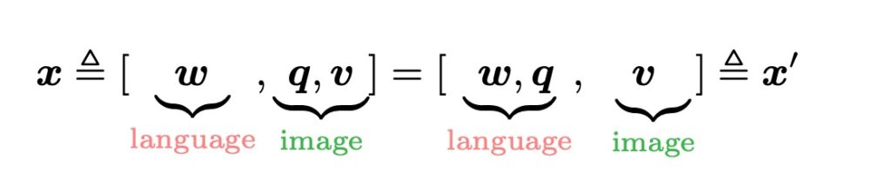
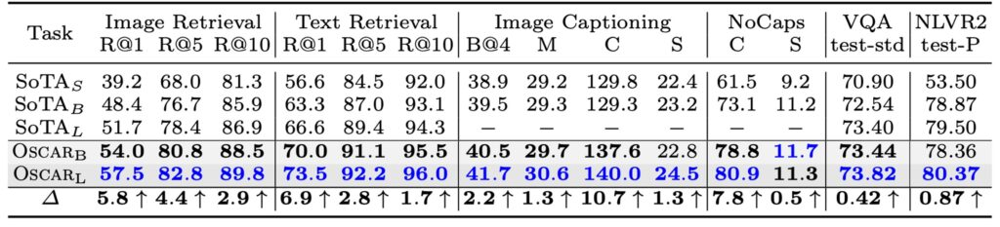
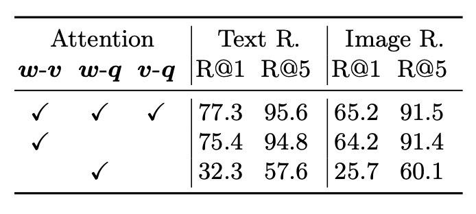

## The Anchors of Oscar

**[Oscar: Object-Semantics Aligned Pre-training for Vision-Language Tasks](https://arxiv.org/abs/2004.06165)**

---

In the field of Vision-Language (V+L) research, the issue of ambiguity has always been a significant hurdle, particularly when multiple objects overlap in image regions. Extracting precise visual region features becomes particularly challenging. For example, when an image contains both a cat and a dog intertwined, their overlapping region features might become ambiguous, posing a challenge for semantic alignment. How to find a clear and meaningful representation in this intertwined region and accurately align it with language is the problem that Oscar seeks to address.

The operation mechanism of Oscar can be simply explained: suppose there is an image containing an apple and a banana, with some overlap between the two. In a conventional scenario, directly extracting features from this overlapping visual region would yield a “mixed” information, making subsequent semantic alignment difficult.

Oscar introduces a clever strategy by using object labels as anchors for semantic alignment. Here, the labels are "apple" and "banana".

In this framework, each training sample is defined as a triplet, including a word sequence, a set of object labels, and a set of image region features. By leveraging this strategy, even when visual region features of objects are ambiguous, the authors can still perform effective semantic alignment using object labels, providing a relatively stable foundation for subsequent V+L tasks.

## Problem Definition

The authors clearly state two core issues related to Vision-Language Pre-training (VLP) models:

1. **Ambiguity**

   - **Issue**: When image regions of two or more objects overlap, the extracted visual region features may become ambiguous and hard to distinguish.
   - **Example**: In Figure 2(a), the objects "dog" and "couch" have significant overlapping regions, making their visual features hard to distinguish.
   - **Resulting Problem**: This ambiguity can make it difficult for models to establish accurate cross-modal alignment when dealing with complex image-text matching tasks.

2. **Lack of Grounding**
   - **Issue**: VLP is a weakly supervised learning problem, lacking explicit correspondences between regions or objects in images and words or phrases in texts.
   - **Background**: Even if objects like "dog" and "couch" appear in both the image and the corresponding text, the absence of explicit alignment annotations can hinder the model from learning the semantic correspondences between objects and text units.

## Solution

### Oscar Model Design

1. **Triplet Input Representation (w, q, v)**

   The Oscar model represents each image-text pairing as a triplet (w, q, v).

   - **w (Word Sequence Encoding)**

     This is the word sequence encoding derived from the text input, where each word or phrase is converted into vector representations.

   - **q (Word Sequence Encoding of Object Labels)**

     This is the word sequence encoding of the object labels identified in the image, typically generated by an image recognition model, possibly based on Faster R-CNN.

   - **v (Set of Region Vectors)**

     This is the set of feature vectors for the identified regions in the image, which may include visual semantics and positional information.

   :::tip
   Pause here for a moment.

   Before moving forward, remember the concepts of the w, q, v input representations. These will appear frequently throughout the paper as combinations of wqv are explored and discussed.
   :::

2. **Object Labels as Alignment Anchors**

   Oscar uses object labels (q) as anchors to simplify learning the alignment between images and text. Since important objects in images are often mentioned in the corresponding text descriptions, using q enhances the model's understanding and learning of the associations between images and text. During training, the model aligns visual objects (which may be ambiguously represented in the visual space) to clear and unique entity representations in the language space, improving cross-modal alignment learning.

3. **Shared Semantic Space and Attention Mechanism**

   Using the BERT model, the model can relatively easily identify the alignment between q and w in the text. Based on this, the model allocates more attention to image regions related to text semantics. When querying with words related to the semantics of q, the model assigns higher attention weights to these specific image regions.

4. **Generation of v and q**

   Given an image with K object regions, the Oscar model uses Faster R-CNN to extract visual semantics from each region as (v’, z), where v’ is a P-dimensional vector (region features) and z is an R-dimensional vector (region positions).

   - v is formed by concatenating v’ and z into a position-sensitive region feature vector, further transformed through linear projection to match the same vector dimension as word encodings.
   - Simultaneously, the word sequence encoding of object labels q is also derived from the image using the same Faster R-CNN.

### Pre-training Objectives

Oscar model inputs can be viewed from two different perspectives: here, x is the modality perspective distinguishing text and image representations; x’ is the dictionary perspective distinguishing two different semantic spaces in which the inputs are expressed.

1. **Dictionary Perspective: Masked Token Loss (MTL)**

   Different dictionaries are used to identify the semantic spaces of different subsequences. Simply put, object labels and word tokens share the same linguistic semantic space, while image region features reside in the visual semantic space. During pre-training, the authors use the “Masked Token Loss” (MTL) method.

   In each training iteration, approximately 15% of input tokens in the sequence are randomly masked (i.e., replaced with a special [MASK] token). The training goal is to predict these masked tokens based on surrounding tokens and all image features.

   This process is very similar to BERT's masked language model, as it recovers masked words or labels from their surrounding context. Meanwhile, additional image information helps the learned word encodings find their place in the visual context.

   :::tip
   Suppose a sentence: “This is a cute dog,” with an accompanying image of a dog.

   During pre-training, the word “dog” might be masked, turning the sentence into “This is a cute [MASK].”
   :::

   The model's task is to use the unmasked words and the image of the dog to predict the true content of the [MASK], which is “dog.” This process leverages visual information to help the model accurately predict masked words, as the visual data provides additional contextual clues.

2. **Modality Perspective: Contrastive Loss**

   To express each input triplet, the authors group [h’, [q, v]] to represent the image modality, while (w) is viewed as the language modality.

   Here’s an interesting experimental process: with a 50% probability, the authors replace (q) with a randomly drawn different label sequence from the dataset to create a set of “contaminated” image representations. Then, because the encoder output at the special marker [CLS] is a fused visual-language representation of (h’, w), a fully connected layer is used on top of it to predict whether the pair contains the original image representation (i.e., (y = 1)) or any “contaminated” representation (i.e., (y = 0)).

   :::tip
   If the above description is confusing, perhaps you can imagine this process as a game:

   Your friend gives you a picture and some text descriptions.

   But there's a catch: the text descriptions might be incorrect (e.g., a picture of a red apple described as “a blue backpack”). Your task is to determine whether these descriptions are true. In Oscar’s context, the model plays a similar game, using mathematical and machine learning techniques to determine if the given text descriptions truly match the picture.
   :::

   Throughout the cross-modal pre-training process, the authors use object labels as proxies for the image to adjust the BERT word encoding space.

   Specifically, we want the learned text representations to be similar to the corresponding images (or detected object labels from the images) and contrast against “contaminated” representations.

## Discussion

### Parameter Efficiency Comparison

The authors first discuss Oscar's performance and efficiency on vision-language (V+L) tasks, comparing Oscar’s performance and parameter efficiency with three different types of existing state-of-the-art (SoTA) models. Oscar shows relatively high parameter efficiency and excellent performance on most tasks compared to other large models.

### Model Performance Comparison

1. **Overall Performance of Oscar Models**

   - Oscar demonstrates strong performance on most V+L (Vision-Language) tasks.
   - In 7 tasks, Oscar outperforms all existing VLP (Vision-Language Pre-training) methods.
   - It achieves new state-of-the-art (SoTA) results in 6 out of these 7 tasks.

2. **Comparison with Other Models**

   - Compared to Neural State Machine (NSM), Oscar may slightly underperform on the GQA task but can be enhanced by incorporating NSM’s structural priors.
   - Compared to the multi-task model 12-in-1, OscarB performs better on most tasks, except for lower results on NLVR2 Test-P.

3. **Method and Training Strategies**

   - On captioning tasks, using Self-Critical Sequence Training (SCST) to further fine-tune Oscar demonstrates the ability to improve sequence-level learning.
   - Part 2 (e) might show Oscar’s improvement over other methods in BLEU@4 and CIDEr metrics (over 2 points and 10 points improvement, respectively).

4. **Demonstration of Generalization Ability**
   - The NoCaps experiment requires models to use only the COCO Captioning training set. Oscar adheres to this requirement, showcasing its strong performance and generalization ability with limited training data.
   - Part 2 (f) might compare Oscar variants with the previous SoTA method UpDown, highlighting Oscar's advantages in different scenarios (in-domain or out-of-domain).

Oscar significantly simplifies the learning of semantic alignment between images and text by using object labels as anchors, which is a key factor in its high efficiency and strong performance. In some tasks or scenarios, Oscar’s approach and model structure can be further enhanced by integrating other powerful techniques or prior knowledge.

While Oscar demonstrates strong performance on most tasks, there may be room for optimization or limitations in certain specific tasks or metrics, such as performance on NLVR2 Test-P.

### Qualitative Study

This study uses t-SNE to visualize the learned semantic feature space of image-text pairs in the COCO test set on a 2D map. Through analysis, the authors present several key points:

1. **Intra-Class Consistency**

   - Using object labels significantly shortens the distance between visual and textual representations of the same object.
   - In the Oscar model, the visual and textual representations of a specific object (e.g., "person" or "zebra") are much closer compared to the baseline methods.

2. **Inter-Class Differentiation**

   - Adding labels brings semantically related object classes closer together, although they remain distinguishable.
   - In the baseline methods, classes (e.g., animals, furniture, and vehicles) exhibit some mixing, while the method with added labels can more accurately distinguish these classes (e.g., "person," "zebra," "sheep," "bird," "chair," "sofa," "bench," "bus," "train," "truck," "motorcycle," and "car").

3. **Importance of Object Labels**
   - Object labels play a crucial role in alignment learning, serving as anchors to connect and regularize cross-modal feature learning.

### Ablation Study

Several key points can be observed from the above figure:

- Learning curves with object label fine-tuning converge faster and better on all tasks compared to VLP methods without labels.
- For VQA (Visual Question Answering) and image retrieval tasks, using labels for training can achieve the final performance of the baseline method in only half the training time.

These findings indicate that Oscar, utilizing object labels, exhibits superior and more efficient performance on these vision tasks, achieving or surpassing the performance of label-free methods in a shorter training time.

- Using object labels indeed enhances model performance. This conclusion is drawn by comparing fully attentive and partially attentive models (w-v), showing that adding object labels benefits the model.
- Region features provide more information than object labels when representing images, as seen in the comparison of w-v (relationship between object regions and text) and v-q (relationship between object labels and questions).

The Oscar model significantly improves performance across multiple downstream tasks by using object labels. Training with object labels can achieve or exceed the final performance of the baseline in a shorter training time. Object labels and region features play important roles in the model's attention mechanism interaction, and using different object label sets during pre-training also shows an impact on model performance.

## Conclusion

In essence, this is also a method of introducing a knowledge graph.

Because labels are human-provided, although they offer clear guidance, is this guidance always correct? Is it sufficient? Could it limit the model’s potential?

The Oscar model relies on the accuracy and quality of object labels to a certain extent. If the object labels generated are not precise or diverse enough, the model might learn incorrect or overly narrow features, affecting the pre-training effect and downstream task performance. After all, human language has infinite possibilities, but the label content is limited. Using limited concepts to achieve unlimited expansion is inherently a very challenging task.

Nevertheless, Oscar enriches the field of multimodal pre-training models and demonstrates an effective new approach to integrating vision and language. Through carefully designed pre-training strategies and experimental verification, this research provides a solid foundation for subsequent researchers to explore more innovative ideas and applications, continually advancing the prospects of vision and language integration technology.
