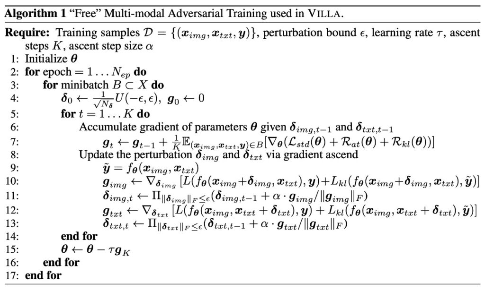
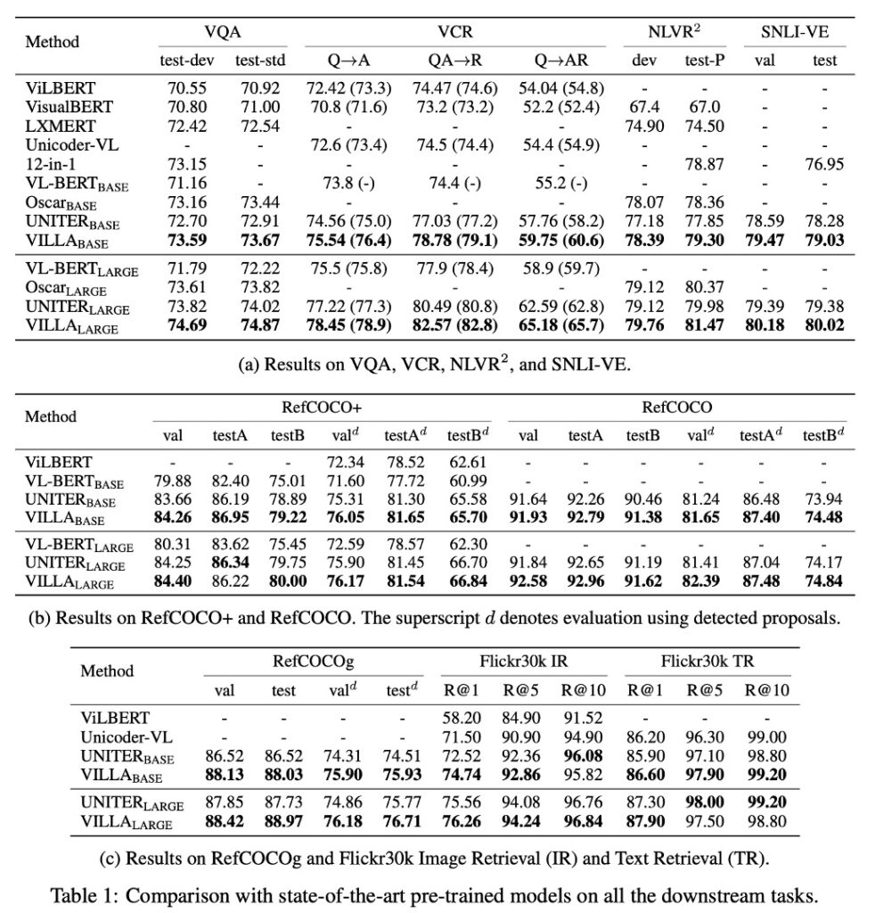
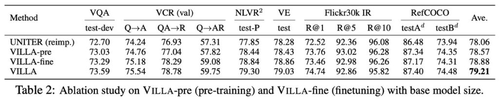
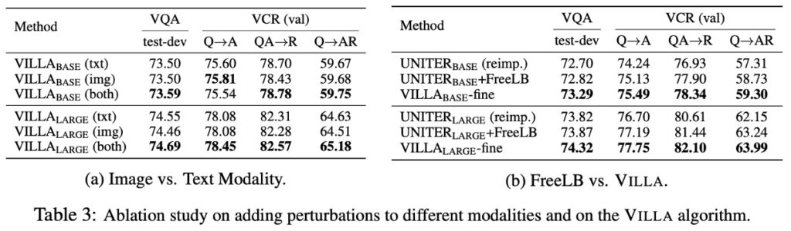
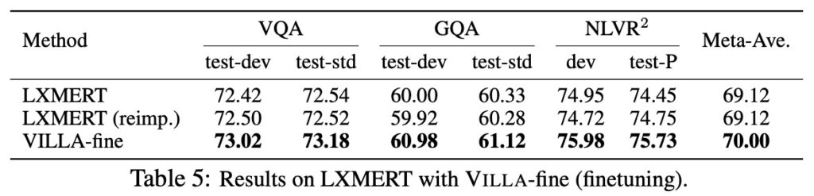

## The Phantom in the Villa

[**Large-Scale Adversarial Training for Vision-and-Language Representation Learning**](https://arxiv.org/abs/2006.06195)

---

Let’s dive into an intriguing paper.

The authors introduce the concept of **adversarial training** in this work, which can often be confused with **denoising**. So, let’s first clarify the distinction between these two concepts:

1. **Denoising**

   The goal of denoising is to remove noise from images or data to recover the original, unperturbed information.

   For example, if you have a noisy image, the denoising process seeks to eliminate the noise and restore the image to its clean, original state.

2. **Adversarial Training**

   The goal of adversarial training is to enable the model to make correct predictions even when facing **adversarial attacks**.

   For instance, if a model is presented with inputs deliberately designed to mislead it into making incorrect predictions, adversarial training helps the model learn to handle such scenarios, improving its generalization capability.

In summary, **denoising** focuses on recovering clean data from known noise patterns, while **adversarial training** aims to strengthen the model against intentionally crafted inputs designed to deceive it. Denoising typically addresses noise removal, while adversarial training generates **hostile inputs** that challenge the model to adapt.

When training a model, we don’t only show it standard, familiar images and text but also introduce “adversaries” — inputs deliberately altered to confuse the model. These adversarial inputs act like surprise challenges during training, forcing the model to learn how to handle various scenarios effectively.

## Defining the Problem

No one had previously attempted to integrate **adversarial training** into Vision-Language Model (VLM) pretraining, making this an obvious gap in the field!

The authors aim to explore how to effectively apply adversarial training to **multimodal tasks** while ensuring good performance.

The challenge is twofold:

1. Enhance the **robustness** of the model against adversarial attacks.
2. Maintain or even improve its **generalization capability** on clean data.

This is particularly challenging because adversarial training often incurs significant computational costs and training time. The authors tackle this dual objective head-on in their work.

## Solution

This section is a bit technical, but let's read through it together.

The authors structure the entire model into three parts.

### VILLA Model Design

The primary goal of this stage is to learn generalized image and text representations applicable to various downstream tasks.

1. **Dataset**

   The dataset for pre-training (denoted as Dp in the paper) consists of image-text pairs (X_img, X_txt).

2. **Feature Representation**

   - Images (X_img) are transformed into feature vectors through a bottom-up feature extractor (g_bu(·)).
   - Text (X_txt) is converted into feature vectors through a learnable word embedding function (g_emb(·)).

3. **Multimodal Fusion**

   To fuse image and text features, a multi-layer Transformer structure is used, popular in natural language processing and other multimodal tasks. Here, the [CLS] token holds special significance, with its encoding serving as the joint representation for multimodal tasks.

### Pre-Training Tasks

MLM and ITM have been discussed in previous papers, so we'll briefly cover them and delve into the MRM strategy.

- **Masked Language Model (MLM)**

  In masked language modeling, about 15% of the input tokens are randomly selected and masked. The model's task is to predict these masked tokens based on other visible language tokens and provided visual tokens.

- **Image-Text Matching (ITM)**

  ITM is a complex strategy designed to evaluate the model's ability to understand the deep semantic relationships between images and their corresponding textual descriptions.

- **Masked Region Modeling (MRM)**

  The main objective of MRM is to enable the model to learn how to infer the masked parts based on complete image information. This ability helps the model better understand and recognize various parts of the image and effectively combine them with language features in subsequent tasks. This method is similar to "Masked Language Modeling" (MLM) in natural language processing but applies to image regions instead of text tokens.

  In image data X_img​, specific regions (randomly chosen or selected by a strategy) are masked by setting their features to zero or using other methods. These masked regions are treated as parts that the model needs to "fill in."

  Given other unmasked multimodal information (such as other parts of the image and related text descriptions), the model's task is to predict the correct content of the masked regions. This prediction can be quantified through cross-entropy loss, KL divergence loss, or contrastive learning.

  :::tip
  This is akin to having a children's coloring book where part of an apple's image is erased or covered. Despite seeing only part of the apple, based on previous complete apples you've seen, you can guess how the missing part should look.
  :::

### Two-Stage Adversarial Training

This refers to both pre-training and fine-tuning stages.

This discussion explores how to conduct adversarial training during pre-training and fine-tuning stages and their relationship.

1. **Connection Between Pre-Training and Fine-Tuning**

   Pre-training and fine-tuning are two main stages in most deep learning workflows. Pre-training aims to gain a fundamental understanding and basic feature extraction capabilities, while fine-tuning specializes the model for specific tasks. These two stages are closely related, with pre-training providing the necessary foundation for fine-tuning.

2. **Importance of Cross-Modal Understanding**

   The model needs to understand both image and text content in tasks like MLM or VQA. For example, if a picture contains a dog, the model needs to link this visual information with the word "dog."

3. **Assumptions in Adversarial Training**

   - The first assumption is that adversarial pre-training can enhance the model's generalization ability, benefiting the fine-tuning stage. Generalization refers to the model's performance on unseen data.
   - The second assumption is that during the fine-tuning stage, with specific task training data, adversarial training methods can be reused to further improve model performance.

4. **Shared Mathematical Formulas**

   Since pre-training and fine-tuning stages are mathematically similar, both can employ the same adversarial training methods.

It is emphasized that both stages can undergo adversarial training to improve the model's generalization ability and robustness against attacks.

Adversarial training in the pre-training stage helps enhance the model's basic generalization ability, while in the fine-tuning stage, it can further improve performance for specific tasks.

### Perturbations

This section explores how to add adversarial perturbations in the embedding space of image and text.

1. **Perturbations in Image Modality**

   In state-of-the-art V+L models, the input typically consists of image features obtained from pre-trained object detectors. Unlike traditional methods that add perturbations at the pixel level, here, perturbations are added directly in the feature encoding space. For example, instead of making minor adjustments to the pixels of a dog picture, perturbations are made to its feature representation in the model. This allows for more precise manipulation of the encoding, making the perturbations stricter.

2. **Perturbations in Text Modality**

   Unlike the continuous values in image pixels, text tokens are discrete, making them harder to manipulate. Traditionally, creating adversarial examples that preserve the original semantics is challenging in text modality. However, this method chooses to add perturbations in the word embedding space instead of directly altering the words. This avoids changing the original text content while still affecting the model's prediction.

   For instance, consider the sentence "The dog barks." Instead of replacing or modifying any word, slight adjustments are made to the embedding of the word "dog," leading to a representation that is similar but slightly different in the model.

3. **Position Encoding**

   In pre-trained V+L models, position encoding is used to encode the positions of image regions and subword tokens. In this adversarial training method, only image and word encodings are modified, keeping other features unchanged.

4. **Consideration for Simultaneous Perturbations**

   The authors suggest adding perturbations to one modality (image or text) at a time. This is based on the unique characteristics and differences of images and text. After adding perturbations, the goal is for the model's predictions to remain unchanged, preserving the original semantics.

### Multimodal "Free" Adversarial Training

This section elaborates on the multimodal "free" adversarial training method used in the VILLA model, involving multiple mathematical formulas and technical details. Don't worry, let's break it down:

- **Training Objective**

  In the VILLA model, "adversarial training" is a core technique aimed at maintaining stable prediction performance even when the input data is slightly perturbed. This method enhances the model's generalization, making it less susceptible to external noise or minor changes, ensuring reliable predictions in various scenarios. This means the model can perform well on both training data and new, unseen data.

  The training process considers three main loss components:

  1. **Standard Cross-Entropy Loss (L-std)**

     This is the basic loss function used in most classification problems, measuring the gap between the model's predictions and the true labels. Smaller cross-entropy loss indicates the model's predictions are closer to reality.

  2. **Label-Preserving Adversarial Training Loss (R-at)**

     This ensures that the model's predictions remain the same when the input data undergoes slight perturbations. In other words, even with minor changes to the image or text, the model should produce the same prediction.

  3. **Fine-Grained Adversarial Regularization Term (R-kl)**

     This more complex loss component requires the model not only to maintain the same label with perturbed inputs but also to ensure that the prediction confidence or probability distribution remains similar. This ensures that the model's generalization is preserved not only at the label level but also in the details of the prediction.

- **Multimodal Adversarial Perturbations**

  In training the VILLA model, not only are the original image and text encodings considered, but adversarial perturbations are also added to these encodings. These perturbations are intentionally introduced minor changes to test and enhance the model's generalization, ensuring it works correctly even with unknown, minor noise or variations.

  However, these adversarial perturbations are not added arbitrarily. They have specific "norm constraints," meaning the intensity or magnitude of these perturbations is controlled to ensure they don't cause significant changes that make the model unrecognizable.

  The model's training involves two main optimization steps: outer minimization and inner maximization. Outer minimization aims to minimize the model's prediction error (loss) during the overall training process, achievable through common gradient descent methods like SGD (Stochastic Gradient Descent). Inner maximization seeks to find adversarial perturbations that maximize the loss, identifying the most likely disturbances to the model. This optimization is done using a method called PGD (Projected Gradient Descent).

  Specifically, for image modality, during each iteration of updating perturbations, PGD first calculates the current perturbation's impact on the loss, i.e., the gradient of the loss with respect to the perturbation. Then, it takes a small step in this gradient direction to find a new perturbation that maximizes the loss. This process is repeated until the preset number of iterations or perturbation size limit is reached.

  Imagine you are training a machine learning model to distinguish between dogs and cats in photos. The original image encoding represents the features or information extracted from the photo.

  1. **Adding Adversarial Perturbations**

     Suppose someone makes minor pixel adjustments to the photos during training, making cats look more like dogs or vice versa. These adjustments are the "adversarial perturbations."

  2. **Norm Constraints**

     However, these adjustments are not arbitrary. They have a limit to ensure the changes are not too significant. For example, the perturbations won't deform the entire cat's face, only minor adjustments enough to confuse the model.

  3. **Optimization**

     In each training iteration, the model tries to identify these adjustments and learn to ignore them, focusing on distinguishing features between dogs and cats. Using SGD, the model adjusts its parameters based on these adjustments' impact, reducing the error rate on these perturbed images. Using PGD, the model tries to find the most likely disturbances in each iteration, learning and adjusting for the worst-case scenarios.

- **Further Enhancement of Adversarial Regularization**

  Adversarial regularization is a technique in machine learning aimed at improving the model's generalization, ensuring it can make correct predictions even with adversarial perturbations. In some situations, adversarial perturbations can significantly alter the model's prediction, and this regularization method seeks to limit such changes.

  This enhanced adversarial regularization not only requires the model to maintain correct classifications with perturbations but also ensures that the prediction confidence or probability distribution remains similar before and after perturbations. This means the model must be confident in its predictions, even with minor disturbances.

  :::tip
  Kullback-Leibler divergence is a tool for measuring the difference between two probability distributions. In this context, it compares the similarity of the model's prediction distributions before and after perturbations. If the distributions are similar, the KL divergence will be close to 0; otherwise, the value will increase.
  :::

  :::tip
  For example:

  Consider a model that predicts a photo's animal as a cat with 90% probability without perturbations. After adversarial perturbations, the model's prediction confidence drops to 60%. This change indicates that the perturbations affected the model's certainty. The difference between these confidence levels, captured by KL divergence, encourages the model to maintain similar prediction confidence with perturbations.
  :::

### Free Adversarial Training Strategy

Adversarial Training (AT) is a method to enhance model generalization, using perturbed data to improve resistance to adversarial attacks. Here, the authors mention a "Free" adversarial training strategy.

- **Computational Cost of K-step PGD**

  PGD (Projected Gradient Descent) is commonly used in adversarial training. Using K-step PGD requires K forward and backward passes through the model, which is time-consuming. Moreover, only the final perturbation after K steps is used for model training, meaning all previous steps are just for generating this final perturbation.

- **Solution: FreeLB**

  To overcome the computational challenges and effectively execute large-scale training, the authors adopt a method called FreeLB. FreeLB performs multiple PGD iterations to create adversarial encodings and accumulates the "free" parameter gradients ∇θL during each iteration. Instead of updating model parameters after each iteration, it updates them once using the accumulated gradients after multiple iterations.

  This strategy simulates a larger "virtual" mini-batch, effectively mimicking a K-times larger mini-batch, making each update richer and more diverse.

To make it more relatable, let's consider an example:

Imagine assembling a bicycle, where each step involves specific parts.

- **Traditional K-step PGD Method**

  This is like testing the bicycle's functionality at each assembly step. For instance, after installing the pedals, you take a short ride, then add the chain and ride again, testing at each step. While this ensures each part is correctly installed, it's time-consuming.

  However, you find that only the final ride test after assembling all parts is crucial, indicating whether the entire bicycle is correctly assembled.

- **FreeLB Strategy**

  Now, imagine a different assembly strategy.

  Instead of testing at each step, you note potential issues or considerations during assembly (equivalent to accumulating gradients). After assembling all parts, you conduct a comprehensive test and adjustment based on accumulated issues and considerations.

  This method allows more efficient assembly, focusing on comprehensive adjustments at the end rather than time-consuming tests at each step.

Of course, all analogies have limitations and may not perfectly map to the target concept, but they help provide a feel.

## Discussion

The focus of this paper is mainly on the design of adversarial training.

But we still need to see if this design is effective. And how effective?

### Experimental Setup

To validate the functionality and effectiveness of VILLA, the authors conducted a series of experimental applications. These applications focused on V+L pre-trained models and comprehensively evaluated various downstream tasks, including Visual Question Answering (VQA), Visual Commonsense Reasoning (VCR), Refer Expression (RE) compression, Visual Entailment, Image-Text Retrieval, and NLVR2.

The validation process was divided into two stages: first, incorporating VILLA into the leading UNITER model for downstream task evaluation and ablation analysis. Second, to demonstrate VILLA's broader applicability, the authors chose another V+L model, LXMERT, for more comprehensive testing.

If you haven't read about these two models, refer to the following:

- **Links: [LXMERT](../1908-lxmert/index.md), [UNITER](../1909-uniter/index.md)**
- **Main Model Configurations: UNITER and LXMERT**

  - **UNITER**

    - UNITER-base: A single-stream model with 12 layers, 768 hidden units per layer, and 12 attention heads.
    - UNITER-large: A larger version with 24 layers, 1024 hidden units per layer, and 16 attention heads.
    - Same structure as BERT, but with inputs combining both modalities (vision and language).

  - **LXMERT**
    - LXMERT is a dual-stream model with independent self-attention layers for each modality (9 layers for text, 5 layers for vision), followed by 5 layers for cross-attention and self-attention processing.

- **Setup Details**
  - For UNITER experiments, the authors used four main large datasets for pre-training: COCO, Visual Genome (VG), Conceptual Captions, and SBU Captions.
  - VILLA also applies to MLM and ITM pre-training tasks, with different training steps provided for UNITER-base and UNITER-large to ensure fair comparison and training time consideration.

### VILLA on UNITER and Analysis

1. **VILLA Compared to Other Pre-Trained V+L Models**

   - VILLA achieved state-of-the-art performance on all test benchmarks.
   - VILLA-base model improvements:

2. **In VQA: +0.76 increase over UNITER-base**

   - In VCR Q→AR: +2.4 increase over UNITER-base
   - In NLVR2: +1.45 increase over UNITER-base
   - In SNLI-VE: Outperforms UNITER-base
   - In Flickr30k image/text retrieval: +2.22/+0.70 (R@1) increase over UNITER-base
   - Average increase of +0.99 across three RE datasets.

3. **VILLA-large model improvements**
   - Similar performance improvement trends overall.
   - In VCR Q→AR: Absolute increase of +2.9 points, significant for understanding complex social dynamics implicitly encoded in images.
   - In VQA benchmark: From 74.02 to 74.87.
   - Ensemble strategy further improved VILLA-large performance to 75.85.

### In-Depth Analysis of VILLA

1. **Pre-Training vs. Fine-Tuning**

   

   Using UNITER-base to study the effects of adversarial training in pre-training and fine-tuning stages.

   - UNITER (reimp.): UNITER-base model re-implemented with standard training.
   - VILLA-pre vs. VILLA-fine: Models applying adversarial training only in pre-training or fine-tuning stages, respectively.
   - Results: VILLA-pre and VILLA-fine provided +0.51 and +0.82 average performance gains across six evaluation tasks. Combining both stages resulted in +1.15 gain.

   

   The training curves show that with increased training steps, the gap between adversarially strengthened models and the original UNITER widens.

2. **Image vs. Text Modality (Table 3a)**

   

   When discussing adversarial examples, these are deliberately designed inputs that look similar to original inputs to humans but lead models to incorrect predictions. Here, perturbations are added focusing on image and text modalities.

   - Experiments and Results
     - Independent image perturbation: Adding perturbation only to image features significantly improves model performance. This contrasts with traditional belief where adversarial training often negatively impacts model accuracy on clean images.
     - Intuition vs. Actual Results: Initially, it might seem that adding perturbations to both modalities (image and text) simultaneously would be more beneficial due to increased adversarial example diversity. However, adding perturbations to a single modality already provides significant performance improvements.

   The VCR (Visual Commonsense Reasoning) task is particularly challenging, requiring models to understand complex social dynamics in images and perform commonsense reasoning. Due to its complexity, performance improvements are more pronounced. This suggests that adversarial training may benefit more from challenging tasks.

3. **FreeLB vs. VILLA (Table 3b)**

   

   The authors compare FreeLB and VILLA on two representative and challenging V+L tasks, VQA and VCR. Due to additional fine-grained adversarial regularization, VILLA outperforms FreeLB in both benchmarks.

   ***

   But wait, didn't we mention earlier that VILLA adopts the FreeLB strategy? Why compare it again?

   Although VILLA employs FreeLB for adversarial training, it is not merely FreeLB. VILLA is a more comprehensive framework, incorporating additional strategies or regularizations like fine-grained adversarial regularization to optimize and enhance model performance.

   The comparison aims to demonstrate that even though VILLA uses FreeLB as its core adversarial training method, its additional optimizations and enhancements make it perform better than just using FreeLB.

4. **Results on LXMERT**

   

   To show VILLA's effectiveness beyond UNITER, it was also applied to LXMERT, achieving significant improvements, even outperforming UNITER-base!

   The authors demonstrate VILLA's generalizability, providing +0.88 average performance improvement across three evaluation tasks.

## Conclusion

In exploring deep learning model robustness, adversarial attacks are a significant area of interest. This study focuses on the adversarial robustness of vision-and-language models (V+L models). Despite being a nascent field, there is a relative lack of literature on strategies for adversarial attacks on these models. Challenges include backpropagating gradients from multimodal Transformer models to CNN backbones for image adversarial attacks and synthesizing text adversarial attacks consistent with visual contexts.

VILLA is a novel adversarial training framework designed to enhance vision-and-language representation learning. Its uniqueness lies in applying adversarial training during both pre-training and fine-tuning stages. Additionally, by adding adversarial perturbations in the embedding space, VILLA consistently improves performance across various evaluation benchmarks.

The authors view VILLA as a "plug-in" concept, meaning after developing a model, you don't need to change its structure. Just incorporate VILLA's adversarial training techniques at the end to enhance model performance by 1-3 percentage points.

Finally, the authors acknowledge that despite VILLA's significant benefits, the time-consuming nature of adversarial training remains a challenge. Future work aims to find more efficient adversarial training methods to make large-scale pre-training more feasible in everyday practice.
