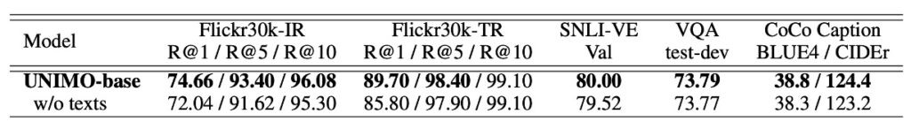

## Intertwined Clues

[**UNIMO: Towards Unified-Modal Understanding and Generation via Cross-Modal Contrastive Learning**](https://arxiv.org/abs/2012.15409)

---

It's been a while since we had a literature class. Do you remember what "intertwined" means?

It might feel a bit off-topic, but let's review it.

## Problem Definition

In reviewing previous work in pretraining research, the authors identify the challenges in single-modal and multi-modal pretraining. These methods often focus on their respective domains, be it single visual or language models, or models covering multi-modal tasks, each with its limitations:

1. **Challenges in Single-Modal Learning**

   Current learning models and research often focus on a single modality (text or image), which reduces their effectiveness in multi-modal scenarios (combining text and image). This approach hinders the comprehensive utilization of information across different modalities (such as visual and language).

2. **Limitations of Multi-Modal Pretraining Data**

   While the existence of multi-modal pretraining methods (e.g., ViLBERT, VisualBERT, and UNITER) has been confirmed, these methods overly rely on limited image-text paired data and show unstable performance in single-modal scenarios. These methods have limitations in the generalization to single-modal tasks.

3. **Challenges in Semantic Space Alignment for Multi-Modal Data**

   Establishing a unified semantic space for different types of data (e.g., text and images) for alignment and integration in multi-modal learning has been a challenge. This significantly impacts the transferability and generalization of learned representations across different modalities.

4. **Efficiency Issues in Cross-Modal Representation Learning**

   Existing cross-modal pretraining strategies mainly learn cross-modal representations using basic image-text matching and masked language model strategies on limited image-text pairs. Such methods are insufficient for learning comprehensive visual and textual representations and generalizing to single-modal tasks.

5. **Challenges in Cross-Modal Understanding and Generation**

   Augmenting visual and language knowledge to enhance understanding and generation capabilities in multi-modal contexts presents significant challenges. Language and visual models need to work synergistically to strengthen information understanding and generation in multi-modal contexts.

## Solution

### UNIMO Model Design

UNIMO is a cross-modal pretraining method designed to capture and learn modality-invariant information at the semantic level across different modalities. The core concept of the model is derived from how humans perceive the world through multiple senses.

The main design principles are:

1. **Multi-Modal Learning**

   - UNIMO learns from different types of data (e.g., images, text, and image-text pairs) to capture modality-invariant information at the semantic level, achieving more robust and general representations for both text and visual inputs.

2. **Adopting Transformer Architecture**

   - UNIMO uses a multi-layer self-attention Transformer structure to learn unified semantic representations of text and visual data.
   - Text input is first segmented into subword sequences using Byte Pair Encoding (BPE) and contextualized token representations are learned using the self-attention mechanism.
   - For image input, Faster R-CNN is used to detect salient image regions and extract visual features for each region.

3. **Cross-Modal Contrastive Learning (CMCL)**

   - CMCL aims to align and unify text and visual representations at different levels into a single semantic space.
   - The basic idea is to bring paired image and text representations closer together in the representation space while pushing unpaired representations further apart.
   - Positive image-text pairs \(X^+\) and negative image-text pairs \(X^-\) are created using a series of text rewriting techniques, and relevant images \(X_I\) and text \(X_T\) are retrieved from single-modal data.
   - These are encoded together or separately by the same unified modality Transformer, and the representations of images and text are extracted to compute the contrastive loss.

4. **Joint Learning of Single and Multi-Modalities**
   - UNIMO is pretrained on large image sets, text corpora, and image-text pairs, learning generalized visual and textual representations through masked prediction and unifying them into the same semantic space.
   - Joint learning of visual knowledge, language knowledge, and cross-modal knowledge not only improves the understanding and generation capabilities of vision and language but also allows textual knowledge and visual knowledge to mutually enhance each other in the learning process within a unified semantic space.

### CMCL

The basic idea of CMCL (Cross-Modal Contrastive Learning) is to minimize the distance between similar (positive) samples while maximizing the distance between dissimilar (negative) samples in a joint semantic space. The mathematical formula is as follows:

In this formula:

- $d(V, W)$ is a function that measures the distance between the image $V$ and the text $W$ in the semantic space. It is designed to ensure that the distance between positive samples is small and the distance between negative samples is large.
- $\tau$ is a temperature parameter that controls the sharpness of the softmax function. When $\tau$ is small, the model is more sensitive to larger values; when $\tau$ is large, the distribution of values is more even.
- $X[+, I, T]$ is the set of positive samples, where $V^+$ and $W^+$ are the related or matched image and text.
- $X[-, +, I, T]$ is the set of negative samples, where $V'$ and $W'$ are the unrelated or mismatched image and text.
- $\mathbb{E}_{V, W}$ denotes the expectation, which is the average over all possible $V$ and $W$.

This loss function embodies a fundamental contrastive learning concept: the model is encouraged to map semantically similar or related images and texts (positive samples) to close points while mapping unrelated images and texts (negative samples) to farther points.

- **Numerator**: For positive samples, the model tries to maximize the exponential of their distance. When $V^+$ and $W^+$ are closer, this value increases.
- **Denominator**: For negative samples, the model tries to minimize the exponential of their distance. When $V'$ and $W'$ are farther apart, this value increases.

By maximizing this ratio, the model learns to differentiate between positive and negative samples in a multi-modal semantic space.

### Multi-Granularity Semantic Alignment

- **Text Rewriting**

  This process plays a crucial role in enhancing multi-granularity semantic alignment between images and texts. The titles or descriptions of images are rewritten at different levels (sentence level, phrase level, and word level) to provide a rich learning environment for the model, helping it align the semantics of images and languages more precisely.

  1. **Sentence-Level Rewriting**

     - Positive Sample Generation: Using back-translation techniques. Each image title is first translated into another language and then back to the original language. This method allows the model to obtain multiple semantically similar but syntactically and lexically different titles for an image as positive samples.
     - Negative Sample Generation: Using TF-IDF similarity-based retrieval to find titles of other images that are very similar to the original image title but do not accurately describe the original image, thus serving as hard negative samples.

  2. **Phrase-Level and Word-Level Rewriting**

     - The image titles are first parsed into a scene graph (a graphical representation depicting objects, attributes, and their relationships in the image). Then, the objects, attributes, or relationship nodes in the scene graph are randomly replaced with other objects, attributes, or relationships from a vocabulary to change the semantics at the phrase or word level.

  Unlike previous methods that often rely on random sampling of negative samples, text rewriting can generate numerous hard negative samples that are semantically close to positive samples but contain subtle differences, thus challenging the model during the learning process.

  These text rewriting strategies help the model learn different levels of semantic alignment between images and texts. By contrasting positive and negative samples, the model learns to align semantically similar images and texts while distinguishing semantically mismatched images and texts. In this way, text rewriting enhances the model's semantic understanding not only at the sentence level but also at finer semantic levels (e.g., words and phrases).

- **Image/Text Retrieval**

  The main goal is to integrate more single-modal information into the cross-modal learning process to enhance the model's learning effect in semantic alignment.

  1. **Augmenting Single-Modal Information**

     Each image-text pair is further augmented by retrieving related images and texts from single-modal data (data containing only images or only text).

     - Image Augmentation: Select images with high visual similarity to the original image, especially those with objects that overlap significantly with the original image. These images provide related visual information to the original image.
     - Text Augmentation: Extract sentences from text data based on semantic similarity to the original caption, providing more contextual language information.

  2. **Encoding Augmented Information**

     The augmented single-modal image and text information are further encoded to calculate cross-modal contrastive loss.

     - Single-Modal Transformer Encoding: The augmented images and texts are individually encoded by a unified modality Transformer. This implies that the model learns to map these single-modal data into a shared semantic space to facilitate the correlation between images and texts.
     - Calculating Cross-Modal Contrastive Loss: In this semantic space, the representations of augmented single-modal information are extracted to compute the contrastive loss as previously mentioned.

  3. **Enhancing Cross-Modal Learning with Single-Modal Information**

     These augmented images and texts provide rich contextual information, playing a critical role in cross-modal learning by helping the model understand and establish stronger semantic alignment between visual and language modalities.

     This process enhances the model's semantic understanding and alignment capabilities in the cross-modal learning process by augmenting the original image-text pairs with additional retrieved single-modal information, improving the model's learning efficiency and performance.

     :::tip
     Providing additional semantic information about images and texts helps the model more accurately identify and understand the semantic relationships between images and texts, thereby improving its performance on complex semantic alignment tasks.
     :::

### Experiment Design

In this section, the authors detail the experiment design for the multi-modal pretraining model UNIMO, including pretraining and fine-tuning setups.

1. **Pretraining Dataset and Implementation Details**

   - **Pretraining Datasets**

     - Text Corpus: Using BookWiki and OpenWebText as primary text sources.
     - Image Collections: Including subsets of OpenImages and COCO unlabel, which are pure image data without text descriptions.
     - Image-Text Pairs: Integrating four multi-modal datasets: COCO, Visual Genome, Conceptual Captions, and SBU Captions.

   - **Implementation Details**
     - Model Sizes: UNIMO offers two model sizes – UNIMO-base (12-layer Transformer) and UNIMO-large (24-layer Transformer).
     - Pretraining: The models are initialized from RoBERTa-base and RoBERTa-large and trained for at least 500K steps.
     - Optimization and Hardware: Using Adam optimizer, float16 mixed-precision training, and training on Nvidia Tesla V100 32GB GPUs.

2. **Fine-Tuning Tasks and Experiment Settings**

   - **Single-Modal Tasks**

     - Generation Tasks: Including conversational question answering (CoQA), question generation (SQuAD 1.1), abstractive summarization (CNN/DailyMail), and sentence compression (Gigaword).
     - Understanding Tasks: Covering sentiment classification (SST-2), natural language inference (MNLI), linguistic acceptability analysis (CoLA), and semantic similarity analysis (STS-B).

   - **Multi-Modal Tasks**

     - Including visual question answering (VQA v2.0), image captioning (Microsoft COCO Captions), visual language inference (SNLI-VE), and image-text retrieval (Flickr30k).

In UNIMO's training process, Faster R-CNN pretrained on the VisualGenome dataset is used to extract visual features of salient regions, with clear standards for region category detection and selection. Additionally, positive and hard negative samples are carefully established and selected in the CMCL setting.

## Discussion

### Performance on Multi-Modal Tasks

UNIMO shows competitive performance in multi-modal tasks, particularly when compared to leading models such as ViLBERT, VLP, UNITER, and Oscar.

Notably, UNIMO-large surpasses previous leading models in several key test items, especially in image retrieval and text retrieval tasks, improving the R@1 indicator by 1.34 and 1.3 points compared to ERNIE-ViL-large, respectively. This indicates significant improvements in certain image-text retrieval tasks.

Additionally, in the image captioning task, UNIMO's BLUE4 score slightly exceeds that of the previously well-performing Oscar model. Overall, UNIMO demonstrates effective and balanced model architecture performance in multi-modal understanding and generation tasks, proving the practicality of its unified modality learning architecture.

### Performance on Single-Modal Tasks

UNIMO exhibits robust adaptability in single-modal tasks. Compared to several existing pretrained language models (such as BERT, RoBERTa, XLNet, and UniLM), UNIMO shows relatively comparable or slightly advantageous performance in most language understanding and generation tasks. By contrasting with UniLM (a model specifically designed for natural language understanding and generation), UNIMO's performance in single-modal scenarios is highlighted, demonstrating its reliable competitiveness in both multi-modal and single-modal tasks.

Such performance is partly attributed to the rationality of UNIMO's unified modality learning architecture. This architecture effectively utilizes large-scale single-modal images and texts for cross-modal learning, achieving a smooth transition and learning between multi-modal and single-modal tasks. However, despite showing some advantages, the adaptability and deep optimization of this unified modality learning architecture in different fields and tasks still require further exploration and verification.

### Whose Contribution?

In the realm of multi-modal learning that integrates text and visual information, the interaction of these two data forms and their respective impacts on the learning process have always been a hot research topic.

The authors specifically explored how text and visual data mutually reinforce each other within the UNIMO model framework:

- **Impact of Text: Adding Context to Visuals**

  

  Through ablation studies, when removing the text learning process from UNIMO (see Table 3), a significant drop in performance on multi-modal understanding and generation tasks was observed. This not only highlights the reinforcing effect of knowledge from text corpora on cross-modal learning but also underscores the crucial role of text in constructing the model's semantic understanding and generation capabilities. Text knowledge, especially when it comes to providing more contextual information to enhance visual language tasks, demonstrates its indispensable value.

- **Contribution of Visuals: Enriching and Enhancing Language Representations**

  

  Conversely, visual knowledge also has a profound impact on language learning. When images and image-text pairs were removed from the pretraining dataset (see Table 4), the model's performance in most language understanding tasks and all language generation tasks significantly decreased. These findings strongly suggest that visual data not only enriches the model's language representations but also enables it to learn more generalized representations in a unified semantic space, thereby enhancing language task performance.

  The interplay and complementarity of text and visual information in multi-modal learning open a new research perspective and reveal potential future development directions. According to this study's findings, they form a "win-win" situation in the unified semantic space, enhancing overall learning outcomes through their respective contributions. Text data provides context and semantic frameworks for visual elements, while visual data injects vivid concrete content and more real-world scene information into language representations.

:::tip
In this paper, the authors first proposed using CMCL to align the semantic space for multi-modal learning. They then suggested considering "multi-granularity semantic alignment" and thus proposed rewriting and data augmentation. However, there are no corresponding discussion sections or ablation studies for these approaches. We are curious about the exact contribution values of these methods.
:::

## Conclusion

In previous discussions, "multi-granularity semantic alignment" is undoubtedly a key concept, especially when exploring how text and visual information are aligned and interact at different semantic levels. Why, then, is such an ostensibly critical feature lacking specific analysis and validation in the experimental section? Does this imply that in the practical application of UNIMO, the role of "multi-granularity semantic alignment" was not fully realized, or its effect was not as significant as expected?

For example, we could have used ablation studies to observe how the model's performance in various cross-modal tasks changes when fine-grained semantic alignment is no longer performed. This would not only validate the practical role of "multi-granularity semantic alignment" in the model but also provide more insights and directions for our future research. For instance, do we need more refined semantic alignment strategies in specific tasks or scenarios? Or, in some cases, can the model still achieve acceptable performance without fine-grained semantic alignment?

These potential questions and challenges need further exploration and validation in future research. We hope this issue can inspire deeper thinking and investigation into multi-modal learning, especially the concept of "multi-granularity semantic alignment," thus advancing further development and innovation in this field.
