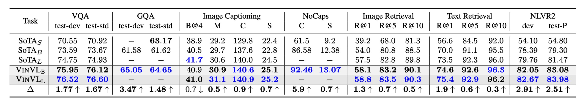

## Revisiting Oscar

[**VinVL: Revisiting Visual Representations in Vision-Language Models**](https://arxiv.org/abs/2101.00529)

---

After examining Oscar, further research promptly followed.

- Portal: [**Oscar**](../2004-oscar/index.md)

This paper acknowledges Oscar's contributions but also highlights its shortcomings:

- It lacks a thorough exploration of visual representations.

So, what constitutes a "thorough" exploration? Let's delve into this paper to find out.

## Defining the Problem

The authors focus on the field of Visual-Language Pretraining (VLP), specifically on enhancing the visual representations generated by Object Detection (OD) models. The effectiveness and richness of visual features are crucial for the performance of models in various Vision-Language (VL) tasks. Here are the main points of concern:

1. **Need for Rich Visual Representations**

   Current VLP methods heavily rely on visual representations provided by object detection models. The authors argue that while these models offer valuable visual information for VL tasks, there is room for improvement, particularly in handling complex, diverse, and semantically rich image scenes.

2. **Effectiveness of Cross-Modal Fusion Models**

   VLP typically consists of two components: a pretrained object detection model and a cross-modal fusion model, which combines visual and language features. While much research focuses on improving the cross-modal model, the authors emphasize that stronger, semantically richer visual representations are equally critical.

3. **Limitations of Existing Object Detection Models**

   The authors note that the widely used OD models are often treated as a "black box" in literature and may have limitations in their training datasets and objectives, impacting their performance in various VL tasks.

4. **Diversity of Visual Objects and Concepts**

   In many practical applications, models must recognize and understand a wide range of visual objects and concepts. Current models, especially those trained on datasets like Open Images, may not fully capture and express this rich diversity of visual content.

## Solving the Problem

In this paper, the authors focus on optimizing visual features within the existing Oscar framework, without proposing a new structure.

Vision-Language models typically consist of two main components: a Vision module (which translates images into semantic representations) and a VL module (which integrates visual and language inputs). Here’s a breakdown of how the paper aims to improve the Vision module, particularly through enhancements in object detection pretraining and the incorporation of attribute information:

### Object Detection Pretraining

- **Data Processing**

  The authors use four major public datasets (COCO, OpenImagesV5, Objects365V1, and Visual Genome) for pretraining the object detection model. They employ strategies like class-aware sampling and balancing for imbalanced datasets to create a unified, large corpus.

- **Model Architecture**

  While the Feature Pyramid Network (FPN) performs better in object detection tasks, the C4 model offers more effective region features for VL tasks.

  :::tip
  **What is the C4 model?**

  The C4 model refers to features extracted from the CNN architecture at 1/16 resolution. This terminology was adopted from a referenced paper, where it was argued that features at this scale enhance VL task performance compared to FPN.
  :::

- **Pretraining Strategy**

  The authors combine classical and experiential methods to enhance the model's performance.

  - Freezing initial layers (including the first convolutional layer, the first residual block, and all batch normalization layers) to preserve low-level visual features during early training.
  - Applying data augmentation techniques like horizontal flipping and multi-scale training to expand the dataset and improve model generalization.

  The object detection model's basic structure is the "X152-C4 architecture," with initial weights based on the ImageNet-5K dataset, trained over 1.8 million iterations with a batch size of 16 images.

### Attribute Injection

- **Pretrained Model and Attribute Branch**

  - The pretrained OD model is enhanced with a new branch to predict object attributes, thereby enabling simultaneous object detection and attribute prediction.

- **Fine-Tuning on Visual Genome (VG) Dataset**
  - Attributes: The VG dataset provides 524 attribute categories (e.g., color, shape, size).
  - Fine-Tuning Strategy: After adding the attribute branch, the model is fine-tuned on the VG dataset to enhance attribute prediction capabilities.
  - Attribute Loss Weight Adjustment: Increasing the attribute loss weight from 0.5 to 1.25 during fine-tuning to emphasize the importance of attribute learning.

This approach allows the model to not only detect objects but also predict multiple attributes on the VG dataset, demonstrating significant advantages over previous models.

### Improving Efficiency

Object detection models face computational challenges due to the diversity of visual features and attributes, especially during feature extraction.

- **Non-Maximum Suppression (NMS) Challenge**

  The diversity of visual objects and attributes requires extensive computational resources for class-aware NMS during post-processing, slowing down feature extraction.

- **Efficiency Strategies**

  - Using class-agnostic NMS: Performing a single NMS operation to reduce computational complexity and maintain high operational efficiency.
  - Adjusting Convolutional Layer Settings: Replacing dilated convolutions with non-dilated ones to further optimize computation.

These adjustments significantly improve the speed of the region feature extraction process without compromising accuracy in VL downstream tasks.

:::tip
**What is Dilated Convolution?**

Dilated Convolution, also known as atrous convolution, introduces gaps within the convolution kernel to expand its receptive field. This technique allows each output feature to be calculated from a wider range of the input feature map, capturing more extensive information while increasing computational complexity.
:::

## Discussion

### Performance on Downstream Tasks

1. To evaluate model parameter efficiency, state-of-the-art models (SoTA) are categorized into three groups:

   - SoTAS: Small models that achieved the best performance before Transformer-based VLP models.
   - SoTAB: The best-performing VLP models comparable in size to BERT Base.
   - SoTAL: The best-performing VLP models comparable in size to BERT Large.

2. OSCAR+ and VinVL outperform previous SoTA across seven VL tasks, often by a significant margin.
3. VQA: The OSCAR+B model outperforms the best model on the VQA leaderboard.
4. GQA: The OSCAR+B with VinVL is the first VLP model to surpass Neural State Machine (NSM).
5. Image Captioning: The OSCAR+B model ranks first on the COCO Image Captioning leaderboard, outperforming 263 models.
6. NoCaps: Without any VLP, BERT-based models with new visual features (VinVL) surpass human CIDEr performance. Adding VIVO pretraining further improves performance, setting new SoTA.

### How Important Are Visual Features?

The authors compare the performance of two different visual models (R101-C4 and X152-C4) and various VLP methods (no VLP and OSCAR) on the VQA task. VinVL and other VLP methods are used for pretraining.

1. **Model Comparison and Performance Improvement**

   - OSCAR vs. OSCAR+: Using R101-C4 features, the OSCAR model serves as a baseline. Switching to X152-C4 features in the OSCAR+ model increases absolute accuracy from 72.38 to 74.90.
   - Contribution Analysis: OSCAR+ pretraining contributes 5% to accuracy, while improved visual features from visual pretraining contribute 95%.

2. **Importance of Visual Representations**
   - Visual representations play a crucial role in VLP and downstream tasks, with both visual models and VLP methods significantly contributing to improved results.
   - The additive gains from VinVL and VLP highlight the independent enhancements provided by visual pretraining and VLP.

### Impact of Visual Concept Diversity

The paper explores how the diversity of visual concepts, particularly object and attribute vocabularies, affects VL models, especially in the VQA task.

- **Richness of Visual Concept Vocabulary**

  

  - A richer object vocabulary correlates positively with VQA results. Models trained on datasets with more diverse object categories, such as VG w/o attr, perform better than those with fewer categories like VG-obj and ImageNet.
  - Object Vocabulary and Semantic Completeness: Certain visual concepts (e.g., "sky" and "water") are crucial for VQA tasks, highlighting the advantage of comprehensive object vocabularies.
  - Attributes play a critical role in VQA results. Models trained to recognize attributes (e.g., on VG or 4Sets→VG datasets) perform significantly better than those without such training.
  - Even smaller visual models (e.g., R50-C4) benefit from visual pretraining, demonstrating its overall effectiveness.

- **Impact of Rich Visual Semantics on VL Tasks**

  

  - COCO ground truth (GT-Obj and GT-Obj&Stuff) excels in object localization but has limited vocabulary. Conversely, VG-trained models may be less effective in object localization but offer richer vocabularies, benefiting VQA tasks.
  - Visual Language (VL) OD tasks rely more on rich visual semantics than typical OD tasks. VL tasks require visual semantics to align with the rich semantics of the language modality, underscoring the importance of a comprehensive visual vocabulary in VL tasks.

## Conclusion

Although VinVL attempts to incorporate more visual features, it still adheres to the concept of categories. The selected objects and attributes might not be sufficiently rich or may carry inherent biases, limiting the model's ability to capture all visual concepts fully and affecting its broader application potential.

Additionally, the large scale and complexity of the model pose significant challenges. The authors seem aware of this and have included a section on improving efficiency to guide users on how to enhance inference speed.

VinVL's large architecture and complex computation demand substantial resources, which limits its applicability and widespread adoption in resource-constrained environments.

Finally, the integration of attributes and visual concepts presents another significant challenge. Training models across multiple data sources to cover a wide range of visual concepts and attributes requires ensuring data consistency and leveraging their advantages fully, which remains a major hurdle in developing a highly consistent and broadly applicable model.

Despite these challenges, VinVL demonstrates strong capabilities and potential in various VL tasks, particularly in object recognition and understanding visual attributes. Its exceptional performance across multiple tasks highlights its value as a visual-language pretraining model.
