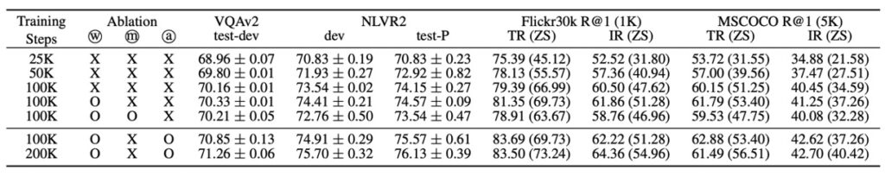
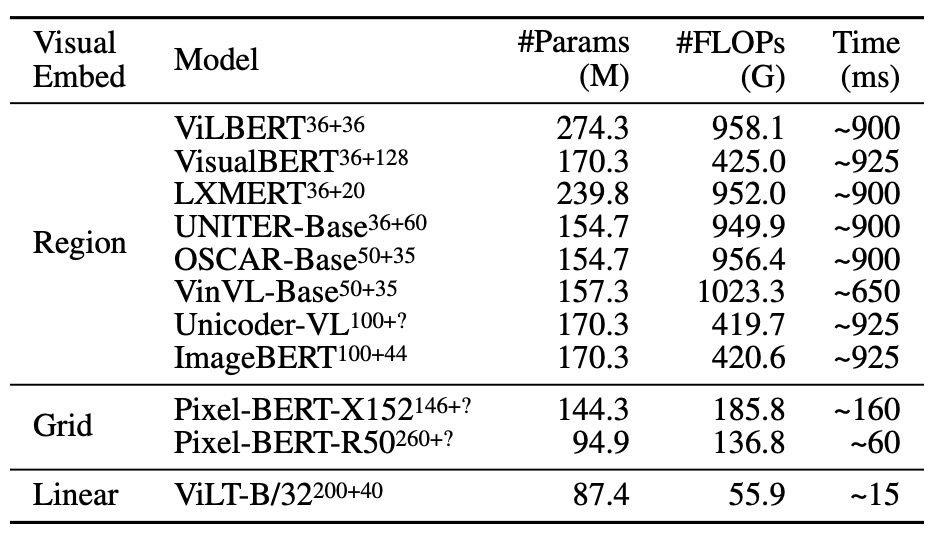

## Enter the Scene

[**ViLT: Vision-and-Language Transformer Without Convolution or Region Supervision**](https://arxiv.org/abs/2102.03334)

---

You might recall that the Transformer was introduced in 2017. Vision Transformer (ViT), specifically designed for images, appeared at the end of 2020, more than three years later.

This time, we don't have to wait that long. In less than six months, ViT was adapted to replace the visual architecture in VLP (Vision-Language Pretraining) models.

In recent years, research has focused on enhancing the visual representation capabilities of VL models to improve overall performance. However, a persistent issue has been the heavy reliance on pretrained object detection models, which are computationally intensive.

The authors of ViLT argue that this approach should be completely abandoned.

## Defining the Problem

The main issues and challenges defined by the authors can be summarized as follows:

1. **Complex Visual Encoding Process**

   Current VLP models often employ deep convolutional networks or pretrained object detectors for visual encoding. This process is usually complex and computationally intensive, posing significant challenges in terms of computational resources and runtime, especially when dealing with large volumes of images.

2. **Heavy Visual Encoders**

   Existing VLP models typically rely on heavy visual encoders to extract features from images, which places a substantial burden on computational resources. While caching region features can mitigate this burden in academic experiments, it is impractical in real-world applications where real-time processing is required.

3. **Balancing Encoding Efficiency and Performance**

   Striking a balance between maintaining model performance and improving encoding efficiency while reducing computational and storage costs has been a longstanding challenge. Most previous research has not focused on exploring lightweight and fast encoding methods that also deliver good performance on vision and language tasks.

4. **Limitations of Traditional Model Architectures**

   Traditional VLP models often use deep, convolution-based encoding methods for visual inputs. This not only increases the model's complexity and runtime but also limits its flexibility and adaptability.

## Solution

### ViLT Design Philosophy

:::tip
This is a classic analysis diagram, not to be missed!
:::

The authors categorize vision and language models along two dimensions:

- Whether both modalities (vision and language) have equal levels of representation (dedicated parameters and/or computation).
- Whether these modalities interact at deep network levels.

Combining these points, the authors identify four prototypes:

- **(a) Type**: Vision Semantic Embedding (VSE) models, such as VSE++ and SCAN, have separate, unequal vision and language encoders with relatively shallow interactions, typically based on simple dot products or shallow attention layers.
- **(b) Type**: Models like CLIP, which use separate but computationally equal encoders for both modalities and interact at relatively shallow levels.
- **(c) Type**: Deep interaction models, such as recent VLP models, utilize deep transformer models to model interactions between the two modalities at deep levels but still rely on computationally intensive convolutional neural networks for visual encoding.
- **(d) Type**: ViLT model, which concentrates most computations on modality interaction modeling, keeping the encoding layer for raw pixels relatively shallow and lightweight, similar to handling text computations.

These four prototypes reflect different design and computational trade-offs:

- **(a) Type**: Potentially computationally lighter but sacrifices deep modality interaction capabilities.
- **(b) Type**: Distributes computational resources equally to vision and language encoders but maintains relatively shallow interactions.
- **(c) Type**: Invests heavily in modality interactions but may overly rely on computationally intensive convolutional neural networks for visual input processing.
- **(d) Type**: Balances computational resource distribution and emphasizes deep interactions.

Each design choice brings different advantages and challenges. For instance, Type 2b models (like CLIP) excel in zero-shot learning scenarios but may be limited in tasks requiring deep modality interactions. These classifications provide a framework for designing vision-language models, highlighting the potential strengths and weaknesses of different approaches. They also suggest that the choice of model design should be tailored to specific application scenarios and requirements.

### ViLT Design Details

ViLT attempts to simplify the visual encoding process using a patch projection strategy and initializes from ViT, which has visual feature processing capabilities. The overall model architecture emphasizes reducing computational complexity and resource requirements while maintaining performance, showcasing a lightweight multimodal learning strategy.

1. **Visual Encoding Method**

ViLT shares a similar text encoding approach with other VLP models, typically leveraging BERT's tokenizers and encoding techniques but differs in visual encoding.

ViLT's design emphasizes simplicity in visual encoding, comparing several strategies:

- **Region Feature**

  Traditional methods often use region features from object detectors (e.g., Faster R-CNN). ViLT avoids this approach, favoring more direct and simple methods.

- **Grid Feature**

  Grid features are another method of visual feature extraction, typically using output feature grids from convolutional neural networks. However, ViLT does not primarily use this method.

- **Patch Projection**

  ViLT adopts the patch projection encoding method introduced by ViT. This method directly projects image patches linearly, greatly simplifying the visual encoding steps and achieving satisfactory results with minimal computation and parameters. This approach requires only 2.4M parameters and negligible runtime.

2. **Model Architecture**

   - ViLT has a streamlined architecture using a single-stream approach for visual encoding.
   - While many previous VLP models initialize from BERT weights, ViLT initializes transformer weights from ViT. This leverages ViT's visual feature processing capabilities to optimize model performance.
   - ViLT uses 32×32 patch projections and ViT-B/32 pretrained weights on ImageNet, fine-tuning them for multimodal learning tasks.
   - ViLT stacks include Multi-Head Self-Attention (MSA) and MLP layers, integrating textual information for multimodal pretraining.

3. **Encoding Details**

   - Text input is processed with token embedding and positional embedding matrices.
   - Image input is divided into patches, flattened, linearly projected, and positionally encoded.
   - Text and image encodings are concatenated with modality type embeddings to form combined sequences, iteratively updated through multiple transformer layers to obtain the final contextual sequence.

### Pretraining Strategies

The authors employ various pretraining strategies, combining image and text features to enhance VLP model performance.

1. **Image-Text Matching (ITM)**

   - Random Image Replacement: To enhance the model's discriminative ability, there's a 0.5 probability of randomly replacing aligned images. In other words, there's a 50% chance that the image and its corresponding text description won't match.
   - ITM Head: The model uses a single linear layer to project pooled features onto binary classes, calculating the similarity with the true match scenario. The ultimate goal is to minimize the negative log-likelihood loss of this match.

2. **Word-Patch Alignment (WPA)**

   Suppose an image shows a man eating an apple, with the text description "A man is eating an apple." Typically, the Image-Text Matching (ITM) objective focuses on the overall correlation between the entire image and the entire sentence.

   However, WPA emphasizes aligning visual and language information at a more granular level. It aligns specific regions in the image (e.g., the apple) with corresponding words in the text (e.g., "apple"). This granularity is crucial for the model to understand the correspondence between visual and textual elements in subsequent tasks.

   :::tip
   **IPOT (Inexact Proximal Transport)**

   IPOT is a method for optimizing transport. In this context, it refers to mapping image patches to specific words in the text.

   The IPOT algorithm seeks the optimal mapping between these subsets. It looks for a transport plan describing how to map features from image regions to corresponding text features, minimizing the overall Wasserstein distance. This distance reflects the degree of mismatch between the two distributions.
   :::

3. **Masked Language Modeling (MLM)**

   - Random Masking: Inspired by BERT, the authors randomly mask portions of the text and try to predict the masked parts based on context. There's a 0.15 probability of randomly masking text in the experiments.
   - MLM Head: The model uses a two-layer MLP to predict the masked tokens, aiming to minimize the negative log-likelihood loss between the prediction and the true tokens.

4. **Whole Word Masking**

   - This strategy specifically masks entire words instead of parts or subwords. For example, the word "giraffe" might be tokenized as ["gi", "##raf", "##fe"] in BERT. Whole word masking ensures that the entire "giraffe" is masked, enhancing the model's ability to predict based on image information.
   - This approach is inspired by [**Pre-training with Whole Word Masking for Chinese BERT**](https://arxiv.org/abs/1906.08101).

5. **Image Augmentation**

   Image augmentation has been shown to improve the generalization ability of visual models. The authors use RandAugment but exclude color inversion and cropping strategies. Color inversion is excluded because the text may contain color information, and cropping is avoided because it may remove important small objects from the image.

By combining these strategies, the authors aim to provide a more robust and comprehensive VLP pretraining method, fully leveraging the interaction between images and text.

## Discussion

In this study, the model is pretrained on several datasets, including MSCOCO, Visual Genome, SBU Captions, and Google Conceptual Captions, to capture rich image and language features.

During training, ViLT uses the AdamW optimizer with learning rate warm-up and linear decay strategies. Images are resized while maintaining their aspect ratios, and text inputs are processed using BERT's tokenizer, learning parameters related to text from scratch.

After pretraining, the model is evaluated on various vision and language downstream tasks, including classification tasks using VQAv2 and NLVR2, and retrieval tasks using MSCOCO and Flickr30K. Multiple runs and outputs are analyzed to record average scores and standard deviations, providing a comprehensive view of model performance.

This entire process is run on 64 NVIDIA V100 GPUs, covering 100K or 200K steps for pretraining and 10 epochs for training on downstream tasks, aiming to optimize performance on vision and language tasks.

### Performance Analysis

In the VQAv2 context, ViLT-B/32, despite fine-tuning and experimentation, did not achieve the best VQA score, especially compared to other VLP models using complex visual encoders. The analysis suggests this might be because VQA tasks often involve questions related to objects, and using object detector-generated separated object representations might simplify VQA training. A model focusing on object-level analysis might achieve higher accuracy in this task.

For the NLVR2 task, ViLT-B/32 faced challenges in processing information from two different images and making binary classifications based on this information and natural language questions. By pairing strategy, the model combines each image and question into a single input pair and processes these pairs. At the head, pooled representations from two different images are concatenated to make the final binary prediction. Despite the complex scenario, ViLT-B/32 demonstrated competitive performance on both datasets, especially considering its impressive inference speed, making it a balanced model in terms of performance and efficiency.

:::tip
The authors, noticing the VQA results, seemed disappointed, as evidenced by the brief discussion in the paper.

Here are additional explanations to elaborate:

When delving into the model's performance in VQA tasks, specific observations and strategies become apparent. VQA tasks typically involve questions about objects' characteristics, relationships, or other object-related attributes in images, such as "What color is this object?" or "How many specific objects are in the picture?" Therefore, understanding the objects and their attributes in images becomes crucial for solving such tasks.

In this context, utilizing object detector-generated separated object representations means the model not only understands the image at a holistic level but also identifies and understands individual objects within the image and can make accurate analyses of these objects' characteristics (e.g., type, size, color).

Why is this important?

Consider typical VQA questions, many of which require detailed analysis of specific objects within the image. For instance, a question might ask, "What color is the ball?" To answer this, the model must identify the "ball" object in the image and understand and describe its color. If the model can generate a separate representation of an object using an object detector, it can more accurately pinpoint the object and analyze its characteristics to provide the correct answer.

In other words, when the model focuses on object-level analysis, it can more accurately capture information related to each object, allowing it to answer questions about these objects more precisely rather than relying on a general understanding of the entire image. This might explain why models focusing on object-level analysis can achieve higher accuracy in VQA tasks, providing a pathway to further optimize performance in this task through enhanced object-level representation and understanding.
:::

### Key Contributions

The authors highlight three main operations based on the above table:

1. **More Training Steps**

   The model's performance consistently improves with longer training steps. This indicates that, keeping other conditions constant, increasing training steps or iterations positively impacts the model's learning process, likely because it gives the model more opportunities to learn and optimize its parameters to better fit the training data.

2. **Whole Word Masking**

   The masking strategy also seems to play a role in improving model performance. This strategy forces the model to learn semantic information of words from the context, potentially enhancing its language understanding and generation capabilities.

3. **Image Augmentation**

   Image augmentation contributes to performance improvement during the model fine-tuning stage. Image augmentation, through various image processing techniques (e.g., rotation, cropping, scaling), helps the model learn more robust visual features and improve its generalization ability.

### Complexity Analysis

Complexity analysis of VLP models can be approached from several angles, including parameter count, FLOP count, and inference latency. Key points of detailed discussion include:

1. **Parameter Count**

   The number of parameters in a model is typically proportional to its complexity and expressive power. Models with more parameters can theoretically learn more patterns and regularities but are also more prone to overfitting and have higher computational demands for training and inference.

2. **FLOP Count**

   The number of FLOPs is used to estimate the computational cost of executing a forward pass. For applications with limited resources (e.g., mobile or edge devices), reducing FLOPs is crucial. Image resolution and sequence length impact FLOP count, indicating that computational complexity is related to the input data size.

3. **Inference Latency**

   Inference latency is an important measure of model prediction efficiency, especially critical for real-time applications. ViT and Transformer inference latencies vary significantly across different hardware (e.g., Xeon E5-2650 CPU and NVIDIA P40 GPU), highlighting the importance of hardware selection for deployment efficiency.

4. **Input Resolution and Length**

   Different VLP models use different image resolutions, likely based on the design objectives and application scenarios. Higher resolutions typically mean more detail but also higher computational costs.

5. **Processing Input Sequences**

   Model efficiency and effectiveness may vary when processing input sequences of different lengths. For input sequences shorter than 300, the runtime of the Transformer varies minimally, indicating scalability within this range.

Considering these aspects, the complexity of VLP models is multifaceted, involving computational cost, resource usage, application scenarios, and performance. Understanding these sources and impacts of complexity provides crucial guidance for model selection, optimization, and deployment in practical applications.

## Conclusion

At the time of this paper's publication, ViT had just been introduced, and many theories and practices were still being explored. Following ViT's introduction, numerous discussions and improvement papers emerged, focusing on training efficiency, accuracy improvements, and related research and theoretical debates for an extended period.

:::tip
Adopting the ViT architecture to replace well-established object detection models was a risky yet opportunistic venture at the time. This change led to significant drops in technical indicators in the VQA task, failing to meet performance expectations.
:::

However, ViLT demonstrated superior performance in certain application scenarios and showcased impressive improvements in inference speed with ViT. For real-time applications, the enhanced inference speed is crucial, significantly improving the model's applicability in practical scenarios, paving the way for broader future applications.

ViLT's proposal not only provides new directions for current model design and pretraining but also clearly indicates that future work should focus more on internal modality interactions within models rather than solely expanding model size or increasing network complexity. This presents a novel approach, pointing toward the potential new direction for model development: achieving performance improvements through more sophisticated design without adding significant computational burden.

Such models point to a future focused on modality interaction and internal structure optimization. Future research can delve deeper into ViLT's potential and limitations, drawing inspiration to develop more innovative models and application strategies.
