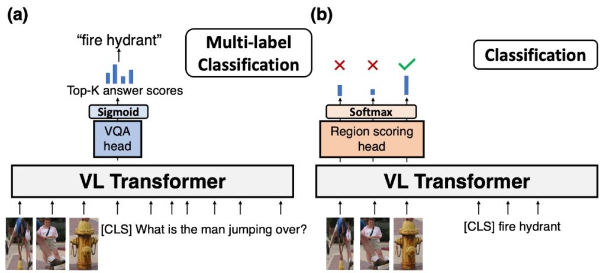
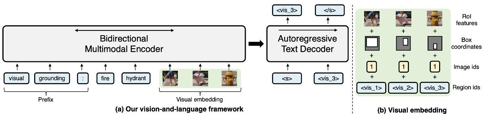
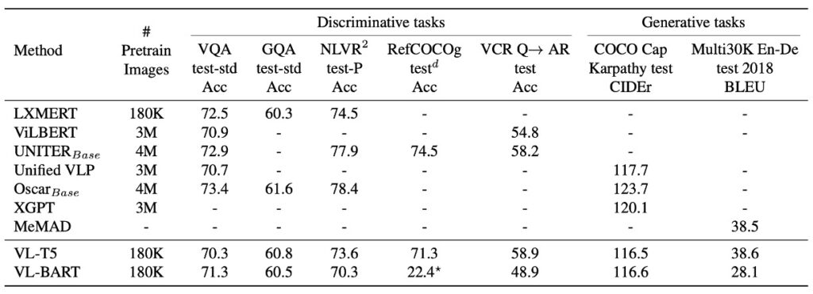

# [21.02] VL-T5

## Consistent Output

[**Unifying Vision-and-Language Tasks via Text Generation**](https://arxiv.org/abs/2102.02779)

---

After reading several papers, you might be familiar with some of the prediction methods for various downstream tasks. Let's look at two examples:

The first example is VQA, generally executed as shown in the above image (a):

1. **Object Detection**: First, obtain object results from an object detector in the image. This step helps identify and locate the main objects and features in the image.

2. **Token Input**: Convert the results from the object detector into tokens and place them at the beginning of the input sequence. Then, convert the question into tokens and place them after the image tokens in the input sequence.

3. **Transformer Model**: Feed the combined token sequence of the image and question into the Transformer model. The Transformer model will perform deep self-attention operations, capturing contextual information and generating an encoded representation of the entire input sequence.

4. **Prediction Head and Sigmoid Function**: Pass the output of the Transformer model (usually the encoded representation of the \[CLS\] token) to a specialized prediction head. This head will calculate a score for each possible answer. Each score is then passed through a sigmoid function to compress it between 0 and 1, which can be interpreted as the model's confidence that the answer is correct.

5. **Select Top-k Answers**: The model will rank the answers based on their scores and select the top-k answers as its final output.

Many VQA datasets, especially those using multiple-choice answers, may be limited by predefined answer sets. This means that even if a more suitable answer exists, the model might miss certain details or information if the answer is not in the predefined set. Additionally, there can be multiple reasonable answers to some questions, which may impact the model's performance during evaluation, even if the provided answer is reasonable in some contexts.

The second example is classification, executed as shown in the above image (b):

1. **Object Detection**: First, obtain object results from an object detector in the image to identify and locate the main objects and features.

2. **Token Input**: Convert the results from the object detector into tokens and place them at the beginning of the input sequence. Then, convert the question into tokens and place them after the image tokens in the input sequence.

3. **Transformer Model**: Feed the combined token sequence of the image and question into the Transformer model. The Transformer model will perform deep self-attention operations, capturing contextual information and generating an encoded representation of the entire input sequence.

4. **Softmax Prediction Head**: Compute scores using all image token encodings together.

5. **Select Answer**: Choose one of the images as the classification answer.

This approach requires an additional image classification head, which the authors find cumbersome.

## Defining the Problem

The authors argue that current methods require task-specific architectures and objectives for handling various vision-and-language tasks, which increases model complexity and limits generalization and efficiency:

1. **Unified Task Architecture**

   - Traditional vision-and-language Transformer models often require task-specific, separately parameterized architectures for different pretraining or downstream tasks. This makes model design and fine-tuning relatively complex.
   - Whenever a new task arises, the model must be redesigned or fine-tuned, increasing workload and complexity.
   - Many skills required for vision-and-language tasks overlap significantly.

2. **Open-Ended Answer Generation**

   - Different tasks require different ways to represent their labels. For example, existing visual question-answering methods treat answers as multi-label classification problems within a fixed set, although answers are already text.
   - Discriminative methods are limited when answering open-ended questions because they can only choose from a predefined set of answers, rather than generating open-ended natural language answers.

3. **Multi-Task Learning and Generalization**

   - Current pretraining methods need task-specific architectures and objectives, which may limit their generalization and efficiency.
   - Traditional methods struggle with rare answers during training, particularly in visual question answering, affecting their generalization ability.

## Solution

### VL-T5 Model Design

:::tip
What is T5?

T5 (Text-to-Text Transfer Transformer) is a model for natural language processing that views all language tasks as text-to-text challenges. Whether it's text classification, translation, or summarization, T5 treats it as inputting one piece of text and generating another related piece of text. This unique design allows it to excel across various tasks while simplifying model design and adaptability. For those interested in understanding its workings and details, it's recommended to refer to the original paper:

T5 Paper:

- [**[19.10] Exploring the Limits of Transfer Learning with a Unified Text-to-Text Transformer**](https://arxiv.org/abs/1910.10683)
  :::

VL-T5 aims to unify vision and language tasks into multimodal conditional text generation. The key design points are:

1. **Based on Pretrained Transformer Models**

   - VL-T5 is based on two pretrained Transformer language models: T5Base.
   - To handle visual input, the authors extended the text encoder by incorporating image region encodings as additional inputs to create a multimodal encoder.

2. **Visual Embeddings**

   - Derived from Faster R-CNN image representations using 36 object regions to represent the input image.
   - Each image region's features are a combination of four types of information: RoI object features, RoI bounding box coordinates, image ID, and region ID.
   - Encoding features involve linear layers and learned embeddings, using image IDs to distinguish between multi-image inputs.

3. **Text Embeddings**

   - To accommodate various tasks without designing task-specific architectures, the model adds specific prefixes to the original input text.
   - Encoding parameters are shared across the encoder, decoder, and language model head. Visual markers corresponding to image regions help establish correspondence between queries, labels, and objects.

4. **Encoder-Decoder Architecture**

   - Uses a Transformer encoder-decoder architecture to encode visual and text inputs and generate text labels.
   - The encoder accepts concatenated text and visual embeddings as input, then outputs their joint contextual representations.
   - The decoder focuses on previously generated tokens and encoder outputs to generate text.

5. **Consistent Output Format**

   - **Unified Framework vs. Task-Specific Methods**

     - Traditional methods often develop specialized architectures and objectives for specific tasks.
     - VL-T5 provides a unified framework that does not require redesigning models for each new task.

   - **Visual Question Answering**
     - Traditional models typically introduce a multilayer perceptron (MLP) multi-label classifier head for visual question answering. These models are trained with binary cross-entropy loss alongside the Transformer backbone, weighted by VQA scores.
     - VL-T5 addresses visual question answering by treating both questions and answers as text and using the same language modeling objective.
   - **Grounded Expression Understanding**
     - Traditional methods (e.g., UNITER) solve this problem by adding an MLP region scoring head to the output representations of image regions, typically involving multi-class or binary classification strategies.
     - VL-T5 again opts for a text-centric approach, treating task labels as corresponding text and using the language modeling objective to predict these labels.

### Datasets Used

- **MS COCO**

  This popular dataset is primarily used for object detection, semantic pixel segmentation, and image captioning tasks. "COCO" stands for "Common Objects in Context," indicating that the images include objects within real-world contexts. It is widely used in deep learning and computer vision for training and validation.

- **Visual Genome (VG)**

  VG is another popular dataset designed to provide detailed visual knowledge by deeply understanding objects, attributes, and relationships within images. It not only annotates objects but also includes interactions and relationships between them.

- **Dataset Scale and Details**
  - Together, these datasets include 180,000 unique images, providing a wide variety of scenes, objects, and contexts, enriching the visual information available for training the model.
  - Among these 180,000 images, there are 9.18 million image-text pairs, meaning each image is associated with multiple text descriptions or annotations. This rich context and detail help the model more accurately understand the relationships between images and text.

### Pretraining Tasks

1. **Multimodal Language Modeling (MLM)**

   VL-T5 is a multimodal version based on the T5 (Text-to-Text Transfer Transformer) architecture.

   In this model, to train it to understand and generate text, the authors randomly mask (or remove) 15% of the original input text tokens and replace them with "sentinel tokens." The main objective of pretraining is for the model to learn to predict the masked text tokens. This masking and prediction method helps the model learn contextual understanding and generate relevant text.

   Sentinel tokens represent masked segments of the input sequence in T5's unsupervised denoising training. They serve a key role in indicating masked parts of the sequence, and in the output sequence, these tokens appear along with the actual masked content.

   :::tip
   For example:

   - Original Sentence: "The cute dog walks in the park."
   - If "cute dog" and "the" are masked, the process is as follows:
     - Input Sequence: "The \[extra_id_1\] walks in \[extra_id_2\] park."
     - Output Sequence: "\[extra_id_1\] cute dog \[extra_id_2\] the."
       :::

   This design aims to use specific tokens to indicate and restore masked sequence parts in unsupervised learning contexts. Unlike the traditional \[MASK\] method, which replaces all masked parts with the same \[MASK\] token, the sentinel tokens method in T5 assigns a unique token for each masked part (e.g., \[extra_id_1\], \[extra_id_2\]). This allows the model to more precisely identify and restore each masked segment.

   The \[MASK\] method is primarily used for training models like BERT to understand context and predict masked parts. Sentinel tokens are designed for T5's text-to-text model, which treats all NLP tasks as input-to-output text transformations.

   Although sentinel tokens are fixed, their specific content is dynamic, depending on the current context and the model's predictions. In different contexts, the same sentinel token can be used without ambiguity, as its meaning is explicitly interpreted and restored during the model's training or prediction process.

2. **Visual Question Answering (VQA)**

   Traditional VQA methods often have a predefined set of answer options (e.g., a fixed answer vocabulary), and the model's task is to choose the most suitable answer from them. This approach is limited because it cannot generate answers not present in the predefined set. However, the authors' proposed method allows the model to directly generate the original text of the answer, offering greater flexibility to answer more open-ended questions rather than just selecting predefined answers.

3. **Image-Text Matching**

   This task involves determining whether an image and a piece of text are related or matched. For example, an image might show a dog playing in a park, and the corresponding text might be "A dog chasing a ball on the grass." If these elements (image and text) describe the same content or context to some extent, they are considered matched.

   During image-text matching training, two types of pairs are typically used:

   - **Correct Pair**: This is the original, true image-text pair, indicating they are matched in the real world.
   - **Incorrect Pair**: This is intentionally created mismatched image-text pairs, usually achieved by pairing an image with randomly chosen text from another context.

   The model's task is to predict the relationship between each image and text pair, determining whether they are "true" (they match) or "false" (they don't match). This is essentially a binary classification problem, where the model learns to identify features that indicate true matching pairs from the image and text.

4. **Visual Grounding**

   Visual grounding, or visual localization, involves the model locating specific visual regions corresponding to textual or linguistic descriptions in an image. This task requires the model to identify and locate specific objects or features in an image and associate them with corresponding text descriptions. During training, the model receives text describing a particular region or object. Based on this text, the model's task is to predict the unique identifier or ID of the region (usually represented as a bounding box or set of coordinates) corresponding to that description.

   Training for visual grounding does not require detailed annotation of every object in the image. The training data may already contain sufficient information (e.g., object locations and corresponding descriptions), so no further annotation is needed.

5. **Grounded Captioning**

   Grounded captioning involves generating text descriptions based on specific regions in an image. Unlike traditional image captioning, which generates descriptions for the entire image, grounded captioning focuses on generating descriptions for specific regions or objects within the image. Visual grounding typically refers to locating regions in the image based on text descriptions, while grounded captioning is the reverse operation: given a region in the image, generate text describing that region.

6. **Pretraining Execution Details**
   - Pretraining was conducted for 30 epochs using 4 RTX 2080 Ti GPUs, taking a total of 4 days.
   - AdamW was used as the optimizer with specific hyperparameter settings.

## Discussion

### VQA and GQA Analysis

VL-T5 and VL-BART were compared with several existing vision-and-language pretrained Transformers across seven different downstream tasks. The results show that VL-T5 and VL-BART's unified generation approach performs very closely to task-specific models, most of which are discriminative.

However, due to VL-BART's subpar performance, the primary focus of this paper is on VL-T5.

1. **Performance in VQA and GQA**

   Visual question answering tasks require the model to provide answers based on the given context image. In VQA and GQA comparisons, VL-T5 and VL-BART achieved performance comparable to existing methods.

2. **Generative Models vs. Discriminative Models**

   Most modern methods are discriminative models, treating VQA tasks as multi-task label classification. While these strategies excel in some scenarios, they struggle with open-ended real-world scenarios. In contrast, generative models like VL-T5 significantly outperform discriminative models in some scenarios, especially for unseen questions.

3. **Effect of Dataset-Specific Prefixes**

   Research indicates that different text prompts or prefixes may impact the model's fine-tuning results. In VQA and GQA, VL-T5 used a single prefix "vqa" during pretraining and fine-tuning. Compared to using dataset-specific prefixes, this approach slightly improved performance, suggesting that a single model can successfully handle multiple VQA tasks without dataset-specific prefixes.

### NLVR2 Analysis

The NLVR2 task requires the model to determine whether a natural language statement applies to a pair of images. This task tests the model's ability to integrate image and text information. It is divided into three encoding settings:

- Triplet: This setting jointly encodes the image pair and corresponding text.
- Pair: This setting individually encodes each image with its corresponding text before concatenation.
- Pair-biattn: Based on the Pair setting, it adds bidirectional attention.

VL-T5's performance in NLVR2 showed comparable results to UNITER in the simple Triplet encoding setting. Despite some performance gaps in more complex encoding settings (e.g., Pair and Pair-biattn), considering the computational efficiency of Triplet, VL-T5's performance in this setting is remarkable. This highlights VL-T5's potential and versatility in vision-and-language tasks.

### VCR Analysis

VCR (Visual Commonsense Reasoning) is a multiple-choice answering task requiring commonsense reasoning beyond simple object or action recognition. Each VCR question has four answer options and four rationale options. This task can be broken down into two sub-tasks: Question Answering (Q→A) and Answer Justification (QA→R). The overall goal is to choose the correct answer and provide the correct rationale for that answer.

VL-T5's approach is similar to that of Nogueira et al. The model concatenates the context (image and question) with each candidate option and generates "true" or "false" based on whether the option is correct. During inference, probabilities are used to rank the options, selecting the highest-scoring option as the answer.

On the VCR validation set, compared to a baseline model without pretraining, VL-T5 showed improved performance, aligning with findings from UNITER. On the VCR test set, VL-T5's performance reached a level comparable to or slightly better than UNITER. Compared to ViLBERT, VL-T5 significantly improved performance.

## Conclusion

The Encoder-Decoder architecture design of Transformers is frequently mentioned. VL-T5 is an in-depth exploration of this architecture, aiming to achieve better performance in vision-and-language integration tasks. However, initial attempts do not seem to have achieved breakthrough results.

While the combination of Encoder and Decoder has proven effective in many tasks, in specific vision-and-language integration tasks, it may still require further adjustment and optimization. This might involve more precise architectural adjustments, different attention mechanisms, or more suitable pretraining strategies for specific tasks.

Therefore, simply changing or adjusting the model architecture may not be sufficient to bring significant performance improvements. Perhaps more importantly, how to fully utilize large amounts of data, more effective training strategies, and deeper task understanding to optimize for specific problems.

From our own development experience, using only an Encoder tends to make it easier for the model to learn data features. This is because the Encoder's primary goal is to capture the main features of the input data and encode them into a fixed-size representation. This representation is typically more concise than the original input and captures its most important information. Due to the simplicity of the architecture, training a pure Encoder is often faster than a full Encoder-Decoder combination, saving training time and resources.

However, when introducing a Decoder mechanism, the model often requires a larger amount of data for learning. This is because the Decoder must reconstruct the input or generate new output from the fixed representation provided by the Encoder, adding to the model's learning challenge. Large amounts of data provide sufficient examples to help the model learn these complex mappings. The introduction of a Decoder adds complexity to the overall architecture, not only increasing the number of parameters to be trained but also potentially raising the risk of overfitting.

:::tip
Could using several orders of magnitude more data on this architecture yield entirely different conclusions?
:::

In summary, VL-T5 provides a valuable starting point, offering new insights into the application of the Encoder-Decoder architecture in vision-and-language integration. By exploring the potential limitations and strengths of this architecture, and further adjusting and optimizing it, we can achieve higher performance while paving new paths for researchers in this field.
