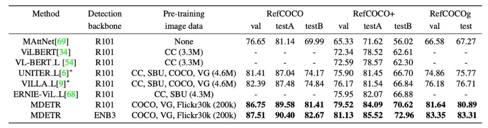
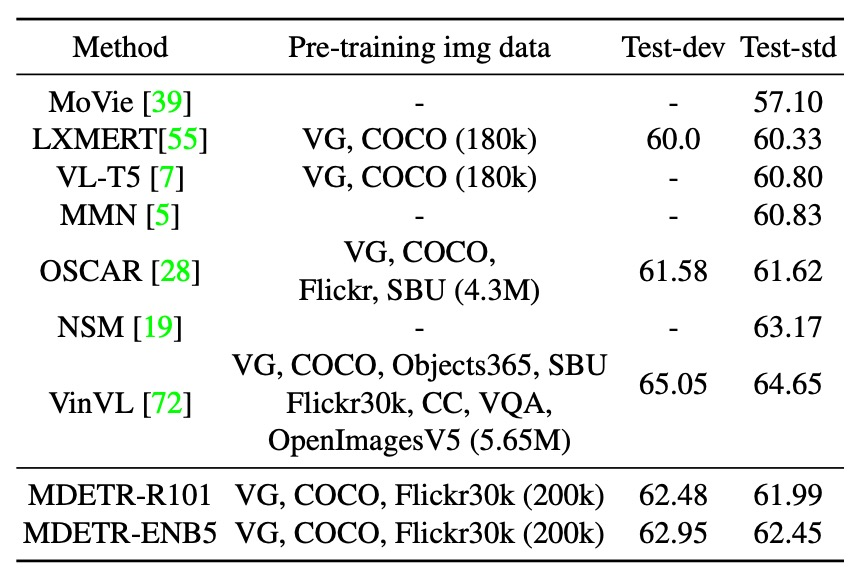
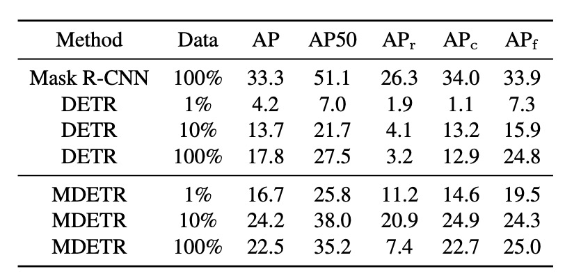

## The Art of Continuity

[**MDETR -- Modulated Detection for End-to-End Multi-Modal Understanding**](https://arxiv.org/abs/2104.12763)

---

In recent years, object detection has been at the forefront of computer vision, serving as the core of many advanced multi-modal understanding systems. However, traditional methods treat detection systems as black boxes, conducting fixed concept image detection, which clearly has inherent limitations.

A significant issue is the inability to effectively utilize multi-modal context for collaborative training, limiting downstream models to accessing only detected objects. Moreover, these detection systems are often frozen, meaning they lack further refinement and adaptability. Most importantly, the vocabulary of these detection systems is severely limited, making them blind to novel concept combinations expressed in free-form text.

Simply put, the authors of this paper aim to replace the object detection architecture in VL models.

You might remember a previous paper that attempted to replace the detection architecture with ViT, which didn’t turn out well.

- Portal: **[ViLT: Passing the Baton](../2102-vilt/index.md)**

Since replacing with ViT wasn’t very successful (because ViT isn’t specialized for object detection), this time the authors used another "specialist" object detection model, DETR, for the replacement.

- Portal: **[DETR: The Pioneer Across Fields](../../object-detection/2005-detr/index.md)**

## Problem Definition

Most advanced multi-modal understanding systems currently rely on object detection as a core component, but these designs are fraught with various issues:

1. **Limitations in Collaborative Training**

   In multi-modal systems, collaborative training means using data from multiple input sources (e.g., images, text, audio) simultaneously for model training. If a system component cannot collaborate with other parts for such training, it might fail to fully leverage all available information.

   Imagine a model with both image and audio inputs that only trains the image detector independently, ignoring the audio input. If the audio provides important information about objects in the image, the model might fail to identify them correctly.

2. **Detection Scope Limitation**

   The main purpose of detection systems is to identify specific objects in images. However, if these systems focus solely on known objects and ignore other parts of the image, they might miss important contextual information. For instance, in an image with multiple people and a dog, the detector might only identify the people and dog, ignoring the park setting, which provides important context.

3. **Model Fixation**

   Once a model is trained and "frozen," it no longer updates or learns. This hinders its ability to adapt and optimize in new situations or with new data. For example, a detector trained on summer images might perform poorly on winter images with snow or people in heavy coats if it cannot be fine-tuned.

4. **Vocabulary Limitation**

   Object detection systems identify specific classes or attributes based on their training data. If they encounter new objects or concepts not seen in the training data, they might fail to recognize them.

5. **Lack of End-to-End Design**

   End-to-end systems allow continuous learning and optimization from input to output without intermediate steps. If the detector is not end-to-end, its collaborative training with other tasks might be limited. Mathematically speaking, this system cannot be differentiated, and without differentiation, it cannot be optimized.

## Solution

### MDETR Model Design

The model is straightforward: for the text part, it uses a modified RoBERTa encoder. After generating text feature encodings, they are concatenated and fed into the original DETR architecture.

The overall structure includes:

- **Main Convolutional Encoder**: The image is first encoded by a convolutional backbone and flattened.
- **Spatial Information**: By adding 2D positional encoding to the flattened vectors, the model retains spatial information.
- **Text Encoding**: The text is encoded using a pretrained Transformer language model, producing a sequence of hidden vectors of the same size as the input.
- **Modality-Specific Linear Projections**: Modality-specific linear projections are applied to image and text features to project them into a shared encoding space.
- **Cross-Encoder**: The concatenated sequence of image and text features is fed into a joint Transformer encoder, the core part of the model.

### Training Method

1. Soft Token Prediction

The idea behind soft token prediction is intriguing. Soft token prediction focuses on predicting the "range" of each matched object in the original text rather than predicting the class label of each detected object. This is the main difference between this method and standard object detection.

Suppose the description sentence is "a black cat and a white dog." When the model detects a black animal, it tries to predict its association with the phrase "black cat." This is not just about an individual token or class label but about a range of tokens in the text that collectively describe a specific object.

The benefit of this approach is that it can handle multiple references to objects in the same text or cases where multiple objects correspond to the same text.

### Contrastive Alignment

Contrastive alignment aims to ensure that the encoded representations of visual objects are close to their corresponding text tokens in the feature space. This alignment is stronger than just relying on positional information from "Soft Token Prediction" as it directly operates on feature representations.

Referencing the mathematical equation provided in the paper:

- L: The maximum number of tokens.
- N: The maximum number of objects.
- T+​i: The set of tokens that should align with a given object oi​.
- Oi+​: The set of objects that should align with a given token ti​.
- τ: The temperature parameter, set to 0.07 directly.

The concept of the entire equation is simple: objects and text, align well, the closer the better.

### All Losses

Training MDETR involves multiple loss functions. In addition to the contrastive loss mentioned above, it includes the original losses from the DETR paper, such as bipartite matching, bounding box prediction loss, L1 loss, GIoU, etc.

### Dataset

- **CLEVR**: Used to evaluate the method's results.
- **Flickr30k**: Used to build the composite dataset images.
- **MS COCO**: Used to build the composite dataset images.
- **Visual Genome (VG)**: Used to build the composite dataset images.
- Annotation data is sourced from referring expression datasets, VG regions, Flickr entities, and the GQA training balanced set.

### Technical Details

- **Pre-training Modulated Detection**

  During the pre-training phase, the goal is to detect all objects referenced in the aligned free-form text.

- **Data Composition Technique and Its Importance**

  - For each image, all relevant text annotations are retrieved from the mentioned datasets. If different annotations reference the same image, they are merged. To ensure the independence of the training and validation/test sets, all images that appear in the validation or test sets are removed from the training set.
  - This algorithm combines sentences, ensuring the overlap between combined phrases or text blocks is minimal (GIoU ≤ 0.5). GIoU is a metric used to assess the overlap between two rectangular regions. The total length of the combined sentence is limited to fewer than 250 characters. Using this method, a large dataset of 1.3 million aligned image-text pairs is formed.
  - There are two main reasons for using this data composition technique:
    - Data efficiency: By packing more information into a single training sample, the data can be utilized more effectively.
    - Better learning signal:
      - When the model learns, it needs to identify and resolve ambiguities between multiple references to the same object class in the text.
      - In a single-sentence context, the task of "Soft Token Prediction" becomes relatively simple, as the model can usually easily predict the subject or core meaning of the sentence without much reliance on the image.
      - By combining multiple sentences, the model is forced to explore the associations between images and text more deeply, thereby improving its prediction capabilities.

- **Model Architecture Choices**
  - The text encoder uses a pretrained RoBERTa-base with 12 Transformer encoder layers.
  - Visual backbones include:
    - **ResNet-101**: Obtained from Torchvision and pretrained on ImageNet.
    - **EfficientNet Series**: EfficientNetB3 and EfficientNetB5 were used. EfficientNetB3 achieved 84.1% top-1 accuracy on ImageNet, while EfficientNetB5 achieved 86.1%.
  - Additionally, a model trained on large amounts of unlabeled data using the Noisy-Student pseudo-labeling technique was used.
  - Training details: Using 32 V100 GPUs, pretraining was conducted for 40 epochs with an effective batch size of 64, taking approximately one week.

## Discussion

### Downstream Task Performance Analysis

1. **Phrase Grounding**

   

   The authors used the Flickr30k dataset with specific training/validation/test splits. For evaluation, they adopted two different protocols to address the issue of multiple objects being referenced by a single phrase, each with its pros and cons.

   1. **ANY-BOX Protocol**

      Under this protocol, if a given phrase references multiple different objects in the image, the predicted bounding box is considered correct if it intersects with any of the ground truth boxes above a set threshold, typically 0.5 IoU. This means the prediction is correct as long as the model correctly identifies any of the referenced objects. However, this method does not evaluate if the model has found all referenced instances.

   2. **MERGED-BOXES Protocol**

      Under this protocol, if a phrase references multiple objects in the image, all ground truth boxes associated with the phrase are first merged into a single bounding box that encompasses all of them. Then, the merged box is used to calculate IoU as usual. This means the model's prediction needs to match the merged box rather than individual ground truth boxes. The issue with this method is that it may lose detailed understanding of each instance, especially when these instances are far apart in the image, making the merged box unreasonably large.

   3. **Results Comparison**
      - Under the ANY-BOX setting, MDETR achieved an 8.5 point improvement in Recall@1 on the validation set compared to the current state-of-the-art techniques, without using any additional pre-training data.
      - With pre-training and using the same backbone, MDETR further improved its performance on the test set by 12.1 points.

2. **Referring Expression Comprehension**

   

   Most previous research and methods for this task involve ranking a set of pre-extracted image-related bounding boxes. These boxes are obtained using pretrained object detectors.

   In contrast, this paper aims for a more challenging goal: training the model to predict bounding boxes directly given a referring expression and the corresponding image, rather than simply ranking pre-extracted boxes.

   The model in this paper is pretrained to identify every object referenced in the text during pre-training. For example, for the caption "a woman in a blue dress standing next to a rose bush," the model is trained to predict boxes for all referenced objects (woman, blue dress, and rose bush). However, when it comes to referring expressions, the task is only to return a single bounding box representing the object referenced by the entire expression. To adapt to this change, the model was fine-tuned on these three specific datasets.

   The results shown in the table indicate significant improvements over state-of-the-art methods across all datasets.

3. **Visual Question Answering**

   

   This model architecture can also be applied to the VQA task but requires some design modifications.

   - **Model Design**
     - Query Types: In addition to the 100 detection queries, query types for question types and queries for predicting question types are introduced. In GQA, these question types are defined as REL, OBJ, GLOBAL, CAT, and ATTR.
     - Training: Pretraining was conducted for 40 epochs, followed by fine-tuning on the unbalanced GQA split for 125 epochs and final fine-tuning on the balanced split for 10 epochs.
     - Loss Strategy: During the first 125 epochs, both detection loss and QA loss were trained, with QA loss given more weight.

   The model utilizes object queries as learned encodings input into the decoder for object detection. During inference, specific parts of the model predict the question type and derive the answer from that part.

   :::tip
   Unlike commonly used VQA v2, this paper uses GQA.

   GQA and VQA v2 are widely used datasets for Visual Question Answering (VQA). While both focus on answering questions given an image, there are key differences:

   1. **Data Scale and Source**

      - GQA: Based on the Visual Genome dataset, containing approximately 22 million question-answer pairs.
      - VQA v2: An improved version of the original VQA dataset, containing about 1.2 million question-answer pairs, based on MS COCO and Abstract Scenes datasets.

   2. **Nature of Questions and Answers**

      - GQA: Focuses on complex and compositional questions, often involving multiple objects and their relationships. Answers are usually more descriptive and can be multi-word responses.
      - VQA v2: More diverse, with questions ranging from very simple (e.g., "What color is this?") to more complex. Answers are usually one or two words.

   3. **Data Imbalance**

      - GQA: Designed to address some imbalance issues in VQA that might lead models to guess answers without truly understanding the image content.
      - VQA v2: Introduced challenging counterexample images to address data bias issues found in the original dataset.

   4. **Scene Graphs**

      - GQA: Contains rich scene graphs, detailing the types, attributes, and relationships of objects in the images.
      - VQA v2: Does not include built-in scene graphs, but researchers can use other data sources or techniques to provide this information.

   5. **Task Goals**
      - GQA: In addition to basic VQA tasks, GQA focuses on multi-modal reasoning, pushing models to deeply understand image content and question context.
      - VQA v2: Primarily focuses on basic VQA tasks, aiming to improve model performance and address data bias issues.

   In summary, GQA tends to provide more complex questions and answers, with richer object and relationship descriptions, while VQA v2 is more diverse and focuses on addressing data bias issues.
   :::

4. **Performance Comparison**

   

   - Using a model with a ResNet-101 backbone, its performance exceeds that of LXMERT and VL-T5.
   - The model's performance even surpasses OSCAR, which uses more pre-training data.
   - The MDETR model with an EfficientNet-B5 backbone achieves even higher performance, as shown in the table.

### Few-Shot Capabilities?

Inspired by the success of CLIP in zero-shot image classification, the authors explored how to fine-tune the pretrained MDETR model for object detection with a small amount of labeled data. Unlike CLIP, MDETR's pretraining dataset does not ensure all target classes are balanced. This means that in its dataset, no bounding boxes are aligned with text, leading the model always to predict a box for the given text.

Due to this design, MDETR cannot be evaluated in a true zero-shot transfer setting. Therefore, the authors chose an alternative strategy, evaluating in a few-shot setting. The LVIS dataset was chosen for this experiment, containing 1.2k categories, most of which have very few training samples, exhibiting a long-tail distribution.

To adapt to this distribution, MDETR's training strategy was: for each positive class, it used the image and the class name as the training instance while using all annotations for that class. For negative classes, only the class name and empty annotations were provided. During inference, MDETR queried for each possible class name and merged all detected boxes across text prompts.

:::tip
Example:

Assume we have a simple dataset with three classes: "dog," "cat," and "fish."

Our labeled data includes:

An image showing a dog, labeled "dog."
Another image showing a cat and a fish, labeled "cat" and "fish," respectively.
Based on MDETR's training strategy:

For the first image:

Since it contains a "dog," this image and the text "dog" are used as the training instance with the label "dog."
Since there are no "cats" or "fish" in the image, the class names "cat" and "fish" are provided without labels (i.e., empty labels).
For the second image:

Since it contains a "cat" and a "fish," the image, and the texts "cat" and "fish" are used as training instances with the labels "cat" and "fish."
Since there are no "dogs" in the image, the class name "dog" is provided without a label (i.e., empty label).
During inference, MDETR queries each class name "dog," "cat," and "fish" and merges the results detected across text prompts. For example, if it detects a box when querying "dog" and "fish" but none when querying "cat," the final result will contain boxes for "dog" and "fish."
:::

The authors fine-tuned MDETR on three subsets of the LVIS dataset (1%, 10%, and 100% of images). The results were compared with two baselines: a Mask-RCNN trained on the full LVIS training set and a DETR pretrained on MSCOCO and fine-tuned on LVIS subsets. Surprisingly, even with only 1% of the data, MDETR leveraged its text pretraining to outperform fully fine-tuned DETR on rare categories.

Moreover, a significant observation was that fine-tuning on the full training data led to a sharp drop in detection performance on rare objects, from 20.9 AP with 10% data to 7.5 AP with 100% data. This steep decline is likely due to extreme class imbalance in the data.

## Conclusion

One of the most appealing features of MDETR is its "complete differentiability."

This design allows the entire model to be trained end-to-end, fostering tighter model collaboration and potentially improving overall performance and training efficiency. Additionally, its practical performance on multiple datasets has demonstrated impressive results, establishing its position in the multi-modal learning domain.

Furthermore, MDETR's versatility is a major highlight. Not only does it excel in modulated detection, but it has also proven its value in downstream applications such as few-shot detection and visual question answering.

MDETR provides a pathway, with its non-reliance on black-box object detectors potentially inspiring more researchers to create accurate and efficient models.

:::tip
Why didn't previous papers string Faster RCNN together? Complete differentiability, how great would that be?

While a fully differentiable model sounds appealing, it can also require more computational resources. Especially if you do it directly and brutally without clever design, there's a high probability that the model will retaliate against you:

- **It won't train.**

When the entire model is differentiable, its internal structure is likely complex, meaning higher computational costs and more training difficulty. Researchers might need to spend more time tuning hyperparameters, which might not be feasible for every team.
:::
