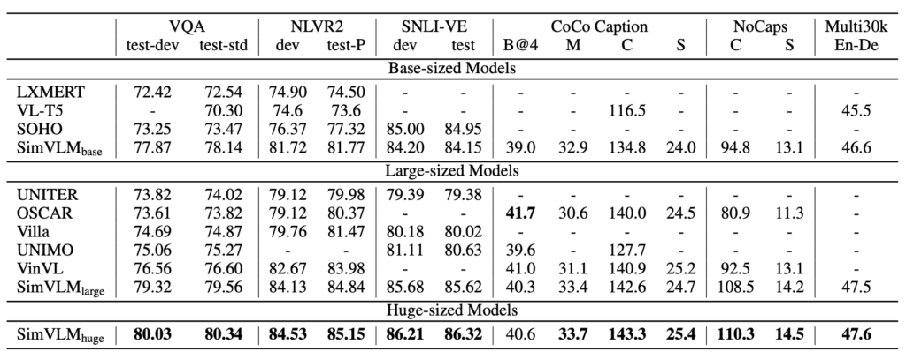
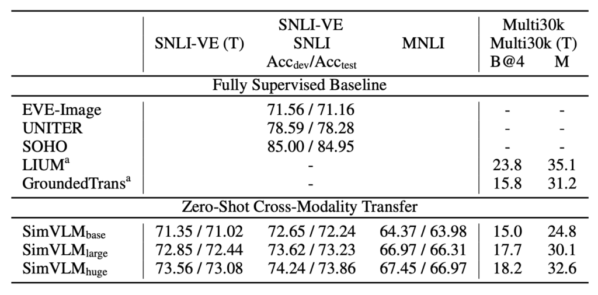

## Simplifying Things

[**SimVLM: Simple Visual Language Model Pretraining with Weak Supervision**](https://arxiv.org/abs/2108.10904)

---

When things get too complicated, they can become daunting:

Do we really need to make it this complicated?

At this point, GPT-3 had already been released and achieved quite impressive results without complicating things too much.

The authors of this paper, based on this idea, thought it might be time to move away from the traditional encoder architecture.

Perhaps, we can simplify things?

## Problem Definition

The authors identified several key issues:

1. **Drawbacks of the Pretraining-Finetuning Paradigm**

   - While pretraining models like BERT on large-scale unlabeled text corpora using Masked Language Modeling (MLM) followed by finetuning has become mainstream, recent autoregressive language models such as GPT-3 have shown strong performance with few-shot learning, without the need for finetuning.

2. **Challenges in Multimodal Alignment**

   - Establishing a correspondence between vision and language is challenging. Early approaches relied on manually annotated datasets for object detection and MLM-based pretraining for fusion models.
   - Due to the limited scale of human-annotated data, previous methods not only required complex pretraining schemes but also introduced task-specific auxiliary losses, complicating the entire Visual Language Pretraining (VLP) protocol.

3. **Lack of Zero-Shot Capability**

   - Current methods based on pretraining and finetuning perform poorly in zero-shot settings, where the model’s generalization ability to unseen tasks is limited.
   - Some methods focus only on specific tasks, making them unsuitable as general-purpose pretrained representations. For instance, certain approaches focus solely on image classification or image-text retrieval tasks.

## Solution

### SimVLM Model Design

1. **PrefixLM**

   Inspired by the zero-shot capabilities of autoregressive language models, the authors propose a new approach called "Prefix Language Modeling" or "PrefixLM". Unlike traditional autoregressive language models, PrefixLM has several key features:

   - **Bidirectional Attention on the Prefix Sequence**:

     PrefixLM considers both the preceding and following context of the prefix sequence, meaning it learns from both past and future information.

   - **Autoregressive Decomposition Only for the Prefix**:

     It performs autoregressive decomposition only after the prefix, attempting to predict the subsequent sequence.

   - **Image as the Prefix of Text**:

     In vision-language tasks, PrefixLM treats images as prefixes to textual descriptions. This is based on the observation that images often precede textual descriptions.

   :::tip
   Suppose we have an image showing a dog playing with a ball in the park. The task of PrefixLM would be to generate a description of this image. The process might look like this:

   1. **Image as Prefix**: First, the image's feature representation (possibly through a visual model like ResNet or VGG) is used as a prefix input to the model.
   2. **Partial Text Description**: With this image as the prefix, a brief description might be added, such as "A dog...".
   3. **Bidirectional Context Consideration**: The model then starts generating the description from the decoder, considering both the context generated so far (e.g., "A dog") and the image's prefix information.
   4. **Continued Description Generation**: Considering the above context, the model might generate "playing with a ball in the park".

   Combining the image prefix and the generated text, we get the full description: "A dog playing with a ball in the park."
   :::

2. **Architecture Design**

   Using Transformer as the core architecture, they combine a sequence-to-sequence language model with both visual and textual modules:

   - **Visual Module**

     Here, instead of the Linear layer used in ViT to convert image patches to features, ResNet is used. The original ViT accepts only image inputs, but here a part of the text input is incorporated into the token sequence.

   - **Text Module**

     Following the SentencePiece tokenization method, specifically the Byte-Pair Encoding (BPE) method, which iteratively merges the most frequent character pairs into new units until a predefined vocabulary size is reached, then learns the encoding for this fixed vocabulary.

   :::tip
   Wait a minute! This architecture looks a lot like VL-T5!

   Let's take a look at the VL-T5 architecture:

   

   - Both have an Encoder-Decoder structure.
   - Both incorporate image and text information into the Encoder.
   - But they are indeed different!

   At first glance, they seem similar, but they are quite different in practice.

   In VL-T5, **the output of the object detector** is used, showing the model cropped image fragments. Additionally, it incorporates two text descriptions:

   - The first segment: the prefix that tells the model the type of task.
   - The second segment: the actual question.

   This design leaves most of the difficulties to the Encoder, making the Decoder's role less significant. In fact, the Decoder could even be removed, adding a [CLS] token to the Encoder to answer questions, potentially achieving similar performance.

   In contrast, SimVLM does not leave all the tasks to the Encoder. It creates a "crime scene" scenario where the Decoder, acting as a detective, must infer the results from the clues left by the Encoder.

   According to the authors, the "prefix" can even be a text description of the image rather than the image itself.

   This design difference led to nearly a 10% performance improvement in downstream tasks.
   :::

### Pretraining Strategy

There’s no MLM, ITM, or any other techniques you might expect.

The authors use only the "PrefixLM" strategy for pretraining, which involves playing a text completion game like GPT, with the addition of image clues.

Wow! This simplicity caught us off guard...

### Datasets

- **ALIGN Training Dataset**: A large dataset of images with associated descriptions or annotations, often containing "a lot of noise". This image-text pair dataset supports multimodal learning tasks and is typically used for visual language pretraining.
- **Colossal Clean Crawled Corpus (C4)**: A large text dataset used for pretraining language models, compiled and cleaned from web texts, designed for efficient and large-scale pretraining.

## Discussion

### How Does the Model Perform?

SimVLM can achieve excellent performance with its simplified pretraining and finetuning approach, seamlessly integrating into the pretraining-finetuning workflow:

1. **Model Comparison**

   - SimVLM is compared with several state-of-the-art Vision Language Pretraining (VLP) methods, including: LXMERT, VL-T5, UNITER, OSCAR, Villa, SOHO, UNIMO, and VinVL.
   - SimVLM outperforms all compared models on multimodal tasks, setting new SOTA results.
   - This indicates that SimVLM’s generative pretraining method is competitive, and its simple framework with weak supervision can learn high-quality multimodal representations.

2. **Performance on Specific Tasks**

   - **Discriminative Tasks**

     SimVLMbase, even with a smaller capacity, outperforms all other methods. Notably, SimVLMhuge is the first model to achieve over 80% accuracy on the VQA task, nearly 4 points higher than the previous SOTA (VinVL).

   - **Complex Visual Language Reasoning**

     SimVLM surpasses previous methods on both NLVR2 and SNLI-VE.

   - **Generative Tasks**

     SimVLM shows significant improvements, particularly on the CoCo Captions “Karpathy” 5k test split and the NoCaps benchmark, outperforming previous models using more complex CIDEr optimization reinforcement learning methods.

   - **Image Translation**

     SimVLM also demonstrates effectiveness in the Multi30k English-to-German image translation task.

### How Is the Zero-shot Performance?

The authors explored three main zero-shot application scenarios:

1. **Zero-shot/Few-shot Image Captioning**

   

   SimVLM’s pretraining process can be seen as an interpretation of the image captioning target on the web. When used in zero-shot or few-shot settings, the model’s performance is comparable to fully supervised models. Using certain prefix prompts, such as “A picture of,” improves caption quality. The model demonstrates strong generalization capabilities, recognizing real-world concepts and providing detailed descriptions of visual inputs.

2. **Zero-shot Cross-modal Transfer**

   

   SimVLM, a VLP model, is used in this study. Since text training data typically costs less than visual data, the model is finetuned on pure text data and then evaluated on joint vision-language tasks. This method is validated on the SNLI-VE and Multi30k datasets.

   Particularly in the SNLI-VE application, SimVLM achieves satisfactory zero-shot transfer results by finetuning on text NLI datasets and then using image data as input, comparable to fully supervised methods.

   Notably, when image features are masked and predictions are made using only hypotheses, the model's performance is similar to random guessing, confirming SimVLM’s effectiveness in cross-modal transfer. Additionally, the model successfully transfers from one modality and language to another, demonstrating its cross-domain and cross-language capabilities.

3. **Open-domain Visual Question Answering (VQA)**

   

   In VQA tasks, traditional methods typically frame the question as multi-label classification over a set of 3,129 predefined candidate answers. However, this approach is limited in real-world applications, as a fixed answer set cannot cover all possible scenarios, making open-domain VQA challenging.

   Experiments show that SimVLM performs exceptionally well in open-domain VQA, outperforming other baseline models, even on questions where the answers are not in the predefined candidate set. Notably, the model can generate meaningful answers for unseen questions even with only a subset of predefined answers used for training. However, without finetuning, the model may struggle to generate meaningful answers for some questions.

### What Contributes to the Model’s Success?

Firstly, when the model only has a decoder without a bidirectional encoder, its performance on VQA significantly drops. This result suggests that combining bidirectional encoding with unidirectional decoding positively impacts model performance.

Next, the study found that among pretraining objectives, PrefixLM outperforms other strategies. This not only demonstrates the effectiveness of PrefixLM but also indicates the importance of having a unified and consistent objective formulation when handling both visual and textual data.

Additionally, during training, while weakly aligned image-text data helps the model understand the relationship between vision and text, pure text corpora are also indispensable. This is because pure text corpora provide rich language information, aiding the model in achieving a deeper understanding of language.

Lastly, the study emphasizes the importance of convolution stages in Vision-Language (VL) tasks. Specifically, when using three convolution (conv) blocks, the model’s performance is most prominent. This finding reveals the different granularities and characteristics in representing image and text data, suggesting that considering these differences in the model architecture is beneficial.

## Conclusion

Achieving such results with such a simple architecture is indeed impressive.

However, this simplicity does not mean it’s easy to discover or implement. SimVLM’s success exemplifies this principle. This paper not only showcases an effective technical strategy but also emphasizes that in today’s seemingly complex technical world, it is still possible to find simple and straightforward solutions.

Often, people tend to believe that complex problems require complex solutions. SimVLM, with its straightforward "PrefixLM" strategy, breaks this stereotype and provides a clear direction for future research.

We can envision that, based on SimVLM’s excellent performance, future researchers might try optimizing from the perspective of ViT, given its numerous evolutionary forms; or deepening the strategy from GPT’s perspective, both of which could further advance the field of visual language pretraining.
