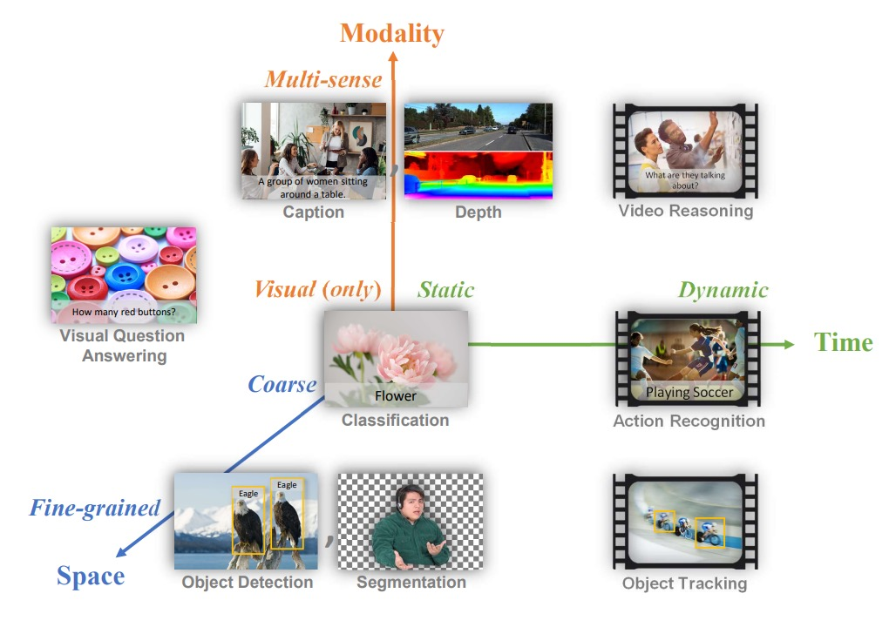
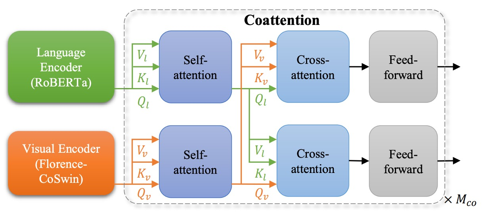

## Renaissance

[**Florence: A New Foundation Model for Computer Vision**](https://arxiv.org/abs/2111.11432)

---

Florence, the birthplace of the Renaissance.

The paper published by Microsoft has a bold name, reflecting both the artistry and audacity behind it.

The term "foundation model" emerged as a concept in the field of natural language processing.

In earlier years, we typically referred to these as "pre-trained models," but as model sizes grew exponentially, reaching almost incomprehensible scales, we discovered that pre-trained models could perform a wide range of tasks, no longer confined to just a few specific ones.

People began to view such models as "foundational," as they provided basic feature representations that could be applied to a variety of tasks, hence the term "foundation model."

:::tip
If you're interested in the opportunities and risks of foundation models, I recommend reading this paper:

- [**[21.08] On the Opportunities and Risks of Foundation Models**](https://arxiv.org/abs/2108.07258)

It's 214 pages long, with 160 pages of content and 50 pages of references—very substantial.
:::

Since this paper has such an ambitious title, let’s dive straight into the main topic.

## Defining the Problem

While the natural language field has already seen iconic foundation models, the authors aim to establish a similar benchmark in the computer vision field. They define the problem space for what they call a "foundation model" in computer vision, proposing a three-dimensional problem space:

1. **Space**: Visual understanding levels ranging from coarser tasks (such as scene classification) to finer ones (such as object detection).
2. **Time**: From static images to dynamic video understanding that involves time series.
3. **Modality**: From pure RGB image information to multimodal data (such as integrating text descriptions, sound, and depth information).

<figure style={{"width": "80%"}}>

</figure>

The problem they aim to solve is: to develop a foundation model and corresponding adapters that can lightly learn general representations from large, diverse upstream data, and, with minimal additional training or modifications, apply to different types of visual tasks across the three dimensions.

In other words, they want to create a model that can handle tasks across the "space-time-modality" spectrum, whether it be scene classification, object detection, behavior recognition in videos, image-text retrieval, or tasks that intertwine vision and language.

## Solving the Problem

### Model Architecture

This architecture diagram is clear and roughly divided into three parts:

1. Prepare a large training dataset.
2. Use optimized contrastive learning methods to train the foundation model.
3. Introduce more adapters for downstream tasks to join the pretraining.

Alright, we've just read through another paper. (~Wait, what?~)

### Training Dataset

Based on the experience of ALIGN, as long as your dataset is large enough, the impact of noisy data can be ignored.

:::tip

If you're interested in the ALIGN model, you can refer to this paper:

- [**[21.02] Scaling Up Visual and Vision-Language Representation Learning With Noisy Text Supervision**](https://arxiv.org/abs/2102.05918)
  :::

Before starting, the authors managed to acquire an enormous image-text dataset (FLOD-900M), which contains 900 million image-text pairs, about 9.7 million unique queries, and a total of 7.5 billion tokens.

### Unified Image-Text Contrastive Learning

The first step is to solve the problem of integrating image and text data. Do you remember the CLIP model from not long ago?

The training idea behind CLIP is:

- Treat image-text pairs as positive samples.
- Treat other text as negative samples.

The issue with this approach is that online data often features "multiple images corresponding to the same text description." If using the CLIP method with the assumption of "one image, one text," then handling multiple images for a single text description becomes challenging. Therefore, the authors reference another contrastive learning framework called "Unified Image-Text Contrastive Learning."

:::tip
For more details on UniCL, you can refer to this paper:

- [**[22.04] Unified Contrastive Learning in Image-Text-Label Space**](https://arxiv.org/pdf/2204.03610)
  :::

The original term is Unified Image-Text Contrastive Learning, abbreviated as UniCL.

The specific approach is to create a hash label for each text description, mapping the same description (regardless of how many images correspond to it) to the same label $y$.

If a batch contains multiple images corresponding to the same text description, these images and that description are all positive samples for each other. In other words, the contrastive learning here no longer has the "one image, one text" limitation but instead follows "one text, many images," where all images corresponding to the same description are positive samples, and other mismatched combinations are still negative samples.

Mathematically, let $f_\theta$ be the image encoder and $f_\phi$ the text encoder.

Given an image $x$ and its corresponding text description $t$, we first convert $f_\theta(x)$ and $f_\phi(t)$ into feature vectors.

- The normalized image feature is

  $$
  u = \frac{f_\theta(x)}{\|f_\theta(x)\|}
  $$

- The normalized text feature is

  $$
  v = \frac{f_\phi(t)}{\|f_\phi(t)\|}
  $$

Next, define a learnable temperature parameter $\tau$ (tau). Given a mini-batch $B$, where each sample has a label $y_i$, the total loss function $L$ includes contrastive losses in two directions:

1. Image-to-text contrastive loss $L_{i2t}$
2. Text-to-image contrastive loss $L_{t2i}$

The final loss is

$$
L = L_{i2t} + L_{t2i}
$$

Through these two directions of contrast, the model simultaneously learns the matching relationship between "image-to-text" and "text-to-image."

Additionally, the authors found that long and meaningful language descriptions are more effective for learning than single-word descriptions. However, since some data contains very short descriptions (like single words), they use templates like "A photo of the [WORD]" to extend the description and provide more contextual features. But later, they discovered that these synthetic prompts negatively impacted higher-level retrieval and vision-language tasks. Therefore, the authors divided the training process into two stages:

- Stage 1: Train for 1 million iterations using all data (including short texts with augmented descriptions).
- Stage 2: Remove all artificial templates and augmented texts, and retrain for 180,000 iterations using only the original data to make the model more sensitive to natural text descriptions.

Finally, they added a high-resolution fine-tuning step (80,000 iterations) that increased the image input size from $224 \times 224$ to $384 \times 384$, similar to other large pre-training methods, to enhance model performance.

### Two-Tower Architecture

The model adopts a "Two-Tower" design:

- **Text Encoder**: A 12-layer Transformer, similar in structure to the text encoder in CLIP.
- **Image Encoder**: A hierarchical Vision Transformer based on CoSwin Transformer.

The entire model has 893 million parameters, with the text Transformer having 256 million parameters and the CoSwin-H image Transformer having 637 million parameters.

:::tip
CoSwin is a variant of Swin Transformer that replaces linear embeddings with convolutional embeddings, making feature extraction more hierarchical, which aids in more precise image representation.
:::

### Downstream Task Adapters - Object-Level

<figure style={{"width": "80%"}}>

</figure>

And now, we move on to solving the fine-grained problem, starting with object-level tasks.

Image-level features alone may not suffice for tasks like object detection and segmentation that require fine-grained localization.

To address this, the authors connect the pre-trained Florence image encoder to an adapter called Dynamic Head or Dynamic DETR, extending from global image semantics to object-level feature learning.

The core concept of Dynamic Head is to connect feature pyramids, spatial dimensions, and channel dimensions through a set of three attention mechanisms.

Since applying multi-head attention to the entire 3D feature tensor would be computationally expensive, the authors decompose it into level-wise, spatial-wise, and channel-wise attention, stacking them sequentially for efficient multi-dimensional feature relationships.

Additionally, the authors built a massive object detection pre-training dataset called **FLOD-9M**.

This dataset combines well-known datasets like COCO, LVIS, OpenImages, and Object365, and generates pseudo-labeled data for ImageNet-22K. FLOD-9M contains about 8.96 million images, 25,190 object categories, and over 33.4 million bounding boxes.

:::tip
For related papers, refer to:

- [**[21.06] Dynamic Head: Unifying object detection heads with attentions**](https://ieeexplore.ieee.org/document/9577765)
- [**[21.10] Dynamic DETR: End-to-End Object Detection with Dynamic Attention**](https://ieeexplore.ieee.org/document/9709981)
  :::

### Downstream Task Adapters - Fine-Grained-Level

<figure style={{"width": "80%"}}>

</figure>

The next problem is fine-grained, where more detailed feature representations are required in tasks like visual question answering and image captioning.

Many earlier studies extracted object-level features from images using an object detector, then fed those features into a fusion network for task prediction. However, newer approaches attempt to learn fine-grained information directly from grid features without relying on explicitly annotated object boxes.

The authors extend Florence to fine-grained representations using **METER**.

The approach replaces the original METER image encoder with the pre-trained Florence image encoder (CoSwin) and uses the pre-trained Roberta as the text encoder. Additionally, they employ a Co-attention Transformer module to simultaneously encode both image and text features, allowing the two modalities to interact, and finally fine-tune on downstream tasks (e.g., VQA).

:::tip
We’ve already seen METER. For more details, refer to:

- [**[21.11] METER: Vibrant Dashboard**](../2111-meter/index.md)
  :::

### Downstream Task Adapters - Video

The last dimension defined by the authors is time, or video.

Transformers' self-attention design can easily scale to video tasks.

The authors propose the "Video CoSwin adapter" to extend the pre-trained CoSwin, which was trained on images, to the video domain.

To adapt to video features, they change the token embedding method from 2D convolution to 3D convolution, allowing them to handle both spatial and temporal features. The original CoSwin uses 2D convolutions to generate patch tokens; now, these 2D kernels are expanded into 3D kernels to account for the temporal dimension.

Mathematically, if the original 2D convolution kernel size is $K_{h} \times K_{w}$, with the introduction of the temporal dimension $T$, the new 3D kernel is $K_{t} \times K_{h} \times K_{w}$.

If the 2D weights are $W_{2D}$, the 3D weights $W_{3D}$ are initialized as follows:

$$
W_{3D}(t,h,w) = \frac{W_{2D}(h,w)}{K_{t}} \quad \text{for } t=1,\dots,K_{t}.
$$

This ensures that the mean and variance do not significantly change when extended.

In Swin Transformer, patch merging is a process that reduces the feature dimensions. For video features, the authors use 3D convolution-based patch merging to combine features in both spatial and temporal dimensions, allowing more interaction between features across different time segments.

Swin Transformer segments the image into small windows and performs self-attention calculations within these windows. Then, in the next layer, it shifts the window positions to exchange features across windows. For video, the authors extend this concept by changing 2D shifted windows to 3D shifted windows, which also shift in time.

To initialize the 3D relative position embeddings, the authors replicate the pre-trained 2D position embeddings along the temporal dimension, ensuring that the relative position embeddings at the start of each time segment are the same as the 2D version.

$$
E_{3D}(t,h,w) = E_{2D}(h,w), \quad \forall t
$$

This means that initially, different time segments use the same 2D relative position embeddings, and the model learns temporal variations through training.

With these minimal modifications, most layers (like self-attention, FFN layers) can directly inherit 2D pre-trained weights. Finally, they use a dynamic window size strategy to reduce memory pressure, using smaller windows in the early stages and larger windows later on.

:::tip
If you find this section hard to follow due to Swin Transformer, you can refer to our previous article:

- [**[21.03] Swin Transformer: The Ball Begins**](../../vision-transformers/2103-swin-transformer/index.md)
  :::

### Space-Time-Modality

Returning to the initial diagram:

<figure style={{"width": "80%"}}>

</figure>

1. **Space**: Visual understanding of scene classification and object detection.
2. **Time**: Dynamic video understanding with time series.
3. **Modality**: Integration of text descriptions and image mappings.

The three-dimensional integration proposed by the authors has been fully completed in the above process, tightly integrated.

## Discussion

In the experimental results section, there are ten charts. Let’s focus on a few key points.

### Zero-Shot Classification Transfer

<figure style={{"width": "80%"}}>

</figure>

This experiment directly uses the Florence model to predict whether an image and text are semantically aligned.

Florence outperforms state-of-the-art models on 9 out of 12 datasets, with the zero-shot classification accuracy on ImageNet-1K reaching 83.74% for Top-1 accuracy and 97.18% for Top-5 accuracy.

### Linear Probe Classification

<figure style={{"width": "80%"}}>

</figure>

In this experiment, the Florence image encoder is frozen, and only the additional linear layers are adjusted to evaluate the generalization ability of the feature representations.

Florence performs better than existing methods on 11 classification benchmark datasets, though it performs slightly worse on CIFAR10 and CIFAR100 due to the lower image resolution in these datasets.

### ImageNet-1K Fine-Tuning

<figure style={{"width": "80%"}}>

</figure>

In this experiment, category names are passed through the text encoder to obtain feature embeddings, and category templates from ImageNet are used to extend the descriptions.

The results show that Florence outperforms BiT and ALIGN in ImageNet-1K fine-tuning evaluations, although it slightly lags behind the SOTA. However, Florence’s model and data scale are three times smaller than the comparison models.

### Image-Text Retrieval Results

<figure style={{"width": "90%"}}>

</figure>

Zero-shot transfer and fine-tuning evaluations for image-text retrieval were conducted on the Flickr30k and MSCOCO datasets.

Florence outperforms SOTA methods in both zero-shot retrieval and fine-tuned retrieval. Fine-tuned retrieval is more efficient, requiring only 6% to 8% of the training cycles of ALIGN to outperform all existing methods.

### Zero-Shot Transfer in Object Detection

The object detection datasets include COCO, Object365, and Visual Genome, as shown in the figure.

Florence achieves new SOTA on these datasets, as seen in the table below:

<figure style={{"width": "70%"}}>

</figure>

Additionally, zero-shot transfer on 11 cross-domain datasets significantly improves performance:

<figure style={{"width": "90%"}}>

</figure>

While there is still a performance gap compared to supervised learning, Florence excels in 5-shot fine-tuning and certain full-data fine-tuning tasks (e.g., the Packages dataset).

### VQA Evaluation Results

<figure style={{"width": "80%"}}>

</figure>

- **Model Setup**:
  - The image encoder is replaced with Florence’s CoSwin-H.
  - Removed the text embedding layer and weight decay for modality-specific embeddings.
  - Pre-trained using ITM and MLM for 43 epochs, with an image input size of 384.
- **Downstream Task**:
  - Visual Question Answering (VQA): Answering questions based on image content (3,129 possible answers).
  - The model uses binary cross-entropy loss and fine-tuned for 10 epochs with a learning rate of $8 \times 10^{-6}$.

On the VQA dataset, Florence achieves new SOTA on both test-dev and test-std. Compared to SimVLM (which used 1.8 billion image-text pairs), Florence pre-trained on just 9 million pairs, demonstrating significant data efficiency improvement.

## Conclusion

Although the paper focuses on the "foundation model" direction, the scale of the parameters (0.6B) seems to fall short of some larger models.

The authors believe that, although the model size is smaller than some existing models with tens of billions of parameters, the experimental results show that Florence has successfully extended to multiple tasks, including spatial, temporal, and cross-modal applications, while demonstrating excellent transfer abilities.

Since initial results have been achieved on a "smaller-scale" model, the next step will likely be expanding to larger models, and we look forward to seeing what comes next.
