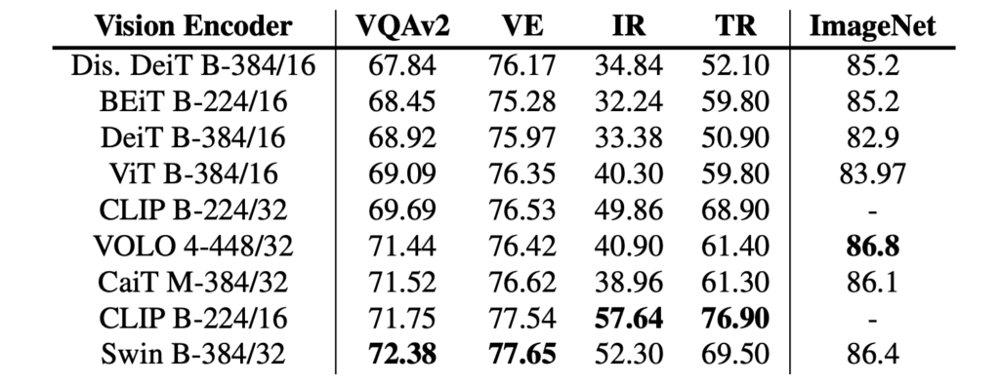
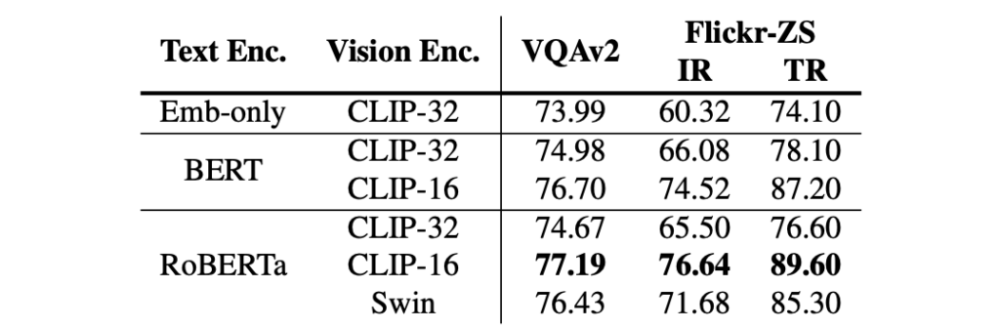
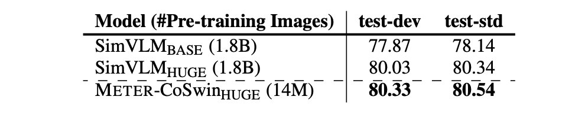

## Vibrant Dashboard

[**An Empirical Study of Training End-to-End Vision-and-Language Transformers**](https://arxiv.org/abs/2111.02387)

---

This is a comprehensive survey paper.

So, you can expect to see experiments, and even more experiments, here.

## Defining the Problem

The current mainstream Vision-Language Pretraining (VLP) architectures generally consist of three components:

- **First**, the vision encoder, commonly referred to as ViT.
- **Second**, the text encoder, most frequently BERT.
- **Finally**, the co-encoder, which integrates visual and textual information.

The authors first compiled a summary of architectures used in previous research, then deconstructed and recombined them.

<figure style={{"width": "90%"}}>

</figure>

Ultimately, it all boils down to issues with the visual component:

First, **inefficiency**.

In many VLP studies, most models rely on object detectors (e.g., Faster RCNN) to extract region features. These detectors are often frozen during the VLP process, which limits the capacity of VLP models. Additionally, the feature extraction process is time-consuming, which can affect the efficiency and practicality of the models.

Second, **insufficient exploration**. Fully transformer-based VLP models have yet to be thoroughly explored. Some ViT-based models still lag behind state-of-the-art performance in downstream tasks like visual question answering.

Finally, **optimizer inconsistency**. Some studies have tried to input convolutional neural network (CNN) and textual grid features directly into transformers but encountered optimizer inconsistency issues, as different optimizers are often used for CNNs and transformers. Recent research has shown that, compared to ViT, CNNs perform slightly worse in terms of accuracy and computational cost (FLOPs).

:::tip
When the authors mention "optimizer inconsistency," they are essentially referring to SimVLM.

- [**[21.08] SimVLM: Simplifying Things**](../2108-simvlm/index.md)
  :::

## Solving the Problem

### METER Model Design

<figure style={{"width": "80%"}}>

</figure>

The authors broke the test units into several components: vision encoder, text encoder, multimodal fusion module, architecture design, and pretraining objectives.

1. **Vision Encoder Selection**

   In the ViT mechanism, images are first divided into multiple patches, which are then processed by a Transformer model.

   The authors compared various ViT models, including the following:

   - **ViT (2020.10):**
     - [An Image is Worth 16×16 Words: Transformers for Image Recognition at Scale](https://arxiv.org/abs/2010.11929)
   - **DeiT (2020.12):**
     - [Training data-efficient image transformers & distillation through attention](https://arxiv.org/abs/2012.12877)
   - **CLIP (2021.03):**
     - [Learning Transferable Visual Models From Natural Language Supervision](https://arxiv.org/abs/2103.00020)
   - **Swin Transformer (2021.03):**
     - [Hierarchical Vision Transformer using Shifted Windows](https://arxiv.org/abs/2103.14030)
   - **CaiT (2021.03):**
     - [Going deeper with Image Transformers](https://arxiv.org/abs/2103.17239)
   - **VOLO (2021.06):**
     - [Vision Outlooker for Visual Recognition](https://arxiv.org/abs/2106.13112)
   - **BEiT (2021.06):**
     - [BERT Pre-Training of Image Transformers](https://arxiv.org/abs/2106.08254)

2. **Text Encoder Selection**

   The authors aimed to process text features with a text encoder before sending them to the fusion module. They explored using different language models like BERT, RoBERTa, ELECTRA, ALBERT, and DeBERTa for text encoding. Additionally, they experimented with a simple word embedding lookup layer initialized with BERT’s embedding layer.

   Below are the architectures selected by the authors:

   - **BERT (2018.10):**
     - [Pre-training of Deep Bidirectional Transformers for Language Understanding](https://arxiv.org/abs/1810.04805)
   - **RoBERTa (2019.07):**
     - [A Robustly Optimized BERT Pretraining Approach](https://arxiv.org/abs/1907.11692)
   - **ALBERT (2019.09):**
     - [A Lite BERT for Self-supervised Learning of Language Representations](https://arxiv.org/abs/1909.11942)
   - **ELECTRA (2020.03):**
     - [Pre-training Text Encoders as Discriminators Rather Than Generators](https://arxiv.org/abs/2003.10555)
   - **DeBERTa (2020.06):**
     - [Decoding-enhanced BERT with Disentangled Attention](https://arxiv.org/abs/2006.03654)

3. **Multimodal Architecture**

   

   As VLP models gain popularity, the authors re-evaluated the effects of two fusion modules in a new environment to determine which fusion strategy is more effective:

   - **Merged Attention Module:** In this module, text and visual features are simply concatenated and jointly input into a single Transformer module. This approach enables simultaneous processing of text and visual information in the same Transformer module.
   - **Co-attention Module:** This module independently inputs text and visual features into separate Transformer modules. It uses cross-attention mechanisms to achieve interaction between modalities, enabling interaction between visual and textual features.

### Encoder-Only vs. Encoder-Decoder

<figure style={{"width": "80%"}}>

</figure>

The authors compared two different model architectures: **encoder-only** and **encoder-decoder**, analyzing their applications in VLP models:

- **Encoder-Only Architecture**:
  In this architecture, cross-modal representations (e.g., combined visual and text features) are directly input to the output layer to generate the final output. VisualBERT is an example of a VLP model employing an encoder-only architecture.

- **Encoder-Decoder Architecture**:
  Prominent works like VL-T5 and SimVLM advocate for an encoder-decoder structure. Here, cross-modal representations are first passed through a decoder, which then generates outputs by attending to both encoder representations and previously generated tokens in an autoregressive manner.

The differences between these architectures are illustrated above. For the Visual Question Answering (VQA) task:

- In the encoder-decoder model, the text input is passed to the encoder, and classification tokens are passed to the decoder.
- In the encoder-only model, cross-modal representations are directly fed into the output layer.

### Pretraining Strategies

The authors identified three primary pretraining tasks commonly used in VLP models: **Masked Language Modeling (MLM)**, **Image-Text Matching (ITM)**, and **Masked Image Modeling (MIM)**:

1. **Masked Language Modeling (MLM)**
   Initially introduced in pure language pretraining, MLM was later adapted for VLP. The goal is to randomly mask some input tokens in image-caption pairs and train the model to reconstruct the masked tokens.

2. **Image-Text Matching (ITM)**
   This task requires the model to identify which images and captions match, typically framed as a binary classification problem. The model learns global cross-modal representations and uses a classifier to predict whether the pairs match.

3. **Masked Image Modeling (MIM)**
   Inspired by MLM, MIM is used in visual pretraining. The goal is for the model to reconstruct or predict masked visual features when some parts of an image are hidden or obscured.

:::tip
The authors did not include recent successes like PrefixLM in their discussion. A plausible reason might be that PrefixLM is not yet considered mainstream, and SimVLM’s success likely stems more from its large dataset scale than its specific methodology. Hence, PrefixLM was not highlighted.
:::

### Dataset

The model was pretrained on four commonly used datasets: **COCO**, **Conceptual Captions**, **SBU Captions**, and **Visual Genome**. Following previous studies, the combined training data consists of approximately **4 million images**.

### Technical Details

- **Hidden Size**: Unless otherwise specified, the hidden layer size is set to **768**, and the number of attention heads is **12**.
- **Separate Visual and Language Branches**: There is no decoder between the visual and language branches, and no parameter sharing between them.
- **Pretraining Tasks**: The model is pretrained using only **MLM** and **ITM**, except in special cases.
- **Optimizer**: The model was pretrained for **100,000 steps** using the AdamW optimizer. The learning rates for the lower and upper layers were set to **1e-5** and **5e-5**, respectively.
- **Warmup Ratio**: The warmup ratio is set to **10%**, with the learning rate linearly decaying to **0** after 10% of the total training steps.
- **Image Resolution**: The size of each image is adjusted to **224×224** or **384×384**.

## Discussion

### Evaluating Components Separately

Due to the time-intensive nature of pretraining, the study first evaluates different text and vision encoders without performing full VLP to improve efficiency:

- The lower layers of the model are initialized with pretrained vision and text encoders, while the upper layers are randomly initialized.
- The default encoders chosen are **CLIP-ViT-224/32** for vision and **RoBERTa** for text, where **ViT-N/M** denotes the image resolution (N) and patch size (M).

1. **Text Encoder Evaluation**

   

   <figure style={{"width": "80%"}}>
   
   </figure>
   

   The performance of models with different text encoders does not show significant differences. **RoBERTa** appears to deliver the best performance in this setup. Additionally, results from the **Emb-only** baseline demonstrate the necessity of having a pretrained encoder, as downstream task performance degrades without one.

2. **Vision Encoder Evaluation**

   

   <figure style={{"width": "80%"}}>
   
   </figure>
   

   Both **CLIP-ViT-224/16** and **Swin Transformer** perform well in this setup. Notably, the **Swin Transformer** achieves a **72.38 VQA score** on the test-dev set without any VLP. This performance is competitive with some VLP models after pretraining.

### V+L Combined Evaluation

<figure style={{"width": "80%"}}>

</figure>

When combined into a VLP architecture, the differences between **BERT** and **RoBERTa** narrow, though having a pretrained text encoder remains critical (as shown in the comparison between **Embed-only** and **RoBERTa**).

For the vision encoder, both **CLIP-ViT-224/16** and **Swin Transformer** deliver strong performance. Specifically, **CLIP-ViT-224/16** achieves **77.19/77.20 VQA scores** on the test-dev/test-std sets, outperforming previous models such as **VinVL**.

:::tip
**Pro Tip from the Authors**

The authors provide an interesting technique to enhance model performance:
When initializing parameters with pretrained models, using a **larger learning rate** for randomly initialized parameters yields better results.

<figure style={{"width": "80%"}}>

</figure>

If the same learning rate is applied across all parts of the model, performance declines. This may occur because pretrained parameters already encode valuable visual and language knowledge, and overly aggressive fine-tuning might overwrite this useful information.
:::

### Feature Fusion Analysis

<figure style={{"width": "80%"}}>

</figure>

The authors designed **Merged Attention** and **Co-attention** models and compared their performance.

Experimental results indicate that the **Co-attention model** outperforms the Merged Attention model, suggesting that maintaining distinct parameter sets for the two modalities is crucial. However, this finding contradicts previous research on region-based VLP models. The authors attribute this to two potential reasons:

1. Results from region-based VLP models may not directly apply to ViT-based VLP models.
2. Most region-based VLP models use pretrained vision encoders without pretrained text encoders, making symmetric architectures like Co-attention less applicable in those scenarios.

On the other hand, in the experiment comparing **Encoder** and **Encoder-Decoder** architectures, the authors followed T5-style language modeling objectives:

- Masked 15% of input text tokens.
- Replaced continuous spans of text with sentinel tokens.
- Trained the decoder to reconstruct the masked tokens.

For **Image-Text Matching (ITM)** tasks, special classification tokens were fed into the decoder to generate binary outputs.

The results show that **Encoder-only models** outperform Encoder-Decoder models on the two discriminative tasks, consistent with previous findings. However, Encoder-Decoder architectures are more flexible, enabling tasks such as **image captioning**, which are more challenging for Encoder-only models.

### Expanding Dataset Scale

<figure style={{"width": "80%"}}>

</figure>

The authors tested the scalability of their framework by pretraining the model with more images and a larger vision backbone. The specific pretraining datasets include **COCO**, **CC**, **CC12M**, **SBU**, and **VG**, providing a total of approximately **14 million images** and **20 million image-caption pairs**, offering rich data for pretraining.

For the vision backbone, they adopted **CoSwin-Huge**, which is capable of handling large-scale visual data. On the text side, they used **RoBERTa-base** to process textual information, ensuring effective text encoding.

Under this expanded configuration, the model achieved **state-of-the-art performance on VQAv2**, surpassing SimVLM, which was trained with **1.8 billion images**. This result highlights METER’s scalability and its ability to improve performance by increasing dataset size and adjusting model structure.

## Conclusion

This paper systematically studies how to train a **full-transformer VLP model** end-to-end. The experiments demonstrate that competitive performance can be achieved with **just 4 million images** for pretraining using state-of-the-art models. Moreover, when scaled up, METER achieved **new state-of-the-art performance on VQA**, demonstrating its strong potential for further improvement.

:::tip
When combining V+L models, the authors applied the **same logic across all architectures**, without fine-tuning configurations for each specific architecture. This "one-size-fits-all" approach might have left certain architectures’ unique strengths unexplored and missed identifying some potential issues.

1. **Uniform Use of MLM Strategy:**
   RoBERTa employs a **dynamic masking mechanism**, unlike BERT, yet the study uniformly applied the MLM strategy. Similarly, there was no detailed tuning for the vision encoder; the authors simply used a high-performing architecture and plugged it into the V+L model.

2. **Potential of PrefixLM:**
   How would **PrefixLM**, as used in SimVLM, perform when applied to the proposed architecture? When combining different text and vision backbones, should specific parameter settings and optimization techniques be tailored to ensure optimal performance for each architecture?
   Additionally, exploring various multimodal fusion strategies could help verify the model's **generalization capabilities** and **stability**.
   :::
