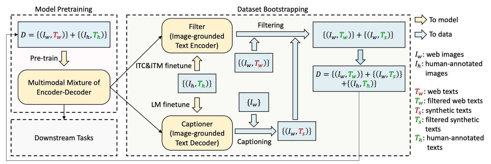
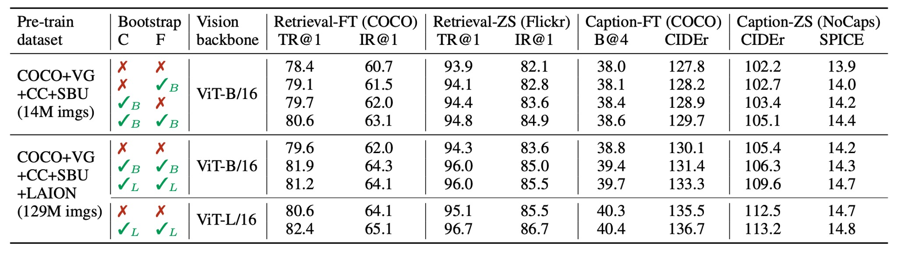
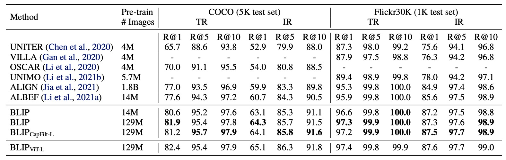

# [22.01] BLIP

## Synthetic Text Technology

[**BLIP: Bootstrapping Language-Image Pre-training for Unified Vision-Language Understanding and Generation**](https://arxiv.org/abs/2201.12086)

---

Multimodal models have firmly established themselves in the field of machine learning, especially in the domain of vision-language tasks. Looking at the ImageNet leaderboard, it’s evident that multimodal architectures dominate the rankings.

## Problem Definition

The authors of this paper reflect on recent advancements in multimodal models and identify a few key issues with current approaches:

1. **Poor Quality of Training Data:**

   Aside from CLIP, another well-known model is ALIGN, which is trained on massive but noisy datasets. Although many studies have shown that these noisy datasets can still yield good results, the authors believe that this is a compromise due to the lack of proper data processing methods.

2. **Architecture Determines Fate:**

   The choice of architecture in multimodal models generally falls into one of two categories: encoder-only models or encoder-decoder models.

   Encoder-only models struggle to transfer well to text generation tasks, such as image captioning. On the other hand, encoder-decoder models perform poorly in tasks like text retrieval.

Is there no approach that can tackle both tasks effectively?

## Problem Solution

### Model Architecture

The figure above outlines the BLIP architecture, which can be explained from left to right:

First, the authors adopt the ViT architecture (Vision Transformer) as the visual input encoder. A special token `[CLS]` is added to the output sequence to represent the features of the entire image.

To build a unified model capable of both understanding and generating language, the authors introduce a **Multimodal Mixture of Encoder-Decoder (MED)** model. This model has three primary components:

1. **Text Encoder:** This is the second block from the left in the diagram.

   The text encoder works similarly to BERT, where a `[CLS]` token is attached at the beginning of the text input to summarize the sentence.

   - [**[18.10] BERT: Twelve Layers of Encoders**](../../transformers//1810-bert/index.md)

2. **Image-Grounded Text Encoder:** This is the third block from the left.

   Visual information is injected by inserting a cross-attention (CA) layer between the self-attention (SA) and feedforward network (FFN) layers in each transformer block.

   A special token `[Encode]` is attached at the end of the text sequence to create a multimodal representation of the image and text.

   :::tip
   Special tokens are used to mark different sequences, allowing the model to understand the current task during training.
   :::

   :::tip
   This architecture is essentially a transformer decoder, but here the input is text, and the cross-attention is directed at the visual features from the image output.
   :::

3. **Image-Grounded Text Decoder:**

   The bidirectional self-attention layers in the text encoder are replaced with causal self-attention layers in the text decoder.

   The decoding process begins with the `[Decode]` token, which signals the start of the sequence, and an end token is used to signify the sequence’s completion.

   :::tip
   This is also a transformer decoder, but since it’s designed for text generation, self-attention is replaced with causal self-attention.
   :::

### Pre-training Objectives

With the architecture in place, the next step is defining the pre-training objectives.

BLIP optimizes for three objectives during pre-training, two of which are understanding tasks, and the third is a generation task:

1. **Image-Text Contrastive Loss (ITC):**

   This loss ensures that matched image-text pairs have similar representations in the feature space, while unmatched pairs are far apart. This helps the model learn to correctly associate related images and text and distinguish unrelated pairs.

   ITC uses unimodal encoders to process images and text separately and introduces a momentum encoder to generate features. Additionally, it softens the labels for potential positive samples in the negative set to improve accuracy in learning the relationship between images and text.

2. **Image-Text Matching Loss (ITM):**

   To enhance the model’s discriminative ability, image-text pairs are randomly misaligned with a 0.5 probability. In other words, half the time, the image and its corresponding text description won’t match. A linear layer projects the pooled features to binary categories, calculating similarity to the ground truth. The goal is to minimize the negative log-likelihood loss for matching.

3. **Language Modeling Loss (LM):**

   The image-grounded text decoder is enabled to generate textual descriptions of the image. This objective optimizes cross-entropy loss to train the model to maximize the probability of generating the correct text in an autoregressive fashion. Unlike the widely-used masked language modeling (MLM) loss, LM loss empowers the model with generation capabilities, turning visual information into coherent text descriptions. A 0.1 label smoothing technique is applied to improve training.

---

To improve the efficiency of multi-task learning:

- **The authors share all parameters between the text encoder and decoder except for the self-attention (SA) layers.**

The main difference between the encoding and decoding tasks lies in the self-attention layer: the encoder uses bidirectional self-attention to construct an overall representation of the input, while the decoder uses causal self-attention to predict the next token based on context.

Additionally, since the embedding layer, cross-attention layers, and feedforward network serve similar functions in both encoding and decoding, sharing these layers boosts training efficiency and makes better use of parameters in multi-task learning.

### CapFilt

As mentioned earlier, the authors believe that training models on noisy datasets can negatively impact their performance. To address this, they propose a **Captioning and Filtering (CapFilt)** method to improve the quality of text data.

As shown in the diagram, CapFilt consists of two modules:

1. **Captioner:** The captioner is the image-grounded text decoder, fine-tuned using the language modeling objective. It generates synthetic descriptions (Ts) from web images.

2. **Filter:** The filter is the image-grounded text encoder, fine-tuned with the ITC and ITM objectives, learning to determine if a text matches an image.

The filter removes noisy text descriptions (Tw) and synthetic text (Ts) that are predicted as mismatches by the ITM. The filtered image-text pairs are then combined with manually annotated pairs to create a new dataset for pre-training the model.

### Model Training Setup

The model is implemented in PyTorch and pre-trained on two 16-GPU nodes.

- The image transformer is initialized from a ViT pre-trained on ImageNet.
- The text transformer is initialized from BERTbase.

The authors explore two ViT variants: ViT-B/16 and ViT-L/16. Unless stated otherwise, results presented for "BLIP" refer to the ViT-B model. The model is pre-trained for 20 epochs, with batch sizes of 2880 (ViT-B) and 2400 (ViT-L).

AdamW is used as the optimizer with a weight decay of 0.05. Learning rates are linearly warmed up to 3e-4 (ViT-B) and 2e-4 (ViT-L) before decaying at a rate of 0.85. During pre-training, images are randomly cropped to a resolution of 224×224, and during fine-tuning, the image resolution is increased to 384×384.

The authors use two manually annotated datasets (COCO and Visual Genome) and three web datasets (Conceptual Captions, Conceptual 12M, SBU captions), totaling 14 million images to train the model.

## Discussion

### CapFilt’s Effectiveness

Since CapFilt is one of the key contributions of this paper, its effectiveness is immediately evaluated.

The authors compare models pre-trained on different datasets to showcase CapFilt’s impact on downstream tasks, including image-text retrieval and image captioning, evaluated under both fine-tuned and zero-shot settings.

When applying either captioner or filter to the 14 million images, performance improvements are observed. When both are applied, the effect is even greater, significantly improving performance compared to using noisy web texts alone.

Additionally, CapFilt demonstrates scalability, offering further performance gains when used with larger datasets and visual backbones. Using larger captioners and filters combined with ViT-L also improves the base model’s performance.

Below, the authors showcase examples of images and their corresponding generated text, illustrating the captioner’s ability to generate new textual descriptions and the filter’s ability to remove noise from both original and synthetic text.

Green text represents text accepted by the filter, while red text indicates rejected text.

### Diversity in CapFilt’s Synthetic Text

In CapFilt, the authors employ **nucleus sampling** to generate synthetic text descriptions.

- [**[19.04] The Curious Case of Neural Text Degeneration**](https://arxiv.org/abs/1904.09751)

Nucleus sampling is a probabilistic decoding method where each token is sampled from a subset of tokens whose cumulative probability mass exceeds a threshold $p$ (set to 0.9 in the experiment).

In the table above, nucleus sampling is compared with **beam search**, a deterministic decoding method that generates the most probable text descriptions. Although nucleus sampling produces noisier text, its performance is noticeably better. The authors suggest that this is because nucleus sampling produces more diverse and surprising text, including more new information, which aids the model’s learning. In contrast, beam search tends to generate common and safe descriptions, providing less additional knowledge.

### Comparison with SOTA Models

The authors compare BLIP with other state-of-the-art (SOTA) models across various datasets. Here are a few highlights:

- **Image-Text Retrieval**

  

  BLIP’s image-to-text retrieval (TR) and text-to-image retrieval (IR) capabilities are evaluated on COCO and Flickr30K datasets. The pre-trained models are fine-tuned with ITC and ITM losses. To speed up inference, k candidate pairs are selected based on the similarity of image and text features, which are then re-ranked using their ITM scores. The k values are set to 256 for COCO and 128 for Flickr30K.

  As shown in the table above, BLIP achieves a significant performance boost compared to existing methods. Using the same 14 million pre-training images, BLIP outperforms the previous best model, ALBEF, by +2.7% on average Recall@1 on COCO.

- **Image Captioning**

  

  The authors evaluate BLIP’s image captioning capabilities on the NoCaps and COCO datasets. They test models fine-tuned on COCO using LM loss. According to previous literature, they add the prompt “a picture of” at the beginning of each description, which provides a slight performance boost.

  As shown in the table, BLIP significantly outperforms other methods using a similar amount of pre-training data when trained on 14 million images. When using 129 million images, BLIP achieves performance comparable to LEMON, which was trained on 200 million images.

  :::tip
  LEMON relies on a computationally expensive object detector and uses higher-resolution input images (800×1333), resulting in significantly slower inference compared to BLIP, which operates at a lower image resolution (384×384) and does not depend on detectors.
  :::

- **Visual Question Answering (VQA)**

  

  VQA requires the model to generate answers based on images and questions. Unlike past studies that often treat VQA as a multi-answer classification task, the authors frame it as an answer generation task, allowing for open-ended VQA. During fine-tuning, the pre-trained model first encodes image-question pairs into multimodal embeddings, which are then fed into the answer decoder.

  The VQA model is fine-tuned using LM loss, with real answers as training targets. As shown in the table, BLIP trained on 14 million images surpasses ALBEF by +1.64% on the test set. When trained on 129 million images, BLIP even outperforms SimVLM.

  

  :::tip
  SimVLM uses 13 times more pre-training data and a larger visual backbone.
  :::

## Conclusion

The CapFilt method proposed by the authors effectively addresses the noise problem in web-based image-text datasets. Through experiments, they demonstrate that generating text descriptions and filtering noisy text significantly improve model performance.

Additionally, BLIP excels in multiple downstream tasks, including image-text retrieval, image captioning, and visual question answering, showcasing its strong multi-task adaptation capabilities. Not only does it offer potential in data generation and noise filtering, but it also provides new ideas for improving the performance of multimodal models, guiding future development in this field.
