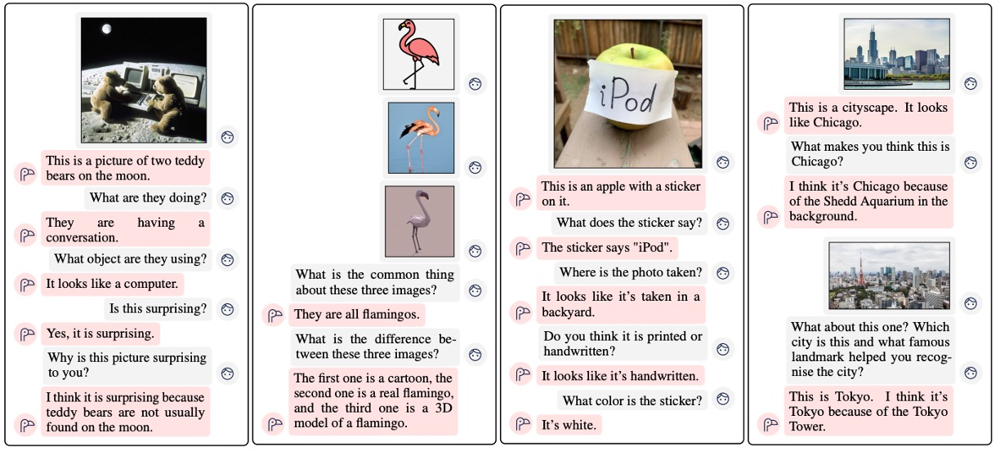
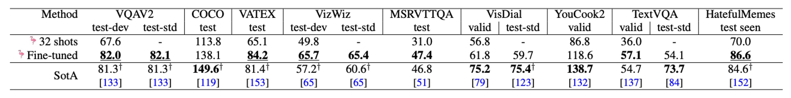

# [22.04] Flamingo

## Richly Illustrated

[**Flamingo: a Visual Language Model for Few-Shot Learning**](https://arxiv.org/abs/2204.14198)

---

In earlier research, it was trendy to forcefully piece together model names, often inspired by Sesame Street characters.

Now, the trend is much simpler: just pick a name you like. For instance, this paper is titled _Flamingo_.

## Problem Definition

One of the most renowned frameworks in recent years, CLIP, utilizes contrastive learning to align image and text embeddings in a shared space, achieving impressive results. However, CLIP is primarily suited for text-image retrieval tasks. When applied to open-ended tasks like "visual question answering" or "image captioning," it faces significant challenges.

On the other hand, GPT-3 has achieved remarkable success across various domains. However, GPT-3 does not support image input.

Is there a way to combine these pretrained vision models and language models? Moreover, can we generate multimodal outputs based on interleaved image-text input formats?

## Solution

### Model Architecture

<figure style={{"width": "90%"}}>

</figure>

The figure above illustrates the Flamingo model architecture. The blue components represent pretrained models with frozen parameters, while the violet components are newly added modules that need to be trained from scratch.

:::tip
At first glance, this architecture resembles the Adapter model we previously encountered.

- [**[19.02] Adapter: Saving 96% of Parameters**](../../model-tuning/1902-adapter/index.md)
  :::

Now, let’s follow the data flow to understand how the Flamingo model operates.

First, prepare the input images, as in the example of a dog and a cat. These images are processed through a vision encoder to obtain visual feature vectors.

For the vision encoder, any well-performing pretrained model will suffice. In this case, the authors chose a pretrained Normalizer-Free ResNet (NFNet). After passing through the vision encoder, the image features are input into the **Perceiver Resampler**.

Here, the Perceiver Resampler serves to downsample and align the dimensions of the features, enabling the visual feature vectors to match the input format of the language model. The visual features are transformed into fixed-length visual tokens of size 64.

:::tip
The Perceiver Resampler is implemented using cross-attention mechanisms to compute a fixed number of visual tokens.
:::

---

Now let’s look at the other side—the right-hand side of the figure.

The input format consists of interleaved image and text sequences. For example:

- **\<image\> This is a very cute dog. \<image\> This is"**

This image-text sequence is fed into the language model, which passes through a **cross-attention layer**. The authors made some improvements to this module, naming it **GATED XATTN-DENSE**.

In this process, language features and image features are fused, and the final output is:

- **"a very cute cat."**

:::tip
The architecture is simple and intuitive. The next step is to collect sufficient data and start training the model.
:::

### Cross-Attention Layer

<figure style={{"width": "90%"}}>

</figure>

Previously, we mentioned the **GATED XATTN-DENSE** module. Let’s take a closer look at its design.

At first glance, it seems almost identical to the traditional Transformer decoder architecture, right?

The only new addition here is the **tanh gate** mechanism. The authors included implementation code alongside the design to help readers better understand this mechanism.

In simple terms, the **tanh gate** is used to control how much weight the "visual features" should add to the "language features." It is initialized to 0, which means visual features are not used at the beginning. During training, if the model discovers that visual features are helpful for generating text, it adjusts the weight accordingly.

---

### Training Datasets and Strategy

During training, the authors employed **per-image/video attention masking** to allow the model to process visual inputs sequentially. Training was conducted with up to 5 images per sequence, but during evaluation, the model demonstrated the ability to handle up to 32 pairs of images/videos and corresponding text.

The training datasets included:

- **M3W (MultiModal Massive-Web) Dataset**: Extracted interleaved image and text data from approximately 43 million web pages.
- **ALIGN Dataset**: Contains 1.8 billion image-alt-text pairs.
- **LTIP (Long Text & Image Pairs) Dataset**: 312 million image-text pairs with higher quality and longer textual descriptions.
- **VTP (Video & Text Pairs) Dataset**: 27 million short video clips (approximately 22 seconds on average) paired with textual descriptions.

The objective function minimizes the **weighted negative log-likelihood** over multiple datasets:

$$
\sum_{m=1}^{M} \lambda_m \cdot \mathbb{E}_{(x, y) \sim \mathcal{D}_m} \left[ -\sum_{\ell=1}^{L} \log p(y_\ell | y_{<\ell}, x_{\leq \ell}) \right],
$$

where $\mathcal{D}_m$ represents the $m$-th dataset, and $\lambda_m$ is the weighting coefficient assigned to that dataset.

:::tip
This is essentially **Cross Entropy Loss**, but adapted to account for multiple datasets, with each dataset assigned a specific weight.
:::

## Discussion

This paper opens with a wealth of experimental results. Let’s explore them together.

### Results Presentation

The flamingo at the very beginning serves as the mascot for this paper.

Overall, the model demonstrates impressive performance.

### Comparison with Other Models

<figure style={{"width": "90%"}}>

</figure>

With just **4 task-specific examples**, Flamingo significantly outperforms prior zero-shot and few-shot learning methods across **16 benchmark tests**, showcasing its practicality and efficiency in adapting to new tasks. Moreover, as the model size increases, Flamingo's few-shot learning performance improves significantly, mirroring trends seen in GPT-3.

Although Flamingo is limited to processing a maximum of **5 images per sequence during training**, it can benefit from up to **32 images or videos during inference**, highlighting its flexibility.

### Fine-Tuning the Model

<figure style={{"width": "90%"}}>

</figure>

With additional annotated data, Flamingo can achieve state-of-the-art results on **5 additional benchmarks**—VQAv2, VATEX, VizWiz, MSRVTTQA, and HatefulMemes—by employing **short-term fine-tuning** with low learning rates and enabling high-resolution processing by unfreezing the vision encoder.

On **6 benchmarks**, Flamingo surpasses the best fine-tuned methods (Fine-Tuned SotA) while using **only a single set of model weights** and **32 task-specific examples**.

### Ablation Studies

<figure style={{"width": "90%"}}>

</figure>

Ablation studies were conducted on the Flamingo-3B model, using the validation subsets of DEV benchmarks (4-shot) to evaluate the contributions of various design choices.

- **Importance of Training Data Composition**

  - Removing the interleaved image-text dataset (M3W) results in a 17% performance drop.
  - Removing the traditional image-text paired dataset causes a 9.8% performance decrease.
  - Removing the video-text paired dataset negatively impacts all video-related tasks.

- **Gradient Accumulation Strategy**

  - The gradient accumulation strategy performs better than the round-robin update strategy.

- **Effect of Tanh Gate Initialization**

  - Removing the tanh gating mechanism leads to a 4.2% drop in overall performance and causes training instabilities.

- **Choice of Conditioning Architecture**

  - The GATED XATTN-DENSE design outperforms the native cross-attention mechanism.

- **Compute/Memory vs. Performance Trade-offs**

  - Inserting GATED XATTN-DENSE at every layer achieves the best performance but has the highest computational cost.
  - Inserting it every 4 layers improves training speed by 66% while reducing performance by only 1.9%.

- **Advantages of Perceiver Resampler**

  - Comparing Perceiver Resampler, MLP, and Transformer:
    - Perceiver Resampler outperforms both in terms of speed and performance.

- **Choice of Vision Encoder**

  - Comparing NFNet-F6, CLIP ViT-L/14, and NFNet-F0:
    - NFNet-F6 outperforms CLIP ViT-L/14 (+5.8%) and NFNet-F0 (+8.0%).

- **Necessity of Freezing the Language Model**
  - Training the language model from scratch results in a 12.9% performance drop.
  - Fine-tuning the pretrained language model causes an 8.0% performance decrease, showing evidence of catastrophic forgetting.

## Conclusion

Flamingo is a general-purpose model that excels in image and video tasks, requiring minimal task-specific training data. Its architecture demonstrates flexible interactive capabilities, breaking the limitations of traditional vision benchmarks.

The authors have successfully combined pretrained large language models with powerful vision models, taking a significant step toward general-purpose visual understanding. This work provides valuable insights and guidance for future research.

:::tip
Common issues with large language models (LLMs)—such as hallucinations, offensive outputs, sensitive content, stereotypes, and discrimination—are no exception in this study.

The authors remind us in the final chapter to exercise caution and actively mitigate these issues during use.
:::
