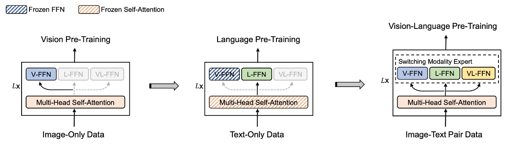
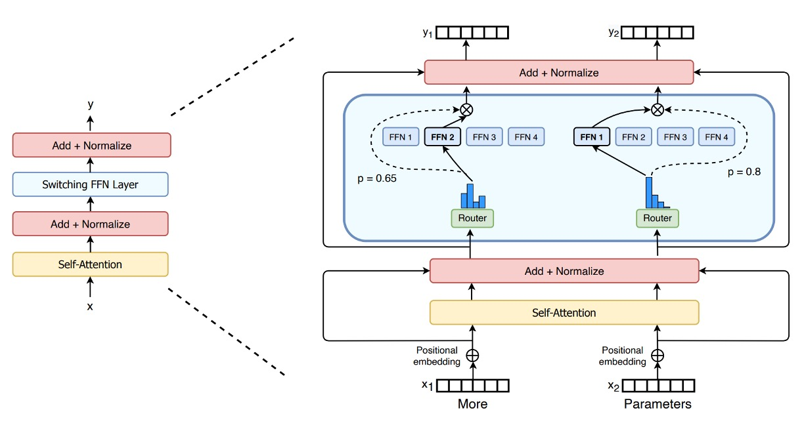
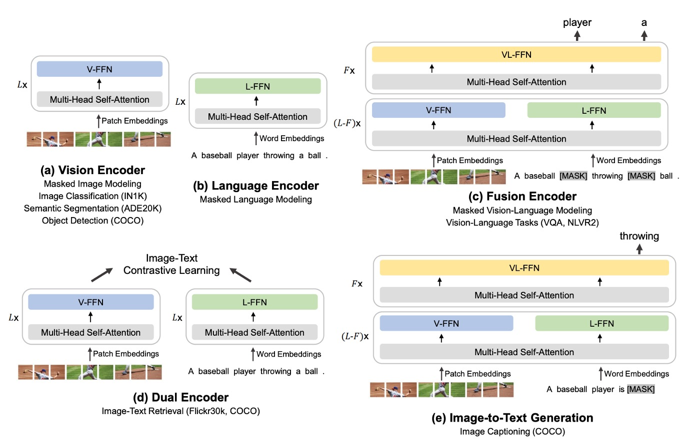
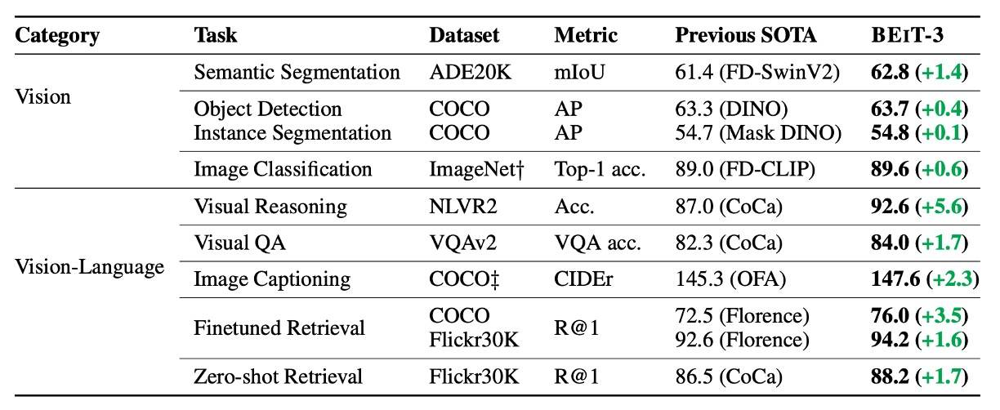

## Great Minds Think Alike

[**Image as a Foreign Language: BEiT Pretraining for All Vision and Vision-Language Tasks**](https://arxiv.org/abs/2208.10442)

---

Everyone knows that BEiT’s signature feature is the "discrete coding."

So, upon encountering this paper, we instinctively expect BEiT-3 to introduce some novel "discrete coding" techniques.

However, BEiT-3 merely **applies** the "discrete coding" method to image pretraining. The main focus of this paper is actually: **How can we use a unified approach to handle pretraining tasks for text, images, and multimodal data?**

That said, reminiscing about past successes is only natural—let’s not dwell too much on it.

## Defining the Problem

The idea of "pretraining images and text together" is no longer groundbreaking.

Previously, common methods, which you might already be familiar with, often involved using multiple pretraining tasks simultaneously, such as: image-text matching, retrieval, and various mask designs.

If it doesn’t ring a bell, let’s revisit the BLIP framework we studied earlier:

<figure style={{"width": "80%"}}>

</figure>

The model is divided into an image branch and a text branch, with multiple tasks in between to learn cross-modal relationships. While effective, this approach becomes increasingly complex and challenging to maintain or expand as the scale of models and data grows.

Since images can be converted into tokens, and text can also be tokenized, why not handle everything using a unified approach? Treating it all as text for processing seems like the most straightforward solution.

Previous researchers have undoubtedly considered this. However, the lack of an effective framework suggests that there are inherent challenges.

The authors believe that we should address this issue with a "multi-path architecture."

## Problem Solving

### Model Architecture

<figure style={{"width": "80%"}}>

</figure>

The multi-path architecture, or its more commonly known name: Mixture-of-Experts (MoE), is a method of combining multiple expert models together. Before BEiT-3 was proposed, a paper applied this architecture in the multimodal domain: VLMo.

:::info
For readers interested in VLMo, you can read:

- [**[21.11] VLMo: Unified Vision-Language Pre-Training with Mixture-of-Modality-Experts**](https://arxiv.org/abs/2111.02358)

      

      <figure style={{"width": "90%"}}>
      
      </figure>
      

In VLMo, different modalities each have their corresponding pre-training tasks, while BEiT-3 unifies everything under the "mask-predict" method for training the model.
:::

Thus, BEiT-3's architecture directly references VLMo's Multiway Transformers.

Each Multiway Transformer module consists of a shared self-attention module and a set of feedforward networks (i.e., modality experts) for different modalities. Depending on the modality of the input token, the corresponding expert is used for feature computation.

In the authors' implementation, each layer includes a vision expert and a language expert; in addition, the top three layers are configured with vision-language experts for the fusion encoders.

Using a set of modality experts allows the model to capture more information specific to each modality. The shared self-attention module learns the alignment between different modalities and performs deep fusion in multimodal tasks (such as vision-language).

:::tip
**Does this series look like the MoE in Switch Transformer?**

- [**[21.01] Switch Transformer**](../../transformers/2101-switch-transformer/index.md)

    

    <figure style={{"width": "70%"}}>
    
    </figure>
    

You are right! In the NLP field, MoE architecture was an academic hotspot in 2021, and while it took a few months longer in the CV field, this idea was quickly applied to the multimodal domain.
:::

### Multimodal Adaptation

As shown in the figure above, the authors demonstrate BEiT-3's "shared Multiway Transformer" architecture, which can "flexibly switch" or "combine" into the required model form for different downstream tasks.

- **(a) Vision Encoder**: Used for visual tasks that require only image feature representations, such as image classification, object detection, instance segmentation, and semantic segmentation.
- **(b) Language Encoder**: Used for language tasks that require only text features, such as text classification, sequence labeling, or dialogue systems combined with other modules.
- **(c) Fusion Encoder**: Used for tasks that require deep interaction between images and text, such as Visual Question Answering (VQA), Visual Reasoning (NLVR2), image-text reasoning, where both image and text need to be "seen" simultaneously for integrated understanding.
- **(d) Dual Encoder**: Used for cross-modal retrieval tasks that require "efficient matching," such as image-text retrieval. For example, quickly finding the image most related to a specific text from a large pool of candidate images, or conversely, finding the text most related to a specific image from a large pool of text.
- **(e) Sequence-to-Sequence Learning**: Used for generative tasks that require transforming image inputs into text outputs, such as image captioning or other applications that need image-text conversion.

Whether it's image encoding, text encoding, or complex applications requiring image-text fusion, retrieval, or generation, all can be configured within the same architecture without needing to switch to entirely different models.

### Pre-training Tasks

During the pre-training process of BEiT-3, the model randomly masks some of the text tokens or image patches and trains the model to recover these masked tokens. This method helps the model learn the representations of text and images while also capturing the correspondence between them.

During training, text data is tokenized using the SentencePiece tokenizer, while image data uses the BEiT v2 tokenizer, which splits images into discrete visual tokens to be reconstructed. The authors randomly mask 15% of the unimodal text tokens and 50% of the text tokens in image-text pairs. For images, the block masking strategy from BEiT is applied, masking 40% of the image patches.

Through experiments, the authors found that when using the "mask-predict" task alone, a much smaller pre-training batch size can be used compared to contrastive models.

:::tip
This is why BEiT v2 is used here, and thus the paper is called BEiT-3.
:::

### Model and Training Data

BEiT-3 has approximately 1.9 billion (1.9B) parameters, with 692 million for the vision experts, 692 million for the language experts, 52 million for the vision-language experts, and 317 million for the shared self-attention module. The architecture draws from ViT-giant.

The model consists of 40 layers of Multiway Transformer. Each layer has a hidden dimension of 1408, an intermediate layer dimension of 6144, and 16 attention heads. Each layer contains both a "vision expert" and a "language expert." Additionally, the top three layers of the Multiway Transformer incorporate "vision-language experts" for deeper cross-modal fusion.

BEiT-3 uses both "unimodal" and "multimodal" data for pre-training. Unimodal data refers to data containing only "pure images" or "pure text," while multimodal data refers to "image + text" pairs.

Multimodal data sources: There are about 15 million images and 21 million image-text pairs from five public datasets: Conceptual 12M (CC12M), Conceptual Captions (CC3M), SBU Captions (SBU), COCO, and Visual Genome (VG).

Unimodal data includes 14 million images from ImageNet-21K and 160GB of text data, sourced from English Wikipedia, BookCorpus, OpenWebText3, CC-News, and Stories.

### Training Strategy

BEiT-3 pre-training lasts for 1 million steps. Each training batch consists of 6144 samples, including: 2048 images, 2048 text samples, and 2048 image-text pairs.

Images are split into 14×14 patches, and during pre-training, a resolution of 224×224 is used. The image augmentation strategy is consistent with BEiT, including random scaling and cropping, horizontal flipping, and color jittering.

The text tokenizer used is SentencePiece, with a vocabulary size of 64k.

Other hyperparameters include:

- AdamW optimizer, with hyperparameters: $\beta_1=0.9, \beta_2=0.98, \epsilon=1e-6$.
- Learning rate schedule uses cosine annealing, with a maximum learning rate of 1e-3, reaching this peak learning rate after 10,000 steps.
- Weight decay is set to 0.05.
- Random depth technique is applied with a probability of 0.1 to reduce overfitting and enhance model generalization.

:::tip
This batch size is actually much smaller than many contrastive learning models, as contrastive models often require very large batch sizes for effective negative sample comparison.
:::

## Discussion

### Comparison with Other Models

<figure style={{"width": "90%"}}>

</figure>

The authors performed extensive evaluations of BEiT-3 on various public benchmarks for vision-language and vision tasks.

BEiT-3 achieved state-of-the-art (SOTA) performance on multiple tasks, surpassing previous models comprehensively, as summarized in the table below:

<figure style={{"width": "90%"}}>

</figure>

### Module Contribution Analysis

The paper does not provide ablation studies, so we cannot determine exactly which "module" is the most crucial in this architecture from specific data. Therefore, we can only attempt to analyze it ourselves:

- **Is the "large amount of data" the core contribution?**

  BEiT-3 pre-trains on a large-scale unimodal and multimodal dataset, including 14M ImageNet-21K images, 160GB of text data, and 15M image/21M image-text pairs.

  Large datasets are indeed a key factor in the performance of current large models, but the paper itself does not "emphasize data quantity" nor does it rely on proprietary data. The authors highlight that it is not about "more is better," but rather achieving superior performance using only publicly available data, compared to previous models that required proprietary data.

  The vast data provides a foundation, but it is not the only innovation. The true focus of the paper is on "the unity and effectiveness of the method."

---

- **The Expert Model Architecture**

  In each Transformer layer of BEiT-3, there is a vision expert, a language expert, and at the top layers, a vision-language expert, all sharing a self-attention module.

  This differs from the common Mixture-of-Experts (MoE) model. The emphasis here is on "multiple paths with most parameters shared," allowing for maximal interaction or independence between vision and language in the same model. Multiway enables the same model to serve multiple purposes: pure vision path, pure text path, cross-modal path… This brings engineering convenience and demonstrates the advantage of cross-task transfer.

  However, this "multi-path architecture" design originates from VLMo's innovation, so it is not considered a key contribution of BEiT-3.

---

- **Unified Training Objective Function**

  The authors improved the complex approach of "multi-task parallelism" in multimodal pre-training by using a single masked prediction (masked data modeling) to learn cross-modal alignment.

  This idea is not entirely new (BERT, BEiT, etc., have used similar Mask-Then-Predict approaches), but in the multimodal domain, many previous models required explicit contrastive losses or image-text matching (ITM) tasks. BEiT-3 only needs one objective function to learn both image-text alignment and cross-modal fusion, making large-scale training "cleaner" without the need to adjust hyperparameters or switch batches for different tasks.

  The authors' insistence on "simplifying the pre-training task" and its successful validation is a key reason for BEiT-3's outstanding performance on multiple tasks and multimodal applications. This is also one of the core messages of the paper.

---

- **Discrete Image Encoding Based on BEiT**

  The BEiT series uses discrete visual tokens (similar to word tokens in NLP) that allow images to undergo "MLM" masking and reconstruction.

  This technology itself comes from earlier BEiT versions (v1, v2), not BEiT-3. However, this paper further proves the feasibility of treating "images like another language." By discretizing image encoding, the model can process both text and images using the same BERT-like pre-training mechanism.

  Unlike previous methods that require CNNs or patch embeddings for image masking, this "discrete image" strategy is an essential foundation for BEiT-3, though its innovation mainly stems from prior BEiT works.

---

While large-scale data and the use of discrete visual tokens indeed support the overall method, if we were to highlight the most crucial contribution, we would attribute it to the "improved Multiway Transformers architecture," particularly the use of a "unified masked objective" to train the model.

The authors did not rely solely on "more data" or "larger parameters" to succeed; rather, through "simplifying pre-training tasks" and "flexible sharing of multiple expert paths," they successfully demonstrated the feasibility and advantages of this approach across various downstream applications.

## Conclusion

In this paper, the authors propose a general multimodal foundational model: BEiT-3.

By treating images as a form of "foreign language," the authors were able to apply the same masked "language modeling" method to train text, images, and image-text pairs, and use the Multiway Transformers architecture, allowing the model to switch flexibly between different modalities.

Compared to most current multimodal pre-training methods, BEiT-3's training process is simpler and more easily scalable, making it a highly attractive design approach.
