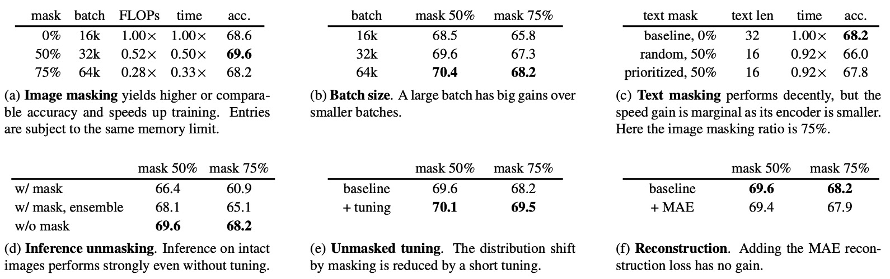
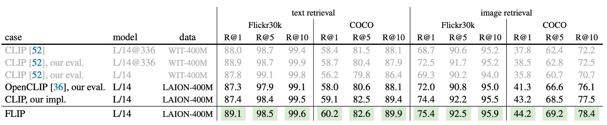

## Fast CLIP

[**Scaling Language-Image Pre-training via Masking**](https://arxiv.org/pdf/2212.00794)

---

This paper, proposed by Meta AI, introduces a new approach to improve the training efficiency of CLIP.

## Problem Definition

In early 2021, OpenAI introduced the CLIP architecture, which sparked a wave of contrastive learning applications in the industry.

While CLIP is simple and effective, **training it is highly resource-intensive**.

In the original CLIP paper, the authors used a massive WIT-400M dataset, comprising 400 million image-text pairs. Training a basic CLIP model took **592 V100 GPUs running for 18 days**.

For independent engineers and researchers, obtaining such computing resources is far from achievable. Meta AI recognized this problem and proposed **FLIP (Fast-CLIP)** as a solution.

## Solution

### Model Architecture

FLIP's architecture is similar to CLIP, but it introduces a new method during training called **masking**.

The idea is straightforward: since the **image encoder** in the model uses a ViT structure, the authors drew inspiration from the **MAE training strategy**. This strategy shows that a good model can be trained using only a **portion of the image data**.

The authors applied this approach and found that **FLIP achieved comparable performance to the original CLIP**, while **reducing training time by 4x**!

And just when we thought we could relax and happily finish the paper... (~nope, there’s more to dive into! Here we go again!~)

:::tip
If you're not familiar with the background papers, check out our earlier notes:

- [**[21.03] CLIP: Breaking the Dimensional Barrier**](../2103-clip/index.md)
- [**[21.11] MAE: A Quarter of the Clue**](../../vision-transformers/2111-mae/index.md)
  :::

### Masking Strategy

For **image masking**, FLIP adopts the same approach as MAE. The image is divided into non-overlapping patches, and a large portion of these patches is randomly masked. The **masking ratio** can be set to **50% or 75%**.

Since the **masked regions are not processed** by the model, FLIP can train with **2x or 4x larger batch sizes** while maintaining the same memory usage. This is a key reason for the accelerated training speed.

While the CLIP architecture includes both **image and text inputs**, FLIP applies masking **only to the image input**. The text encoder is left unmasked because it is relatively small and does not significantly affect overall performance. This decision is explored further in the **ablation studies**.

During **inference**, the model processes the **full, unmasked image** without requiring any adjustments to the encoder.

### Loss Function

Although FLIP borrows the masking mechanism from MAE, it does **not use a reconstruction loss**. Based on ablation experiments, the authors found that reconstruction loss does not improve **zero-shot transfer performance**. By **removing the decoder and reconstruction head**, they achieved better speed and simplicity.

FLIP relies entirely on **contrastive loss**. In this setup:

- **Positive pairs** are corresponding image-text pairs.
- **Negative pairs** are drawn from other samples within the same batch.

The outputs of the image and text encoders are projected into the **same embedding space** through a linear layer. The similarity between these embeddings is measured using **cosine similarity**, scaled by a **learnable temperature parameter**. The loss function used is **InfoNCE loss**, formulated as:

$$
L = -\frac{1}{N} \sum_{i=1}^{N} \log \frac{\exp(\text{sim}(v_i, t_i) / \tau)}{\sum_{j=1}^{N} \exp(\text{sim}(v_i, t_j) / \tau)}
$$

where $N$ is the batch size, $v_i$ and $t_i$ are the embedding vectors for the $i^{th}$ image and its corresponding text, and $\text{sim}(v_i, t_j)$ denotes the **cosine similarity** between the image and text embeddings. $\tau$ is a **learnable temperature parameter**.

Cosine similarity is computed as:

$$
\text{sim}(v_i, t_j) = \frac{v_i^\top t_j}{\|v_i\| \|t_j\|}
$$

This loss function aims to **maximize the similarity between positive pairs** while **minimizing the similarity between negative pairs**. By computing the loss across all samples in the batch, the model learns to embed **relevant images and texts into nearby regions** of the vector space.

## Discussion

What improvements enable FLIP to significantly accelerate CLIP’s training? In this section, we summarize the key findings from the **ablation studies** conducted by the authors.

### Ablation Studies

1. **Masking Ratio**

   - The model is trained on **LAION-400M** and evaluated on the **ImageNet-1K** validation set for zero-shot accuracy.
   - Table (a) examines the effect of different masking ratios while adjusting batch sizes to maintain memory usage:
     - **50% masking** yields a **1.2% higher accuracy** than the original CLIP baseline.
     - **75% masking** achieves similar accuracy to the baseline.
   - **Training time:**
     - With 50% masking, training time is **reduced to 50%** of the original time.
     - With 75% masking, it is **reduced to 33%** of the original time.

2. **Batch Size**

   - Table (b) explores the impact of **batch size** on model accuracy:
     - Increasing batch size consistently **improves accuracy**.
     - Even with a **batch size of 16k**, the model with **50% masking** achieves **68.5% accuracy**, comparable to the unmasked model’s **68.6%**.
     - Masking may introduce **regularization effects**, which help mitigate overfitting.
     - However, **75% masking** combined with a **fixed batch size** causes performance degradation due to information loss.
   - Expanding batch sizes does not significantly increase memory requirements, but **memory constraints remain a bottleneck** in practice.

3. **Text Masking**

   - Table (c) shows that **randomly masking 50% of text** reduces accuracy by **2.2%**:
     - Text data is more **information-dense** than image data, making large-scale text masking less effective.
     - **Prioritizing the masking of padding tokens** reduces the accuracy drop to **0.4%**.
   - However, text masking provides limited speed benefits since the text encoder contributes only **4.4% of the total computation**. As a result, the authors do not use text masking in subsequent experiments.

4. **Inference Unmasking**

   - Table (d) reveals that **ignoring the difference between masked and unmasked distributions** during inference yields good results, even in zero-shot settings:
     - If masking is applied during inference, **accuracy drops by 7.3%**.
     - Using **ensemble methods** that combine multiple masked views reduces the performance gap but **still lags behind using the full image**.

5. **Unmasked Tuning**

   - Table (e) shows that **fine-tuning the model without masking** for **0.32 additional epochs** on the pre-training dataset improves the **75% masked model’s accuracy by 1.3%**.
     - This **unmasked tuning** helps close the distribution gap between the pre-training and inference stages.

6. **Reconstruction Loss**
   - Table (f) explores the impact of adding a **reconstruction loss**:
     - The reconstruction head follows the design in **MAE**, using a small decoder to reconstruct normalized image pixels. The reconstruction loss is combined with the contrastive loss.
     - The experiments indicate that adding reconstruction loss **slightly reduces zero-shot and fine-tuning accuracy**.
   - To **simplify the system and improve performance**, the authors ultimately **omit the reconstruction head and loss**.

### Comparison with CLIP

To demonstrate the effectiveness of FLIP, the authors compare it against several CLIP baselines, showing that FLIP is a strong alternative to CLIP. The baselines used include:

- **Original CLIP**: Trained on the private WIT-400M dataset.
- **OpenCLIP**: A faithful reproduction of CLIP, trained on the public LAION-400M dataset.
- **Authors’ CLIP reproduction**: Also trained on LAION-400M, this version helps analyze methodological differences.

### Zero-Shot Transfer on ImageNet

<figure style={{"width": "80%"}}>

</figure>

The table above compares **zero-shot accuracy on ImageNet-1K**.

- **Authors' CLIP reproduction** achieves slightly higher accuracy than OpenCLIP, both trained on LAION-400M.
- **FLIP**: Using optimal settings (batch size of 64k, 50% masking, and unmasked tuning), the ViT-L/14 model reaches **74.6% accuracy**, surpassing OpenCLIP by **1.8%** and the CLIP reproduction by **1.5%**.
- Compared to the original CLIP, FLIP narrows the gap to **0.7%**, likely due to differences in pre-training datasets.

### Zero-Shot Classification on Additional Datasets

<figure style={{"width": "100%"}}>

</figure>

This table compares zero-shot classification performance across several datasets.

- **WIT-trained models** excel in tasks like **Aircraft, Country211, and SST2**, while **LAION-trained models** perform better on **Birdsnap, SUN397, and Cars**.
- In most tasks, **FLIP significantly outperforms OpenCLIP and the authors' CLIP reproduction** (highlighted in green).

### Zero-Shot Retrieval

<figure style={{"width": "100%"}}>

</figure>

This table shows image-text retrieval results on **Flickr30k** and **COCO**.

- **FLIP surpasses all CLIP competitors, including the original CLIP**, across all metrics.
- In these retrieval tasks, **WIT offers no clear advantage over LAION**.

### Model Scaling

With the efficiency gains from FLIP, the authors explore how to push beyond CLIP’s limits by scaling along three axes:

1. **Model Scaling**

   - The **ViT-L image encoder** is replaced with **ViT-H**, which has approximately **2x the parameters**, with a corresponding increase in the text encoder.

2. **Data Scaling**

   - The pre-training dataset is expanded from **LAION-400M** to **LAION-2B**.
   - To isolate the effect of data volume from training duration, the **total sampled data** is kept at **12.8B** (equivalent to 32 epochs on 400M or 6.4 epochs on 2B data).

3. **Schedule Scaling**
   - The sampled data is increased to **25.6B** (64 epochs on LAION-400M).
   - For each experiment, the other two axes are kept constant to observe the individual impact of each scaling strategy.

Results of the Scaling Experiments are shown in the figure below:

1. **Model Scaling** (Fig. a): Accuracy steadily improves throughout training, although the gap narrows towards the end.
2. **Data Scaling** (Fig. b): The early performance is similar to the baseline, but **accuracy improves significantly in the later stages**.This configuration incurs **no additional computational cost** since the total sampled data is controlled.
3. **Schedule Scaling** (Fig. c): Doubling the training duration yields **diminishing returns**. The dashed line indicates the performance curve if the training time were halved, showing that **longer training does not always result in proportional gains**.

### Transferability

The table above details the impact of different scaling strategies on downstream tasks:

- Both **model scaling and data scaling** outperform the baseline across all metrics, with notable improvements in certain scenarios.
- Even without extending the training schedule, **data scaling yields significant gains**, highlighting the value of large datasets in providing richer information.

The second-to-last row shows that the joint expansion of model and data surpasses single expansion in all metrics: model expansion improves by 1.2% (74.3%→75.5%), data expansion by 1.5% (74.3%→75.8%), and joint expansion by 3.3% (77.6%). This indicates that larger models require more data to fully realize their potential.

In the last row of the table, the comprehensive expansion of model, data, and training schedule is shown: the zero-shot IN-1K accuracy reaches **78.8%**, surpassing OpenCLIP's best result on the same public data (78.0%).

OpenCLIP was trained on 32B data, while FLIP only used 25.6B and was 2.5 times faster, saving an estimated **3,360 GPU days** of training costs. This demonstrates FLIP's high performance and significant cost advantages in large-scale data and model settings.

## Conclusion

Through a series of ablation experiments and comparative analyses, the authors demonstrate the effectiveness of FLIP. When training CLIP models on large-scale datasets, FLIP significantly accelerates training speed and achieves better performance on multiple zero-shot tasks.

Time is money, and we believe no one would have a problem with money, right?

Do you want to build a CLIP model? FLIP is undoubtedly a cost-effective choice.
