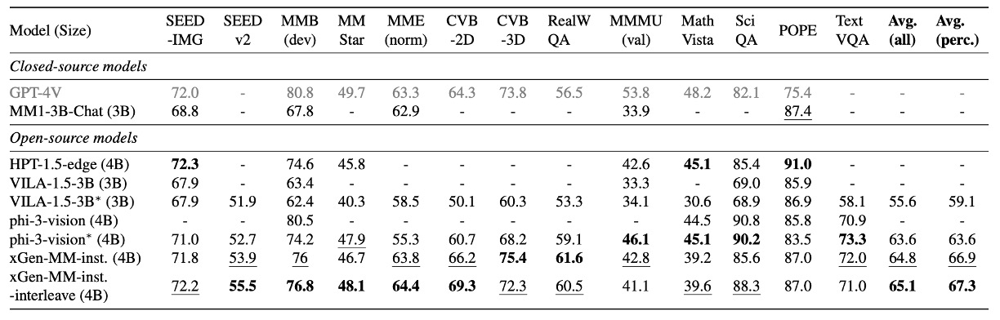
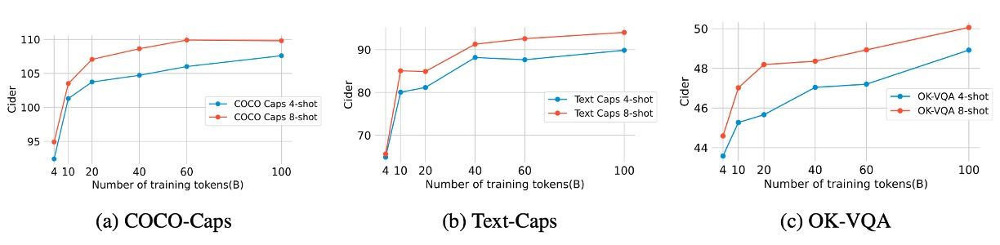

# [24.08] xGen-MM

## Also Known As BLIP-3

[**xGen-MM (BLIP-3): A Family of Open Large Multimodal Models**](https://arxiv.org/abs/2408.08872)

---

Coming up with a name for a research paper is no easy task.

If there’s already a successful model in the past, releasing a sequel might draw more attention. However, to achieve even greater success, perhaps a brand-new name is needed.

So, this time, the authors decided, _Why not both?_ They included both the new and the old names in the paper title!

## Problem Definition

Let’s build on the discussion of BLIP-2.

:::tip
If you haven’t read about BLIP-2, you can refer to:

- [**[23.01] BLIP-2: The Debut of Q-Former**](../2301-blip2/index.md)
  :::

The authors argue that the Q-Former architecture and the diverse training objectives (ITM, ITC, ITG losses) increased the complexity of large-scale training. Additionally, BLIP-2 only supports single-image input, making it incapable of handling the most natural forms of multimodal data, such as interleaved language and text input formats.

So, how was this "interleaved data format" handled in the past?

For that, we have to revisit another well-known paper: Flamingo.

:::tip
We recommend readers to review the content of Flamingo first:

- [**[22.04] Flamingo: Multimodal Marvel**](../2204-flamingo/index.md)
  :::

In Flamingo’s structure, a cross-attention module was used to integrate image and text features, enabling the interactive input of text and images. The process looks like the diagram below:

<figure style={{"width": "80%"}}>

<figurecaption>Flamingo Model Architecture</figurecaption>
</figure>

---

However, the authors of this paper felt that Flamingo’s design was overly complex. At the same time, they believed that Flamingo’s "Perceiver Resampler" was conceptually similar to the Q-Former but simpler!

Thus, the goals of this paper are:

1. To use Perceiver Resampler as a replacement for Q-Former.
2. To simplify Flamingo’s cross-attention architecture.

Finally, to improve model performance, the authors introduced a large-scale, high-quality dataset to enhance the foundation of training.

The authors aim to bridge the gap between open-source and private LMMs by improving data, architecture, and training methods. They hope that through open-source resources, research and applications can flourish, enabling the open-source community to better explore and harness the potential of multimodal models.

## Problem Solving

### Model Architecture

<figure style={{"width": "80%"}}>

</figure>

As mentioned earlier, the authors aim to integrate the entire interleaved input structure of language and images into a single decoder. In the diagram above, snowflakes indicate frozen parameters that do not participate in training, while flames represent trainable components.

The main modules of the model are:

- **Vision Transformer (ViT)**: Responsible for processing image features.
- **Vision Token Sampler (Perceiver Resampler)**: Compresses the image embeddings.
- **Pretrained Large Language Model (phi3-mini)**: Serves as the language processing core for multimodal inputs.

The data flow involves processing image features through the ViT, compressing them with the Perceiver Resampler, and then feeding them along with language features into the phi3-mini.

### Training Process

While the model architecture is simple, the training process is intricate and consists of four stages:

- **Stage 1: Pretraining**

  The goal of this stage is to predict the next text token using a mixture of multimodal datasets. The base model is pretrained on approximately 100 billion multimodal tokens, with image resolutions set to $384 \times 384$ pixels.

- **Stage 2: Supervised Fine-Tuning (SFT)**

  This stage aims to enable the pretrained model to better understand and follow user queries. The model is fine-tuned using publicly available instruction-following datasets. As in previous studies, an arbitrary resolution image-token sampling strategy is employed.

  :::tip
  For more information, readers can refer to the following papers:

  - [**[23.10] Improved baselines with visual instruction tuning**](https://arxiv.org/abs/2310.03744)
  - [**[24.05] What matters when building vision-language models?**](https://arxiv.org/abs/2405.02246)
  - [**[24.06] Cambrian-1: A Fully Open, Vision-Centric Exploration of Multimodal LLMs**](https://arxiv.org/abs/2406.16860)
    :::

- **Interleaved Multi-Image Supervised Fine-Tuning**

  Building on the instruction-tuned base model, this phase fine-tunes the model to handle interleaved instructions involving multiple and single images. An arbitrary resolution image-token sampling strategy is again adopted, consistent with the previous SFT phase.

- **Stage 3: Post-Training**

  This stage focuses on enhancing the model's usefulness while reducing hallucinations and toxicity.

  This phase is divided into two sub-stages:

  - **Sub-Stage 1: Direct Preference Optimization (DPO)**
    - Improves the model's utility and visual faithfulness.
  - **Sub-Stage 2: Safety Fine-Tuning**
    - Enhances the model's safety by reducing potential harmful behaviors.

### Pretraining Datasets

<figure style={{"width": "90%"}}>

</figure>

The pretraining datasets comprise a mixture of multimodal datasets, as shown in the figure above, sampled according to specific proportions. The datasets include:

- **Multimodal Interleaved Dataset Mixture**

  - **MINT-1T**: A dataset containing 1 trillion tokens.
  - **OBELICS**: Composed of HTML documents, differing slightly from MINT-1T in domain coverage and preprocessing methods.

- **Caption Dataset Mixture**

  - **BLIP3-KALE**: A large-scale, high-quality caption dataset.
  - **BLIP3-OCR-200M**: Annotated using an OCR engine on 200 million high-resolution images.

      

      <figure style={{"width": "50%"}}>
      
      </figure>
      

  - **BLIP3-GROUNDING-50M**: Annotated for 50 million images with object location information.

      

      <figure style={{"width": "50%"}}>
      
      </figure>
      

  - **Other Public Datasets**: These include Datacomp-1B, CC12M, CC3M, VG, and SBU, among others.

### Supervised Fine-Tuning Datasets

The datasets for this phase primarily include:

- **Instruction-Following Dataset**

  - Public datasets from various domains, including multimodal dialogue, image captioning, visual question answering, chart/document understanding, and scientific/mathematical data.
  - Text-only instruction data was added for visual instruction fine-tuning, comprising 1 million public instructions, trained over a single epoch.

- **Interleaved Multi-Image Instruction Dataset**
  - Training begins with a single-image fine-tuned model, adding multi-image/interleaved image-text instruction data.
  - To prevent degradation of single-image capabilities, some single-image data is mixed into the multi-image training data.

### Post-Training Datasets

Post-training is divided into two parts:

1. **Direct Preference Optimization (DPO)**

   - Utilizes the **VLFeedback** dataset, which contains 80,000 multimodal instructions. High-score samples were selected to create a preference dataset of 62,600 examples. The model was trained for one epoch, updating 2.5% of the LLM's backbone weights using low-rank adaptation (LoRA).

   :::tip
   If you're interested in LoRA, you can refer to our earlier article:

   - [**[21.06] LoRA: A Fraction of an LLM**](../../llm-tuning/2106-lora/index.md)
     :::

2. **Safety Fine-Tuning**

   - Leverages the **VLGuard** dataset, which includes 2,000 unsafe images and instructions. Unsafe categories cover privacy leaks, sensitive topics (e.g., politics, sexuality, violence), deception, and discrimination. To balance safety and utility, an additional 5,000 safe instructions were randomly sampled and included in the training set.

## Discussion

### Pretraining Model Performance

<figure style={{"width": "90%"}}>

</figure>

The authors compared BLIP-3 with other multimodal models across multiple benchmarks, evaluating its few-shot learning capabilities on tasks like image captioning and visual question answering (VQA).

The focus was on zero-shot performance as well as few-shot settings (4-shots and 8-shots).

- BLIP-3's multimodal in-context learning performance is comparable to similarly sized LLMs.
- For OCR tasks, BLIP-3 outperforms MM1-3B significantly on benchmarks such as TextCaps, TextVQA, and VQA-v2, even surpassing larger models like Idefics-9B and MM1-7B.
- Performance improves as the number of shots increases, demonstrating the model's ability to adapt to contextual distributions.

### Fine-Tuned Model Performance

<figure style={{"width": "90%"}}>

</figure>

The authors conducted a comprehensive evaluation of the fine-tuned model on multimodal (image-text) benchmarks, focusing on the following abilities:

- **General VQA**: Assessing the model's ability to answer image-related questions.
- **Visual Perception**: Testing image understanding and parsing.
- **Domain Knowledge**: Performance on datasets related to mathematics and science.
- **OCR Capability**: Handling text-rich images (e.g., documents and charts).
- **Hallucination Mitigation**: Reducing the generation of false content.

The comparison included closed-source models under 5B parameters and state-of-the-art (SoTA) open-source models.

:::tip
Closed-source models under 5B parameters include:

- [**[24.03] MM1: Methods, Analysis & Insights from Multimodal LLM Pre-training**](https://arxiv.org/abs/2403.09611)

SoTA open-source models include:

- [**[23.12] Vila: On Pre-training for Visual Language Models**](https://arxiv.org/abs/2312.07533)
- [**[24.04] Phi-3 Technical Report: A Highly Capable Language Model Locally on Your Phone**](https://arxiv.org/abs/2404.14219)
  :::

**Key Findings**

- **xGen-MM-instruct**: Achieved superior performance on general VQA and visual perception benchmarks, surpassing previous baselines.
- **xGen-MM-instruct-interleave**: Despite being fine-tuned on multi-image datasets, it maintained strong performance on single-image benchmarks and achieved the highest overall scores.

:::tip
`interleave` refers to fine-tuning datasets where the input format alternates between images and text, rather than being purely image-based or text-based.
:::

### Pretraining Data Scale

<figure style={{"width": "90%"}}>

</figure>

The authors explored the impact of multimodal training token counts (ranging from 2B to 100B) on pretraining evaluation metrics. The results are shown in the figure above.

- **60B tokens**: Showed significant performance improvements on image-text captioning and OCR tasks such as TextCaps and TextVQA.
- **100B tokens**: Provided moderate additional gains in few-shot evaluation metrics, but with diminishing returns.

The results suggest diminishing marginal returns with increasing data scale, with 60B appearing to be the optimal balance between investment and performance.

### Any-Resolution Training Strategy

<figure style={{"width": "70%"}}>

</figure>

The authors investigated three different strategies for image downsampling during training:

- **Any-Resolution**: Each image patch is individually downsampled and input into the LLM, preserving more details.
- **Fixed-Resolution**: All images are resized to the default dimensions of the visual encoder while maintaining the original aspect ratio.
- **Fixed Sampling (AnyRes-Fixed-Sampling)**: All image embeddings are concatenated into a single sequence before unified downsampling.

The experimental results, as shown in the figure above, indicate that the **Any-Resolution** strategy outperforms others in high-resolution, text-rich tasks, achieving significantly better performance.

### Instruction-Aware Design

<figure style={{"width": "70%"}}>

</figure>

The authors conducted experiments to test whether incorporating textual instruction tokens during the image downsampling process could enhance model performance. This approach is referred to as instruction-aware visual token sampling.

The results, shown in the figure above, indicate that the instruction-aware version showed no significant performance difference compared to the baseline model. The authors hypothesize that the architecture of the Perceiver Resampler (which only includes cross-attention layers) may not fully replicate the instruction-awareness capability of Q-Former.

Given the minimal performance difference, the authors retained the original Perceiver Resampler design to simplify the model. They suggest that future research could explore improving instruction-aware visual-language connectors.

### Diversity of Pure Text Data

<figure style={{"width": "90%"}}>

</figure>

The authors examined how the diversity of pure text data impacts multimodal model performance, particularly on multimodal benchmarks involving math and programming tasks.

The study compared two types of pure text datasets:

- **Diverse Data**: Includes data from multiple domains such as dialogue, mathematics, and programming.
- **Single-Type Data**: Includes only general conversational data.

The results, shown in the figure above, reveal that adding math and programming data improves performance on domain-specific benchmarks (e.g., MathVista). For general VQA benchmarks, the impact was minimal.

The authors concluded that the diversity of pure text data enhances performance in specific domains while having limited effects on non-domain-specific tasks. In multimodal learning, pure text data remains crucial for maintaining the model's language capabilities.

## Conclusion

The authors introduced a comprehensive framework, **xGen-MM (BLIP-3)**, for training a series of open large multimodal models. Built on meticulously designed large-scale dataset mixtures, this framework demonstrates emerging capabilities such as multimodal in-context learning and achieves impressive results on multimodal benchmarks.

While the competition between open-source and closed-source models remains intense, the authors aim to empower the research community by providing accessible multimodal foundational models, curated datasets, and fine-tuning code. They hope to encourage researchers to further explore and advance the potential and emerging capabilities of large multimodal models (LMMs).

:::info
Open-source project: [**salesforce/LAVIS**](https://github.com/salesforce/LAVIS/tree/xgen-mm)
:::
