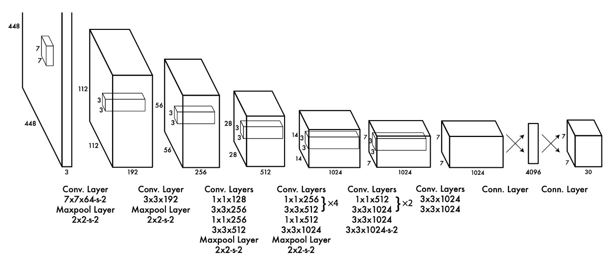
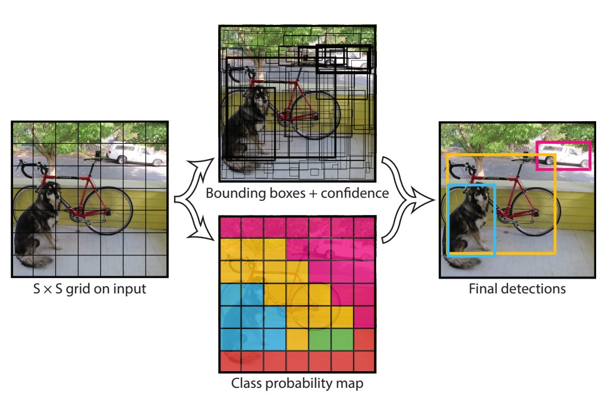

## You Only Look Once

[**You Only Look Once: Unified, Real-Time Object Detection**](https://arxiv.org/abs/1506.02640)

---

In object detection systems, the process is typically divided into two main steps: region proposal and classification.

1. **Region Proposal**:

   The aim here is to generate potential bounding boxes for objects.

   For instance, methods like R-CNN use Selective Search to generate thousands of candidate regions. More advanced approaches, such as Faster R-CNN, employ a Region Proposal Network (RPN) to generate these boxes, seeking to optimize the process in an end-to-end manner. While more efficient, this method still requires multiple passes of a neural network over the image.

2. **Classification**:

   Following region proposal, classifiers process each candidate box individually to determine its object class. In R-CNN, for example, a convolutional neural network extracts features from each region, followed by classification using a support vector machine. Although this sequential processing offers some accuracy benefits, its speed is relatively slow due to the need to handle each region separately.

## Problem Definition

The primary issue with the above process is its speed. Extracting features and classifying each region separately incurs significant computational overhead and time consumption. This is the core problem addressed in this paper: is it possible to merge these steps so the system needs only to "look" at the image once?

YOLO redefines object detection as a single regression problem, directly predicting bounding box coordinates and class probabilities from the input image pixels. The main advantages of this approach are:

- **Single-stage processing**: YOLO's neural network completes the entire object detection process in one forward pass, eliminating the need for multiple image processes. This significantly speeds up detection and simplifies the process.
- **Global reasoning**: Since YOLO considers the entire image during both training and inference, it can leverage global contextual information, improving detection accuracy.
- **Real-time performance**: The design of the YOLO model achieves a good balance between speed and accuracy, enabling real-time detection.

The design of YOLO achieves faster detection speeds while maintaining effectiveness, making it a highly practical object detection method.

## Solution

### Model Architecture

:::tip
This image appears to be cropped, possibly as a nod to AlexNet.
:::

The model architecture proposed consolidates the region proposal and classification systems. After a backbone network, the last feature map is taken and passed through a fully connected layer.

The backbone can be any model, but in the paper, the authors used Darknet-19, a network they designed for speed and accuracy.

The fully connected layer serves to consolidate information from the feature map, projecting the predictions onto a prediction head.

This prediction head, carefully designed by the authors, is illustrated in the above image with dimensions 7x7x30. This means the prediction head correlates back to the original image dimensions, divided into a 7x7 grid as shown below:

Each grid cell is responsible for:

1. Predicting two bounding boxes, each specifying an object's location in the format `(x, y, w, h)`, where `(x, y)` is the center of the grid cell, and `w` and `h` are the width and height of the object.
2. Predicting the class of the object, with the authors using 20 classes, requiring each cell to predict 20 class probabilities.

Several hyperparameters were defined in the paper:

1. `S`: The number of cells per side, here being 7.
2. `B`: The number of bounding boxes each cell predicts, here being 2.
3. `C`: The number of classes, here being 20.

### Loss Function

Predictions naturally result in significant overlap.

The authors proposed a loss function composed of several parts:

$$
λ_{coord} \sum_{i=0}^{S^2} \sum_{j=0}^{B} 1_{obj}^{ij} \left[ (x_i - \hat{x}_i)^2 + (y_i - \hat{y}_i)^2 \right]
$$

$$
+ λ_{coord} \sum_{i=0}^{S^2} \sum_{j=0}^{B} 1_{obj}^{ij} \left[ \left( \sqrt{w_i} - \sqrt{\hat{w}_i} \right)^2 + \left( \sqrt{h_i} - \sqrt{\hat{h}_i} \right)^2 \right]
$$

$$
+ \sum_{i=0}^{S^2} \sum_{j=0}^{B} 1_{obj}^{ij} \left( C_i - \hat{C}_i \right)^2
$$

$$
+ λ_{noobj} \sum_{i=0}^{S^2} \sum_{j=0}^{B} 1_{noobj}^{ij} \left( C_i - \hat{C}_i \right)^2
$$

$$
+ \sum_{i=0}^{S^2} 1_{obj}^{i} \sum_{c \in \text{classes}} \left( p_i(c) - \hat{p}_i(c) \right)^2
$$

This loss function consists of five main components, each contributing differently to the model's predictions:

1. **Coordinate Loss**
2. **Size Loss**
3. **Confidence Loss**
4. **No Object Confidence Loss**
5. **Class Probability Loss**

### Inference Scenario

With each grid cell predicting two bounding boxes, a total of $S^2 \times B$ boxes are generated per inference. Non-Maximum Suppression (NMS) is used during inference to filter out overlapping boxes, retaining only the most confident detections.

### Discussion

#### Inference Speed

YOLO outperforms traditional detectors like DPM in GPU implementations, running at 30Hz or 100Hz. Fast YOLO is the quickest on PASCAL, achieving 52.7% mAP, doubling the accuracy of prior real-time detectors.

While a YOLO model trained on VGG-16 is more accurate, it's slower, making speed a focal point of this paper.

#### Comparison with Other Methods

YOLO, while fast, struggles with precise object localization compared to methods like Fast R-CNN, which better locates but often misclassifies background as objects. This highlights a trade-off between speed and precision in different detection methods.

### Limitations

YOLO imposes strict spatial constraints on bounding box predictions, limiting its ability to detect clusters of small objects like flocks of birds. Its coarse features also mean it might underperform in detailing boundaries, particularly for smaller objects.

## Conclusion

YOLO is an innovative detection method that frames the detection problem as a single regression challenge, predicting bounding boxes and class probabilities directly from image pixels. This unified model not only enhances detection speed—processing images at 45 frames per second—but also maintains commendable accuracy, setting a robust foundation for future real-time detection technologies. Despite some challenges in precisely locating small objects, YOLO demonstrates strong generalization capabilities across various detection tasks.
