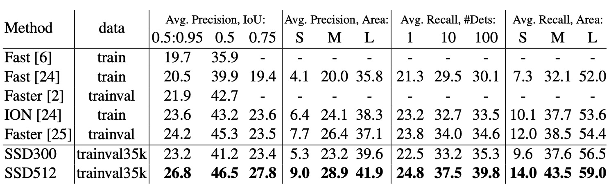

## Save Time, Save Pooling

[**SSD: Single Shot MultiBox Detector**](https://arxiv.org/abs/1512.02325)

---

Faster R-CNN has long been the gold standard for object detection.

The common workflow typically follows these steps:

1. **Bounding Box Proposal**: Using a Region Proposal Network (RPN) to generate candidate boxes.
2. **Feature Resampling for Each Box (ROI Pooling)**: Extract features for each proposed region.
3. **Classification**: Feed the features into a classifier to predict the object class.

## Defining the Problem

Although these methods are accurate, the computational cost is still quite high. For embedded systems, even the fastest detector, Faster R-CNN, can only reach about 7 FPS (Frames Per Second).

The authors believe the bottleneck lies in the process of extracting features and classifying for each candidate box. Maybe there’s a way to skip this step altogether.

## Solution

### Model Architecture

To address this problem, the authors proposed the SSD architecture. The image above compares SSD with YOLO-v1.

As shown, SSD eliminates the need for region proposals, directly predicting bounding boxes from the feature maps.

While this may seem abstract, let’s break it down step by step:

1. First, use VGG as the backbone and extract a feature map at a 1/8 scale, sized $38 \times 38$.

   Each pixel on this feature map directly predicts detection boxes, with 4 boxes predicted per pixel, each with a different aspect ratio.

   This results in $38 \times 38 \times 4 = 5776$ detection boxes.

   :::tip
   In the image above, the output size is shown as $38 \times 38 \times 4 \times (\text{Classes}+4)$. The term $\text{Classes}+4$ means each detection box predicts both the object class (potentially 21 or more classes) and the bounding box parameters (Cx, Cy, W, H).
   :::

---

2. The feature map is then downsampled to $19 \times 19$.

   Here, 6 detection boxes are predicted per pixel, so this layer predicts $19 \times 19 \times 6 = 2166$ boxes.

---

3. Downsample the feature map again to $10 \times 10$.

   Six detection boxes are predicted, resulting in $10 \times 10 \times 6 = 600$ boxes.

---

4. Downsample again to $5 \times 5$.

   This layer predicts 6 boxes, yielding $5 \times 5 \times 6 = 150$ boxes.

---

5. Next, downsample to $3 \times 3$.

   This layer predicts 4 boxes, giving $3 \times 3 \times 4 = 36$ boxes.

---

6. Finally, downsample to $1 \times 1$.

   This layer predicts 4 boxes, resulting in $1 \times 1 \times 4 = 4$ boxes.

---

Adding all of these up: $5776 + 2166 + 600 + 150 + 36 + 4 = 8732$ detection boxes.

:::tip
We’re not just throwing numbers around. The number 8732 appears in the paper, and we were curious how it was derived, so we did the math.
:::

### Positive and Negative Sample Matching Strategy

During training, we need to match the ground truth bounding boxes to the predictions.

Each ground truth box needs to be assigned to one or more predicted boxes, which vary in location, aspect ratio, and scale to cover a wide range of object shapes and sizes.

The authors use the **Jaccard overlap** (also known as **Intersection over Union**, or IoU) to match predicted boxes to ground truth boxes.

For each ground truth box, the predicted box with the highest IoU is selected to ensure that each ground truth box is matched to at least one predicted box. This ensures the network learns to predict bounding boxes correctly.

Unlike previous methods, SSD doesn’t stop after finding the highest IoU match. It also matches all predicted boxes with IoU greater than 0.5 to the corresponding ground truth box. This simplifies the learning problem by allowing the network to predict for multiple overlapping boxes, instead of forcing it to predict only the highest-IoU box.

This flexibility improves the accuracy of predictions when multiple suitable predicted boxes exist.

### Training Objective

SSD’s training objective extends the MultiBox loss function to handle multiple object classes.

- [**[13.12] Scalable Object Detection using Deep Neural Networks**](https://arxiv.org/abs/1312.2249)

Let $x*{pij} = \{1, 0\}$ be an indicator variable that denotes whether the $i$-th predicted box matches the $j$-th ground truth box for class $p$. Since SSD allows multiple matches per ground truth box, $\sum_i x*{pij} \geq 1$.

The total loss function in SSD is a weighted sum of **localization loss** ($L*{loc}$) and **confidence loss** ($L*{conf}$):

$$
L(x, c, l, g) = \frac{1}{N}(L_{conf}(x, c) + \alpha L_{loc}(x, l, g))
$$

where $N$ is the number of matched boxes, and $\alpha$ is set to 1 through cross-validation.

- **Localization Loss**

  The localization loss uses **Smooth L1 loss** to measure the difference between the predicted box ($l$) and the ground truth box ($g$). It regresses the center point ($cx, cy$) and the width ($w$) and height ($h$) of the bounding boxes, similar to Faster R-CNN:

  $$
  L_{loc}(x, l, g) = \sum_{i \in Pos} \sum_{m \in \{cx, cy, w, h\}} x_{ij}^k \cdot smoothL1(l^m_i - \hat{g}^m_j)
  $$

  The offsets for the ground truth boxes $\hat{g}$ are computed as:

  $$
  \hat{g}^{cx}_j = \frac{g^{cx}_j - d^{cx}_i}{d^w_i}, \quad \hat{g}^{cy}_j = \frac{g^{cy}_j - d^{cy}_i}{d^h_i}
  $$

  $$
  \hat{g}^w_j = \log \frac{g^w_j}{d^w_i}, \quad \hat{g}^h_j = \log \frac{g^h_j}{d^h_i}
  $$

  :::tip
  Dividing by the width $d^w_i$ and height $d^h_i$ of the predicted box normalizes the object sizes, ensuring the network learns relative rather than absolute scales. This stabilizes regression for objects of varying sizes.
  :::

- **Confidence Loss**

  The confidence loss is based on **softmax loss** and measures the difference between predicted class scores and the true class:

  $$
  L_{conf}(x, c) = - \sum_{i \in Pos} x_{ij}^p \log(\hat{c}^p_i) - \sum_{i \in Neg} \log(\hat{c}^0_i)
  $$

  where $\hat{c}^p_i$ is the predicted probability for class $p$:

  $$
  \hat{c}^p_i = \frac{\exp(c^p_i)}{\sum_p \exp(c^p_i)}
  $$

### Predicting Box Sizes and Aspect Ratios

The scales and aspect ratios of the prediction boxes in SSD are carefully designed. Suppose we have $m$ feature maps for prediction. The scale $s_k$ of the prediction box at layer $k$ is calculated as:

$$
s_k = s_{\text{min}} + \frac{s_{\text{max}} - s_{\text{min}}}{m - 1}(k - 1), \quad k \in [1, m]
$$

Where $s*{\text{min}} = 0.2$ and $s*{\text{max}} = 0.9$. This means the smallest prediction box scale is 0.2, and the largest is 0.9, with intermediate layers spaced evenly.

Different aspect ratios, $a_r \in \{1, 2, 3, \frac{1}{2}, \frac{1}{3}\}$, are used for each prediction box.

The width and height of each prediction box are:

$$
w^a_k = s_k \sqrt{a_r}, \quad h^a_k = \frac{s_k}{\sqrt{a_r}}
$$

Additionally, an extra box is added for aspect ratio 1, with the following scale:

$$
s'_k = \sqrt{s_k s_{k+1}}
$$

Each position in the feature map generates 6 prediction boxes.

The center of each box is located at:

$$
\left( \frac{i+0.5}{|f_k|}, \frac{j+0.5}{|f_k|} \right)
$$

where $|f_k|$ is the size of the feature map at layer $k$, and $i, j \in [0, |f_k|)$.

By combining different positions, scales, and aspect ratios, SSD can cover a wide range of object shapes and sizes. For example, in the image below, the ground truth box for the dog matches a box in the $4 \times 4$ feature map, but not in the $8 \times 8$ map, as the larger prediction boxes do not align with the dog's size.

## Discussion

The authors performed an extensive analysis of the model’s design and evaluated its experimental results.

### Data Augmentation

Look at the first and last columns of the table above for SSD’s data augmentation.

SSD uses a broader sampling strategy similar to YOLO. This augmentation increases SSD’s performance (mAP) by 8.8%. Other methods struggle to leverage this strategy due to their feature pooling steps (e.g., ROI pooling), which are robust to object translation and thus less affected by object displacement.

### Variety of Box Shapes

The design of the prediction box shapes significantly impacts performance.

- When aspect ratios $1/3$ and $3$ were removed, performance dropped by **0.6%**.
- When aspect ratios $1/2$ and $2$ were removed, performance further dropped by **2.1%**.

This shows that diverse box shapes help the network predict bounding boxes more easily, improving accuracy.

### Atrous Convolution

SSD uses **Atrous Convolution** to improve speed. This convolution increases the receptive field without adding computation. The subsampled VGG16 version with atrous convolution is **20%** faster than the full VGG16 version, with minimal performance loss.

This shows that using atrous convolution in higher layers can significantly improve speed without sacrificing accuracy.

### Class Analysis

The authors conducted a detailed analysis across different classes (e.g., animals, vehicles, furniture) and studied the distribution of false positives.

The top graph shows the ratio of correct detections to false positives as the number of detections increases. SSD has a lower recall at high overlap (0.5 IoU) but shows a significant recall improvement at lower overlap (0.1 IoU).

The bottom graph categorizes false positives in each class into errors due to poor localization (Loc), confusion with similar classes (Sim), confusion with other classes (Oth), and background (BG) errors.

These charts show SSD’s sensitivity across different object scales, aspect ratios, and classes.

### Object Size Analysis

The authors also explored how the size and aspect ratio of bounding boxes impact model performance.

Different classes perform differently across object sizes. SSD struggles with small and medium objects but performs well with large objects. Aspect ratio variations also impact detection, as objects with extreme aspect ratios reduce accuracy. This highlights the need for diverse aspect ratios in box design.

### Performance on COCO Dataset

Objects in the COCO dataset are typically smaller than those in the PASCAL VOC dataset, so SSD adjusts its box sizes accordingly.

- The minimum box scale ($s\_{\text{min}}$) is reduced from 0.2 to 0.15, and the default box scale for the conv4_3 layer is reduced to 0.07 (which corresponds to 21 pixels in a 300×300 image).
- For the SSD512 model, the minimum box scale is further reduced to 0.1, and the conv4_3 layer is set to 0.04.
- SSD300 and SSD512 models are trained on the trainval35k dataset.
- The training process consists of three stages: 160,000 iterations with a learning rate of $10^{-3}$, followed by 40,000 iterations at $10^{-4}$, and a final 40,000 iterations at $10^{-5}$.

---

On COCO, SSD300 outperforms Fast R-CNN on both **mAP@0.5** and **mAP@[0.5:0.95]**. It performs similarly to ION and Faster R-CNN at **mAP@0.75**, but is slightly behind Faster R-CNN at **mAP@0.5**.

When the image size increases to 512×512, **SSD512** surpasses Faster R-CNN on both **mAP@0.5** and **mAP@[0.5:0.95]**. SSD512 excels at **mAP@0.75**, outperforming Faster R-CNN by **5.3%**, though the gain at **mAP@0.5** is smaller at **1.2%**.

**SSD512** shows significant improvement in **Average Precision (AP)** and **Average Recall (AR)** for large objects, with AP increasing by **4.8%** and AR by **4.6%**. This indicates SSD512 handles large objects better. However, SSD512 shows only modest improvement for small objects, with AP increasing by **1.3%** and AR by **2.0%**, suggesting SSD struggles with smaller objects.

### Visual Results

## Conclusion

The key advantage of SSD lies in its ability to eliminate the need for region proposals, directly predicting objects from feature maps. This dramatically improves inference speed without sacrificing accuracy. SSD-300 can achieve 59 FPS, faster and more accurate than YOLO-v1 of the same period.

Additionally, SSD performs multi-scale object detection by predicting from multiple feature maps. This design allows the model to effectively detect objects of various sizes and shapes.

SSD, as an efficient object detection method, deserves further study.
