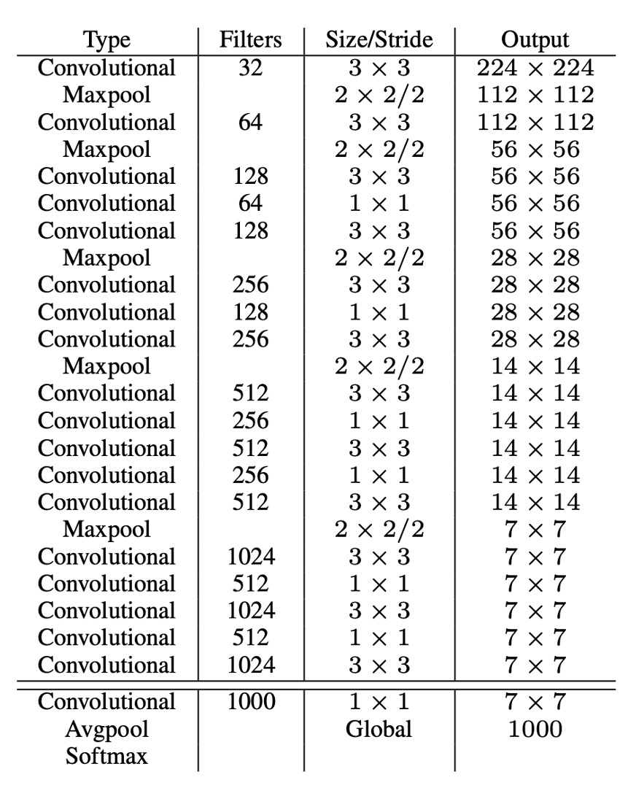
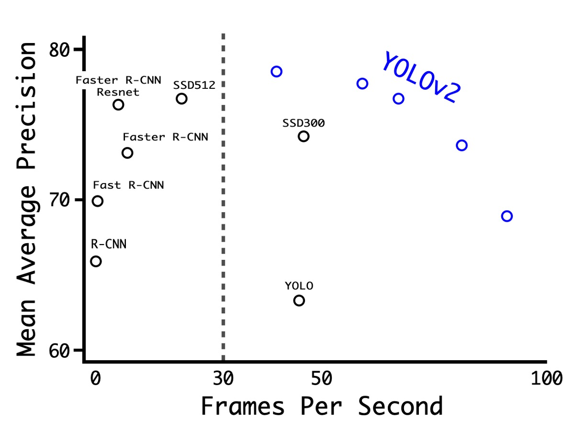

## Expanding a Large Number of Categories

[**YOLO9000: Better, Faster, Stronger**](https://arxiv.org/abs/1612.08242)

---

## Problem Definition

Looking back at YOLO v1, the authors pointed out several issues in the final analysis chapter, including a significant number of localization errors and low recall rates.

To address these issues, introducing the concept of anchor boxes seemed inevitable.

Additionally, several improved training methods have been proposed recently, and the authors have considered these methods as well.

## Problem Solving

### Anchor Box Selection

Firstly, let's talk about anchor box selection. Previously, a set of fixed ratio anchor boxes were used, such as 1:1, 1:2, 2:1, etc. However, the authors believed that since the model would be applied to a specific dataset, it would be better to find the optimal anchor boxes directly from the dataset.

The method used here is to calculate the width-height ratio of all training data and then use K-means clustering to find the optimal anchor boxes.

As shown in the figure above, the authors found N anchor boxes on the COCO and VOC datasets respectively. Through experimentation, they found that using 5 anchor boxes achieved the best balance.

### Prediction Box Design

In the Faster R-CNN paper, an RPN is used for region proposal, and the model ultimately predicts an offset, which is used to adjust the prediction box.

In the previous version of YOLO, the authors used a 7x7 grid, where each grid predicted 2 boxes. This was essentially an unrestricted prediction space, making the model burden heavier compared to Faster R-CNN. Therefore, in this version, the authors also introduced the concept of offsets, using more prior knowledge to reduce the model's burden.

The redesigned prediction is shown above. The model now predicts values in the form of $t_x, t_y, t_w, t_h$ instead of the original $x, y, w, h$. Each part is handled as follows:

1. $t_x$ and $t_y$ represent the offset of the grid center. The prediction results are passed through a sigmoid function, ensuring the prediction results range between 0 and 1, meaning the predicted center will not exceed the grid range. In the figure above, $c_x$ and $c_y$ represent the top-left coordinates of the grid.

2. $t_w$ and $t_h$ represent the width and height of the prediction box. The prediction results are passed through an exp function to ensure they are positive numbers and then multiplied by the width and height of the anchor box.

At this step, the authors specifically changed the network input from the original 448x448 to 416x416. This made the grid size 13x13, allowing the grid center points to fall on the grid intersections, improving the center point accuracy. With this design, the authors found that while the model accuracy slightly decreased, the recall rate significantly increased from 81% to 88%.

### Multi-scale Training

In addition to adjusting the prediction box design, the authors also introduced the concept of multi-scale training.

During the model training process, every 10 batches, the authors randomly selected a scale in multiples of 32, such as 320x320, 352x352, 384x384, etc., with the smallest scale being 320x320 and the largest being 608x608.

This approach allowed the model to perform well at different scales, enhancing its generalization ability.

### Darknet-19

To achieve faster inference speed, the authors did not use existing backbone networks but designed their own network called Darknet-19. The model architecture is shown in the table above.

Similar to VGG, the authors used 3x3 convolution kernels, doubling the number of channels after each pooling layer, using batch normalization, and adding fully connected layers at the end. This model was first trained on ImageNet, achieving a top-1 accuracy of 76.5% and a top-5 accuracy of 93.3%. During training, standard image augmentation techniques such as random flipping and random cropping were used.

Finally, the authors transferred this model to the object detection task, replacing the original classification head with a detection head and fine-tuning it, thus completing the entire model design.

### Classification Head Design

To expand the number of detectable object categories, the authors introduced the concept of WordTree.

The authors combined classification and detection datasets for joint training to enhance both object detection and classification capabilities. This method uses images with detection labels to learn specific information such as bounding box coordinates and object presence, and uses images with only class labels to expand the number of detectable object categories.

One challenge of this method is how to merge the labels from the two datasets, as detection datasets typically have general labels (such as "dog" or "boat"), while classification datasets have more detailed labels (such as various breeds of dogs). Traditional classification methods use a softmax layer to calculate the final probability distribution of all possible classes, assuming the classes are mutually exclusive, which can cause problems when merging datasets. Therefore, the authors proposed using WordNet to construct a hierarchical tree model called WordTree to address this issue.

The WordTree model uses WordNet's hierarchical structure to organize concepts in a hierarchical manner, allowing for more detailed classification. This model predicts conditional probabilities at each node and calculates the absolute probability of a specific node by multiplying the conditional probabilities along the path from the root to the node. For example, to determine if an image is a Norfolk Terrier, one would simply multiply the conditional probabilities along the path from the root node.

The authors applied this hierarchical structure to both classification and detection tasks, training a model called YOLO9000. This model used the COCO detection dataset and ImageNet classification dataset for joint training, enabling it to detect over 9000 object categories in real-time while maintaining high accuracy. Experimental results showed that YOLO9000 performed well on the ImageNet detection task, even for categories that had not been seen in the detection dataset.

## Discussion

### Experiments on PASCAL VOC

As shown in the table above, the authors conducted experiments on PASCAL VOC 2007, showing that YOLOv2 achieved a good balance between speed and accuracy.

- At a resolution of 288 × 288, YOLOv2's speed exceeded 90 FPS, and its mAP was almost as good as Fast R-CNN. This makes it very suitable for smaller GPUs, high frame rate videos, or multiple video streams.
- At a resolution of 416 × 416, YOLOv2 achieved an mAP of 76.8% with a speed of 67 FPS, making it one of the state-of-the-art detectors at the time.

### From V1 to V2

The table above shows how the authors improved YOLO's performance through different designs.

Starting with adding BatchNorm, the authors gradually introduced more designs, including a deeper network, more anchor boxes, more training data, etc. These improvements achieved a better balance between speed and accuracy for YOLOv2.

It's worth noting that the introduction of anchor boxes in the authors' experiments decreased mAP, leading to the later use of clustering to find the optimal anchor boxes.

## Conclusion

YOLOv2 introduced anchor box technology, enhancing the detection ability for small objects, and used batch normalization to reduce overfitting to specific datasets, improving model generalization. The model also supports end-to-end training and prediction, simplifying and making the training process more efficient. On the other hand, this model has some drawbacks, such as potentially less accurate localization for irregularly shaped objects compared to other methods like Faster R-CNN.

Although the accuracy is slightly lower, it's not a big issue because it's fast!

This alone made it one of the most popular object detection models at the time.
