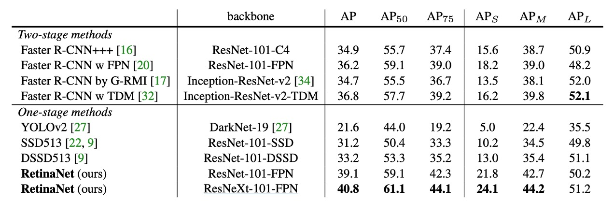

# [17.08] RetinaNet

## Focal Loss is the Key

[**Focal Loss for Dense Object Detection**](https://arxiv.org/abs/1708.02002)

---

:::info
The following content is compiled by ChatGPT-4 and has been manually checked, edited, and supplemented.
:::

---

Before this, the classic R-CNN methods dominated the object detection field. Although slow, they were highly accurate. Subsequent research aimed to address the speed issue with methods like SSD and YOLO.

However, while these new methods were faster, they lacked accuracy.

Is it possible to achieve both speed and accuracy?

## Problem Definition

Why is it inaccurate?

The authors of this paper believe the root cause is the **imbalance between positive and negative samples** during training.

In single-stage object detection methods, the model generates numerous detection boxes, most of which are background. This creates a significant imbalance between positive and negative samples, making it difficult for the model to find effective gradients during training. Since most negative samples are easy to classify, they don't contribute useful learning signals.

This issue isn't new, and some researchers have proposed Hard Negative Mining, which involves selecting difficult negative samples that are often misclassified as positives to train the model. These are called "hard negatives."

However, the authors of this paper don't follow this approach. They believe it's inefficient and increases training complexity. A better method might be to incorporate the concept of balancing positive and negative samples directly into the loss function.

They propose a new loss function called: **Focal Loss**.

## Solution

### Focal Loss

Cross-entropy loss (CE Loss) is a commonly used loss function for binary classification problems.

It is defined as follows:

$$
CE(p, y) =
\begin{cases}
- \log(p) & \text{if } y = 1 \\
- \log(1 - p) & \text{otherwise}
\end{cases}
$$

where $y \in \{ \pm 1\}$ denotes the true class label and $p \in [0, 1]$ is the model's predicted probability for $y = 1$.

For simplicity, we define $p_t$ as follows:

$$
p_t =
\begin{cases}
p & \text{if } y = 1 \\
1 - p & \text{otherwise}
\end{cases}
$$

Thus, cross-entropy loss can be rewritten as:

$$
CE(p, y) = CE(p_t) = - \log(p_t)
$$

A notable characteristic of cross-entropy loss is that even easy-to-classify samples (i.e., $p_t \approx 0.5$) generate non-negligible loss values. When dealing with many easy-to-classify samples, these small loss values can accumulate, overshadowing the importance of rare class samples.

To address the class imbalance issue, a common approach is to introduce a weighting factor $\alpha \in [0, 1]$, assigning weights $\alpha$ and $1 - \alpha$ to the positive and negative classes, respectively. In practice, $\alpha$ can be set based on the inverse frequency of the classes or adjusted through cross-validation. Similar to the definition of $p_t$, we define $\alpha_t$ and rewrite the $\alpha$-balanced cross-entropy loss as:

$$
CE(p_t) = - \alpha_t \log(p_t)
$$

This loss function is a simple extension of cross-entropy loss, used by the authors as a baseline for implementing Focal Loss.

---

Although $\alpha$ can balance the importance of positive and negative samples, it cannot distinguish between easy and difficult samples.

Therefore, the authors propose reshaping the loss function to "down-weight" easy-to-classify samples, thereby focusing training on hard negatives.

This is done by adding a modulation factor $(1 - p_t)^\gamma$ to the cross-entropy loss, where $\gamma \geq 0$ is a tunable parameter.

The authors define Focal Loss as:

$$
FL(p_t) = - (1 - p_t)^\gamma \log(p_t)
$$

When a sample is misclassified and $p_t$ is small, the modulation factor is close to 1, and the loss is unaffected. However, as $p_t \to 1$, the modulation factor approaches 0, reducing the loss for correctly classified samples.

:::tip
Higher scores indicate greater confidence from the model, suggesting the sample is easier to classify.
:::

The parameter $\gamma$ smoothly adjusts the rate of down-weighting for easy samples. When $\gamma = 0$, Focal Loss is equivalent to cross-entropy loss; as $\gamma$ increases, the modulation factor's effect strengthens (the authors found $\gamma = 2$ to work best).

In practice, the authors use an $\alpha$-balanced variant of Focal Loss:

$$
FL(p_t) = - \alpha_t (1 - p_t)^\gamma \log(p_t)
$$

The authors found this form slightly more accurate than the non-$\alpha$-balanced form.

The relationship between the classification score $p_t$ and the corresponding loss can be intuitively understood through the following chart:

In the chart, $\gamma = 0$ represents standard cross-entropy loss, while $\gamma = 2$ is the optimal value from the authors' experiments. The region from 0.6 to 1.0 corresponds to easy-to-classify samples, where the loss is effectively reduced after applying Focal Loss.

### Model Architecture

To ensure the effect of Focal Loss is not overshadowed by model complexity, the authors designed a very simple model architecture called **RetinaNet**.

RetinaNet is a single-stage object detection model, with key design features including:

- A simple backbone, such as ResNet50.
- A straightforward neck, such as the Feature Pyramid Network (FPN).
- Extracting multi-scale feature maps from the last three layers, converting them into detection boxes using 9 sets of anchors.

  - Anchors have aspect ratios of 1:2, 1:1, and 2:1. At each level, the authors added three more sizes to the original three aspect ratio anchors, corresponding to $2^{0}$, $2^{1/3}$, and $2^{2/3}$ times the original sizes. Combining these sizes, they obtained nine different anchor ratios.

    - **1:2 Aspect Ratio:**

      - 1:2 $\times 1 = 1:2$
      - 1:2 $\times 1.26 = 1.26:2.52$
      - 1:2 $\times 1.59 = 1.59:3.18$

    - **1:1 Aspect Ratio:**

      - 1:1 $\times 1 = 1:1$
      - 1:1 $\times 1.26 = 1.26:1.26$
      - 1:1 $\times 1.59 = 1.59:1.59$

    - **2:1 Aspect Ratio:**

      - 2:1 $\times 1 = 2:1$
      - 2:1 $\times 1.26 = 2.52:1.26$
      - 2:1 $\times 1.59 = 3.18:1.59$

  - Each anchor point is assigned a classification vector of length $K$ and a bounding box coordinate vector of length $4$.
  - Using RPN classification rules, but adjusting the positive sample threshold to above 0.5 and the negative sample threshold to below 0.4.
  - Each anchor point predicts only one bounding box.

- The object detection part is divided into two subnetworks, one for class prediction and one for bounding box regression, both composed of fully convolutional network architectures.

### Training Parameters

1. During inference, RetinaNet generates numerous detection boxes. These boxes are classified by the classification network, selecting the top 1000 highest-scoring boxes, followed by non-maximum suppression (NMS) with a threshold of 0.5 to produce the final detection results.
2. The authors found that setting $\gamma = 2$ for Focal Loss worked best, with $\alpha$ set based on the inverse frequency of the classes and linked to $\gamma$. They found $\alpha = 0.25$ to be optimal.
3. RetinaNet uses ResNet-50-FPN, ResNet-101-FPN, and ResNeXt-101-FPN as backbone networks.
4. RetinaNet uses SGD as the optimizer, with a learning rate of 0.01, reduced to 1/10 at 60k and 80k iterations. The momentum is 0.9, and weight decay is 0.0001.
5. Focal Loss is used for classification, while Smooth L1 Loss is used for regression, with both losses summed during training.

## Discussion

### Experimental Results on the COCO Dataset

Compared to recent two-stage methods, RetinaNet surpasses the best-performing Faster R-CNN model (based on Inception-ResNet-v2-TDM) by 2.3 points.

Using ResNeXt-32x8d-101-FPN as the RetinaNet backbone further improves results by 1.7 AP, exceeding 40 AP on the COCO dataset.

Compared to existing single-stage methods, RetinaNet significantly outperforms the closest competitor, DSSD, by 5.9 AP points (39.1 vs. 33.2) and is faster, as shown in the following chart:

### Ablation Studies

The authors conducted ablation studies on several key elements of RetinaNet, showing the following results:

1. **Balanced Cross Entropy**

   As shown in table (a), the first improvement attempt by the authors was using the $\alpha$-balanced cross-entropy loss described earlier. Table (a) shows the results for different $\alpha$ values. Setting $\alpha = 0.75$ improves AP by 0.9 points.

2. **Focal Loss**

   As shown in table (b), Focal Loss results are displayed. Focal Loss introduces a new hyperparameter $\gamma$ that controls the modulation term's strength. When $\gamma = 0$, the loss is equivalent to cross-entropy loss. As $\gamma$ increases, the loss's shape changes, further down-weighting easy negative samples. With increasing $\gamma$, FL shows significant gains over CE. When $\gamma = 2$, FL improves by 2.9 AP points over $\alpha$-balanced CE loss.

   To ensure fair comparison, the authors found the optimal $\alpha$ for each $\gamma$. The chart shows that with increasing $\gamma$, the chosen $\alpha$ value is lower (since easy negatives are down-weighted, emphasizing positive samples less).

3. **High-Density Two-Stage Systems May Be Unnecessary**

   As shown in table (c), the authors used ResNet-50 and scanned the number of scale and aspect ratio anchors used at each spatial position and pyramid level in FPN. They considered scenarios from one square anchor per position to 12 anchors per position, spanning 4 sub-octave scales ($2^{k/4}$ for $k \leq 3$) and 3 aspect ratios (0.5, 1, 2).

   Using just one square anchor achieves surprisingly good AP (30.3). Using 3 scales and 3 aspect ratios per position improves AP by nearly 4 points (to 34.0).

   All other experiments in this work use this setup.

   Finally, the authors note that anchor numbers above 6-9 show no further gains. Thus, while two-stage systems can classify arbitrary boxes, they may not provide advantages in performance density saturation.

4. **Online Hard Example Mining (OHEM)**

   As shown in table (d), previous literature proposed improving two-stage detector training by constructing mini-batches containing high-loss samples. In OHEM, each sample is scored by its loss, then NMS is applied, and mini-batches are constructed with high-loss samples. NMS threshold and batch size are adjustable parameters. Like Focal Loss, OHEM emphasizes misclassified samples, but unlike FL, OHEM discards easy samples entirely.

   In the best OHEM setup in the experiments (no 1:3 ratio, batch size 128, NMS 0.5), AP is 32.8, a 3.2 AP gap, showing FL is more effective than OHEM. The authors also tried other parameter settings and OHEM variants but couldn't achieve better results.

   :::tip
   The authors also experimented with hinge loss on $p_t$ early on, setting the loss to 0 when $p_t$ exceeded a certain value.

   However, results were unstable and didn't yield meaningful outcomes.
   :::

5. **Larger Backbone**

   As shown in table (e), larger backbones can provide higher accuracy but also slow down inference speed. Similarly, the input image scale (defined by the shorter side) has a similar effect. The table shows the impact of these two factors. Further optimizing the network architecture for faster inference might be needed, which is beyond this paper's scope and left for future work.

## Conclusion

RetinaNet effectively addresses class imbalance by introducing Focal Loss, allowing the model to focus on hard negatives and significantly improving detection accuracy. Experimental results show RetinaNet surpasses various existing one-stage and two-stage detection methods on the COCO dataset, demonstrating its practical potential.

Subsequent research, such as YOLO-v3, incorporated Focal Loss but didn't achieve the significant improvements seen in RetinaNet, suggesting Focal Loss's effectiveness might also depend on the model architecture.

There is still much work to be done in object detection research, and we look forward to future advancements.
