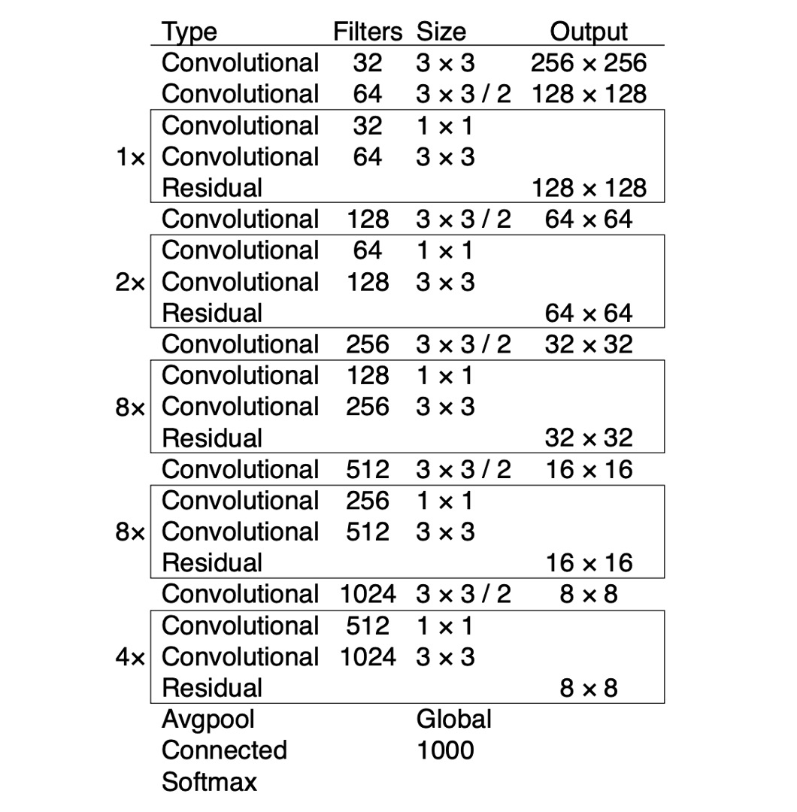
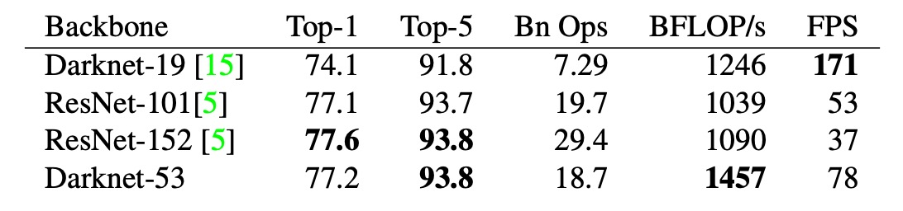

# [18.04] YOLO-V3

## Introducing Multi-Scale Detection

[**YOLOv3: An Incremental Improvement**](https://arxiv.org/abs/1804.02767)

---

The third generation of YOLO is not a formal research paper; as stated by the author, it is more of a technical report.

## Problem Definition

Recently, there have been numerous advancements in the field of object detection.

The author felt it was time to integrate these new ideas into YOLO and make some improvements. The bounding box prediction part remains unchanged and continues to use the design from YOLOv2. We won't delve into that here.

- [**[16.12] YOLO-V2: Expanding a Large Number of Categories**](../1612-yolov2/index.md)

## Problem Solution

The author implemented a series of improvements.

### Updated Backbone

The author replaced the Darknet-19 network architecture with Darknet-53. This updated network also uses consecutive 3x3 and 1x1 convolutional layers, with added residual connections. It is a deeper network, trained on ImageNet. Due to its 53 convolutional layers, the author named it Darknet-53.

The table below shows the performance of Darknet-53 on ImageNet. It can be seen that the top-1 accuracy is comparable to ResNet-101, around 77.1%, but with a 50% increase in inference speed.

### Class Prediction

Instead of using softmax for class prediction, logistic regression is used to predict the probability of each class.

This means the model does not have to make a hard decision about the class but can instead assign probabilities to multiple classes, making it easier to extend to unknown classes.

### Multi-Scale Detection

Inspired by concepts from FPN and RetinaNet, the author introduced multi-scale detection in YOLOv3.

Anchors are still found using K-means clustering, but now three different scales of feature maps are used: 1/32, 1/16, and 1/8. Three different sized boxes are predicted at each scale, resulting in a total of 4 bounding box offsets, 1 object confidence score, and 80 class probabilities.

The prediction tensor size is $N \times N \times [3 \times (4 + 1 + 80)]$.

## Discussion

### Performance on COCO

The author admitted that, not wanting to spend a lot of time retraining other models, he "borrowed" an image and a table from the RetinaNet paper. He then added the YOLOv3 results to the table, showing that YOLOv3 performs well in terms of speed and accuracy.

From the table, we can see that YOLOv3 excels in $AP_{50}$, significantly outperforming the SSD architecture, indicating strong performance in object detection. However, as the IOU threshold increases, YOLOv3's performance drops, suggesting difficulty in producing high-precision bounding boxes.

In the past, YOLO architectures performed poorly in detecting small objects. However, YOLOv3 has improved significantly in this aspect due to the new multi-scale detection, although its performance in detecting medium and large objects has declined.

### Attempts That Didn't Work

The author also mentioned some methods tried during training that did not yield significant results.

1. Predicting anchor box center points (x, y) using linear activation: Tried but found no significant improvement.
2. Linear x, y predictions instead of logistic: Performance dropped with linear activation.
3. Using Focal Loss: Tried to address class imbalance but resulted in a 2-point drop in performance, the reason for which remains unclear.
4. Dual IOU threshold: Tried using the Faster R-CNN approach with objects considered positive if IOU > 0.7 and negative if IOU < 0.3, but found it ineffective.

## Conclusion

Based on previous research, it's difficult for humans to distinguish between detection boxes with IOUs of 0.3 and 0.5 by eye. Therefore, the author believes that striving for higher scores on these validation datasets may not be very meaningful.

The performance of YOLO v3 is considered sufficient to handle most real-world problems. The focus should be on enhancing model safety and ensuring these high-performance models are used correctly, reducing potential harm to the world.

:::tip
The research report is quite candidly written. If you're curious about the author's original statements, you might want to check out the original text.
:::
